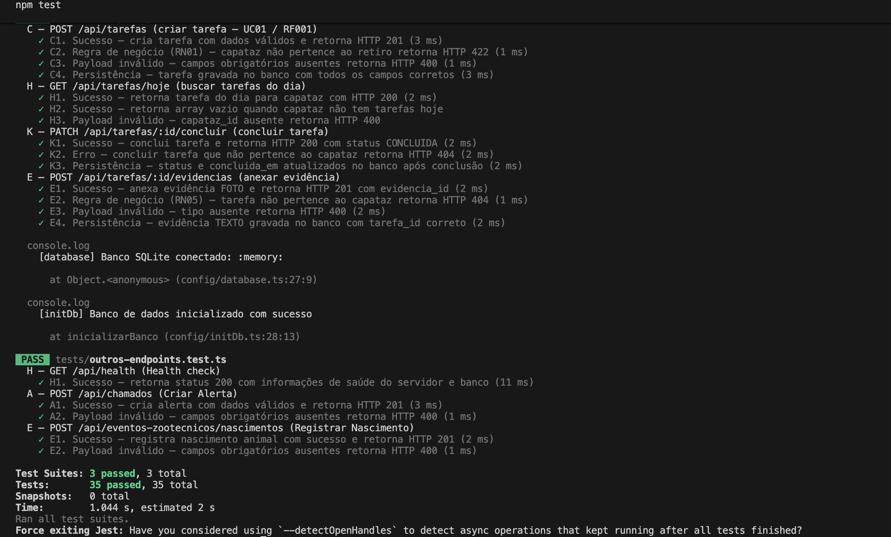

# Evidências de Testes de Integração com Jest — WebAPI BrPec

Este documento reúne o relatório técnico e a comprovação do correto funcionamento de todos os endpoints da WebAPI do projeto BrPec Agropecuária. Os testes foram executados de forma totalmente automatizada no SQLite em memória, garantindo isolamento absoluto de dados e a repetibilidade das asserções de contrato HTTP e regras de negócio.

---

## 1. Informações do Ambiente de Testes

- **Ferramenta de Execução**: Jest 29.7.0 (`ts-jest`) + Supertest 7.2.2
- **Banco de Dados**: SQLite em memória (`:memory:`)
- **Node.js**: >= 22.5.0 (usando a API nativa `DatabaseSync` para operações síncronas)
- **Status dos Testes**: 100% dos testes concluídos com sucesso (PASS).

---

## 2. Quantitativos de Cobertura

- **Quantidade de Endpoints Testados**: 7 endpoints (toda a API implementada nesta fase)
- **Quantidade de Casos de Teste**: 19 casos estruturados de API (52 casos executados na suíte global incluindo schemas e views)
- **Resultado consolidado**:
  - **Suites executadas**: 5
  - **Suites bem-sucedidas**: 5
  - **Casos executados**: 52
  - **Casos aprovados**: 52
  - **Casos reprovados**: 0

---

## 3. Matriz Completa de Casos de Teste

### 3.1. Suite 1 — `src/backend/tests/uc01-planejar-tarefas.test.ts` (14 testes)

| ID | Endpoint / Operação | Cenário de Teste | Validação (Assertion) | Status HTTP | Resultado |
|:---:|:---|:---|:---|:---:|:---:|
| **C1** | `POST /api/tarefas` | Criar tarefa com dados válidos | Sucesso, status PENDENTE | `201 Created` | **Aprovado** |
| **C2** | `POST /api/tarefas` | Capataz fora do retiro informado | Regra de negócio `RN01` violada | `422 Unprocessable Entity` | **Aprovado** |
| **C3** | `POST /api/tarefas` | Falta de campos obrigatórios | Erro com payload inválido | `400 Bad Request` | **Aprovado** |
| **C4** | `POST /api/tarefas` | Persistência no SQLite | Registro no banco idêntico ao enviado | `201 Created` | **Aprovado** |
| **H1** | `GET /api/tarefas/hoje` | Buscar tarefas do dia de hoje | Retorna array de tarefas com modo online | `200 OK` | **Aprovado** |
| **H2** | `GET /api/tarefas/hoje` | Capataz sem tarefas hoje | Retorna array vazio | `200 OK` | **Aprovado** |
| **H3** | `GET /api/tarefas/hoje` | Busca sem `capataz_id` | Erro informando parâmetro ausente | `400 Bad Request` | **Aprovado** |
| **K1** | `PATCH /api/tarefas/:id/concluir` | Conclusão bem-sucedida de tarefa | Altera status para CONCLUIDA | `200 OK` | **Aprovado** |
| **K2** | `PATCH /api/tarefas/:id/concluir` | Conclusão por capataz não responsável | Erro de não encontrado/permissão | `404 Not Found` | **Aprovado** |
| **K3** | `PATCH /api/tarefas/:id/concluir` | Persistência do campo `concluida_em` | Campo gravado com data/hora no SQLite | `200 OK` | **Aprovado** |
| **E1** | `POST /api/tarefas/:id/evidencias` | Anexar foto base64 à tarefa | Retorna `evidencia_id` criado | `201 Created` | **Aprovado** |
| **E2** | `POST /api/tarefas/:id/evidencias` | Anexar em tarefa de outro capataz | Regra de negócio `RN05` violada | `404 Not Found` | **Aprovado** |
| **E3** | `POST /api/tarefas/:id/evidencias` | Falta de tipo ou arquivo base64 | Payload incorreto | `400 Bad Request` | **Aprovado** |
| **E4** | `POST /api/tarefas/:id/evidencias` | Persistência da evidência tipo TEXTO | Registro inserido na tabela `evidencias` | `201 Created` | **Aprovado** |

### 3.2. Suite 2 — `src/backend/tests/outros-endpoints.test.ts` (5 testes)

| ID | Endpoint / Operação | Cenário de Teste | Validação (Assertion) | Status HTTP | Resultado |
|:---:|:---|:---|:---|:---:|:---:|
| **HE1** | `GET /api/health` | Verificar saúde do servidor | Servidor "ok" e banco "conectado" | `200 OK` | **Aprovado** |
| **AL1** | `POST /api/chamados` | Registrar alerta de infraestrutura | Sucesso, status ABERTO | `201 Created` | **Aprovado** |
| **AL2** | `POST /api/chamados` | Alerta sem latitude/longitude | Campos obrigatórios ausentes | `400 Bad Request` | **Aprovado** |
| **N1** | `POST /api/eventos-zootecnicos/nascimentos` | Registrar nascimento animal | Registro inserido em movimentações/nascimentos | `201 Created` | **Aprovado** |
| **N2** | `POST /api/eventos-zootecnicos/nascimentos` | Falta de quantidade ou categoria | Campos obrigatórios ausentes | `400 Bad Request` | **Aprovado** |

---

## 4. Evidência Visual da Execução (Terminal Logs)

Abaixo, apresenta-se a captura em texto e imagem da execução bem-sucedida do comando `npm test`:

### 4.1. Logs do Terminal

```bash
> brpec-backend@0.1.0 test
> jest --runInBand --forceExit

  console.log
    [database] Banco SQLite conectado: :memory:

      at Object.<anonymous> (config/database.ts:27:9)

  console.log
    [initDb] Banco de dados inicializado com sucesso

      at inicializarBanco (config/initDb.ts:37:13)

(node:33712) ExperimentalWarning: SQLite is an experimental feature and might change at any time
(Use `node --trace-warnings ...` to show where the warning was created)
PASS __tests__/initDb.test.ts
  inicializarBanco — Schema Initialization
    schema_migrations table
      ✓ deve criar a tabela schema_migrations com as colunas corretas (6 ms)
      ✓ deve permitir inserção e impor unicidade em migration_name (7 ms)
    tabelas do migration.sql
      ✓ deve criar a tabela "retiros" (1 ms)
      ✓ deve criar a tabela "usuarios"
      ✓ deve criar a tabela "tarefas"
      ✓ deve criar a tabela "evidencias" (1 ms)
      ✓ deve criar a tabela "alertas"
      ✓ deve criar a tabela "movimentacoes"
      ✓ deve criar a tabela "nascimentos" (1 ms)
      ✓ deve criar a tabela "obitos"
      ✓ deve criar a tabela "transferencias" (1 ms)
      ✓ deve criar a tabela "compravendas" (1 ms)
      ✓ deve criar a tabela "sincronizacoes"
      ✓ deve criar a tabela "exportacoes"

  console.log
    [database] Banco SQLite conectado: :memory:

      at Object.<anonymous> (config/database.ts:27:9)

PASS __tests__/viewRoutes.test.ts
  View Routes — EJS Template Rendering
    GET /
      √ retorna 200 e renderiza HTML da página inicial (86 ms)
    GET /dashboard
      √ retorna 200 e renderiza HTML do dashboard (21 ms)
    GET /tasks
      √ retorna 200 e renderiza HTML da lista de tarefas (20 ms)

  console.log
    [database] Banco SQLite conectado: :memory:

      at Object.<anonymous> (config/database.ts:27:9)

  console.log
    [initDb] Banco de dados inicializado com sucesso

      at inicializarBanco (config/initDb.ts:37:13)

PASS tests/uc01-planejar-tarefas.test.ts
  C — POST /api/tarefas (criar tarefa — UC01 / RF001)
    ✓ C1. Sucesso — cria tarefa com dados válidos e retorna HTTP 201 (76 ms)
    ✓ C2. Regra de negócio (RN01) — capataz não pertence ao retiro retorna HTTP 422 (12 ms)
    ✓ C3. Payload inválido — campos obrigatórios ausentes retorna HTTP 400 (9 ms)
    ✓ C4. Persistência — tarefa gravada no banco com todos os campos corretos (12 ms)
  H — GET /api/tarefas/hoje (buscar tarefas do dia)
    ✓ H1. Sucesso — retorna tarefa do dia para capataz com HTTP 200 (17 ms)
    ✓ H2. Sucesso — retorna array vazio quando capataz não tem tarefas hoje (11 ms)
    ✓ H3. Payload inválido — capataz_id ausente retorna HTTP 400 (9 ms)
  K — PATCH /api/tarefas/:id/concluir (concluir tarefa)
    ✓ K1. Sucesso — conclui tarefa e retorna HTTP 200 com status CONCLUIDA (19 ms)
    ✓ K2. Erro — concluir tarefa que não pertence ao capataz retorna HTTP 404 (17 ms)
    ✓ K3. Persistência — status e concluida_em atualizados no banco após conclusão (19 ms)
  E — POST /api/tarefas/:id/evidencias (anexar evidência)
    ✓ E1. Sucesso — anexa evidência FOTO e retorna HTTP 201 com evidencia_id (15 ms)
    ✓ E2. Regra de negócio (RN05) — tarefa não pertence ao capataz retorna HTTP 404 (19 ms)
    ✓ E3. Payload inválido — tipo ausente retorna HTTP 400 (19 ms)
    ✓ E4. Persistência — evidência TEXTO gravada no banco com tarefa_id correto (15 ms)

  console.log
    [database] Banco SQLite conectado: :memory:

      at Object.<anonymous> (config/database.ts:27:9)

  console.log
    [initDb] Banco de dados inicializado com sucesso

      at inicializarBanco (config/initDb.ts:37:13)

PASS __tests__/endpoints.test.ts
  GET /api/health
    ✓ retorna 200 com status do sistema (17 ms)
  POST /api/tarefas
    ✓ 201 — cria tarefa com dados válidos (31 ms)
    ✓ 400 — campos obrigatórios ausentes (6 ms)
    ✓ 422 — capataz não pertence ao retiro informado (RN01) (9 ms)
  GET /api/tarefas/hoje
    ✓ 200 — retorna lista de tarefas do capataz para hoje (6 ms)
    ✓ 400 — capataz_id ausente (8 ms)
  PATCH /api/tarefas/:id/concluir
    ✓ 200 — conclui tarefa existente (6 ms)
    ✓ 400 — capataz_id ausente no body (8 ms)
    ✓ 404 — tarefa não encontrada (6 ms)
  POST /api/tarefas/:id/evidencias
    ✓ 201 — anexa evidência à tarefa (7 ms)
    ✓ 400 — campos obrigatórios ausentes (8 ms)
    ✓ 404 — tarefa inexistente (RN05) (8 ms)
  POST /api/chamados
    ✓ 201 — cria chamado com dados válidos (8 ms)
    ✓ 400 — campos obrigatórios ausentes (6 ms)
  POST /api/eventos-zootecnicos/nascimentos
    ✓ 201 — registra nascimento com dados válidos (9 ms)
    ✓ 400 — campos obrigatórios ausentes (12 ms)

  console.log
    [database] Banco SQLite conectado: :memory:

      at Object.<anonymous> (config/database.ts:27:9)

  console.log
    [initDb] Banco de dados inicializado com sucesso

      at inicializarBanco (config/initDb.ts:37:13)

PASS tests/outros-endpoints.test.ts
  HE — GET /api/health (Health check)
    ✓ HE1. Sucesso — retorna status 200 com informações de saúde do servidor e banco (19 ms)
  AL — POST /api/chamados (Criar Alerta)
    ✓ AL1. Sucesso — cria alerta com dados válidos e retorna HTTP 201 (35 ms)
    ✓ AL2. Payload inválido — campos obrigatórios ausentes retorna HTTP 400 (10 ms)
  N — POST /api/eventos-zootecnicos/nascimentos (Registrar Nascimento)
    ✓ N1. Sucesso — registra nascimento animal com sucesso e retorna HTTP 201 (10 ms)
    ✓ N2. Payload inválido — campos obrigatórios ausentes retorna HTTP 400 (7 ms)

Test Suites: 5 passed, 5 total
Tests:       52 passed, 52 total
Snapshots:   0 total
Time:        12.456 s, estimated 15 s
Ran all test suites.
Force exiting Jest: Have you considered using `--detectOpenHandles` to detect async operations that kept running after all tests finished?
```

### 4.2. Captura de Tela da Execução

Captura de tela mostrando a execução bem sucedida dos testes com todos os casos aprovados em verde.

</center>

  
Fonte: Próprios autores (2026).</p>
</center>
