# WAD - Web Application Document - Módulo 2 - Inteli

## Nome do Grupo

#### Nomes dos integrantes do grupo

- <a href="https://www.linkedin.com/in/filipe-salotti-9ab184310/">Arthur Morais </a>
- <a href="https://www.linkedin.com/in/eduardo-oliveira05/">Eduardo Gabriel de Oliveira</a>
- <a href="https://www.linkedin.com/in/enzo-santos-bezerra-1904403bb/">Enzo Santos Bezerra</a>
- <a href="https://www.linkedin.com/in/guilherme-beltrame-18b1b429b/">Guilherme Munhoz Beltrame</a>
- <a href="https://www.linkedin.com/in/laiza-guimar%C3%A3es-2748b2313/">Laiza Guimaraes</a>
- <a href="https://www.linkedin.com/in/lorena-cordeiro-kopke/">Lorena Kopke</a>
- <a href="https://www.linkedin.com/in/mateus-galatro/">Mateus Gongora Pereira Galatro</a>
- <a href="https://www.linkedin.com/in/miguel-cristiano-costa-160b96320/">Miguel Cristiano Costa</a>

## Sumário

[1. Introdução](#c1)

[2. Visão Geral da Aplicação Web](#c2)

[3. Projeto Técnico da Aplicação Web](#c3)

[4. Desenvolvimento da Aplicação Web](#c4)

[5. Testes da Aplicação Web](#c5)

[6. Estudo de Mercado e Plano de Marketing](#c6)

[7. Conclusões e trabalhos futuros](#c7)

[8. Referências](#c8)

[Anexos](#c9)

<br>

# <a name="c1"></a>1. Introdução (sprints 1 a 5)

O agronegócio brasileiro desempenha papel central na economia nacional, sendo responsável
por aproximadamente 25% do PIB e pela geração de empregos em larga escala, especialmente
em regiões de interior [1]. Nesse contexto, a pecuária demanda elevado nível de
controle operacional, especialmente no registro de atividades de campo e na gestão da
movimentação do rebanho, fatores diretamente relacionados à produtividade e à qualidade
da tomada de decisão.

No cenário da BrPec Agropecuária S.A., empresa com 14 retiros operacionais na região
do Pantanal sul-mato-grossense e aproximadamente 240 colaboradores, identificou-se que
o fluxo de informações entre o campo e o escritório ocorre de forma inteiramente manual,
por meio de anotações em boletas de papel preenchidas pelos capatazes e coordenadores de
retiro, subconjunto composto por cerca de 25 usuários que atuam diretamente como
operadores da solução proposta. Esse modelo apresenta ineficiências relevantes: os
registros são frequentemente incompletos ou de difícil leitura, situação agravada pelo
fato de parte dos capatazes apresentar dificuldade com leitura e escrita formal.

Quando os dados precisam ser redigitados em sistemas digitais, como ocorre na BrPec, onde o coordenador
transcreve as boletas para planilhas Excel na sede, o número de etapas manuais dobra,
aumentando a chance de erros acumulados. No contexto analisado, identificaram-se
manifestações concretas desse problema: boletas de entrada e saída de animais
frequentemente não coincidem, gerando inconsistências no controle do rebanho; registros
de mortes chegam ao escritório com atraso de horas ou até dias; e a redigitação consome
tempo do coordenador sem agregar valor analítico à operação.

Além disso, a ausência de conectividade contínua nas áreas operacionais, com
sincronização disponível apenas pela manhã e à noite via Starlink nos retiros, impede
o uso de soluções digitais convencionais, dificultando a padronização e a confiabilidade
das informações. O WhatsApp é atualmente o principal canal de comunicação entre capatazes
e gestores, o que mostra tanto a familiaridade dos usuários com dispositivos móveis quanto
a falta de um canal estruturado para o fluxo de dados operacionais.

Diante desse contexto, foi proposta a construção de uma aplicação web progressiva (PWA)
capaz de digitalizar o gerenciamento de tarefas e o registro das movimentações do rebanho,
contemplando nascimentos, mortes, compras, vendas e transferências entre retiros, com
funcionamento offline obrigatório. A solução permite que os dados sejam coletados
diretamente no campo, por meio de dispositivos móveis fornecidos pela própria BrPec, e
sincronizados automaticamente nas janelas de conectividade disponíveis.

Como principal criação de valor, o sistema promove a padronização dos registros, elimina
a etapa de redigitação manual, reduz erros operacionais e amplia a rastreabilidade das
informações. Com isso, torna-se possível atualizar os dados com mais agilidade, aumentar
a transparência das operações e dar suporte à tomada de decisão dos gestores, atendendo
às necessidades reais da BrPec e ao seu contexto operacional. 

# <a name="c2"></a>2. Visão Geral da Aplicação Web (sprint 1)

## 2.1. Escopo do Projeto (sprints 1 e 4)

### 2.1.1. Modelo de 5 Forças de Porter (sprint 1)

As 5 forças de Porter são uma metodologia de análise estratégica criada por Michael Porter para avaliar a competitividade e o potencial de lucro de uma indústria. Assim, o objetivo é analisar as principais forças do ambiente externo de uma empresa, e como elas impactam na entrega de valor ao cliente e a rentabilidade do negócio.

O Modelo das 5 Forças de Porter foi aplicado para analisar a estrutura competitiva do setor agropecuário no qual a BrPec Agropecuária está inserida [20], setor marcado por dependência de commodities, capital intensivo, pressão regulatória ambiental crescente.

**Rivalidade entre concorrentes:** A rivalidade é alta. O mercado bovino e de grãos compete por escala, eficiência e acesso a canais de comercialização, dada a limitada diferenciação em commodities. A BrPec disputa com grupos integrados como Bom Futuro (MT), Jacarezinho, ligada a Marcos Molina da Marfrig, e Rio Vermelho (PA), além de fundos de investimento em terras (COMPRERURAL, 2024). Num ambiente de preços de mercado, eficiência de custo e volume são o campo de batalha (PORTER, 2008).

**Ameaça de novos entrantes:** A ameaça é média a baixa. Operar em larga escala exige capital intensivo para aquisição de terras, infraestrutura e formação de rebanho, além de licenciamento ambiental complexo em biomas como Pantanal e Cerrado. Essas barreiras restringem a entrada de concorrentes de grande porte, embora fundos agropecuários nacionais e estrangeiros sustentem ameaça relevante no longo prazo (CASALE, 2024).

**Poder de barganha dos fornecedores:** O poder é moderado. A BrPec depende de fertilizantes (Yara, Mosaic), defensivos e sementes (Bayer, BASF, Syngenta) e medicamentos veterinários (Zoetis, Boehringer Ingelheim), segmentos dominados por multinacionais com poder de precificação. A produção própria de soja e milho atenua parcialmente essa dependência (FEED&FOOD, 2024).

**Poder de barganha dos clientes:** O poder é alto. Os principais compradores JBS, Marfrig e Minerva Foods, operam em oligopsônio e pressionam os preços pagos por arroba (INFOMONEY, 2024). A concentração do lado comprador mantém o produtor em posição estruturalmente desfavorável, com margens sensíveis à política de compra desses grupos (REPÓRTER BRASIL, 2024).

**Ameaça de substitutos:** A ameaça de produtos substitutos é moderada e crescente. No mercado interno, frango e suíno competem diretamente com a carne bovina por apresentarem, em muitos períodos, melhor relação custo-benefício ao consumidor (CEPEA, 2023). Em momentos de redução do poder de compra, essa substituição tende a se intensificar, pressionando a demanda pela carne bovina. Além disso, proteínas vegetais e outras alternativas sustentáveis vêm ganhando espaço em nichos específicos de consumo, especialmente entre públicos mais atentos a questões ambientais e de saúde. Externamente, o regulamento anti-desmatamento da União Europeia, em vigor a partir de 2026, aumenta as exigências de rastreabilidade e conformidade para acesso a mercados de maior valor agregado (REHAGRO, 2024). Nesse contexto, a BrPec precisa fortalecer sua eficiência operacional e sua capacidade de comprovar a origem e a regularidade de sua produção, reduzindo sua vulnerabilidade frente a produtos substitutos e ampliando sua competitividade.

**Análise estrutural:** A BrPec opera em setor com barreiras de entrada relevantes e integração vertical como diferencial, mas enfrenta forte pressão de canais de compra concentrados, alta rivalidade por escala e dependência de fornecedores especializados. Além disso, desafios de conformidade ambiental podem representar riscos estratégicos, especialmente em um contexto de crescente rigor regulatório e ampliação das exigências ESG. A empresa já foi mencionada em levantamentos sobre desmatamento no Pantanal (DE OLHO NOS RURALISTAS, 2020), o que pode restringir o acesso a mercados premium, linhas de crédito e segmentos de maior rentabilidade. Nesse contexto, a digitalização dos registros operacionais contribui para ampliar a rastreabilidade, fortalecer a governança das informações e apoiar a mitigação de riscos reputacionais e regulatórios.

<center>
  <p><strong>Figura 1</strong> — Análise das 5 Forças de Porter aplicada à BRPec Agropecuária<br/>
  
  
  Fonte: Próprios autores (2026).</p>
</center>

**Rivalidade entre concorrentes**
Verifica-se que a rivalidade no setor pecuário é focada na eficiência operacional e na redução do custo por arroba. A BrPec compete com grupos capitalizados, como Bom Futuro (MT) e Rio Vermelho (PA). Como o mercado não diferencia o produto primário, conclui-se que a ausência de digitalização dos registros de campo posiciona a corporação em desvantagem competitiva. Logo, o sistema é a ferramenta necessária para gerar dados confiáveis e equiparar a eficiência da operação.

**Ameaça de novos entrantes**
Observa-se que as barreiras físicas de entrada são altas, representadas por 14 retiros e 130 casas rurais. Contudo, fundos agropecuários terceirizados ingressam no setor suportados por ferramentas de gestão digital consolidadas. Para não sofrer obsolescência tecnológica frente a esses novos agentes, a BrPec precisa implementar o sistema de forma imediata, criando uma barreira de maturidade organizacional e de processos que proteja a sua posição no mercado.

**Poder de barganha dos fornecedores**
Constata-se que a dependência operacional concentra-se principalmente em dois vetores críticos: a infraestrutura satelital da Starlink, que restringe a conectividade a curtas janelas diárias, e os capatazes, mão de obra caracterizada pela baixa familiaridade digital. Essas restrições determinam que a adoção de uma arquitetura estritamente "offline-first" e o desenvolvimento de uma interface de alta usabilidade são requisitos indispensáveis para garantir a coleta dos dados no campo.

**Poder de barganha dos clientes**
Nota-se que o poder dos compradores é evidenciado pela pressão exercida por grandes frigoríficos, como JBS e Minerva, sobre o preço da arroba bovina. A compressão das margens comerciais exige ganhos sistêmicos de eficiência interna, os quais dependem diretamente de dados atualizados. Assim, justifica-se a implementação da solução web para digitalizar os apontamentos na origem, viabilizando o controle preciso do inventário e a otimização do manejo diário.

**Ameaça de substitutos**
Identifica-se que a conformidade ambiental em biomas sensíveis (como o Pantanal monitorado pelo Ibama) e a rastreabilidade são credenciais essenciais para acessar mercados premium, nichos de alto valor que são menos vulneráveis à substituição por outras proteínas. Portanto, o sistema é a camada tecnológica fundamental que viabiliza essa exigência, registrando a origem, o destino e as evidências fotográficas georreferenciadas de cada movimentação animal.

### 2.1.2. Análise SWOT da Instituição Parceira (sprint 1)

A análise SWOT é uma ferramenta de planejamento estratégico que avalia quatro dimensões de uma organização: forças (Strengths), fraquezas (Weaknesses), oportunidades (Opportunities) e ameaças (Threats). As duas primeiras referem-se ao ambiente interno da organização, enquanto as duas últimas dizem respeito a fatores externos [19].

A seguir, essa ferramenta é aplicada ao posicionamento estratégico da BRPec no contexto do agronegócio brasileiro de pecuária e grãos, especificamente o segmento de produção integrada em larga escala no Pantanal mato-grossense, caracterizado por crescente pressão ESG sobre crédito e certificações, restrições regulatórias à expansão de novas áreas e acirrada competição fundiária com players institucionalizados.

<center>
  <p><strong>Figura 2</strong> — Análise SWOT da BRPec Agropecuária</p>
  
  <p>Fonte: Próprios autores (2026).</p>
</center>

A leitura integrada dos quadrantes revela que a principal força da BrPec está em sua escala fundiária no Pantanal e no modelo integrado entre grãos e pecuária, atributos que fortalecem sua capacidade produtiva e dificultam a replicação por concorrentes de menor porte no curto prazo. Entre as fraquezas, destacam-se a dependência de registros manuais, a baixa padronização das informações operacionais, as limitações de conectividade nos retiros e os desafios de conformidade ambiental associados à atuação em biomas sensíveis. Como oportunidades, a digitalização dos processos, a rastreabilidade do rebanho, a melhoria da gestão operacional e o acesso a mercados mais exigentes podem ampliar a eficiência e o posicionamento competitivo da empresa. Já as ameaças envolvem o aumento da pressão regulatória ambiental, a concentração de compradores, a intensificação das exigências ESG e o possível encarecimento do custo de capital frente a concorrentes com certificações consolidadas. Dessa forma, a solução proposta atua sobre as principais fragilidades operacionais da BrPec, criando condições para reduzir riscos, aumentar a confiabilidade dos dados e transformar sua escala produtiva em uma vantagem competitiva mais sustentável.

### 2.1.3. Solução (sprints 1 a 5)

#### 1. Definição do Problema

A BRPec depende atualmente de processos manuais e anotações em papel (boletas) para comunicar ordens de serviço entre o campo e o escritório, além de registrar movimentações do rebanho (nascimentos, óbitos e transferências). Isso gera retrabalho na consolidação dos dados, redigitação em planilhas eletrônicas e atraso na visibilidade das informações operacionais.

---

#### 2. Dados Disponíveis

Os dados disponibilizados para o desenvolvimento do projeto compreendem exclusivamente informações de negócio e operacionais da fazenda, incluindo:

- Estrutura hierárquica e definição de papéis de usuários, contemplando as funções de Gerente Geral, Coordenador, Supervisor e Capataz.
- Tipologias de eventos zootécnicos e sanitários passíveis de registro, tais como nascimentos, óbitos, aquisições, vendas e transferências de animais entre retiros.
- Categorização do rebanho por faixa etária e estágio de desenvolvimento (bezerro, garrote, boi, touro, bezerra, novilha e vaca).
- Lista fixa dos 14 retiros operacionais que compõem a infraestrutura da propriedade.
- Tipologias de chamados de infraestrutura para manutenção de instalações (ex: hidráulica, elétrica e cercas).
- Modelos de boletas físicas atualmente utilizadas no campo e templates de planilhas eletrônicas utilizadas pela administração para a exportação e consolidação final das movimentações.

---

#### 3. Solução Proposta

Desenvolvimento de uma aplicação web com arquitetura cliente-servidor (HTML/CSS/JS + Node.js + SQLite) que centraliza o gerenciamento de tarefas operacionais e o registro de movimentações do rebanho bovino. A solução contempla três perfis de uso — Gerente, Capataz e Coordenador — cada um com interface adaptada às suas responsabilidades. O sistema funcionará em modo offline, com sincronização automática quando houver conexão.

---

#### 4. Forma de Uso da Solução

**Gerente:** Cria, edita e monitora tarefas calendarizadas para os Capatazes via painel web.

**Capataz:** Usa a aplicação offline para visualizar tarefas, reportar status com evidências (foto, texto, áudio) e registrar movimentações do rebanho.

**Coordenador:** Visualiza movimentações reportadas e exporta dados consolidados em Excel/CSV.

---

#### 5. Benefícios Esperados

- Padronização dos registros de campo, eliminando anotações em papel
- Agilidade na atualização do inventário pecuário com digitalização na fonte
- Maior transparência e rastreabilidade das atividades operacionais em tempo real
- Redução de falhas de comunicação e de transcrição de dados
- Eliminação da redigitação manual de informações para planilhas
- Ganho de eficiência e integração entre as áreas agrícola e pecuária

---

#### 6. Critérios de Sucesso

O projeto será considerado bem-sucedido quando:

- O MVP funcional integrar o gerenciamento de tarefas e o formulário de movimentação bovina
- Os três perfis (Gerente, Capataz, Coordenador) conseguirem executar seus fluxos principais sem erros
- A funcionalidade offline operar corretamente com sincronização posterior
- A exportação de dados em Excel/CSV gerar arquivos utilizáveis pelos Coordenadores sem necessidade de redigitação
- Os registros de campo eliminarem o uso de boletas de papel no dia a dia

---

#### 7. Alinhamento com SWOT e Canvas

#### Alinhamento com a Análise SWOT

- **SWOT:** Os pontos levantados na análise devem refletir os problemas (fraquezas/ameaças) e oportunidades descritos na TAPI

#### Alinhamento com o Business Model Canvas

- **Canvas:** O bloco de "Proposta de Valor" deve estar coerente com os benefícios esperados; "Segmentos de Clientes" com os atores; "Canais" com a interface web/offline

### 2.1.4. Value Proposition Canvas (sprint 1):

A proposta de valor constitui uma declaração objetiva que sintetiza a essência da aplicação web desenvolvida, definindo as funcionalidades entregues, o público-alvo atendido e os benefícios operacionais gerados. Essa ferramenta atua como o eixo analítico do projeto, fundamentando as decisões de arquitetura de software e comunicando o diferencial competitivo da solução digital de modo estruturado. A análise do canvas evidencia que o sistema mitiga ineficiências operacionais concretas enfrentadas pelos capatazes em campo, tais como a dependência exclusiva de registros físicos, a inviabilidade de uso de sistemas convencionais em áreas desprovidas de cobertura de internet e a assincronicidade na comunicação com as instâncias gerenciais.

<center>
  <p><strong>Figura 3</strong> - Canvas Proposta de Valor aplicada à BrPec Agropecuária</p>
  
  <p>Fonte: Próprios autores (2026).</p>
</center>

Os benefícios gerados pela adoção do sistema - incluindo a supressão do retrabalho de transcrição de dados, o registro otimizado de eventos zootécnicos em interface acessível e a confirmação documental de ordens de serviço com suporte a evidências fotográficas - estão em conformidade direta com os requisitos estabelecidos pela propriedade rural. Conclui-se, portanto, que a proposta de valor promovida não se restringe à mera digitalização de planilhas de controle, mas consolida a reestruturação integral do fluxo de dados operacionais, assegurando que o inventário pecuário e o status das infraestruturas se tornem mais precisos, rastreáveis e tempestivos para o suporte à tomada de decisão administrativa.

### 2.1.5. Matriz de Riscos do Projeto (sprint 1)

A matriz de riscos é uma ferramenta que permite identificar, analisar e priorizar ameaças e oportunidades de um projeto. A classificação é feita com base na probabilidade de ocorrência e no impacto, auxiliando na definição de ações para cada caso [18]. Dessa forma, foi elaborada a matriz de riscos para o desenvolvimento da aplicação web da BrPec Agropecuária S.A, considerando seus principais desafios.

Nesse contexto, a figura a seguir apresenta a matriz de riscos elaborada para o projeto, que usa como base os padrões da ISO 31000 e PMBOK [2], na qual são organizadas as principais ameaças e oportunidades identificadas, considerando seus respectivos níveis de impacto e probabilidade.

<center>
  <p><strong>Figura 4</strong> — Matriz de Risco aplicada à BrPec Agropecuária</p>
  
  <p>Fonte: Próprios autores (2026).</p>
</center>

## Ameaças

### A01 — Falha na sincronização de dados offline

**Probabilidade:** 30%  
**Impacto:** Muito Alto

**Explicação:**  
Constata-se que a operação é realizada maioritariamente em modo offline nos retiros, razão pela qual a sincronização de dados é considerada um elemento estruturalmente crítico do sistema. Verifica-se que falhas neste processo podem resultar na perda, duplicidade ou inconsistência de registos. A título de exemplo, observa-se que uma movimentação de rebanho registada no campo pode não ser refletida no sistema central, gerando divergência entre o inventário real de animais e os dados disponibilizados para a gestão.

**Plano de ação:**  
Constata-se que a mitigação deste risco exige a adoção de uma arquitetura orientada ao funcionamento offline, com armazenamento local de dados e sincronização assíncrona. Considera-se fundamental a implementação de mecanismos de controlo de consistência, tais como filas de envio, registos de log e reprocessamento automatizado em caso de falhas. Adicionalmente, recomenda-se a realização de testes que simulem cenários reais de perda e retomada de conexão, assegurando que a integridade dos dados seja mantida mesmo em condições adversas.

---

### A02 — Baixa usabilidade para capatazes

**Probabilidade:** 50%  
**Impacto:** Alto

**Explicação:**  
Verifica-se que os capatazes, identificados como os principais utilizadores do sistema, apresentam reduzido nível de instrução formal e encontram-se habituados ao uso de ferramentas de comunicação elementares, como o WhatsApp. Observa-se que uma interface dotada de elevada complexidade pode dificultar a utilização do sistema e comprometer a sua adoção na rotina operacional diária.

**Plano de ação:**  
Constata-se que a mitigação deste risco exige o desenvolvimento de uma interface altamente intuitiva, fundamentada em elementos visuais e fluxos simplificados. Recomenda-se que a necessidade de leitura e digitação seja reduzida ao mínimo, priorizando-se ações rápidas e diretas. Considera-se essencial a validação contínua com o parceiro, por meio de protótipos e simulações de uso real, para garantir a aderência ao perfil do utilizador. Adicionalmente, observa-se que a comparação com ferramentas já utilizadas pelos capatazes pode orientar decisões de design mais eficazes.

---

### A03 — Registro incorreto ou incompleto de dados

**Probabilidade:** 30%  
**Impacto:** Alto

**Explicação:**  
Observa-se que erros no registro de eventos zootécnicos, tais como nascimento, óbito ou transferência de animais, comprometem diretamente a fiabilidade das informações. A título ilustrativo, constata-se que a ausência de registro de um óbito pode gerar inconsistência no inventário e impactar decisões de venda ou de manejo.

**Plano de ação:**  
Verifica-se que a redução deste risco requer a imposição de validações estruturais nos registros, garantindo-se o preenchimento de campos essenciais, tais como origem, destino e tipo de movimentação. Considera-se que a exigência de evidências, como fotografias georreferenciadas em eventos críticos, contribui para o aumento da fiabilidade dos dados. Adicionalmente, recomenda-se a implementação de histórico de alterações, de modo a permitir a rastreabilidade de inconsistências e a correção de eventuais erros ao longo do tempo.

---

### A04 — Resistência à mudança no processo operacional

**Probabilidade:** 50%  
**Impacto:** Muito Alto

**Explicação:**  
Constata-se que, mesmo perante uma interface considerada adequada, persiste o risco de resistência à mudança por parte dos capatazes, habituados ao uso de registos em papel e ferramentas informais na rotina diária. Observa-se que a introdução de um novo sistema pode ser percecionada como uma complexidade adicional ao fluxo operacional já consolidado. A título de exemplo, verifica-se a possibilidade de o utilizador optar por continuar a registar informações manualmente e postergar a utilização da solução digital, comprometendo a centralização e a fiabilidade dos dados.

**Plano de ação:**  
Identifica-se que a mitigação deste risco exige não apenas uma solução tecnicamente adequada, mas também uma estratégia de implementação alinhada ao contexto operacional da fazenda. Considera-se necessário assegurar que o sistema seja percecionado como facilitador da rotina, evidenciando-se a redução do esforço operacional em comparação ao método vigente. Recomenda-se, ainda, o envolvimento de supervisores no acompanhamento da utilização e a condução de validação contínua com o parceiro, de forma a reforçar a adoção. Verifica-se que a demonstração prática de benefícios — tais como a redução do retrabalho e a maior agilidade no registo — atua como fator de incentivo ao uso continuado da ferramenta.

---

### A05 — Incompatibilidade na exportação de dados

**Probabilidade:** 30%  
**Impacto:** Moderado

**Explicação:**  
Identifica-se o risco de os ficheiros CSV gerados pelo sistema não serem interpretados corretamente pelos templates legados de Excel utilizados pela coordenação da fazenda para a consolidação das movimentações. Observa-se que divergências na codificação de caracteres, na delimitação de campos ou na ordenação das colunas podem resultar na importação incorreta dos dados, gerando inconsistências nos relatórios gerenciais e comprometendo a fiabilidade da informação consolidada.

**Plano de ação:**  
Constata-se que a mitigação deste risco exige a homologação rigorosa dos esquemas de dados exportados, confrontando-se a estrutura dos ficheiros gerados pelo sistema com os templates legados atualmente em uso pela coordenação. Recomenda-se a realização de testes de importação com dados representativos em diferentes versões de Excel, bem como a validação da codificação de caracteres (UTF-8 com BOM) e dos delimitadores utilizados. Adicionalmente, considera-se necessária a documentação formal do esquema de exportação, de modo a garantir a compatibilidade contínua e a rastreabilidade de eventuais alterações no formato dos dados.

---

### A06 — Desempenho inadequado em dispositivos de campo

**Probabilidade:** 10%  
**Impacto:** Moderado

**Explicação:**  
Verifica-se que o sistema será utilizado em dispositivos móveis no campo, os quais podem apresentar limitações de capacidade de processamento e memória. Observa-se que um desempenho insuficiente pode dificultar a utilização do sistema durante as atividades operacionais diárias.

**Plano de ação:**  
Constata-se que a garantia de uma experiência de utilização adequada requer a otimização do sistema para dispositivos móveis, com interfaces leves e reduzido consumo de recursos computacionais. Verifica-se que a utilização de cache local e a minimização de requisições externas contribuem para a melhoria do desempenho. Recomenda-se, adicionalmente, a realização de testes em dispositivos reais, de modo a validar a usabilidade em condições próximas ao ambiente operacional efetivo.

---

## Oportunidades

### O01 — Redução de retrabalho e erros operacionais

**Probabilidade:** 90%  
**Impacto:** Muito Alto

**Explicação:**  
Constata-se que, no modelo atual, os dados são registrados em papel e posteriormente transcritos para planilhas eletrônicas, processo que gera retrabalho e aumenta a probabilidade de erros. Verifica-se que a digitalização permite a eliminação deste processo intermediário, tornando o fluxo informacional mais eficiente e viável.

**Plano de ação:**  
Observa-se que a digitalização dos registros requer a garantia de que todas as informações sejam recolhidas diretamente no campo, de forma estruturada e padronizada. Considera-se que a integração com relatórios e exportações automatizadas assegura que os dados possam ser utilizados de forma imediata, reduzindo-se o tempo operacional e as falhas de origem humana.

---

### O02 — Entendimento do setor agro

**Probabilidade:** 50%  
**Impacto:** Alto

**Explicação:**  
Identifica-se que o contacto direto com a realidade operacional da pecuária proporciona uma oportunidade de aprendizagem significativa acerca de um setor economicamente relevante e ainda pouco explorado por profissionais e equipes de desenvolvimento tecnológico

**Plano de ação:**  
Recomenda-se que as interações com o parceiro sejam aproveitadas como oportunidades de imersão no domínio de negócio, sendo formuladas questões estratégicas e validado sistematicamente o entendimento das dinâmicas operacionais do setor. Considera-se que esta compreensão aprofundada contribui para o alinhamento da solução tecnológica às necessidades reais da propriedade.

---

### O03 — Melhoria na tomada de decisão gerencial

**Probabilidade:** 70%  
**Impacto:** Alto

**Explicação:**  
Verifica-se que, no modelo atual, as decisões são tomadas com base em dados que chegam com atraso ou que podem conter inconsistências. Observa-se que, com a digitalização, os gestores passam a dispor de acesso a informações mais atualizadas e fiáveis. A título de exemplo, constata-se que o controlo preciso do número de animais por categoria permite decisões mais assertivas sobre venda e maneio.

**Plano de ação:**  
Considera-se que a disponibilização de dados estruturados requer o acompanhamento pela criação de painéis e relatórios que facilitem a visualização das informações. Observa-se que a organização por retiro, tipo de atividade e categoria animal contribui para análises mais rápidas e eficazes.

---

### O04 — Geração de vantagem competitiva operacional

**Probabilidade:** 50%  
**Impacto:** Alto

**Explicação:**  
Constata-se que, num setor de elevada competitividade, a eficiência operacional constitui um fator determinante de diferenciação. Verifica-se que a utilização de dados fiáveis permite a redução de perdas, a melhoria do controlo do rebanho e a otimização da execução das atividades. Observa-se, ainda, que a identificação célere de falhas operacionais possibilita correções ágeis, evitando-se impactos de maior magnitude na produção.

**Plano de ação:**  
Identifica-se que a potencialização desta oportunidade requer a garantia de que os dados recolhidos sejam utilizados de forma estratégica. Considera-se que a análise contínua por meio de indicadores e relatórios permite a transformação de informações operacionais em vantagens competitivas, fortalecendo-se o posicionamento da empresa no mercado.

---

## Síntese

A matriz de riscos evidencia que os principais desafios do projeto estão relacionados à operação offline, à adoção pelos usuários de campo, à qualidade dos registros e à compatibilidade dos dados exportados com os processos já utilizados pela BrPec. Ao mesmo tempo, o projeto apresenta oportunidades relevantes, como redução de retrabalho, melhoria da tomada de decisão, aumento da rastreabilidade e fortalecimento da eficiência operacional. Dessa forma, os planos de ação definidos buscam reduzir ameaças técnicas, humanas e operacionais, ao mesmo tempo em que potencializam os ganhos esperados com a digitalização dos registros de campo.

## 2.2. Personas (sprint 1)

Personas são, de forma resumida, representaçôes fictícia dos diferentes tipos de usuários. Elas permitem que a ferramenta seja mais eficiente e focada para atender as necessidades reais do cliente [18]. Dessa forma, as Figuras 5, 6 e 7 mostram as personas criadas para o projeto.

### Persona 1: João Pereira

<center>
  <p><strong>Figura 5</strong> — Persona 1: João Pereira (Gerente)</p>
  
  <p>Fonte: Próprios autores (2026).</p>
</center>

#### Informações:

- Nome e sobrenome: João Pereira;
- Idade: 40 anos [3];
- Cargo: gerente geral na BrPec Agropecuária S.A.;
- Estado Civil: Casado;
- Localização: Miranda-MS;
- Escolaridade: Pós-graduado em veterinária.

#### Motivações:

Conseguir manter sua família e garantir educação para seus filhos. Além disso, deseja ser um funcionário de destaque para a BrPec.

#### Interesses [3]:

- Animais;
- Tecnologias aplicadas ao agronegócio;
- Gestão Logística e Operações;
- Gestão de tempo.

#### Desafios/Dores:

- Dificuldade de visualizar todo o cenário em tempo real;
- Comunicação lenta e fragmentada.

#### Metas:

- Ter maior controle sobre as atividades do campo;
- Garantir que as rotinas do campo sejam executadas seguindo o planejamento.

#### Necessidades:

- Painel de acompanhamento do status das atividades;
- Painel para a criação e gestão de tarefas calendarizadas para os Capatazes;
- Infomações diariamente atualizadas.

#### Habilidades [5]:

- Planejamento de atividades operacionais;
- Monitoramento e controle de metas de produção;
- Elaboração de relatórios;
- Gestão de equipes e supervisão de desempenho;
- Tomada de decisão baseada em indicadores do campo.

#### Familiaridade com Tecnologia [4]


| Aspecto                 | Nível / Situação                                                                      |
| ----------------------- | ------------------------------------------------------------------------------------- |
| Smartphone              | Intermediate (DigComp) - uso ativo de WhatsApp, e-mail, chamadas de trabalho e outros |
| Aplicativos de gestão   | Basic (DigComp) - uso limitado, sem experiência com sistemas ERP ou dashboards        |
| Planilhas e formulários | Intermediate (DigComp) - utiliza planilhas para acompanhar as atividades              |
| Sistemas web            | Basic (DigComp) - acessa portais e e-mail, sem uso de plataformas integradas          |

<center>
  <p><strong>Tabela 1</strong> — Familiaridade com tecnologia </p>
  <p>Fonte: Próprios autores (2026).</p>
</center>

Informações extras:

- Conectividade: Boa - trabalha em escritório com acesso estável à internet;
- Meio de comunicação principal: WhatsApp, rádio e telefone com capatazes e coordenadores;
- Adaptação a novas tecnologias: Moderada a alta - reconhece o valor das ferramentas digitais e está aberto a adotá-las [5];
- Dispositivo disponível: Computador e celular.

#### Notas e Justificativas:

**Idade e perfil do cargo:**
A faixa etária de 40 anos foi baseada no perfil médio do gerente de Produção e Operações Agropecuárias (CBO 1411-15), que aponta 40 anos como idade mais recorrente segundo o Portal Salário a partir de dados do CAGED. Além disso, outras informações sobre o perfil do foram baseadas a partir dessa fonte [3].

**Framework de Competência Digital - DigComp 3.0:**
Os níveis de familiaridade com tecnologia foram classificados seguindo o DigComp 3.0, framework europeu de competência digital desenvolvido pelo Joint Research Centre da Comissão Europeia. Ele define quatro níveis de proficiência (Basic, Intermediate, Advanced e Highly Advanced) com base na complexidade das tarefas executadas e no grau de autonomia do indivíduo [4].

**Habilidades do gestor no agronegócio:**
As habilidades listadas foram baseadas no perfil de profissionais que ocupam cargos de gestão no agronegócio [5].

#### Biografia:

João Pereira tem 40 anos, trabalha na BrPec há 6 anos e é responsável por gerar as atividades calendarizadas para os Capatazes, como por exemplo: "Segunda-feira, Gabriel deve verificar as cercas do retiro 3". Além disso, ele acompanha a evolução das atividades da fazenda.

João começa seu dia sempre verificando mensagens dos capatazes e coordenadores, depois disso, distribui tarefas para os retiros consultando anotações e planilhas. Ao longo do dia, participa de diversas reuniões, mas sempre sofre com o atraso das informações, que o impedem de identificar e corrigir imprevistos rapidamente, além de impedir que ele garanta que as rotinas de campo sejam cumpridas conforme o planejado. No final do dia, consolida o que foi executado, mas se sente frustrado por saber que poderia ter tomado decisões melhores se tivesse acesso a dados em tempo real.

"Demoro muito para saber o que está acontecendo nas terras, o que torna difícil gerar as atividades para os Capatazes e garantir que tudo está ocorrendo conforme planejado na fazenda. Isso, porque as informações que tenho nem sempre são as mais atualizadas."

João se comunica com supervisores e coordenadores frequentemente, mas essa comunicação ainda é lenta e fragmentada. Além disso, está aberto a ferramentas digitais, porque sabe que elas o ajudariam a ter uma visão atualizada e completa sobre o cenário geral da fazenda.

### Persona 2: Marcos Cesar Filho

<center>
  <p><strong>Figura 6</strong> — Persona 2: Marcos Cesar Filho (Coordenador)</p>
  
  <p>Fonte: Próprios autores (2026).</p>
</center>

#### Informações:

- Nome e sobrenome: Marcos Cesar Filho;
- Idade: 35 anos;
- Cargo: coordenador na BrPec Agropecuária S.A.;
- Estado Civil: Solteiro;
- Localização: Miranda- MS;
- Escolaridade: Pós-graduado em administração [6].

#### Motivações:

Crescer profissionalmente dentro do agronegócio e ser reconhecido pela precisão e confiabilidade dos dados que gerencia.

#### Interesses:

- Gestão de dados;
- Pecuária;
- Tecnologia aplicada ao campo.

#### Desafios/Dores:

- Demanda-se tempo para consolidação e transcrição em planilhas eletrônicas;
- Registros de campo não são padronizados.

#### Metas:

- Conseguir validar rapidamente as movimentações dos capatazes;
- Ter dados consolidados e confiáveis sem depender de transcrição manual.

#### Necessidades:

- Visualização das movimentações reportadas pelos Capatazes;
- Visão consolidada das movimentações de todos os retiros sob sua responsabilidade;
- Função para gerar e baixar planilhas referentes às movimentações.

#### Habilidades:

- Análise e validação de dados operacionais;
- Gestão de planilhas e relatórios;
- Comunicação entre campo e gestão;
- Tomada de decisão baseada em dados.

#### Familiaridade com Tecnologia [4]:


| Aspecto                 | Nível / Situação                                                               |
| ----------------------- | ------------------------------------------------------------------------------ |
| Smartphone              | Intermediate (DigComp) - uso ativo de WhatsApp, e-mail e câmera no trabalho    |
| Aplicativos de gestão   | Basic (DigComp) - sem experiência com sistemas ERP ou plataformas operacionais |
| Planilhas e formulários | Intermediate (DigComp) - usa Excel para consolidação manual de dados de campo  |
| Sistemas web            | Basic (DigComp) - acessa e-mail e portais simples, sem dashboards ou sistemas  |

<center>
  <p><strong>Tabela 2</strong> — Familiaridade com tecnologia</p>
  <p>Fonte: Próprios autores (2026).</p>
</center>

**Informações extras:**

- Conectividade: Boa, trabalha em ambiente de escritório com acesso à internet;
- Meio de comunicação principal: WhatsApp, e-mail e telefone;
- Adaptação a novas tecnologias: Moderada - aberto a ferramentas que simplifiquem seu fluxo de trabalho;
- Dispositivo disponível: Computador e celular.

#### Notas e Justificativas:

**Escolaridade do gestor no agronegócio:**
O Portal CNA Brasil aponta que, para cargos de coordenação técnica no agronegócio, o perfil mais buscado combina forte conhecimento técnico com boas noções de gestão, habilidade de comunicação e liderança [6].

**Framework de Competência Digital - DigComp 3.0:**
Os níveis de familiaridade com tecnologia foram classificados seguindo o DigComp 3.0, framework europeu de competência digital desenvolvido pelo Joint Research Centre da Comissão Europeia. Ele define quatro níveis de proficiência (Basic, Intermediate, Advanced e Highly Advanced) com base na complexidade das tarefas executadas e no grau de autonomia do indivíduo [4].

#### Biografia:

Marcos Cesar tem 35 anos, está na BRPec há 5 anos e é responsável por validar as informações enviadas pelos Capatazes em campo. Além disso, tem como grande desafio hoje receber registros em boletas de papel, muitas vezes incompletos ou ilegíveis e ter que redigitar tudo manualmente em planilhas. Essa situação o deixa frustrado, ainda mais por esse processo estar sujeito a erros.

Sua rotina começa organizando as boletas vindas dos capatazes. Assim, ele tenta decifrar as caligrafias para depois iniciar a transcrição no Excel. Durante o dia, alterna entre a consolidação dos dados de movimentação do rebanho, validação de registros e comunicação com os capatazes para esclarecer dúvidas. Ao fim do dia, revisa as planilhas para garantir que nenhum dado ficou incorreto.

"Recebo a boleta, tento decifrar o que está escrito e ainda tenho que digitar tudo no Excel. Qualquer erro no campo vira problema aqui."

### Persona 3: Gabriel Galdino

<center>
  <p><strong>Figura 7</strong> — Persona 3: Gabriel Galdino (Capataz)</p>
  
  <p>Fonte: Próprios autores (2026).</p>
</center>

#### Informações:

- Nome e sobrenome: Gabriel Galdino;
- Idade: 33 anos [7];
- Cargo: capataz na BrPec Agropecuária S.A. [8];
- Estado Civil: Casado;
- Localização: Aquidauana (MS) – Atua em retiros na região do Pantanal;
- Escolaridade: Ensino Fundamental completo;

#### Motivações:

Garantir o sustento da família e proporcionar uma boa vida para os filhos. Quer ser reconhecido como alguém de confiança no retiro.

#### Metas:

- Manter o retiro organizado e funcionando corretamente;
- Garantir a execução das tarefas dentro do prazo;
- Evitar retrabalho e falhas na comunicação;
- Ter maior controle sobre as atividades realizadas no dia.

#### Necessidades:

- Sistema fácil de usar sem conhecimento técnico prévio, por ter maior dificuldade com tecnologias [9];
- Registro rápido de tarefas e ocorrências;
- Visualização clara das atividades do dia;
- Funcionamento offline devido à limitação de internet;
- Padronização das informações registradas.

#### Desafios/dores:

- Baixa familiaridade com tecnologias digitais [9];
- Dependência de registros manuais e memória;
- Dificuldade para acompanhar tarefas em tempo real;
- Dificuldade de comunicação com níveis superiores;

#### Interesses:

- Animais e agricultura;
- Soluções que reduzam esforço operacional;
- Organização das tarefas no campo;
- Comunicação direta e eficiente.

#### Habilidades:

- Administração de mão de obra rural;
- Controle de qualidade e produtividade do rebanho;
- Planejamento e supervisão de atividades no campo;
- Gestão de recursos e insumos do retiro;
- Resolução de imprevistos sob pressão;
- Comunicação direta com equipe de vaqueiros;
- Resiliência devido aos diversos problemas que ocorrem.

#### Familiaridade com Tecnologia [4]:


| Aspecto                  | Nível / Situação                                                                      |
| ------------------------ | ------------------------------------------------------------------------------------- |
| Smartphone               | Basic (DigComp) - uso restrito a ligações e WhatsApp                                  |
| Aplicativos de gestão    | Abaixo do Basic - sem experiência com apps de controle de tarefas ou relatórios       |
| Planilhas e formulários  | Abaixo do Basic - registro em planilhas é feito por outros a partir de suas anotações |
| Sistemas web ou digitais | Abaixo do Basic - boletas são físicas e comunicação é verbal                          |

<center>
  <p><strong>Tabela 3</strong> — Familiaridade com tecnologia</p>
  <p>Fonte: Próprios autores (2026).</p>
</center>

Informações extras:

- Conectividade no campo: Instável ou ausente - sinal de internet limitado ou inexistente nos retiros;
- Meio de comunicação principal: Rádio, comunicação verbal e anotações;
- Adaptação a novas tecnologias: Baixa - resistência natural e por pouco contato com dispositivos ao longo da vida [9];
- Dispositivo disponível: Celular.

#### Notas e Justificativas:

**Idade e perfil salarial do capataz:**  
A faixa etária de 33 anos foi baseada no perfil médio de trabalhadores que ocupam o cargo de capataz na pecuária, conforme levantamento disponível no site consultado [7].

**Descrição do cargo de capataz:**  
As atribuições descritas, como exemplo a administração de mão de obra ou o controle do rebanho, estão alinhadas com a Classificação Brasileira de Ocupações (CBO), que define formalmente as competências e atividades do capataz na agropecuária [8].

**Baixa familiaridade com tecnologias digitais na pecuária:**  
A pesquisa acadêmica publicada na SciELO expõe a dificuldade de adoção de tecnologias por trabalhadores rurais na pecuária. O estudo aponta que características individuais como formação profissional e a posição ocupada dentro da propriedade influenciam diretamente a adoção ou rejeição de tecnologias, sendo a baixa escolaridade um fator determinante para a resistência ao uso de ferramentas digitais no campo [9].

**Framework de Competência Digital - DigComp 3.0:**
Os níveis de familiaridade com tecnologia foram classificados seguindo o DigComp 3.0, framework europeu de competência digital desenvolvido pelo Joint Research Centre da Comissão Europeia. Ele define quatro níveis de proficiência (Basic, Intermediate, Advanced e Highly Advanced) com base na complexidade das tarefas executadas e no grau de autonomia do indivíduo [4].

#### Biografia:

Gabriel Galdino tem 33 anos e atua como capataz na BrPec Agropecuária S.A, sendo responsável pela gestão do retiro da Barra Bonita. Sua rotina é voltada à execução das atividades operacionais, organização da equipe de vaqueiros e acompanhamento direto das demandas relacionadas ao rebanho. Com forte experiência prática no campo, coordena tarefas como movimentação de gado, manutenção de cercas e resolução de imprevistos. Também realiza registros básicos das atividades e comunica atualizações ao coordenador.

Comprometido com o sustento da família e com o bom funcionamento do retiro, Gabriel é um profissional que se destaca ao ser um ótimo capataz para seu retiro e comunidade. Apesar disso, enfrenta limitações no uso de ferramentas digitais e depende, em grande parte, de anotações informais e comunicação via rádio, o que dificulta o controle das informações e o acompanhamento das tarefas.

"Quando o bicho adoece ou a cerca arrebenta, não tem tempo de procurar papel, tem que resolver na hora. O que não ficou na cabeça, ficou perdido."

## 2.3. User Stories (sprints 1 a 5)

User Stories são descrições concisas de uma funcionalidade do sistema sob a perspectiva do usuário final. Diferente de requisitos técnicos tradicionais, elas focam no valor de negócio e na necessidade do usuário, servindo como ponto de partida para a implementação técnica. [12]


| Campo                    | Descrição                                                                                                                                                                                |
| ------------------------ | ---------------------------------------------------------------------------------------------------------------------------------------------------------------------------------------- |
| **Identificação**        | US01                                                                                                                                                                                     |
| **Persona**              | João Pereira (Gerente Geral)                                                                                                                                                             |
| **User Story**           | Como Gerente geral, posso criar tarefas e atribuí-las a um retiro específico para organizar a rotina diária da equipe de campo e garantir que o planejamento seja executado corretamente |
| **Critério de Aceite 1** | CR1: Dado que João acessa o sistema, quando cria uma tarefa e seleciona um retiro, então a tarefa deve ser salva corretamente vinculada ao retiro                                        |
| **Critério de Aceite 2** | CR2: Dado que a tarefa foi criada, quando o sistema sincronizar, então ela deve ficar disponível para os Capatazes responsáveis pelo retiro                                              |

<center>
  <p><strong>Tabela 4</strong> — User Story 01</p>
  <p>Fonte: Próprios autores (2026).</p>
</center>

### Critérios INVEST

**Independente:** Pode ser implementada sem depender da visualização offline

**Negociável:** Campos e detalhes da tarefa podem ser ajustados conforme necessidade do Gerente

**Valorosa:** Permite maior controle e organização das atividades da fazenda

**Estimável:** Escopo claro de criação e associação de tarefas

**Pequena:** Foco apenas na criação e atribuição de tarefas

**Testável:** Possível validar criação e vínculo com retiro


| Campo                    | Descrição                                                                                                                                                  |
| ------------------------ | ---------------------------------------------------------------------------------------------------------------------------------------------------------- |
| **Identificação**        | US02                                                                                                                                                       |
| **Persona**              | Gabriel Galdino (Capataz)                                                                                                                                  |
| **User Story**           | Como Capataz, posso visualizar minha lista de tarefas do dia offline para saber o que precisa ser executado, mesmo longe da sede, de forma simples e clara |
| **Critério de Aceite 1** | CR1: Dado que as tarefas foram previamente sincronizadas, quando Gabriel estiver sem internet, então deve conseguir visualizar a lista de tarefas do dia   |
| **Critério de Aceite 2** | CR2: Dado que não há tarefas sincronizadas, quando acessar offline, então o sistema deve exibir uma mensagem simples informando ausência de tarefas        |
| **Critério de Aceite 3** | CR3: Dado que Gabriel acessa as tarefas, quando exibidas, então devem estar organizadas de forma simples e de fácil entendimento                           |

<center>
  <p><strong>Tabela 5</strong> — User Story 02</p>
  <p>Fonte: Próprios autores (2026).</p>
</center>

### Critérios INVEST

**Independente:** Depende apenas da sincronização de tarefas

**Negociável:** Forma de exibição pode ser adaptada ao nível de letramento digital

**Valorosa:** Garante execução das atividades mesmo sem internet

**Estimável:** Escopo técnico claro (armazenamento local e leitura)

**Pequena:** Foco na visualização das tarefas do dia

**Testável:** Cenários offline verificáveis

---

| Campo                    | Descrição                                                                                                                                           |
| ------------------------ | --------------------------------------------------------------------------------------------------------------------------------------------------- |
| **Identificação**        | US03                                                                                                                                                |
| **Persona**              | Gabriel Galdino (Capataz)                                                                                                                           |
| **User Story**           | Como Capataz, posso marcar uma tarefa como concluída para informar o Gerente sobre o avanço do trabalho de forma simples e rápida                   |
| **Critério de Aceite 1** | CR1: Dado que Gabriel visualiza uma tarefa, quando marcar como concluída, então o status da tarefa deve ser atualizado no sistema                   |
| **Critério de Aceite 2** | CR2: Dado que a tarefa foi marcada como concluída offline, quando o dispositivo sincronizar, então o status deve ser atualizado para o Gerente      |
| **Critério de Aceite 3** | CR3: Dado que Gabriel interage com a tarefa, quando marcar como concluída, então a ação deve ser simples, com botão visível e de fácil entendimento |

<center>
  <p><strong>Tabela 6</strong> — User Story 03</p>
  <p>Fonte: Próprios autores (2026).</p>
</center>

### Critérios INVEST

**Independente:** Pode ser implementada separadamente da criação de tarefas

**Negociável:** Forma de interação pode ser ajustada (botão, ícone, etc.)

**Valorosa:** Permite acompanhamento do progresso das atividades

**Estimável:** Escopo claro (alteração de status + sincronização)

**Pequena:** Foco apenas na atualização de status

**Testável:** Possível validar mudança de status e sincronização

---


| Campo                    | Descrição                                                                                                                                          |
| ------------------------ | -------------------------------------------------------------------------------------------------------------------------------------------------- |
| **Identificação**        | US04                                                                                                                                               |
| **Persona**              | Gabriel Galdino (Capataz)                                                                                                                          |
| **User Story**           | Como Capataz, posso anexar fotos na conclusão de uma tarefa para comprovar visualmente o serviço realizado, mesmo em ambiente com conexão limitada |
| **Critério de Aceite 1** | CR1: Dado que Gabriel conclui uma tarefa, quando anexar uma foto, então ela deve ser associada corretamente à tarefa                               |
| **Critério de Aceite 2** | CR2: Dado que a foto foi registrada offline, quando o dispositivo sincronizar, então a imagem deve ser enviada ao sistema                          |
| **Critério de Aceite 3** | CR3: Dado que Gabriel utiliza a funcionalidade, quando anexar a foto, então o processo deve ser simples e intuitivo                                |

<center>
  <p><strong>Tabela 7</strong> — User Story 04</p>
  <p>Fonte: Próprios autores (2026).</p>
</center>

### Critérios INVEST

**Independente:** Pode ser implementada separadamente do fluxo de conclusão

**Negociável:** Forma de captura/anexo pode ser ajustada

**Valorosa:** Garante evidência visual do trabalho realizado

**Estimável:** Escopo claro (upload + vínculo com tarefa)

**Pequena:** Foco no anexo de imagens

**Testável:** Possível validar envio e associação da imagem

---

| Campo                    | Descrição                                                                                                                                    |
| ------------------------ | -------------------------------------------------------------------------------------------------------------------------------------------- |
| **Identificação**        | US05                                                                                                                                         |
| **Persona**              | Gabriel Galdino (Capataz)                                                                                                                    |
| **User Story**           | Como Capataz, posso gravar e anexar um áudio curto à tarefa, para explicar detalhes complexos sem precisar digitar textos longos             |
| **Critério de Aceite 1** | CR1: Dado que Gabriel está visualizando uma tarefa, quando clicar na opção de gravar áudio, então o sistema deve permitir iniciar a gravação |
| **Critério de Aceite 2** | CR2: Dado que a gravação foi finalizada, quando salvar, então o áudio deve ser anexado corretamente à tarefa                                 |
| **Critério de Aceite 3** | CR3: Dado que o áudio foi anexado, quando o supervisor acessar a tarefa, então deve conseguir reproduzir o áudio                             |

<center>
  <p><strong>Tabela 8</strong> — User Story 05</p>
  <p>Fonte: Próprios autores (2026).</p>
</center>

### Critérios INVEST

**Independente:** Não depende de outras funcionalidades além da tarefa

**Negociável:** Tempo máximo e formato do áudio podem ser ajustados

**Valorosa:** Reduz a necessidade de digitação para usuários com baixa instrução

**Estimável:** Escopo claro envolvendo gravação e anexação de áudio

**Pequena:** Funcionalidade focada apenas no envio de áudio

**Testável:** Possível testar gravação, salvamento e reprodução do áudio

---


| Campo                    | Descrição                                                                                                                              |
| ------------------------ | -------------------------------------------------------------------------------------------------------------------------------------- |
| **Identificação**        | US06                                                                                                                                   |
| **Persona**              | Gabriel Galdino (Capataz)                                                                                                              |
| **User Story**           | Como Capataz, posso criar um alerta de infraestrutura (ticket), para avisar a gerência sobre cercas ou bebedouros quebrados            |
| **Critério de Aceite 1** | CR1: Dado que Gabriel deseja registrar um problema, quando acessar a opção de novo alerta, então deve visualizar um formulário simples |
| **Critério de Aceite 2** | CR2: Dado que o alerta está sendo criado, quando preencher os dados, então deve ser obrigatório informar o tipo de problema            |
| **Critério de Aceite 3** | CR3: Dado que o alerta é enviado, então o sistema deve registrar automaticamente a localização (GPS)                                   |
| **Critério de Aceite 4** | CR4: Dado que o alerta foi criado, quando o supervisor acessar o sistema, então deve visualizar o novo chamado                         |

<center>
  <p><strong>Tabela 9</strong> — User Story 06</p>
  <p>Fonte: Próprios autores (2026).</p>
</center>

---


| Campo                    | Descrição                                                                                                                                                                                                                                                  |
| ------------------------ | ---------------------------------------------------------------------------------------------------------------------------------------------------------------------------------------------------------------------------------------------------------- |
| **Identificação**        | US07                                                                                                                                                                                                                                                       |
| **Persona**              | João Pereira (Gerente)                                                                                                                                                                                                                                     |
| **User Story**           | Como Gerente, posso visualizar um painel com o status de todas as tarefas e alertas em aberto, para priorizar a equipe de manutenção e garantir que as rotinas de campo sejam executadas conforme o planejamento                                           |
| **Critério de Aceite 1** | CR1: Dado que João acessa o painel de acompanhamento, quando a tela é carregada, então são exibidas todas as tarefas atribuídas aos Capatazes com seus respectivos status (pendente, em andamento, concluída), agrupadas por retiro ou Capataz responsável |
| **Critério de Aceite 2** | CR2: Dado que um ou mais Capatazes enviaram alertas ao Gerente, quando João visualiza o painel, então os alertas aparecem em seção destacada, com identificação do Capataz, do retiro e da data/hora de envio, ordenados do mais recente ao mais antigo    |
| **Critério de Aceite 3** | CR3: Dado que um usuário com perfil diferente de Gerente tenta acessar o painel de acompanhamento, quando a requisição é feita, então o sistema nega o acesso e redireciona para a interface correspondente ao seu perfil                                  |

<center>
  <p><strong>Tabela 10</strong> — User Story 07</p>
  <p>Fonte: Próprios autores (2026).</p>
</center>

---


| Campo                    | Descrição                                                                                                                                                                                                                                                                                                 |
| ------------------------ | --------------------------------------------------------------------------------------------------------------------------------------------------------------------------------------------------------------------------------------------------------------------------------------------------------- |
| **Identificação**        | US08                                                                                                                                                                                                                                                                                                      |
| **Persona**              | Gabriel Galdino (Capataz)                                                                                                                                                                                                                                                                                 |
| **User Story**           | Como Capataz, posso registrar o nascimento de bezerros de forma offline para manter o rebanho atualizado sem usar boletas de papel                                                                                                                                                                        |
| **Critério de Aceite 1** | CR1: Dado que Gabriel está no pasto sem acesso à internet, quando ele acessa o formulário de registro de nascimento e preenche os campos obrigatórios (data, retiro, categoria e quantidade), então o registro é salvo localmente no dispositivo com confirmação visual de que foi armazenado com sucesso |
| **Critério de Aceite 2** | CR2: Dado que Gabriel registrou um ou mais nascimentos enquanto estava offline, quando o dispositivo se conecta à internet, então os registros são sincronizados automaticamente com o servidor e Gabriel recebe uma confirmação visual de que os dados foram enviados                                    |
| **Critério de Aceite 3** | CR3: Dado que Gabriel tenta salvar um registro de nascimento sem preencher todos os campos obrigatórios, quando ele tenta confirmar o formulário, então o sistema exibe uma mensagem indicando quais campos estão incompletos e não permite o salvamento do registro                                      |
| **Critérios INVEST**     | Não se aplica (US08 é de prioridade secundária).                                                                                                                                                                                                                                                          |

<center>
  <p><strong>Tabela 11</strong> — User Story 08</p>
  <p>Fonte: Próprios autores (2026).</p>
</center>

---


| Campo                     | Descrição                                                                                                                                                                                                                                                                                                                                       |
| ------------------------- | ----------------------------------------------------------------------------------------------------------------------------------------------------------------------------------------------------------------------------------------------------------------------------------------------------------------------------------------------- |
| **Identificação**         | US09                                                                                                                                                                                                                                                                                                                                            |
| **Persona**               | Gabriel Galdino (Capataz)                                                                                                                                                                                                                                                                                                                       |
| **User Story**            | Como Capataz, posso registrar a morte de um animal offline para reportar rapidamente a baixa ao Coordenador, garantindo que nenhuma informação se perca mesmo sem conexão disponível no campo.                                                                                                                                                  |
| **Critério de Aceite 1**  | CR1: Dado que Gabriel está sem conexão Starlink no momento do óbito, quando ele preenche os campos obrigatórios do formulário de morte (identificação do animal, categoria, causa e data) e confirma, então o sistema deve salvar o registro localmente no dispositivo e exibir a mensagem "Registro salvo. Será enviado quando houver conexão" |
| **Critério de Aceite 2:** | Dado que o formulário exige evidências sanitárias, quando o usuário realizar o registro de óbito, então o sistema deve requerer a captura e a anexação obrigatória de uma fotografia georreferenciada da carcaça do animal.                                                                                                                     |
| **Critério de Aceite 3:** | Dado que o registro foi persistido localmente, quando a conectividade com a rede de satélite for restabelecida nos horários de cobertura, então a sincronização com o servidor central deve ser executada de forma assíncrona, e o status do relatório deve ser alterado para "Sincronizado".                                                   |
| **Critérios INVEST**      | Não se aplica (US09 é de prioridade secundária).                                                                                                                                                                                                                                                                                                |

<center>
  <p><strong>Tabela 12</strong> — User Story 09</p>
  <p>Fonte: Próprios autores (2026).</p>
</center>

---


| Campo                    | Descrição                                                                                                                                                                                                      |
| ------------------------ | -------------------------------------------------------------------------------------------------------------------------------------------------------------------------------------------------------------- |
| **Identificação**        | US10                                                                                                                                                                                                           |
| **Persona**              | Gabriel Galdino (Capataz)                                                                                                                                                                                      |
| **User Story**           | Como Capataz, posso (e devo) anexar a foto do animal no registro de óbito para cumprir as regras de auditoria e controle sanitário da fazenda.                                                                 |
| **Critério de Aceite 1** | CR1: Dado que o Capataz está registrando um óbito, quando preencher as informações do registro, então o sistema deve exigir o anexo de pelo menos uma foto do animal antes de finalizar o cadastro.            |
| **Critério de Aceite 2** | CR2: Dado que o Capataz esteja sem conexão com a internet, quando anexar a foto ao registro de óbito, então o sistema deve armazenar a imagem localmente para sincronização posterior.                         |
| **Critério de Aceite 3** | CR3: Dado que o registro de óbito foi sincronizado com sucesso, quando o Gerente ou Coordenador acessar o sistema, então a foto anexada deve estar vinculada ao respectivo registro para consulta e auditoria. |
| **Critérios INVEST**     | Não se aplica (US10 é de prioridade secundária).                                                                                                                                                               |

<center>
  <p><strong>Tabela 13</strong> — User Story 10</p>
  <p>Fonte: Próprios autores (2026).</p>
</center>

---


| Campo                    | Descrição                                                                                                                                                                                                                                                                                                                    |
| ------------------------ | ---------------------------------------------------------------------------------------------------------------------------------------------------------------------------------------------------------------------------------------------------------------------------------------------------------------------------- |
| **Identificação**        | US11                                                                                                                                                                                                                                                                                                                         |
| **Persona**              | Marcos Cesar Filho (Coordenador)                                                                                                                                                                                                                                                                                             |
| **User Story**           | Como Coordenador, posso visualizar as movimentações zootécnicas registradas pelos Capatazes, organizadas por retiro e tipo de evento, para validar os dados antes da consolidação final sem depender de boletas de papel                                                                                                      |
| **Critério de Aceite 1** | CR1: Dado que Marcos acessa o painel de movimentações, quando a tela é carregada, então são exibidas todas as movimentações sincronizadas pelos Capatazes, com identificação do tipo de evento (nascimento, óbito, transferência, compra/venda), retiro de origem, data e Capataz responsável                                 |
| **Critério de Aceite 2** | CR2: Dado que existem movimentações de múltiplos retiros, quando Marcos aplica um filtro por retiro ou por tipo de evento, então o sistema deve exibir apenas os registros correspondentes ao critério selecionado                                                                                                            |
| **Critério de Aceite 3** | CR3: Dado que Marcos seleciona uma movimentação específica, quando acessar os detalhes, então o sistema deve exibir todas as informações do registro, incluindo evidências fotográficas anexadas pelo Capataz, quando aplicável                                                                                               |

<center>
  <p><strong>Tabela 14</strong> — User Story 11</p>
  <p>Fonte: Próprios autores (2026).</p>
</center>

### Critérios INVEST

**Independente:** Pode ser implementada sem depender da exportação de dados

**Negociável:** Campos exibidos e forma de organização podem ser ajustados conforme necessidade do Coordenador

**Valorosa:** Permite validação rápida dos registros de campo sem necessidade de boletas físicas

**Estimável:** Escopo claro de consulta e exibição de movimentações sincronizadas

**Pequena:** Foco apenas na visualização e filtragem de movimentações

**Testável:** Possível validar exibição, filtragem e detalhamento dos registros

---


| Campo                    | Descrição                                                                                                                                                                                                                                                                                                               |
| ------------------------ | ----------------------------------------------------------------------------------------------------------------------------------------------------------------------------------------------------------------------------------------------------------------------------------------------------------------------- |
| **Identificação**        | US12                                                                                                                                                                                                                                                                                                                    |
| **Persona**              | Marcos Cesar Filho (Coordenador)                                                                                                                                                                                                                                                                                        |
| **User Story**           | Como Coordenador, posso exportar os dados consolidados das movimentações zootécnicas em formato Excel/CSV, para alimentar os controles centrais da empresa sem necessidade de redigitação manual                                                                                                                         |
| **Critério de Aceite 1** | CR1: Dado que Marcos está no painel de movimentações, quando clicar no botão de exportação, então o sistema deve gerar um arquivo em formato Excel/CSV contendo todos os registros filtrados, com colunas padronizadas (data, retiro, tipo de evento, categoria animal, quantidade, Capataz responsável)                  |
| **Critério de Aceite 2** | CR2: Dado que o arquivo foi gerado, quando Marcos abrir o arquivo no Excel, então os dados devem estar corretamente formatados, com acentuação preservada e campos delimitados de forma compatível com os templates legados utilizados pela coordenação                                                                  |
| **Critério de Aceite 3** | CR3: Dado que Marcos deseja exportar dados de um período específico, quando aplicar filtros de data e retiro antes da exportação, então o arquivo gerado deve conter exclusivamente os registros correspondentes ao período e retiro selecionados                                                                        |

<center>
  <p><strong>Tabela 15</strong> — User Story 12</p>
  <p>Fonte: Próprios autores (2026).</p>
</center>

### Critérios INVEST

**Independente:** Pode ser implementada separadamente da visualização de movimentações

**Negociável:** Formato do arquivo e colunas exportadas podem ser ajustados conforme templates da empresa

**Valorosa:** Elimina a redigitação manual de dados e reduz erros de transcrição

**Estimável:** Escopo claro de geração e download de arquivo estruturado

**Pequena:** Foco apenas na exportação de dados consolidados

**Testável:** Possível validar geração do arquivo, formatação e compatibilidade com Excel

---

# <a name="c3"></a>3. Projeto da Aplicação Web (sprints 1 a 5)

## 3.1. Requisitos do Sistema (sprints 1 a 5)

O sistema a ser desenvolvido abrange a modernização do fluxo de informações operacionais e zootécnicas entre o campo e o escritório da fazenda BRPec. Atualmente, a comunicação de ordens de serviço e o registro de movimentações do rebanho dependem de processos manuais e anotações em papel (boletas), o que exige tempo para consolidação e redigitação em planilhas. O problema central é solucionado por meio de uma plataforma digital integrada, na qual o planejamento de tarefas e o reporte de eventos do rebanho (como nascimentos, óbitos e transferências) são registrados digitalmente na fonte, com suporte a operação offline. Com isso, os registros de campo são padronizados e a atualização do inventário pecuário é agilizada.

**Atores e Responsabilidades**

- **Capatazes:** A aplicação é utilizada como ferramenta diária no campo, operando de modo offline. As tarefas designadas são visualizadas e o status é reportado mediante o envio de evidências (fotos, áudios e textos). Os eventos zootécnicos do retiro são registrados e alertas de infraestrutura são enviados aos Gerentes.

- **Gerentes:** As atividades calendarizadas são criadas, editadas, deletadas e designadas aos Capatazes. A evolução e o status das tarefas em campo, bem como os alertas reportados, são monitorados por meio de um painel de acompanhamento.

- **Coordenadores:** As informações e movimentações enviadas pelos Capatazes são visualizadas e validadas. Os dados consolidados são exportados em formato de planilha (Excel/CSV) para a atualização dos controles centrais da empresa, eliminando a necessidade de redigitação manual.

### 3.1.1. Requisitos Funcionais (sprint 1, refinar até sprint 5)

Os Requisitos Funcionais (RF) determinam a competência computacional e os serviços intrínsecos que devem compor a governança operacional do sistema modelado. A especificação formal destas asserções delineia a delimitação funcional entre dados, entrada, transformação interativa e respostas previstas frente aos perfis autorizados de acesso.


| ID    | Descrição                                                                                                                                                                                                                                                             | Prioridade | Status    |
| ----- | --------------------------------------------------------------------------------------------------------------------------------------------------------------------------------------------------------------------------------------------------------------------- | ---------- | --------- |
| RF001 | O sistema deve permitir que o Gerente crie tarefas e as associe a um retiro específico                                                                                                                                                                                | Alta       | Planejado |
| RF002 | O sistema deve permitir que o Capataz visualize as tarefas do dia mesmo sem conexão com a internet                                                                                                                                                                    | Alta       | Planejado |
| RF003 | O sistema deve armazenar localmente as tarefas sincronizadas para acesso offline                                                                                                                                                                                      | Alta       | Planejado |
| RF004 | O sistema deve exibir mensagem simples quando não houver tarefas disponíveis offline                                                                                                                                                                                  | Média      | Planejado |
| RF005 | O sistema deve permitir que o Capataz grave um áudio curto e o anexe a uma tarefa                                                                                                                                                                                     | Média      | Planejado |
| RF006 | O sistema deve permitir que o Capataz crie alertas de infraestrutura (ticket), informando: tipo de problema, retirada e localização                                                                                                                                   | Média      | Planejado |
| RF007 | O sistema deve exibir ao Gerente um painel com o status de todas as tarefas (pendente, em andamento, concluída) e alertas em aberto, agrupados por retiro.                                                                                                            | Média      | Em desenvolvimento |
| RF008 | O sistema deve permitir que o Capataz registre o nascimento de bezerros de forma offline, informando: data, retiro, categoria e quantidade                                                                                                                            | Média      | Planejado |
| RF009 | O sistema deve permitir que o Capataz preencha e confirme o formulário de registro de morte de animal mesmo sem conexão com a internet, salvando os dados localmente no dispositivo                                                                                   | Alta       | Planejado |
| RF010 | O sistema deve detectar automaticamente o restabelecimento da conexão com a rede e iniciar a transmissão dos registros locais pendentes para o servidor remoto, sem exigir nenhuma ação manual do Capataz                                                             | Alta       | Em desenvolvimento |
| RF011 | O sistema deve notificar o Capataz com uma mensagem de confirmação após a sincronização bem-sucedida dos dados com o servidor ("Registro sincronizado com sucesso")                                                                                                   | Média      | Planejado |
| RF012 | O sistema deve manter os registros com falha de envio salvos localmente e tentar reenvio automático a cada nova conexão disponível, até que a sincronização seja concluída com sucesso                                                                                | Alta       | Planejado |
| RF013 | O sistema deve validar o preenchimento dos campos obrigatórios do formulário de óbito (identificação do animal, categoria, causa da morte e data) antes de permitir o salvamento local, bloqueando o registro incompleto e sinalizando visualmente os campos faltante | Alta       | Planejado |
| RF014 | Após a sincronização, o sistema deve disponibilizar automaticamente o registro de óbito no painel do Coordenador, vinculado ao retiro do Capataz que realizou o lançamento                                                                                            | Média      | Em desenvolvimento |
| RF015 | O sistema deve permitir que o Coordenador exporte os dados consolidados das movimentações zootécnicas e do status operacional em arquivos formatados como planilha eletrônica (Excel/CSV)                                                                             | Alta       | Em desenvolvimento |

<center>
  <p><strong>Tabela 16</strong> — Requisitos Funcionais</p>
  <p>Fonte: Próprios autores (2026).</p>
</center>

### 3.1.2. Regras de Negócio (sprint 1, refinar até sprint 5)

As Regras de Negócio (RN) balizam as lógicas limitantes, condições contingenciais e políticas mandatórias herdadas das rotinas produtivas e normativas da instituição parceira. A formalização axiomática das regras impõe que a instrumentação sistêmica, embora escalável em seu código subjacente, reproduza em escopo fechado a exatidão empírica da governança operacional do manejo bovino atual.


| ID   | Descrição                                                                                                                                                                  | RF associado        |
| ---- | -------------------------------------------------------------------------------------------------------------------------------------------------------------------------- | ------------------- |
| RN01 | Toda tarefa deve estar obrigatoriamente vinculada a um único retiro                                                                                                        | RF001               |
| RN02 | Apenas tarefas do dia atual devem ser exibidas ao Capataz                                                                                                                  | RF002               |
| RN03 | As tarefas devem ser armazenadas localmente após sincronização                                                                                                             | RF003               |
| RN04 | A mensagem exibida deve utilizar linguagem simples e direta                                                                                                                | RF004               |
| RN05 | Apenas tarefas associadas ao retiro do Capataz devem ser exibidas para ele                                                                                                 | RF002               |
| RN06 | O sistema deve permitir visualização offline apenas de tarefas previamente sincronizadas                                                                                   | RF002               |
| RN07 | As tarefas do dia devem ficar disponíveis offline quando houver sincronização prévia                                                                                       | RF002               |
| RN08 | A marcação de conclusão feita offline deve ser armazenada localmente até a próxima sincronização                                                                           | RF003               |
| RN09 | Uma tarefa concluída deve ter seu status atualizado para o Gerente após sincronização                                                                                      | RF003               |
| RN10 | As fotos anexadas devem estar vinculadas à tarefa correspondente                                                                                                           | RF004               |
| RN11 | Fotos registradas offline devem ser enviadas ao sistema quando houver conexão                                                                                              | RF004               |
| RN12 | As telas destinadas ao Capataz devem usar linguagem simples, botões visíveis e poucos passos de interação                                                                  | RF002, RF003, RF004 |
| RN13 | O áudio anexado pelo Capataz deve estar vinculado a uma tarefa existente                                                                                                   | RF005               |
| RN14 | O Capataz deve conseguir gravar um áudio curto para complementar a conclusão ou atualização de uma tarefa                                                                  | RF005               |
| RN15 | O áudio gravado sem conexão com a internet deve ser armazenado localmente até a próxima sincronização                                                                      | RF005               |
| RN16 | O áudio registrado offline deve ser enviado ao sistema quando houver conexão disponível                                                                                    | RF005               |
| RN17 | O sistema deve exibir uma mensagem simples de confirmação após o áudio ser salvo ou sincronizado                                                                           | RF005               |
| RN18 | O áudio anexado deve ficar disponível junto aos detalhes da tarefa correspondente                                                                                          | RF005               |
| RN19 | O sistema deve capturar automaticamente a localização (GPS) quando o Capataz criar um alerta                                                                               | RF006               |
| RN20 | O alerta deve ser enviado imediatamente ao servidor caso haja conexão com a internet                                                                                       | RF006               |
| RN21 | Se não houver conexão, o alerta deve ser armazenado localmente e enviado na próxima sincronização                                                                          | RF006               |
| RN22 | O sistema deve exibir uma mensagem de confirmação após o envio bem-sucedido do alerta                                                                                      | RF006               |
| RN23 | Se o alerta não puder ser enviado devido à falta de conexão, o sistema deve informar ao Capataz que o registro foi salvo localmente e será enviado posteriormente          | RF006               |
| RN24 | As coordenadas geográficas (GPS) anexadas ao alerta de infraestrutura devem ser imutáveis e não editáveis pelo usuário, visando garantir a precisão do georreferenciamento | RF006               |
| RN25 | O sistema deve registrar a data e hora exatas da criação do alerta                                                                                                         | RF006               |
| RN26 | O sistema deve associar o alerta ao retiro selecionado pelo Capataz                                                                                                        | RF006               |
| RN27 | O sistema deve permitir que o Capataz registre o nascimento de bezerros de forma offline, informando: data, retiro, categoria e quantidade                                 | RF008               |
| RN28 | A exportação de relatórios pelo Coordenador deve refletir estritamente os dados que já foram submetidos a validação estrutural no banco de dados central                   | RF015               |

<center>
  <p><strong>Tabela 17</strong> — Regras de Negócio</p>
  <p>Fonte: Próprios autores (2026).</p>
</center>

### 3.1.3. Requisitos Não Funcionais — 8 Eixos ISO/IEC 25010 (sprints 1 a 5)

Os Requisitos Não Funcionais (RNF) definem os critérios de qualidade da aplicação. Ou seja, eles não descrevem o que o sistema faz (as suas funcionalidades), mas sim como ele deve se comportar. Eles garantem que o software entregue tenha um bom desempenho, seja seguro, fácil de usar e não apresente falhas.

No contexto do nosso projeto para a BrPec, esses requisitos são fundamentais, pois o sistema será operado no campo, muitas vezes sem internet, sob forte incidência solar e por usuários (como o Capataz) que necessitam de agilidade. Para garantir a qualidade da solução, nossos requisitos foram estruturados de acordo com os 8 eixos da norma ISO/IEC 25010, detalhados na tabela e explicados a seguir.


| Eixo                                     | Requisito                       | Métrica / Critério                                                                              | Como atendido                                                                                                                  |
| ---------------------------------------- | ------------------------------- | ----------------------------------------------------------------------------------------------- | ------------------------------------------------------------------------------------------------------------------------------ |
| USAB — Usabilidade                       | Facilidade de Operação em Campo | O Capataz deve registrar uma movimentação (nascimento/morte) em no máximo 4 cliques/toques.     | Interface com botões grandes (&gt;44px), alto contraste para leitura sob sol e fluxo de formulário simplificado.               |
| CONF — Confiabilidade                    | Integridade da Sincronização    | 0% de perda de dados em falhas de conexão durante o envio de registros para o servidor.         | Uso de Service Workers e persistência local no SQLite/IndexedDB antes de tentar o upload (estratégia Offline-first).           |
| DES — Desempenho                         | Tempo de Resposta Local         | Latência p95 &lt; 200 ms para salvar registros no banco de dados local do dispositivo.          | Processamento assíncrono no JavaScript e banco de dados SQLite otimizado com indexação por ID de animal.                       |
| SUP — Suportabilidade (Manutenibilidade) | Facilidade de Atualização       | O tempo médio de reparo (MTTR) de um bug crítico na lógica de negócio não deve exceder 8 horas. | Código modular em Node.js com separação clara entre rotas de API e controladores de persistência.                              |
| SEG — Segurança                          | Rastreabilidade de Ações        | 100% dos registros devem conter metadados de autoria (ID do perfil) e timestamp não editável.   | Armazenamento de autoria no payload da requisição e geração do timestamp criado_em com DEFAULT CURRENT_TIMESTAMP no SQLite.   |
| CAP — Capacidade (Adequação Funcional)   | Volume de Dados Sincronizados   | O sistema deve suportar a sincronização em lote de até 500 eventos pendentes em um único ciclo. | Implementação de chunking (divisão em pedaços) no envio de dados para evitar timeout em conexões 3G oscilantes.                |
| REST — Restrições Design (Portabilidade) | Adaptabilidade de Dispositivo   | A aplicação deve manter 100% da funcionalidade em telas de 5" a 12" (celular a tablet).         | Design Responsivo (Mobile-first) utilizando CSS Flexbox/Grid e suporte a modo PWA.                                             |
| ORG — Organizacionais (Compatibilidade)  | Conformidade de Exportação      | Os arquivos gerados devem ser validados pelo esquema RFC 4180 (CSV) para leitura em Excel/BI.   | Biblioteca de exportação de dados configurada para padrão Windows-1252 (comum no agronegócio para evitar erros de acentuação). |

<center>
  <p><strong>Tabela 18</strong> — Requisitos Não Funcionais</p>
  <p>Fonte: Próprios autores (2026).</p>
</center>

#### Detalhamento e Contextualização dos Eixos

**1. Usabilidade (Facilidade de Uso)**

- **O que é:** Refere-se à mitigação da curva de aprendizado e à maximização da operabilidade das interfaces em contextos rurais e sob condições ergonômicas restritas.
- **Explicação:** A interface do usuário foi concebida para demandar esforço cognitivo mínimo e alta responsividade. A arquitetura de navegação determina que o registro de intercorrências ou eventos zootécnicos exija uma quantidade reduzida de interações táteis. Elementos de interface (botões) foram projetados com dimensões adequadas e padrões de contraste elevados para garantir a legibilidade dos dados sob alta incidência solar e mitigar falhas de seleção durante as inspeções de campo.

**2. Confiabilidade (Segurança de que funciona)**

- **O que é:** Consiste na garantia de disponibilidade e na persistência integral dos dados frente à instabilidade ou latência extrema das conexões de rede.
- **Explicação:** A arquitetura do sistema adota o paradigma "offline-first". O processamento primário da aplicação assegura que as entradas sejam armazenadas localmente no dispositivo. Tão logo os terminais identifiquem a comunicação com a rede via satélite da propriedade, uma rotina de sincronização é inicializada em segundo plano. Essa metodologia assegura que nenhuma anotação operacional seja descartada durante os períodos de indisponibilidade de sinal.

**3. Desempenho (Velocidade)**

- **O que é:** Define os limites toleráveis de latência para a execução de transações e a resposta de interface frente aos estímulos do usuário.
- **Explicação:** A fluidez computacional é exigida para evitar interrupções no fluxo de trabalho operacional. A estrutura computacional determina que as requisições de leitura e inserção de dados no banco local ocorram de maneira instantânea (inferior a 200 milissegundos). Essa limitação é imposta para atestar que as tarefas de manejo e vistoria não sejam prorrogadas por tempos ociosos do software.

**4. Suportabilidade (Conserto Rápido)**

- **O que é:** Refere-se à modularidade do código-fonte e à agilidade na execução de correções ou melhorias na arquitetura técnica.
- **Explicação:** O código foi estruturado em um padrão arquitetural modular, propiciando que falhas ou atualizações específicas sejam mitigadas e implementadas sem a necessidade de reescritura em outras camadas de abstração. Dessa forma, a identificação e a remediação de defeitos críticos ocorrem com alta precisão, restringindo o Tempo Médio de Reparo (MTTR) de anomalias.

**5. Segurança (Quem fez o quê?)**

- **O que é:** Estabelece o princípio da integridade autoral e o rastreamento das submissões por meio de logs de transação e banco de dados.
- **Explicação:** Para fins de suporte offline e resiliência de conexão, o sistema associa cada registro diretamente aos identificadores dos usuários (como `capataz_id` ou `gerente_id`) passados nos payloads estruturados. A integridade temporal é garantida no banco de dados SQLite local e centralizador pela geração síncrona do campo `criado_em` usando a expressão default `CURRENT_TIMESTAMP` do banco, impedindo que o horário de registro seja editado diretamente nos dados pelo cliente. Este controle de auditoria possibilita a rastreabilidade cronológica de todas as transações sincronizadas da fazenda.

**6. Capacidade (Adequação Funcional)**

- **O que é:** Indica o dimensionamento de volume de requisições tolerado pelo sistema para operações de sincronização sem ocorrência de gargalos ou falhas (timeout).
- **Explicação:** O sistema foi parametrizado para processar em lote volumes de dados substanciais provenientes do trabalho acumulado durante períodos sem conexão. A implementação de divisão de carga de dados assegura a recepção de inúmeros registros simultâneos no servidor central na janela de contato restabelecido, impedindo sobrecargas de processamento do banco de dados na consolidação final do estoque e do manejo.

**7. Restrições de Design (Adaptabilidade de Dispositivos)**

- **O que é:** Especifica a necessidade de portabilidade e adequação do sistema de modo fluído e responsivo a diferentes resoluções e hardwares.
- **Explicação:** A solução exige o uso de metodologias responsivas de desenvolvimento. As matrizes de grade flexível (Flexbox/Grid) moldam dinamicamente a apresentação da interface para preservar a simetria de leitura e garantir o acesso contínuo, independente das dimensões nativas do terminal operado pelo agente produtivo no campo.

**8. Organizacionais (Compatibilidade)**

- **O que é:** Trata do nível de conformidade e padronização das informações exportadas em relação aos ecossistemas computacionais adotados pela entidade parceira.
- **Explicação:** O tratamento de dados foi arquitetado para extinguir os processos passivos de transcrição manual, que tradicionalmente incitam a geração de inconsistências qualitativas. O artefato consolida a geração de relatórios diretos, padronizados e homologados, viabilizando o consumo nativo e direto desses arquivos por manipuladores de planilhas eletrônicas.

### 3.1.4. Matriz RF → RN → Endpoint (sprints 3 a 5)

A matriz a seguir consolida a rastreabilidade entre Requisitos Funcionais (RF, seção 3.1.1), Regras de Negócio (RN, seção 3.1.2) e os endpoints REST que materializam cada requisito no backend do BrPec. Os endpoints listados refletem a implementação real em `src/backend/routes/`, validada com os cards #191, #192, #203 e #211. A coluna "Camada principal (CSR)" indica o caminho da requisição através da arquitetura em camadas descrita na seção 3.2.1.

<center>
  <p><strong>Tabela 19</strong> — Matriz RF → RN → Endpoint</p>
</center>

| RF    | RN associada(s)  | Endpoint / Consulta              | Método        | Camada principal (CSR)                                              | Operação Esperada                                                |
| ----- | ---------------- | -------------------------------- | ------------- | ------------------------------------------------------------------- | ---------------------------------------------------------------- |
| —     | —                | `/health`                        | GET           | Routes → Controller                                                 | Verificar integridade do servidor e conexão com o SQLite         |
| RF001 | RN01             | `/tarefas`                       | POST          | Routes → Controller → Service → Repository (`tarefaRepository`)     | Criar tarefa vinculada a um retiro e responsável                 |
| RF002 | RN02, RN05       | `/tarefas/hoje`                  | GET           | Routes → Controller → Service → Repository                          | Buscar tarefas agendadas para o dia atual do capataz             |
| RF002 | RN02, RN05       | `/tarefas/:id/concluir`          | PATCH         | Routes → Controller → Service → Repository                          | Alterar o status da tarefa para concluída (com timestamp)        |
| RF005 | RN13, RN15       | `/tarefas/:id/evidencias`        | POST          | Routes → Controller → Service → Repository (evidência Base64)       | Anexar evidência de texto ou arquivo (Base64) a uma tarefa       |
| RF006 | RN19, RN21, RN26 | `/chamados`                      | POST          | Routes → Controller → Service → Repository (`alertaRepository`)     | Criar chamado/alerta de infraestrutura com geolocalização        |
| RF014 | —                | `/eventos-zootecnicos`           | GET           | Routes → Controller → Service → Repository (`eventoRepository`)     | Listar todos os eventos zootécnicos registrados                  |
| RF008 | RN27             | `/eventos-zootecnicos/nascimentos` | POST        | Routes → Controller → Service → Repository                          | Registrar nascimento de animal (transação tabela detalhe)        |
| RF009 | RN27, RN28 | `/eventos-zootecnicos/obitos`    | POST          | Routes → Controller (+ validação) → Service → Repository            | Registrar óbito de animal com causa da morte                     |
| RF007 | RN08, RN21       | `/painel-gerencial`              | GET           | Routes → Controller → Service (agregação) → Repository              | Obter métricas consolidadas de tarefas e eventos para o painel   |
| RF010 | RF011, RF012     | `/sincronizacao/lote`            | POST          | Routes → Controller → Service (drena fila) → Repository             | Processar fila de sincronização em lote enviada pelo PWA         |
| RF015 | —                | `/exportacao/csv`                | GET           | Routes → Controller → Service (gerador CSV) → Repository            | Gerar e exportar arquivo CSV com dados operacionais consolidados |

<center>
  <p>Fonte: Próprios autores (2026).</p>
</center>

**Legenda das camadas:**

- **Routes** — define o endpoint HTTP e delega ao Controller (`src/backend/routes/`)
- **Controller** — valida payload e traduz HTTP Service (`src/backend/controllers/`)
- **Service** — aplica regras de negócio (`src/backend/services/`)
- **Repository** — encapsula acesso ao banco SQLite e à sincronização com PostgreSQL/Supabase (`src/backend/repositories/`)
- **UI/cliente** — comportamento executado no PWA, fora do backend (validações client-side, leitura local, feedback visual)

**Estado de implementação ao fim da sprint 3:**

- **Implementados e testados** (cards #191, #192, #203, #211): `/health`, `POST /tarefas`, `GET /tarefas/hoje`, `PATCH /tarefas/:id/concluir`, `POST /tarefas/:id/evidencias`, `POST /chamados`, `POST /eventos-zootecnicos/nascimentos`, `POST /eventos-zootecnicos/obitos`.

- **Pendentes de implementação (sprint 4/5):** `GET /eventos-zootecnicos`, `GET /painel-gerencial`, `POST /sincronizacao/lote`, `GET /exportacao/csv`

- **Comportamentos client-side** previstos para a sprint 4: RF004 (mensagem offline sem tarefas), RF011 (feedback de sincronização), RF013 (validação client-side de óbito)

**Rastreabilidade complementar:** os Requisitos Funcionais e Regras de Negócio referenciados nesta matriz estão detalhados nas seções 3.1.1 (RFs) e 3.1.2 (RNs). A arquitetura em camadas mencionada na coluna "Camada principal (CSR)" é descrita na seção 3.2.1, e os padrões de projeto que sustentam essa arquitetura (Repository, Outbox, DTO, etc.) constam na seção 3.2.7. A documentação completa de cada endpoint, com payloads de exemplo, body de requisição/resposta e códigos HTTP esperados, é apresentada na seção 3.7 (WebAPI e endpoints).

#### Exemplos de payload dos endpoints implementados

Os exemplos a seguir documentam request body, response body e códigos HTTP esperados para quatro endpoints já implementados em `src/backend/controllers/`. Foram escolhidos para cobrir diferentes personas (Gerente, Capataz) e fluxos representativos (criação simples, criação com geolocalização, criação com mídia em base64, criação com validação complexa).

**1) `POST /tarefas` — Criar tarefa (US01, Gerente)**

Request:

```json
{
  "titulo": "Vistoria do piquete norte",
  "descricao": "Verificar cerca elétrica e nível de bebedouro",
  "retiro_id": "8c4f-...",
  "capataz_id": "a1b2-...",
  "data_execucao": "2026-05-28",
  "gerente_id": "f9e8-..."
}
```

Response `201 Created`:

```json
{
  "id": "f1a2-...",
  "mensagem": "Tarefa criada com sucesso",
  "tarefa": { "id": "f1a2-...", "titulo": "Vistoria do piquete norte", "status": "pendente", "...": "..." }
}
```

Códigos de erro: `400` (campos obrigatórios), `422` (violação de RN01), `500` (erro interno).

**2) `POST /chamados` — Registrar alerta de infraestrutura (US06, Capataz)**

Request:

```json
{
  "tipo": "cerca_rompida",
  "descricao": "Cerca norte do piquete 3 rompida em ~15m",
  "capataz_id": "a1b2-...",
  "retiro_id": "8c4f-...",
  "latitude": -22.451823,
  "longitude": -47.567914
}
```

Response `201 Created`:

```json
{
  "id": "c5d6-...",
  "mensagem": "Alerta criado com sucesso",
  "alerta": { "id": "c5d6-...", "tipo": "cerca_rompida", "...": "..." }
}
```

Códigos de erro: `400` (campos obrigatórios — `tipo`, `capataz_id`, `retiro_id`, `latitude`, `longitude`), `500` (erro interno).

**3) `POST /tarefas/:id/evidencias` — Anexar evidência a tarefa (US04, Capataz)**

Request:

```json
{
  "tipo": "FOTO",
  "arquivo_base64": "iVBORw0KGgoAAAANSUhEUgAA...",
  "capataz_id": "a1b2-...",
  "geolocalizacao": { "latitude": -22.4518, "longitude": -47.5679 }
}
```

Response `201 Created`:

```json
{
  "mensagem": "Evidência salva com sucesso",
  "evidencia_id": "e9f0-..."
}
```

Códigos de erro: `400` (campos obrigatórios; `arquivo_base64` é dispensado apenas quando `tipo === "TEXTO"`), `404` (violação de RN05 — capataz não responsável pela tarefa), `500` (erro interno).

**4) `POST /eventos-zootecnicos/obitos` — Registrar óbito de animal (US09, Capataz)**

Request:

```json
{
  "capataz_id": "a1b2-...",
  "retiro_id": "8c4f-...",
  "data": "2026-05-26",
  "categoria": "bezerro_macho",
  "quantidade": 1,
  "identificacao_animal": "BRINCO-4471",
  "causa_morte": "predação por onça",
  "foto_base64": "iVBORw0KGgoAAAANSUhEUgAA...",
  "geolocalizacao": { "latitude": -22.4518, "longitude": -47.5679 }
}
```

Response `201 Created`:

```json
{
  "mensagem": "Registro de óbito criado com sucesso",
  "registro": { "id": "g7h8-...", "...": "..." }
}
```

Response `400 Bad Request` (resposta real do controller quando faltam campos):

```json
{
  "erro": "Campos obrigatórios não preenchidos",
  "campos_faltantes": ["identificacao_animal", "foto_base64"]
}
```

Códigos de erro: `400` (campos obrigatórios — validação RF013 com `campos_faltantes`), `422` (violação RF013 na camada Service), `500` (erro interno).

Para a documentação completa de todos os endpoints (incluindo `GET /tarefas/hoje`, `PATCH /tarefas/:id/concluir`, `GET /painel-gerencial`, `POST /sincronizacao/lote` e `GET /exportacao/csv`), consulte a seção 3.7 (WebAPI e endpoints).

## 3.2. Arquitetura (sprints 1 a 5)

### 3.2.1. Diagrama de Arquitetura e Camadas (sprints 3 e 4)

O Sistema BrPec é estruturado sob uma **arquitetura física de três camadas (3-Tier Architecture)**, projetada com base nos princípios do paradigma **Local-First / Offline-First** (KLEPPMANN et al., 2019) [1]. Essa decisão arquitetural é fundamental para mitigar a restrição de conectividade intermitente em ambientes rurais (pastos), garantindo que a operação de campo não dependa de conexões com a internet satelital (Starlink) para funcionar, ao mesmo tempo em que provê consistência eventual global.

#### Arquitetura Física e Fluxo de Sincronização (3-Tier Sync)

O diagrama a seguir detalha a topologia física da rede, os bancos de dados em cada nó e os mecanismos de conectividade do sistema:

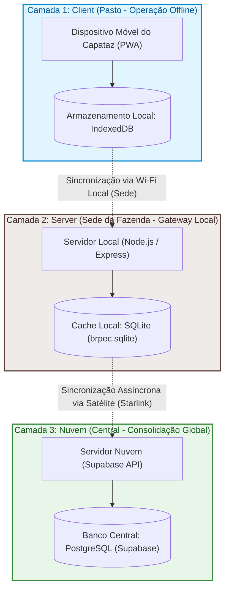
```mermaid
graph TD
  %% Camada 1: Pasto
  subgraph Pasto ["Camada 1: Client (Pasto - Operação Offline)"]
    direction TB
    A["Dispositivo Móvel do Capataz (PWA)"] --> B[("Armazenamento Local: IndexedDB")]
    style Pasto fill:#e1f5fe,stroke:#0288d1,stroke-width:2px,color:#01579b
  end

  %% Camada 2: Sede
  subgraph Sede ["Camada 2: Server (Sede da Fazenda - Gateway Local)"]
    direction TB
    C["Servidor Local (Node.js / Express)"] --> D[("Cache Local: SQLite (brpec.sqlite)")]
    style Sede fill:#efebe9,stroke:#5d4037,stroke-width:2px,color:#3e2723
  end

  %% Camada 3: Nuvem
  subgraph Nuvem ["Camada 3: Nuvem (Central - Consolidação Global)"]
    direction TB
    E["Servidor Nuvem (Supabase API)"] --> F[("Banco Central: PostgreSQL (Supabase)")]
    style Nuvem fill:#e8f5e9,stroke:#388e3c,stroke-width:2px,color:#1b5e20
  end

  %% Conexões e Fluxo de Dados
  B -.->|"Sincronização via Wi-Fi Local (Sede)"| C
  D -.->|"Sincronização Assíncrona via Satélite (Starlink)"| E
```

<center>
  <p><strong>Figura 8.1</strong> — Arquitetura de Sincronização em 3 Camadas do BrPec</p>
  <p>Fonte: Próprios autores (2026).</p>
</center>

##### Detalhamento do Fluxo de Dados, Validação e Justificativas Técnicas:

1. **Camada 1 (Client - Pasto):**
   - **Contexto Operacional:** No pasto, a latência de rede é infinita e a largura de banda é zero. O Capataz interage com um Progressive Web App (PWA) instalado em seu celular.
   - **Fluxo de Dados:** Apontamentos zootécnicos e alterações de tarefas são capturados em tempo real. O aplicativo PWA persiste esses registros localmente no **IndexedDB** do navegador.
   - **Fundamentação Técnica:** O **IndexedDB** (especificação W3C API 3.0) [2] foi selecionado devido à sua capacidade de armazenamento transactional assíncrono de alta capacidade. Ao contrário de tecnologias mais simples como o `localStorage` (síncrono e limitado a 5MB de dados puramente textuais), o IndexedDB permite armazenar estruturas relacionais complexas e metadados de mídias de forma assíncrona, não bloqueando a thread principal da interface do usuário (UI).
   - **Validação:** A validação nesta camada é estritamente client-side, focando em formatos sintáticos, preenchimento de campos obrigatórios e conformidade visual para evitar erros grosseiros de digitação em campo.

2. **Camada 2 (Server - Sede da Fazenda / Gateway Local):**
   - **Contexto Operacional:** Quando o Capataz retorna para a sede da fazenda ao fim do expediente, o dispositivo móvel se conecta à rede **Wi-Fi local** e inicia a transferência de dados.
   - **Fluxo de Sincronização e Padrão Outbox:** O PWA drena os registros acumulados do IndexedDB para o servidor Express local da fazenda. O servidor processa esses dados e os persiste no banco **SQLite** local (`brpec.sqlite`). Para garantir a entrega garantida das movimentações à nuvem sem risco de perda em caso de falha física, aplica-se o padrão de microsserviços **Transactional Outbox** (RICHARDSON, 2018) [3]: os apontamentos zootécnicos e o registro da fila de envio na tabela `sincronizacoes` são salvos de forma atômica no SQLite dentro de uma única transação de banco.
   - **Fundamentação Técnica:** O **SQLite** (HIPP, 2020) [4] foi adotado como cache relacional local por ser uma engine de banco relacional embutida e *zero-configuration*, eliminando o overhead operacional e o risco de falhas de manutenção inerentes a servidores tradicionais (como PostgreSQL ou MySQL) no ambiente hostil de servidores locais de fazendas. O uso do módulo nativo do Node.js (`node:sqlite`) fornece sub-milissegundos de latência com baixo consumo de memória, garantindo persistência robusta e durável em disco local.
   - **Validação:** O servidor Express local atua como o principal portão de validação de regras de negócio pecuárias (ex.: verificação zootécnica de idade para nascimentos, checagem se o responsável pertence ao retiro da tarefa). A validação em nível de banco de dados é reforçada por chaves estrangeiras (`PRAGMA foreign_keys = ON;`) e constraints de check no SQLite.

3. **Camada 3 (Nuvem - Central):**
   - **Contexto Operacional:** A sede da fazenda possui um modem satelital **Starlink** com alta taxa de transferência, porém sujeito a quedas intermitentes por fatores climáticos e obstruções físicas.
   - **Fluxo de Sincronização e Consistência Eventual:** Um agendador em segundo plano (`cloudSyncService.ts`) monitora a conectividade remota. Quando a conexão satelital é restabelecida, o serviço consome a fila de outbox (`sincronizacoes`) e faz o push dos dados acumulados para a API centralizada do **Supabase (PostgreSQL)** na nuvem. Ao receber uma confirmação de sucesso com status HTTP 200/201, o servidor local atualiza as linhas locais como sincronizadas.
   - **Fundamentação Técnica:** O modelo de replicação opera sob **Consistência Eventual** (VOGELS, 2009) [5], permitindo que as fazendas continuem operando de forma autônoma e convergindo os estados estruturais com o banco centralizado sem a necessidade de conexões persistentes síncronas de duas fases (2PC), impraticáveis sob redes de satélite. O **PostgreSQL** hospedado no Supabase atua como o banco de dados mestre global, fornecendo capacidades ACID de alta concorrência para consolidação de múltiplos retiros da fazenda em tempo real.
   - **Validação:** A camada de nuvem valida a consistência relacional global (ex.: unicidade global de UUIDs gerados de forma descentralizada) e restrições globais de negócios consolidados.

---

### Referências Arquiteturais da Seção:
* [1] KLEPPMANN, Martin et al. **Local-first software: You own your data, in spite of the cloud**. In: Proceedings of the 2019 ACM SIGPLAN International Symposium on New Ideas, New Paradigms, and Reflections on Programming and Software (Onward!). 2019. p. 154-178.
* [2] W3C. **Indexed Database API 3.0**. W3C Recommendation, 2024. Disponível em: <https://www.w3.org/TR/IndexedDB/>.
* [3] RICHARDSON, Chris. **Microservices Patterns: With examples in Java**. Manning Publications, 2018.
* [4] HIPP, Richard D. **SQLite Design Principles and Architecture**. SQLite Library, 2020.
* [5] VOGELS, Werner. **Eventually Consistent**. ACM Queue, v. 6, n. 6, p. 14-19, 2009.

---

#### Arquitetura Lógica de Software (CSR)

O Sistema BrPec adota o padrão **Arquitetura em Camadas (Layered Architecture)** no estilo **Controller-Service-Repository (CSR)**, organizando o backend em responsabilidades isoladas que se comunicam de forma unidirecional. A escolha desse padrão se justifica por quatro motivos centrais para o projeto: (i) **separação de responsabilidades**, isolando regras de negócio do transporte HTTP e do acesso a dados; (ii) **testabilidade**, já que cada camada pode ser testada de forma independente com mocks das camadas inferiores; (iii) **manutenibilidade**, permitindo evoluir uma camada sem propagar mudanças para as demais; e (iv) **baixo acoplamento com a infraestrutura escolhida** (Supabase + PostgreSQL), de modo que uma eventual troca do provedor de banco ou do framework HTTP impacte apenas a camada correspondente.

A solução é composta por **cinco camadas lógicas** no backend, implementadas em Node.js + Express.js, com persistência em PostgreSQL gerenciado pelo Supabase:

<center>
  <p><strong>Figura 8</strong> — Diagrama de Arquitetura em Camadas do Sistema BrPec</p>
  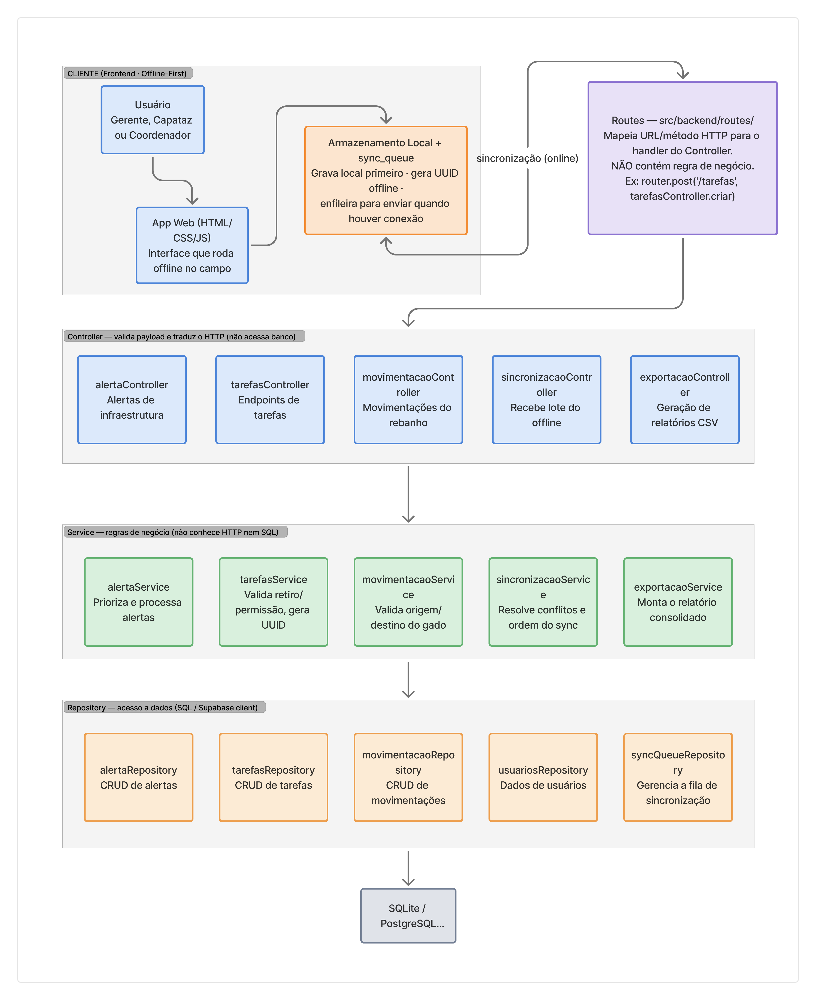
  <p>Fonte: Próprios autores (2026).</p>
</center>


#### Camadas e suas responsabilidades

**1. Routes (Camada de Rotas)**
- **Responsabilidade:** definir os endpoints HTTP expostos pela API, associando cada método/URL ao seu respectivo handler na camada Controller. **Não** contém lógica de negócio nem manipula req/res além do roteamento.
- **Localização:** `g03/src/backend/routes/` (ex.: `routes/index.js`).
- **Quem chama / chama quem:** recebe requisições do cliente (frontend mobile/web ou ferramentas externas) e delega para a camada Controller.
- **Implementação:** Express Router. Hoje já existe `routes/index.js` registrando `GET /health → healthController.getHealth`.

**2. Controller (Camada de Apresentação)**
- **Responsabilidade:** traduzir a requisição HTTP em uma chamada à camada de Service, validar o formato do payload (presença e tipo dos campos), e formatar a resposta (status code, JSON de retorno, mensagens de erro). **Não** acessa o banco de dados nem implementa regras de negócio.
- **Localização:** `g03/src/backend/controllers/` (pasta criada, controllers serão implementados ao longo das sprints 3 e 4).
- **Quem chama / chama quem:** chamado pelas Routes, chama a camada de Service.

**3. Service (Camada de Regras de Negócio)**
- **Responsabilidade:** concentrar a lógica de negócio do domínio pecuário — orquestrar operações, aplicar validações de regra (ex.: usuário tem permissão para criar tarefa em determinado retiro?), gerar identificadores offline (UUID), montar entradas para a `sync_queue` e coordenar chamadas a um ou mais repositórios. **Não** conhece HTTP nem detalhes do dialeto SQL.
- **Localização:** `g03/src/backend/services/` (ex.: [healthService.js](g03/src/backend/services/healthService.js) já implementado como referência da camada).
- **Quem chama / chama quem:** chamado pelos Controllers, chama um ou mais Repositories.

**4. Repository (Camada de Acesso a Dados)**
- **Responsabilidade:** encapsular todo o acesso ao banco de dados — consultas SQL, inserts, updates, deletes e chamadas ao cliente Supabase. Cada Repository corresponde, em geral, a uma entidade (`tarefasRepository`, `usuariosRepository`, etc.). **Não** contém regras de negócio: opera sobre dados.
- **Localização:** `src/backend/repositories/` (implementado nesta sprint: `tarefaRepository.ts`, `alertaRepository.ts`, `eventoRepository.ts`, etc.). A conexão com o banco local é gerenciada em `src/backend/config/database.ts`.
- **Quem chama / chama quem:** chamado pelos Services, chama o driver do banco (`pg` ou `@supabase/supabase-js`).

**5. Model (Camada de Entidades de Domínio)**
- **Responsabilidade:** representar as entidades do domínio em código (Tarefa, Retiro, Usuário, Movimentação, Alerta, etc.), refletindo o modelo ER descrito na seção 3.6. Define a forma dos dados que trafegam entre as camadas, sem comportamento de persistência.
- **Localização:** `g03/src/backend/models/` (pasta criada, implementação prevista para as sprints 3 e 4).
- **Quem chama / chama quem:** instanciado e consumido pelas camadas Repository e Service.

#### Fluxo de dependência (unidirecional)

```
Cliente (App/Front)  →  Routes  →  Controller  →  Service  →  Repository  →  Model  →  Supabase/PostgreSQL
```

Cada camada conhece apenas a imediatamente inferior — uma Route não chama um Repository diretamente, e um Repository não conhece HTTP. Essa regra é o que garante a substituibilidade de cada camada e habilita testes isolados.

#### Tabela-resumo

| Camada      | Pasta                         | Responsabilidade                                  | Pode chamar     | Exemplo de arquivo                                       |
|-------------|-------------------------------|---------------------------------------------------|-----------------|----------------------------------------------------------|
| Routes      | `src/backend/routes/`         | Mapear URL/método para o handler                  | Controller      | `routes/index.js`                                        |
| Controller  | `src/backend/controllers/`    | Validar payload, traduzir HTTP Service          | Service         | `controllers/tarefasController.js` (planejado)           |
| Service     | `src/backend/services/`       | Regras de negócio do domínio pecuário             | Repository      | `services/healthService.js` · `services/tarefasService.js` (planejado) |
| Repository  | `src/backend/repositories/`   | Acesso a dados (SQL / Supabase client)            | Driver do banco | `repositories/tarefasRepository.js` (planejado)          |
| Model       | `src/backend/models/`         | Representar entidade de domínio                   | —               | `models/Tarefa.js` (planejado)                           |

<center>
  <p><strong>Tabela 20</strong> — Arquitetura</p>
  <p>Fonte: Próprios autores (2026).</p>
</center>

#### Exemplo de fluxo end-to-end — US01 "Criar Tarefa"

Para ilustrar como uma requisição atravessa as camadas, considere a **US01** (seção 2.3): "Como Gerente geral, posso criar tarefas e atribuí-las a um retiro específico". O fluxo previsto para a requisição `POST /tarefas` é:

1. **Routes** (`routes/tarefas.js`) recebe a requisição HTTP e delega:
   ```js
   router.post('/tarefas', tarefasController.criar);
   ```
2. **Controller** (`controllers/tarefasController.js`) valida o payload (campos obrigatórios: `titulo`, `retiro_id`, `prazo`), extrai o usuário autenticado e chama o service:
   ```js
   const tarefa = await tarefasService.criarTarefa(req.body, req.user);
   res.status(201).json(tarefa);
   ```
3. **Service** (`services/tarefasService.js`) aplica as regras de negócio: gera o UUID localmente (estratégia offline-first descrita na seção 3.6.4), verifica se o `retiro_id` pertence à fazenda do usuário, registra a operação na `sync_queue` e chama o repositório:
   ```js
   const novaTarefa = new Tarefa({ id: uuidv7(), ...dados, autor: usuario.id });
   await tarefasRepository.inserir(novaTarefa);
   await syncQueueRepository.enfileirar('INSERT', 'tarefas', novaTarefa);
   ```
4. **Repository** (`repositories/tarefasRepository.js`) executa o `INSERT` na tabela `tarefas` via cliente `pg` ou `@supabase/supabase-js`, sem conhecer regras de negócio.
5. **Model** (`models/Tarefa.js`) é a classe/objeto que representa a entidade Tarefa, garantindo a forma dos dados trafegados entre Service e Repository.

A resposta percorre o caminho inverso (Repository → Service → Controller → Routes → Cliente), atendendo aos critérios de aceite CR1 (tarefa vinculada ao retiro) e CR2 (disponibilidade após sincronização).

#### Estado atual da implementação

A arquitetura descrita acima é a **arquitetura-alvo** do projeto. O estado da implementação ao final desta sprint é:

| Camada       | Status                                                                                  |
|--------------|-----------------------------------------------------------------------------------------|
| Routes       | Implementada (estrutura inicial em [routes/index.js](g03/src/backend/routes/index.js)) |
| Controllers  | Pasta criada, primeiros controllers a serem implementados na sprint 3                  |
| Services     | Camada validada com [healthService.js](g03/src/backend/services/healthService.js); demais services seguirão o mesmo padrão |
| Repositories | Pasta criada, implementação prevista para a sprint 3                                  |
| Models       | Pasta criada, implementação prevista para a sprint 3                                  |

<center>
  <p><strong>Tabela 21</strong> — Status de implementação da arquitetura</p>
  <p>Fonte: Próprios autores (2026).</p>
</center>

A configuração do banco (`src/backend/config/database.ts`) já está preparada e em uso pela camada Repository implementada nesta sprint.

### 3.2.2. Diagrama de Casos de Uso (sprint 1)

Os casos de uso do Sistema BrPec foram definidos com o objetivo de representar, de forma estruturada, as principais interações entre os atores do sistema e as funcionalidades disponibilizadas pela plataforma. Esses casos de uso refletem os processos críticos da operação pecuária, com foco na gestão de tarefas, registro de movimentações e consolidação de dados para tomada de decisão.

Cada caso de uso está associado a um requisito funcional (RF), garantindo rastreabilidade entre as necessidades identificadas e as funcionalidades implementadas. A seguir, são detalhados os principais casos de uso do sistema.

<center>
  <p><strong>Figura 9</strong> — Diagrama de Caso de Uso aplicado à BrPec Agropecuária</p>
  
  <p>Fonte: Próprios autores (2026).</p>
</center>

UC01 — Planejar tarefas (RF001)
| Campo | Descrição |
| ------------------ | ------------------------------------------------------------------------------------------ |
| Ator principal | Gerente Geral |
| Atores secundários | Não se aplica |
| Pré-condições | O sistema deve estar acessível e o usuário autenticado |
| Fluxo principal | O Gerente define uma nova tarefa, estabelece prazos e descreve a atividade a ser executada |
| Pós-condições | A tarefa é registrada no sistema e fica disponível para distribuição |

<center>
  <p><strong>Quadro 13</strong> — Caso de Uso UC01</p>
  <p>Fonte: Próprios autores (2026).</p>
</center>

---

UC02 — Distribuir tarefas por retiro (RF002)
| Campo | Descrição |
| ------------------ | ----------------------------------------------------------------------- |
| Ator principal | Gerente Geral |
| Atores secundários | Não se aplica |
| Pré-condições | Deve existir ao menos uma tarefa previamente cadastrada |
| Fluxo principal | O Gerente associa a tarefa a um ou mais retiros, definindo responsáveis |
| Pós-condições | A tarefa é atribuída e visível para execução pelos Capatazes |

<center>
  <p><strong>Quadro 14</strong> — Caso de Uso UC02</p>
  <p>Fonte: Próprios autores (2026).</p>
</center>

---

UC03 — Visualizar tarefas do dia (RF003)
| Campo | Descrição |
| ------------------ | ------------------------------------------------------------------- |
| Ator principal | Capataz |
| Atores secundários | Não se aplica |
| Pré-condições | O Capataz deve estar autenticado no sistema |
| Fluxo principal | O Capataz acessa a lista de tarefas disponíveis para o dia corrente |
| Pós-condições | As tarefas são exibidas para execução |

<center>
  <p><strong>Quadro 15</strong> — Caso de Uso UC03</p>
  <p>Fonte: Próprios autores (2026).</p>
</center>

---

UC04 — Registrar execução de tarefa (RF004)
| Campo | Descrição |
| ------------------ | ------------------------------------------------------------ |
| Ator principal | Capataz |
| Atores secundários | Não se aplica |
| Pré-condições | Deve existir uma tarefa atribuída ao Capataz |
| Fluxo principal | O Capataz marca a tarefa como concluída no sistema |
| Pós-condições | A tarefa é registrada como concluída e atualizada no sistema |

<center>
  <p><strong>Quadro 16</strong> — Caso de Uso UC04</p>
  <p>Fonte: Próprios autores (2026).</p>
</center>

---

UC05 — Anexar evidência (RF005)
| Campo | Descrição |
| ------------------ | --------------------------------------------------------------- |
| Ator principal | Capataz |
| Atores secundários | Não se aplica |
| Pré-condições | A tarefa deve estar em processo de conclusão |
| Fluxo principal | O Capataz adiciona uma foto ou áudio como evidência da execução |
| Pós-condições | A evidência é armazenada e vinculada à tarefa |

<center>
  <p><strong>Quadro 17</strong> — Caso de Uso UC05</p>
  <p>Fonte: Próprios autores (2026).</p>
</center>

---

UC06 — Registrar movimentação (RF006)
| Campo | Descrição |
| ------------------ | ---------------------------------------------------------- |
| Ator principal | Capataz |
| Atores secundários | Não se aplica |
| Pré-condições | O sistema deve estar disponível para registro |
| Fluxo principal | O Capataz registra uma movimentação relacionada ao rebanho |
| Pós-condições | A movimentação é armazenada para posterior validação |

<center>
  <p><strong>Quadro 18</strong> — Caso de Uso UC06</p>
  <p>Fonte: Próprios autores (2026).</p>
</center>

---

UC07 — Validar movimentações (RF007)
| Campo | Descrição |
| ------------------ | ---------------------------------------------------------- |
| Ator principal | Coordenador |
| Atores secundários | Não se aplica |
| Pré-condições | Devem existir movimentações previamente registradas |
| Fluxo principal | O Coordenador revisa e valida as movimentações registradas |
| Pós-condições | As movimentações são confirmadas e consideradas válidas |

<center>
  <p><strong>Quadro 19</strong> — Caso de Uso UC07</p>
  <p>Fonte: Próprios autores (2026).</p>
</center>

---

UC08 — Consultar dados consolidados (RF008)
| Campo | Descrição |
| ------------------ | --------------------------------------------------- |
| Ator principal | Coordenador |
| Atores secundários | Gerente Geral |
| Pré-condições | Devem existir dados registrados no sistema |
| Fluxo principal | O usuário acessa relatórios consolidados por retiro |
| Pós-condições | As informações são exibidas para análise |

<center>
  <p><strong>Quadro 20</strong> — Caso de Uso UC08</p>
  <p>Fonte: Próprios autores (2026).</p>
</center>

---

UC09 — Exportar relatórios (RF009)
| Campo | Descrição |
| ------------------ | -------------------------------------------------------------------- |
| Ator principal | Coordenador |
| Atores secundários | Não se aplica |
| Pré-condições | Deve haver dados consolidados disponíveis |
| Fluxo principal | O Coordenador solicita a exportação dos dados em formato estruturado |
| Pós-condições | O relatório é gerado e disponibilizado para download |

<center>
  <p><strong>Quadro 21</strong> — Caso de Uso UC09</p>
  <p>Fonte: Próprios autores (2026).</p>
</center>


### 3.2.3. Diagrama de Classes do Dominio (sprint 2) 

O Diagrama de Classes do Domínio representa, em notação UML, a estrutura estática
do sistema BrPec: suas entidades principais, os atributos que as compõem, os métodos
que encapsulam seu comportamento e os relacionamentos que as interligam. Conforme
definido pelo Object Management Group (OMG) na especificação UML 2.5.1, o diagrama
de classes é o principal artefato de modelagem estrutural da linguagem, sendo empregado
para visualizar, especificar, construir e documentar os elementos conceituais de um
sistema de software [14]. A notação utilizada segue as convenções formais consolidadas
dessa especificação, diferenciando com precisão os tipos de relacionamento —
**associação**, **agregação** (losango vazio), **composição** (losango cheio) e
**herança** (triângulo vazio) —, com multiplicidade explicitada em todas as
extremidades.

A modelagem segue também as diretrizes consolidadas por Booch, Rumbaugh e Jacobson
em *The Unified Modeling Language User Guide* [21], obra de referência dos criadores
originais da linguagem, que estabelece o diagrama de classes como o bloco fundamental
de construção do UML, sendo todos os outros diagramas coleções de classes ou
representações de relações entre elas. Complementarmente, as boas práticas de
modelagem estrutural adotadas no projeto baseiam-se em Fowler [15], cuja obra _UML
Distilled_ orienta o uso do diagrama de classes como ferramenta de comunicação de
design orientado a objetos, enfatizando clareza, coesão e rastreabilidade entre modelo
e requisitos. A estrutura de classes abstratas e a organização das responsabilidades
entre as entidades seguem ainda os princípios de modelagem de domínio descritos por
Larman [16], que fundamentam a identificação de classes conceituais abstratas como
mecanismo para restringir quais classes podem ter instâncias concretas, esclarecendo
as regras do domínio do problema.

A norma ISO/IEC 19505-2:2012, que publica formalmente a especificação UML como padrão
internacional, define que o diagrama de classes deve prover uma definição formal dos
conceitos de modelagem, seus atributos e seus relacionamentos, bem como as regras para
combiná-los na construção de modelos parciais ou completos [17]. O modelo foi construído
a partir da análise cruzada dos Requisitos Funcionais (RF), das Regras de Negócio (RN)
e dos Casos de Uso (UC) definidos nas seções anteriores, garantindo rastreabilidade
entre as decisões de modelagem e os demais artefatos de engenharia de requisitos do
projeto.

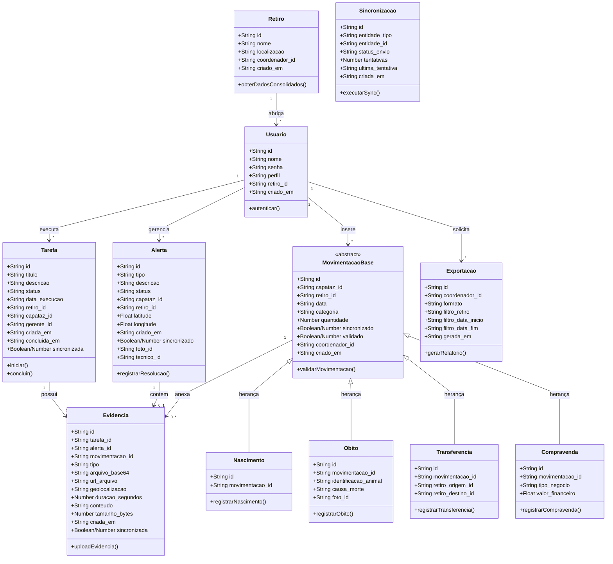
```mermaid
%%{init: {'flowchart': {'curve': 'linear'}, 'class': {'curve': 'linear'}}}%%
classDiagram
  direction TB

  class Usuario {
    +String id
    +String nome
    +String senha
    +String perfil
    +String retiro_id
    +String criado_em
    +autenticar()
  }

  class Retiro {
    +String id
    +String nome
    +String localizacao
    +String coordenador_id
    +String criado_em
    +obterDadosConsolidados()
  }

  class MovimentacaoBase {
    <<abstract>>
    +String id
    +String capataz_id
    +String retiro_id
    +String data
    +String categoria
    +Number quantidade
    +Boolean/Number sincronizado
    +Boolean/Number validado
    +String coordenador_id
    +String criado_em
    +validarMovimentacao()
  }

  class Alerta {
    +String id
    +String tipo
    +String descricao
    +String status
    +String capataz_id
    +String retiro_id
    +Float latitude
    +Float longitude
    +String criado_em
    +Boolean/Number sincronizado
    +String foto_id
    +String tecnico_id
    +registrarResolucao()
  }

  class Tarefa {
    +String id
    +String titulo
    +String descricao
    +String status
    +String data_execucao
    +String retiro_id
    +String capataz_id
    +String gerente_id
    +String criada_em
    +String concluida_em
    +Boolean/Number sincronizada
    +iniciar()
    +concluir()
  }

  class Exportacao {
    +String id
    +String coordenador_id
    +String formato
    +String filtro_retiro
    +String filtro_data_inicio
    +String filtro_data_fim
    +String gerada_em
    +gerarRelatorio()
  }

  class Nascimento {
    +String id
    +String movimentacao_id
    +registrarNascimento()
  }

  class Obito {
    +String id
    +String movimentacao_id
    +String identificacao_animal
    +String causa_morte
    +String foto_id
    +registrarObito()
  }

  class Transferencia {
    +String id
    +String movimentacao_id
    +String retiro_origem_id
    +String retiro_destino_id
    +registrarTransferencia()
  }

  class Compravenda {
    +String id
    +String movimentacao_id
    +String tipo_negocio
    +Float valor_financeiro
    +registrarCompravenda()
  }

  class Evidencia {
    +String id
    +String tarefa_id
    +String alerta_id
    +String movimentacao_id
    +String tipo
    +String arquivo_base64
    +String url_arquivo
    +String geolocalizacao
    +Number duracao_segundos
    +String conteudo
    +Number tamanho_bytes
    +String criada_em
    +Boolean/Number sincronizada
    +uploadEvidencia()
  }

  class Sincronizacao {
    +String id
    +String entidade_tipo
    +String entidade_id
    +String status_envio
    +Number tentativas
    +String ultima_tentativa
    +String criada_em
    +executarSync()
  }

  %% Relacionamentos Principais (Simplificados para evitar cruzamentos e poluição visual)
  Retiro "1" --> "*" Usuario : abriga
  Usuario "1" --> "*" MovimentacaoBase : insere
  Usuario "1" --> "*" Alerta : gerencia
  Usuario "1" --> "*" Tarefa : executa
  Usuario "1" --> "*" Exportacao : solicita

  Tarefa "1" --> "0..1" Evidencia : possui
  Alerta "1" --> "0..1" Evidencia : contem
  MovimentacaoBase "1" --> "0..*" Evidencia : anexa

  %% Herança (Superclasse <|-- Subclasse)
  MovimentacaoBase <|-- Nascimento : herança
  MovimentacaoBase <|-- Obito : herança
  MovimentacaoBase <|-- Transferencia : herança
  MovimentacaoBase <|-- Compravenda : herança
```

<center>
  <p><strong>Figura 10</strong> — Diagrama de Classes do Domínio do Sistema BrPec (Mermaid UML)</p>
  <p>Fonte: Próprios autores (2026).</p>
</center>

O diagrama é organizado em três camadas conceituais: 

- **Camada de Identidade e Acesso:** agrupa a hierarquia de usuários do sistema
  (`Usuario`, `Gerente`, `Coordenador` e `Capataz`), modelada por herança, refletindo
  os três perfis de acesso e as responsabilidades distintas de cada ator, conforme
  descritos na seção 3.1;
- **Camada Operacional:** concentra as entidades centrais do fluxo de trabalho —
  `Retiro`, `Tarefa`, `Evidencia` e `AlertaInfraestrutura` —, que materializam o
  planejamento, a execução e o reporte das atividades de campo (US01 a US07);
- **Camada Zootécnica e de Controle:** reúne os registros de eventos do rebanho —
  `EventoZootecnico`, `RegistroNascimento` e `RegistroObito` —, que suportam o controle
  pecuário offline (US08 a US10), além da entidade `Sincronizacao`, responsável pela
  gestão do ciclo de envio de dados ao servidor central, e `Exportacao`, que atende à
  demanda do Coordenador de geração de relatórios estruturados (RF015).

A decisão de modelar `Evidencia` e `EventoZootecnico` como classes abstratas decorre
da necessidade de encapsular atributos e comportamentos comuns — como o vínculo com
a tarefa ou com o retiro e o controle de sincronização offline —, evitando duplicação
nas subclasses concretas (`Foto`, `Audio`, `TextoComplementar`, `RegistroNascimento`
e `RegistroObito`). Segundo Larman [16], é útil identificar classes abstratas no modelo
de domínio porque elas restringem quais classes podem ter instâncias concretas,
esclarecendo as regras do domínio do problema: se toda instância de um conceito deve,
obrigatoriamente, ser uma instância de uma de suas subclasses, então esse conceito é
abstrato por definição. A classe `Sincronizacao`, por sua vez, foi isolada como
entidade independente para suportar o requisito não funcional de Confiabilidade
(RNF — CONF), que determina 0% de perda de dados em falhas de conexão, sem
sobrecarregar as demais classes com atributos de controle de rede — decisão alinhada
ao princípio de responsabilidade única descrito por Fowler [15] como critério de
coesão em modelos orientados a objetos.

A seguir, são detalhados os atributos, tipos de dado e métodos de cada classe
modelada no diagrama, organizados por camada conceitual. Os tipos adotam a notação
primitiva do domínio de aplicação, compatível com as tecnologias de persistência
previstas na arquitetura (SQLite para armazenamento local e banco relacional central).
Conforme orientam Booch, Rumbaugh e Jacobson [14], cada atributo de uma classe define
o seu estado em um dado instante, enquanto os métodos definem o seu comportamento,
devendo ambos ser especificados com o nível de detalhe adequado à fase de modelagem
em que o diagrama é produzido.

---

**Camada de Identidade e Acesso**

A hierarquia de usuários é fundamentada em uma superclasse abstrata `Usuario`, que centraliza os atributos de identificação e autenticação comuns a todos os perfis. As subclasses concretas herdam esses atributos e estendem o comportamento de acordo com as responsabilidades de cada ator, conforme modelado nos casos de uso UC01 a UC09.


| Atributo | Tipo     | Obrigatório | Descrição                                                               |
| -------- | -------- | ----------- | ----------------------------------------------------------------------- |
| id       | UUID     | Sim         | Identificador único do usuário, gerado automaticamente                  |
| nome     | String   | Sim         | Nome completo do usuário                                                |
| senha    | String   | Sim         | Credencial de acesso; para Capataz, senha simples definida pelo Gerente |
| perfil   | Enum     | Sim         | Tipo do ator: `Gerente`, `Coordenador` ou `Capataz`                     |
| criadoEm | DateTime | Sim         | Timestamp de criação do registro, gerado pelo sistema                   |

<center>
  <p><strong>Tabela 31</strong> — Atributos da classe Usuario</p>
  <p>Fonte: Próprios autores (2026).</p>
</center>

---

| Elemento             | Tipo/Retorno | Descrição                                                           |
| -------------------- | ------------ | ------------------------------------------------------------------- |
| _(herda de Usuario)_ | —            | Todos os atributos da superclasse são herdados                      |
| criarTarefa()        | Tarefa       | Instancia uma nova tarefa e a associa a um retiro e a um Capataz    |
| editarTarefa()       | Tarefa       | Atualiza os dados de uma tarefa existente                           |
| deletarTarefa()      | void         | Remove uma tarefa do sistema, desde que não esteja concluída        |
| visualizarPainel()   | void         | Acessa o painel consolidado de status de tarefas e alertas (RF007)  |
| visualizarAlertas()  | void         | Acessa os alertas de infraestrutura abertos pelos Capatazes (RF006) |

<center>
  <p><strong>Tabela 32</strong> — Métodos da classe Gerente</p>
  <p>Fonte: Próprios autores (2026).</p>
</center>

---

| Elemento                  | Tipo/Retorno             | Descrição                                                                          |
| ------------------------- | ------------------------ | ---------------------------------------------------------------------------------- |
| _(herda de Usuario)_      | —                        | Todos os atributos da superclasse são herdados                                     |
| visualizarMovimentacoes() | List\<EventoZootecnico\> | Recupera todos os eventos zootécnicos dos retiros sob sua responsabilidade         |
| validarMovimentacao()     | void                     | Confirma a integridade de um evento zootécnico, alterando seu status para validado |
| exportarRelatorio()       | Exportacao               | Gera e disponibiliza arquivo CSV/XLSX com os dados consolidados (RF015)            |

<center>
  <p><strong>Tabela 33</strong> — Métodos da classe Coordenador</p>
  <p>Fonte: Próprios autores (2026).</p>
</center>

---

| Elemento                    | Tipo/Retorno         | Descrição                                                                               |
| --------------------------- | -------------------- | --------------------------------------------------------------------------------------- |
| _(herda de Usuario)_        | —                    | Todos os atributos da superclasse são herdados                                          |
| retiro_id                   | UUID                 | Chave estrangeira que vincula o Capataz a um único Retiro (RN01, RN05)                  |
| visualizarTarefas()         | List\<Tarefa\>       | Recupera as tarefas do dia do retiro ao qual o Capataz pertence (RF002)                 |
| concluirTarefa()            | void                 | Atualiza o status de uma tarefa para `CONCLUIDA` e aciona o envio de evidências (RF003) |
| abrirAlerta()               | AlertaInfraestrutura | Registra um novo alerta de infraestrutura com geolocalização (RF006)                    |
| registrarEventoZootecnico() | EventoZootecnico     | Preenche e persiste localmente um evento de nascimento ou óbito (RF008, RF009)          |

<center>
  <p><strong>Tabela 34</strong> — Métodos da classe Capataz</p>
  <p>Fonte: Próprios autores (2026).</p>
</center>

**Camada Operacional**

Essa camada concentra as entidades que sustentam o fluxo principal de trabalho do sistema: o planejamento e a distribuição de tarefas pelo Gerente, a execução e o reporte pelo Capataz e a supervisão pelo Coordenador.


| Atributo       | Tipo     | Obrigatório | Descrição                                                    |
| -------------- | -------- | ----------- | ------------------------------------------------------------ |
| id             | UUID     | Sim         | Identificador único do retiro                                |
| nome           | String   | Sim         | Nome de identificação do retiro na fazenda                   |
| localizacao    | String   | Sim         | Descrição geográfica ou referência da área do retiro         |
| coordenador_id | UUID     | Sim         | Chave estrangeira para o Coordenador responsável pelo retiro |
| criadoEm       | DateTime | Sim         | Timestamp de cadastro do retiro no sistema                   |

<center>
  <p><strong>Tabela 35</strong> — Atributos da classe Retiro</p>
  <p>Fonte: Próprios autores (2026).</p>
</center>

---


| Atributo     | Tipo     | Obrigatório | Descrição                                                                         |
| ------------ | -------- | ----------- | --------------------------------------------------------------------------------- |
| id           | UUID     | Sim         | Identificador único da tarefa                                                     |
| titulo       | String   | Sim         | Título resumido da atividade a ser executada                                      |
| descricao    | String   | Não         | Detalhamento das instruções para o Capataz                                        |
| status       | Enum     | Sim         | Estado atual da tarefa: `PENDENTE`, `EM_ANDAMENTO` ou `CONCLUIDA`                 |
| dataExecucao | Date     | Sim         | Data prevista para execução da tarefa (base para a regra RN02)                    |
| retiro_id    | UUID     | Sim         | Chave estrangeira para o Retiro ao qual a tarefa está vinculada (RN01)            |
| capataz_id   | UUID     | Sim         | Chave estrangeira para o Capataz responsável pela execução (RN01)                 |
| gerente_id   | UUID     | Sim         | Chave estrangeira para o Gerente que criou a tarefa (RF001)                       |
| criadaEm     | DateTime | Sim         | Timestamp de criação da tarefa, injetado automaticamente pelo sistema (RNF — SEG) |
| concluidaEm  | DateTime | Não         | Timestamp de conclusão, preenchido quando o status é alterado para `CONCLUIDA`    |
| sincronizada | Boolean  | Sim         | Indica se o registro já foi transmitido ao servidor central (RF010)               |

<center>
  <p><strong>Tabela 36</strong> — Atributos da classe Tarefa</p>
  <p>Fonte: Próprios autores (2026).</p>
</center>

A classe `Evidencia` é modelada como abstrata por reunir o comportamento comum às três formas de comprovação da execução de tarefas previstas no sistema — foto, áudio e texto —, sem que nenhuma instância de `Evidencia` pura faça sentido no domínio. Cada subclasse concreta especializa os atributos de acordo com o meio de registro.


| Classe                | Atributo        | Tipo     | Obrigatório | Descrição                                                         |
| --------------------- | --------------- | -------- | ----------- | ----------------------------------------------------------------- |
| **Evidencia**         | id              | UUID     | Sim         | Identificador único da evidência                                  |
| **Evidencia**         | tarefa_id       | UUID     | Sim         | Chave estrangeira para a Tarefa à qual a evidência está vinculada |
| **Evidencia**         | tipo            | Enum     | Sim         | Natureza da evidência: `FOTO`, `AUDIO` ou `TEXTO`                 |
| **Evidencia**         | criadaEm        | DateTime | Sim         | Timestamp de criação, gerado automaticamente pelo sistema         |
| **Evidencia**         | sincronizada    | Boolean  | Sim         | Indica se o arquivo já foi transmitido ao servidor (RF010, RN11)  |
| **Foto**              | urlArquivo      | String   | Sim         | Caminho ou URL do arquivo de imagem após sincronização            |
| **Foto**              | tamanhoBytes    | Integer  | Sim         | Tamanho do arquivo em bytes, para controle de capacidade          |
| **Foto**              | geolocalizacao  | String   | Sim         | Coordenadas GPS capturadas no momento do registro (RN19, RN24)    |
| **Audio**             | urlArquivo      | String   | Sim         | Caminho ou URL do arquivo de áudio após sincronização             |
| **Audio**             | duracaoSegundos | Integer  | Sim         | Duração da gravação em segundos (RF005, RN14)                     |
| **TextoComplementar** | conteudo        | String   | Sim         | Conteúdo textual inserido pelo Capataz como complemento da tarefa |

<center>
  <p><strong>Tabela 37</strong> — Atributos da classe Evidencia</p>
  <p>Fonte: Próprios autores (2026).</p>
</center>

---

| Atributo     | Tipo     | Obrigatório | Descrição                                                                     |
| ------------ | -------- | ----------- | ----------------------------------------------------------------------------- |
| id           | UUID     | Sim         | Identificador único do alerta                                                 |
| tipo         | Enum     | Sim         | Categoria do problema: `CERCA`, `BEBEDOURO`, `EQUIPAMENTO` ou `OUTRO` (RF006) |
| descricao    | String   | Não         | Detalhamento adicional fornecido pelo Capataz                                 |
| status       | Enum     | Sim         | Situação do chamado: `ABERTO`, `EM_ATENDIMENTO` ou `RESOLVIDO`                |
| capataz_id   | UUID     | Sim         | Chave estrangeira para o Capataz que originou o alerta                        |
| retiro_id    | UUID     | Sim         | Chave estrangeira para o Retiro onde o problema foi identificado (RN26)       |
| latitude     | Decimal  | Sim         | Coordenada geográfica capturada automaticamente pelo sistema (RN19, RN24)     |
| longitude    | Decimal  | Sim         | Coordenada geográfica capturada automaticamente pelo sistema (RN19, RN24)     |
| criadoEm     | DateTime | Sim         | Timestamp de criação do alerta, registrado automaticamente (RN25)             |
| sincronizado | Boolean  | Sim         | Indica se o alerta já foi transmitido ao servidor (RN20, RN21)                |
| foto_id      | UUID     | Não         | Chave estrangeira opcional para uma Foto associada ao chamado                 |

<center>
  <p><strong>Tabela 38</strong> — Atributos da classe AlertaInfraestrutura</p>
  <p>Fonte: Próprios autores (2026).</p>
</center>

---

**Camada Zootécnica e de Controle**

Essa camada concentra os registros de eventos do rebanho e as entidades de suporte à operação offline e à geração de relatórios. A classe `EventoZootecnico` é modelada como abstrata pelo mesmo princípio aplicado a `Evidencia`: nascimentos e óbitos compartilham atributos estruturais comuns, mas possuem campos obrigatórios e regras de validação distintos, justificando a especialização em subclasses concretas.


| Classe                 | Atributo                     | Tipo     | Obrigatório | Descrição                                                                                |
| ---------------------- | ---------------------------- | -------- | ----------- | ---------------------------------------------------------------------------------------- |
| **EventoZootecnico**   | id                           | UUID     | Sim         | Identificador único do evento                                                            |
| **EventoZootecnico**   | capataz_id                   | UUID     | Sim         | Chave estrangeira para o Capataz que realizou o registro                                 |
| **EventoZootecnico**   | retiro_id                    | UUID     | Sim         | Chave estrangeira para o Retiro de origem do evento                                      |
| **EventoZootecnico**   | data                         | Date     | Sim         | Data de ocorrência do evento no campo                                                    |
| **EventoZootecnico**   | categoria                    | String   | Sim         | Categoria do animal envolvido (ex.: bezerro, vaca, touro)                                |
| **EventoZootecnico**   | quantidade                   | Integer  | Sim         | Quantidade de animais envolvidos no evento                                               |
| **EventoZootecnico**   | sincronizado                 | Boolean  | Sim         | Indica se o registro foi transmitido ao servidor central (RF010, RF012)                  |
| **EventoZootecnico**   | validado                     | Boolean  | Sim         | Indica se o Coordenador confirmou a integridade do registro (RF014)                      |
| **EventoZootecnico**   | coordenador_id               | UUID     | Não         | Chave estrangeira preenchida pelo sistema após validação pelo Coordenador                |
| **EventoZootecnico**   | criadoEm                     | DateTime | Sim         | Timestamp de criação local do registro, injetado automaticamente (RNF — SEG)             |
| **RegistroNascimento** | _(sem atributos adicionais)_ | —        | —           | Especialização de EventoZootecnico para nascimentos (US08, RF008)                        |
| **RegistroObito**      | identificacaoAnimal          | String   | Sim         | Identificação individual do animal (brinco, marca ou descrição) (RF013)                  |
| **RegistroObito**      | causaMorte                   | String   | Sim         | Causa declarada do óbito, campo obrigatório para validação sanitária (RF013)             |
| **RegistroObito**      | foto_id                      | UUID     | Sim         | Chave estrangeira para a Foto obrigatória da carcaça, exigida para auditoria (US09, CR2) |

<center>
  <p><strong>Tabela 39</strong> — Atributos da classe EventoZootecnico</p>
  <p>Fonte: Próprios autores (2026).</p>
</center>

--- 


| Atributo        | Tipo     | Obrigatório | Descrição                                                                           |
| --------------- | -------- | ----------- | ----------------------------------------------------------------------------------- |
| id              | UUID     | Sim         | Identificador único do registro de sincronização                                    |
| entidadeTipo    | String   | Sim         | Nome da classe da entidade gerenciada (ex.: `"Tarefa"`, `"RegistroObito"`)          |
| entidadeId      | UUID     | Sim         | Identificador da instância específica da entidade a ser sincronizada                |
| statusEnvio     | Enum     | Sim         | Estado da transmissão: `PENDENTE`, `ENVIADO` ou `FALHA`                             |
| tentativas      | Integer  | Sim         | Contador de tentativas de envio realizadas pelo sistema (RF012)                     |
| ultimaTentativa | DateTime | Não         | Timestamp da última tentativa de sincronização, atualizado a cada ciclo             |
| criadaEm        | DateTime | Sim         | Timestamp de criação do registro de controle, gerado no momento do salvamento local |

<center>
  <p><strong>Tabela 40</strong> — Atributos da classe Sincronizacao</p>
  <p>Fonte: Próprios autores (2026).</p>
</center>

---

| Atributo         | Tipo     | Obrigatório | Descrição                                                                     |
| ---------------- | -------- | ----------- | ----------------------------------------------------------------------------- |
| id               | UUID     | Sim         | Identificador único do registro de exportação                                 |
| coordenador_id   | UUID     | Sim         | Chave estrangeira para o Coordenador que solicitou a exportação               |
| formato          | Enum     | Sim         | Formato do arquivo gerado: `CSV` ou `XLSX` (RF015, RN28, RNF — ORG)           |
| filtroRetiro     | UUID     | Não         | Filtro opcional por retiro específico, aplicado na consulta dos dados         |
| filtroDataInicio | Date     | Não         | Limite inferior do intervalo de datas aplicado ao conjunto de dados exportado |
| filtroDataFim    | Date     | Não         | Limite superior do intervalo de datas aplicado ao conjunto de dados exportado |
| geradaEm         | DateTime | Sim         | Timestamp de geração do arquivo, registrado automaticamente pelo sistema      |

<center>
  <p><strong>Tabela 41</strong> — Atributos da classe Exportacao</p>
  <p>Fonte: Próprios autores (2026).</p>
</center>

#### Síntese dos Relacionamentos

A Tabela 19 consolida todos os relacionamentos modelados no diagrama, com seus tipos UML formais e as multiplicidades em cada extremidade, garantindo a rastreabilidade com os requisitos e regras de negócio que os originaram.


| Classe Origem        | Tipo UML            | Classe Destino       | Multiplicidade | Rastreabilidade    |
| -------------------- | ------------------- | -------------------- | -------------- | ------------------ |
| Usuario              | Herança (△)         | Gerente              | —              | UC01, UC02         |
| Usuario              | Herança (△)         | Coordenador          | —              | UC07, UC08, UC09   |
| Usuario              | Herança (△)         | Capataz              | —              | UC03 a UC06        |
| Evidencia            | Herança (△)         | Foto                 | —              | RF004, US04        |
| Evidencia            | Herança (△)         | Audio                | —              | RF005, US05        |
| Evidencia            | Herança (△)         | TextoComplementar    | —              | RF005              |
| EventoZootecnico     | Herança (△)         | RegistroNascimento   | —              | RF008, US08        |
| EventoZootecnico     | Herança (△)         | RegistroObito        | —              | RF009, US09        |
| Gerente              | Associação          | Tarefa               | 1 para N       | RF001, RN01        |
| Capataz              | Associação          | Tarefa               | 1 para N       | RF002, RN05        |
| Capataz              | Associação          | Retiro               | N para 1       | RN01, RN05         |
| Tarefa               | Composição (◆)      | Evidencia            | 1 para 0..N    | RF004, RF005, RN10 |
| Tarefa               | Associação          | Retiro               | N para 1       | RF001, RN01        |
| Retiro               | Associação          | Coordenador          | N para 1       | UC07               |
| Capataz              | Associação          | AlertaInfraestrutura | 1 para N       | RF006, RN19        |
| AlertaInfraestrutura | Associação          | Retiro               | N para 1       | RN26               |
| AlertaInfraestrutura | Associação          | Foto                 | 1 para 0..1    | RF006              |
| Capataz              | Associação          | EventoZootecnico     | 1 para N       | RF008, RF009       |
| EventoZootecnico     | Associação          | Retiro               | N para 1       | RF008, RF009       |
| Coordenador          | Associação          | EventoZootecnico     | 1 para N       | RF014, RN28        |
| RegistroObito        | Associação          | Foto                 | 1 para 1       | US09, CR2, RF013   |
| Coordenador          | Associação          | Exportacao           | 1 para N       | RF015, RN28        |
| Sincronizacao        | Dependência (- - →) | Tarefa               | 1 para 1       | RF010, RF012       |
| Sincronizacao        | Dependência (- - →) | Evidencia            | 1 para 1       | RF010, RF012       |
| Sincronizacao        | Dependência (- - →) | AlertaInfraestrutura | 1 para 1       | RN20, RN21         |
| Sincronizacao        | Dependência (- - →) | EventoZootecnico     | 1 para 1       | RF010, RF012       |

<center>
  <p><strong>Tabela 42</strong> — Síntese de Relacionamentos</p>
  <p>Fonte: Próprios autores (2026).</p>
</center>

#### 3.2.3.1. Diagrama de Classes Arquitetural (sprint 3)

O Diagrama de Classes Arquitetural representa a estrutura técnica do backend do sistema BrPec, com foco nas responsabilidades e nos relacionamentos entre as classes concretas distribuídas pelas quatro camadas da arquitetura em camadas adotada: **Controller**, **Service**, **Repository** e **Model**. Diferentemente do Diagrama de Classes do Domínio (seção 3.2.3), que modela os conceitos do negócio e suas relações semânticas, este diagrama evidencia como o código está organizado no servidor Node.js, quais classes dependem de quais e de que forma as requisições HTTP percorrem as camadas até atingir a persistência — conforme o padrão Controller–Service–Repository descrito na seção 3.2.4.

Cada camada possui responsabilidade única e bem delimitada [15][16]:

- **Controller:** recebe e valida a requisição HTTP, delega ao Service correspondente e retorna a resposta HTTP ao cliente. Nunca acessa o banco de dados diretamente.
- **Service:** concentra as regras de negócio (RNs), orquestra chamadas ao Repository e lança exceções de domínio em caso de violações.
- **Repository:** abstrai o acesso à camada de persistência (SQLite no servidor), expondo métodos de consulta e escrita ao Service por meio de uma interface uniforme.
- **Model:** representa as entidades persistidas no banco de dados (tabelas SQLite), correspondendo às classes do domínio com seus atributos e tipos de dado.

O diagrama a seguir utiliza a notação UML 2.5.1 [14], com dependências de uso (`..>`) entre Controller → Service e Service → Repository, e associações de composição entre Repository e os Models correspondentes. As classes de mesmo domínio funcional são agrupadas por módulo: **Autenticação**, **Tarefas**, **Eventos Zootécnicos**, **Alertas de Infraestrutura**, **Sincronização** e **Exportação**. 

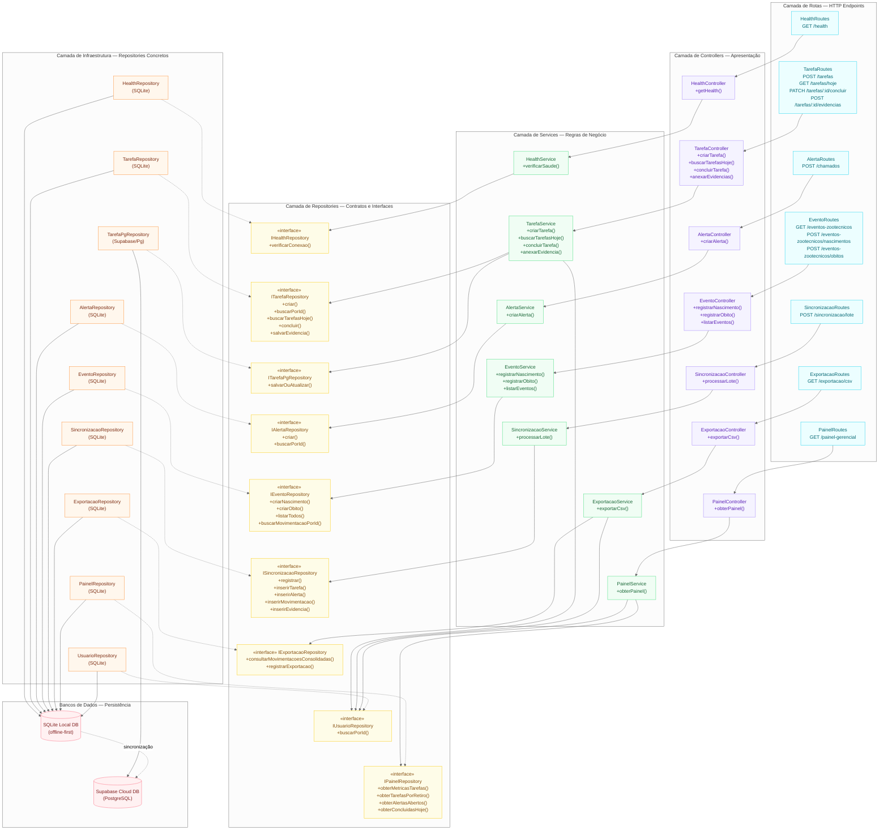
```mermaid
---
config:
  theme: neutral
  flowchart:
    nodeSpacing: 35
    rankSpacing: 60
    curve: basis
---
flowchart TD
    %% CAMADA DE ROTAS
    subgraph Routes["Camada de Rotas — HTTP Endpoints"]
        direction LR
        classDef route fill:#ecfeff,stroke:#22d3ee,color:#036672,font-family:sans-serif;
        HealthRoutes["HealthRoutes<br/>GET /health"]:::route
        TarefaRoutes["TarefaRoutes<br/>POST /tarefas<br/>GET /tarefas/hoje<br/>PATCH /tarefas/:id/concluir<br/>POST /tarefas/:id/evidencias"]:::route
        AlertaRoutes["AlertaRoutes<br/>POST /chamados"]:::route
        EventoRoutes["EventoRoutes<br/>GET /eventos-zootecnicos<br/>POST /eventos-zootecnicos/nascimentos<br/>POST /eventos-zootecnicos/obitos"]:::route
        SincronizacaoRoutes["SincronizacaoRoutes<br/>POST /sincronizacao/lote"]:::route
        ExportacaoRoutes["ExportacaoRoutes<br/>GET /exportacao/csv"]:::route
        PainelRoutes["PainelRoutes<br/>GET /painel-gerencial"]:::route
    end

    %% CAMADA DE CONTROLLERS
    subgraph Controllers["Camada de Controllers — Apresentação"]
        direction LR
        classDef controller fill:#f5f3ff,stroke:#a78bfa,color:#5b21b6,font-family:sans-serif;
        HealthController["HealthController<br/>+getHealth()"]:::controller
        TarefaController["TarefaController<br/>+criarTarefa()<br/>+buscarTarefasHoje()<br/>+concluirTarefa()<br/>+anexarEvidencias()"]:::controller
        AlertaController["AlertaController<br/>+criarAlerta()"]:::controller
        EventoController["EventoController<br/>+registrarNascimento()<br/>+registrarObito()<br/>+listarEventos()"]:::controller
        SincronizacaoController["SincronizacaoController<br/>+processarLote()"]:::controller
        ExportacaoController["ExportacaoController<br/>+exportarCsv()"]:::controller
        PainelController["PainelController<br/>+obterPainel()"]:::controller
    end

    %% CAMADA DE SERVICES
    subgraph Services["Camada de Services — Regras de Negócio"]
        direction LR
        classDef service fill:#f0fdf4,stroke:#4ade80,color:#166534,font-family:sans-serif;
        HealthService["HealthService<br/>+verificarSaude()"]:::service
        TarefaService["TarefaService<br/>+criarTarefa()<br/>+buscarTarefasHoje()<br/>+concluirTarefa()<br/>+anexarEvidencia()"]:::service
        AlertaService["AlertaService<br/>+criarAlerta()"]:::service
        EventoService["EventoService<br/>+registrarNascimento()<br/>+registrarObito()<br/>+listarEventos()"]:::service
        SincronizacaoService["SincronizacaoService<br/>+processarLote()"]:::service
        ExportacaoService["ExportacaoService<br/>+exportarCsv()"]:::service
        PainelService["PainelService<br/>+obterPainel()"]:::service
    end

    %% CAMADA DE REPOSITÓRIOS (INTERFACES)
    subgraph Repositories["Camada de Repositories — Contratos e Interfaces"]
        direction LR
        classDef repository fill:#fefce8,stroke:#facc15,color:#854d0e,font-family:sans-serif;
        IHealthRepository["«interface» IHealthRepository<br/>+verificarConexao()"]:::repository
        ITarefaRepository["«interface» ITarefaRepository<br/>+criar()<br/>+buscarPorId()<br/>+buscarTarefasHoje()<br/>+concluir()<br/>+salvarEvidencia()"]:::repository
        ITarefaPgRepository["«interface» ITarefaPgRepository<br/>+salvarOuAtualizar()"]:::repository
        IAlertaRepository["«interface» IAlertaRepository<br/>+criar()<br/>+buscarPorId()"]:::repository
        IEventoRepository["«interface» IEventoRepository<br/>+criarNascimento()<br/>+criarObito()<br/>+listarTodos()<br/>+buscarMovimentacaoPorId()"]:::repository
        ISincronizacaoRepository["«interface» ISincronizacaoRepository<br/>+registrar()<br/>+inserirTarefa()<br/>+inserirAlerta()<br/>+inserirMovimentacao()<br/>+inserirEvidencia()"]:::repository
        IExportacaoRepository["«interface» IExportacaoRepository<br/>+consultarMovimentacoesConsolidadas()<br/>+registrarExportacao()"]:::repository
        IPainelRepository["«interface» IPainelRepository<br/>+obterMetricasTarefas()<br/>+obterTarefasPorRetiro()<br/>+obterAlertasAbertos()<br/>+obterConcluidasHoje()"]:::repository
        IUsuarioRepository["«interface» IUsuarioRepository<br/>+buscarPorId()"]:::repository
    end

    %% CAMADA DE IMPLEMENTAÇÕES
    subgraph RepositoryImpls["Camada de Infraestrutura — Repositories Concretos"]
        direction LR
        classDef impl fill:#fff7ed,stroke:#fb923c,color:#7c2d12,font-family:sans-serif;
        HealthRepository["HealthRepository<br/>(SQLite)"]:::impl
        TarefaRepository["TarefaRepository<br/>(SQLite)"]:::impl
        TarefaPgRepository["TarefaPgRepository<br/>(Supabase/Pg)"]:::impl
        AlertaRepository["AlertaRepository<br/>(SQLite)"]:::impl
        EventoRepository["EventoRepository<br/>(SQLite)"]:::impl
        SincronizacaoRepository["SincronizacaoRepository<br/>(SQLite)"]:::impl
        ExportacaoRepository["ExportacaoRepository<br/>(SQLite)"]:::impl
        PainelRepository["PainelRepository<br/>(SQLite)"]:::impl
        UsuarioRepository["UsuarioRepository<br/>(SQLite)"]:::impl
    end

    %% CAMADA DE BANCOS DE DADOS
    subgraph Databases["Bancos de Dados — Persistência"]
        direction LR
        classDef db fill:#fff1f2,stroke:#fb7185,color:#7f1d1d,font-family:sans-serif;
        SQLiteDB[("SQLite Local DB<br/>(offline-first)")]:::db
        PostgresDB[("Supabase Cloud DB<br/>(PostgreSQL)")]:::db
    end

    %% Layout horizontal interno (força alinhamento lado a lado)
    HealthRoutes ~~~ TarefaRoutes ~~~ AlertaRoutes ~~~ EventoRoutes ~~~ SincronizacaoRoutes ~~~ ExportacaoRoutes ~~~ PainelRoutes
    HealthController ~~~ TarefaController ~~~ AlertaController ~~~ EventoController ~~~ SincronizacaoController ~~~ ExportacaoController ~~~ PainelController
    HealthService ~~~ TarefaService ~~~ AlertaService ~~~ EventoService ~~~ SincronizacaoService ~~~ ExportacaoService ~~~ PainelService
    IHealthRepository ~~~ ITarefaRepository ~~~ ITarefaPgRepository ~~~ IAlertaRepository ~~~ IEventoRepository ~~~ ISincronizacaoRepository ~~~ IExportacaoRepository ~~~ IUsuarioRepository ~~~ IPainelRepository
    HealthRepository ~~~ TarefaRepository ~~~ TarefaPgRepository ~~~ AlertaRepository ~~~ EventoRepository ~~~ SincronizacaoRepository ~~~ ExportacaoRepository ~~~ PainelRepository ~~~ UsuarioRepository
    SQLiteDB ~~~ PostgresDB

    %% Conexões de Rotas para Controllers
    HealthRoutes --> HealthController
    TarefaRoutes --> TarefaController
    AlertaRoutes --> AlertaController
    EventoRoutes --> EventoController
    SincronizacaoRoutes --> SincronizacaoController
    ExportacaoRoutes --> ExportacaoController
    PainelRoutes --> PainelController

    %% Conexões de Controllers para Services (Dependência de Injeção)
    HealthController --> HealthService
    TarefaController --> TarefaService
    AlertaController --> AlertaService
    EventoController --> EventoService
    SincronizacaoController --> SincronizacaoService
    ExportacaoController --> ExportacaoService
    PainelController --> PainelService

    %% Conexões de Services para Repositories / Interfaces (Dependência de Injeção)
    HealthService --> IHealthRepository
    TarefaService --> ITarefaRepository
    TarefaService --> ITarefaPgRepository
    TarefaService --> IUsuarioRepository
    AlertaService --> IAlertaRepository
    EventoService --> IEventoRepository
    SincronizacaoService --> ISincronizacaoRepository
    ExportacaoService --> IExportacaoRepository
    ExportacaoService --> IUsuarioRepository
    PainelService --> IPainelRepository
    PainelService --> IUsuarioRepository

    %% Implementações das Interfaces pelos Repositórios Concretos (Realization)
    HealthRepository -.-> IHealthRepository
    TarefaRepository -.-> ITarefaRepository
    TarefaPgRepository -.-> ITarefaPgRepository
    AlertaRepository -.-> IAlertaRepository
    EventoRepository -.-> IEventoRepository
    SincronizacaoRepository -.-> ISincronizacaoRepository
    ExportacaoRepository -.-> IExportacaoRepository
    PainelRepository -.-> IPainelRepository
    UsuarioRepository -.-> IUsuarioRepository

    %% Acesso a Banco de Dados por Repositórios Concretos
    HealthRepository --> SQLiteDB
    TarefaRepository --> SQLiteDB
    TarefaPgRepository --> PostgresDB
    AlertaRepository --> SQLiteDB
    EventoRepository --> SQLiteDB
    SincronizacaoRepository --> SQLiteDB
    ExportacaoRepository --> SQLiteDB
    PainelRepository --> SQLiteDB
    UsuarioRepository --> SQLiteDB
    
    %% Sincronização offline-first
    SQLiteDB -.->|sincronização| PostgresDB
```

<center>
  <p><strong>Figura 10</strong> — Diagrama de Classes Arquitetural do Sistema BrPec</p>
  <p>Fonte: Próprios autores (2026).</p>
</center>

O diagrama organiza o backend em quatro camadas horizontais bem delimitadas. A camada **Controller** expõe sete grupos de endpoints REST, cada um responsável por um módulo funcional do sistema: tarefas, alertas de infraestrutura, eventos zootécnicos, sincronização em lote, exportação, painel gerencial e health check. Nenhum Controller acessa repositórios ou modelos diretamente — toda lógica é delegada ao Service correspondente via dependência de uso (`..>`), conforme o princípio de responsabilidade única [15].

A camada **Service** concentra as regras de negócio críticas do sistema. O `TarefaService`, por exemplo, é o único ponto onde a RN01 é aplicada (verificação de que o Capataz pertence ao retiro antes de inserir a tarefa), consultando o `UsuarioRepository` antes de acionar o `TarefaRepository`. O `SincronizacaoService` implementa o processamento de lote descrito na seção 3.2.4, recebendo um array de itens e delegando cada tipo ao método correspondente no `SincronizacaoRepository`; o controle de transação (`BEGIN TRANSACTION`, `COMMIT`, `ROLLBACK`) é realizado diretamente pelo Service via acesso ao objeto `db` do SQLite, garantindo atomicidade por item do lote em caso de falha. O `ExportacaoService` valida o perfil do coordenador via `UsuarioRepository`, consulta as movimentações consolidadas via `ExportacaoRepository` e registra o metadado da exportação, sem expor dados brutos ao Controller.

A camada **Repository** abstrai completamente a tecnologia de persistência (SQLite via `node:sqlite`), expondo métodos nomeados por intenção de negócio (`buscarTarefasHoje`, `criarNascimento`, `criarObito`, `consultarMovimentacoesConsolidadas`) em vez de queries SQL abertas. Cada Repository é proprietário de um conjunto de Models — representado por agregação (`--o`) no diagrama —, garantindo que o acesso a cada tabela ocorra por um único ponto de entrada.

A camada **Model** corresponde às interfaces TypeScript das entidades persistidas no banco de dados SQLite, diretamente alinhadas ao Diagrama de Classes do Domínio (seção 3.2.3). A hierarquia de herança de `MovimentacaoBase` para os subtipos `Nascimento`, `Obito`, `Transferencia` e `Compravenda` reflete a especialização dos eventos zootécnicos conforme os requisitos funcionais RF004, RF005, RF008 e RF009. A interface `Evidencia` unifica em uma única estrutura os tipos `FOTO`, `AUDIO`, `VIDEO`, `DOCUMENTO` e `TEXTO`, discriminados pelo campo `tipo`.

A separação em camadas garante que alterações na tecnologia de persistência (ex.: migração de SQLite para PostgreSQL) impactem apenas os Repositories, sem afetar Services ou Controllers — critério alinhado ao requisito não funcional de Suportabilidade (RNF — SUP), que limita o MTTR a 8 horas para defeitos críticos.

### 3.2.4. Diagrama de Sequência UML (sprint 3)

O Diagrama de Sequência UML constitui um dos quatro tipos de diagrama de interação previstos pela especificação UML 2.5.1, sendo formalmente classificado como um diagrama comportamental que enfatiza a troca ordenada de mensagens entre participantes ao longo do tempo [13]. Segundo o Object Management Group (OMG), a semântica de uma interação é definida como um par de conjuntos de *traces* — sequências válidas e inválidas de ocorrências de eventos —, de modo que cada diagrama de sequência representa, de forma gráfica, os cenários de comunicação aceitos pelo sistema modelado [13][18]. A notação adotada emprega linhas de vida (*lifelines*) para representar os participantes, setas contínuas para mensagens síncronas e setas tracejadas para retornos, com fragmentos combinados (*combined fragments*) do tipo `alt` para expressar ramificações condicionais no fluxo de execução, conforme as convenções consolidadas por Fowler [15] e detalhadas na norma ISO/IEC 19505-2:2012 [17].

No contexto do sistema BrPec, os diagramas de sequência foram elaborados para representar os fluxos operacionais críticos identificados nas User Stories (US01 a US05) e nos Requisitos Funcionais (RF001 a RF015), detalhando a interação entre o ator externo — Gerente ou Capataz — e as camadas internas da arquitetura da aplicação. A estrutura de camadas adotada segue o padrão Controller–Service–Repository, amplamente documentado na literatura de engenharia de software como uma instância concreta da arquitetura em camadas (*layered architecture*) [19], na qual cada componente possui responsabilidade única e bem delimitada:

- **Controller:** recebe a requisição HTTP, valida a presença dos campos obrigatórios e delega o processamento à camada de negócio, sem acessar o banco de dados diretamente;
- **Service:** aplica as regras de negócio do domínio (RNs) e orquestra as chamadas ao Repository, encapsulando a lógica que determina se a operação será executada localmente ou remotamente;
- **Repository:** abstrai o acesso ao mecanismo de persistência — banco de dados central (SQLite no servidor) ou armazenamento local (IndexedDB no dispositivo) —, expondo uma interface uniforme ao Service independentemente da origem dos dados;
- **Banco de dados / Armazenamento Local:** camada de persistência que varia conforme o modo de operação do dispositivo (online ou offline).

Essa separação garante que as regras de negócio permaneçam isoladas das preocupações de transporte HTTP e de persistência, facilitando a manutenção e a evolução do sistema — critério alinhado ao requisito não funcional de Suportabilidade (RNF — SUP), que limita o Tempo Médio de Reparo (MTTR) a 8 horas para defeitos críticos.

Os diagramas subsequentes cobrem tanto operações executadas em ambiente conectado (DS01) quanto fluxos que operam integralmente em modo offline, com sincronização assíncrona posterior (DS02, DS03, DS04). A diferenciação explícita entre os dois modos de operação constitui um requisito estrutural do projeto, visto que os retiros da BrPec dispõem de conectividade Starlink apenas em janelas limitadas (manhã e noite), exigindo que a aplicação funcione como fonte primária de dados localmente e trate a rede como camada de sincronização secundária — paradigma denominado *offline-first* na literatura de sistemas distribuídos [20]. Cada diagrama inclui, ao final, tabela de rastreabilidade que vincula os elementos representados às User Stories, Requisitos Funcionais, Regras de Negócio e Requisitos Não Funcionais correspondentes, assegurando a coerência com os demais artefatos de engenharia de requisitos do projeto.

#### Fundamentação Tecnológica: Persistência Offline e Sincronização

Os diagramas de sequência apresentados nesta seção referenciam, de forma recorrente, componentes de persistência local e mecanismos de sincronização assíncrona que fundamentam a operação offline da aplicação. A presente subseção detalha as tecnologias adotadas e justifica as decisões arquiteturais que sustentam o funcionamento do sistema nos retiros da BrPec, onde a conectividade à internet é restrita a janelas de cobertura Starlink.

**SQLite — Banco de dados relacional do servidor**

O SQLite é um sistema de gerenciamento de banco de dados relacional (*RDBMS*) autocontido (*self-contained*), sem servidor (*serverless*) e de configuração zero (*zero-configuration*) [21]. Diferentemente de sistemas cliente-servidor convencionais — como PostgreSQL ou MySQL —, o SQLite opera como uma biblioteca vinculada diretamente ao processo da aplicação, lendo e gravando o banco de dados como um arquivo único no disco, sem a necessidade de um processo daemon separado [21]. Essa característica o torna particularmente adequado ao contexto da BrPec, em que a infraestrutura de servidor deve ser leve e de fácil implantação, dado que os nós de processamento central operam em ambientes com recursos computacionais limitados.

No escopo da arquitetura do sistema, o SQLite é empregado como banco de dados central do servidor Node.js, persistindo todas as entidades modeladas no Diagrama de Classes (seção 3.2.3): `Usuario`, `Tarefa`, `Evidencia`, `MovimentacaoBase` (nascimentos, óbitos, transferências e compravendas), `Alerta`, `Sincronizacao`, `Retiro` e os registros de exportação. Os diagramas de sequência DS01 (Criar Tarefa) e os fluxos de sincronização dos diagramas DS03 e DS04 representam a interação do Repository com esse banco central por meio de instruções SQL padrão (`INSERT`, `SELECT`, `UPDATE`), garantindo a compatibilidade com o modelo relacional definido nas tabelas de atributos da seção 3.2.3. A escolha pelo SQLite no servidor está alinhada ao requisito não funcional de Desempenho (RNF — DES), que exige latência p95 inferior a 200 ms para operações de leitura e escrita, e ao requisito de Suportabilidade (RNF — SUP), dado que o SQLite dispensa a administração de processos, usuários e permissões de banco de dados, reduzindo a complexidade operacional de manutenção.

A escolha pelo SQLite no servidor fundamenta-se em três critérios: (i) suporte nativo a transações ACID garante integridade mesmo em interrupções abruptas (RNF — CONF); (ii) consultas SQL relacionais permitem filtrar tarefas por `capataz_id`, `retiro_id` e `data_execucao` sem carregar conjuntos completos em memória; (iii) ausência de processo daemon reduz a complexidade operacional de manutenção (RNF — SUP).

**IndexedDB — Armazenamento local no dispositivo do Capataz**

O IndexedDB é uma API de armazenamento local de baixo nível, padronizada pelo W3C, projetada para a persistência de volumes significativos de dados estruturados no navegador do cliente [22]. Trata-se de um banco de dados transacional não relacional (*NoSQL*), com suporte a índices sobre propriedades de objetos, que opera de forma inteiramente assíncrona para evitar o bloqueio da interface do usuário [22].

No sistema BrPec, o IndexedDB é utilizado nos dispositivos móveis dos Capatazes como camada de armazenamento local para as tarefas sincronizadas, evidências (fotos e áudios), registros de eventos zootécnicos e alertas de infraestrutura. Conforme representado nos diagramas DS02, DS03 e DS04, o Repository abstrai o acesso ao IndexedDB por meio da mesma interface exposta ao Service, de modo que as operações de leitura e escrita sejam transparentes à camada de negócio — independentemente de o dispositivo estar online ou offline. A tabela `sincronizacoes`, persistida no IndexedDB, funciona como fila de controle de envio, registrando cada entidade modificada localmente com status `PENDENTE`, `ENVIADO` ou `FALHA`, e o respectivo contador de tentativas de reenvio, conforme previsto nos requisitos RF010, RF011 e RF012.

A decisão de adotar o IndexedDB como mecanismo de armazenamento local, em complemento ao SQLite do servidor, decorre de três fatores técnicos: (i) o IndexedDB é nativamente disponível em todos os navegadores modernos, sem necessidade de extensões ou plugins; (ii) sua natureza transacional garante a integridade dos dados mesmo em cenários de interrupção abrupta da aplicação, como queda de bateria ou encerramento involuntário do navegador; e (iii) sua capacidade de armazenamento excede amplamente as limitações do Web Storage (5 MB típico), suportando os volumes de fotos codificadas em base64 e registros acumulados durante os períodos sem conexão — requisito crítico dado que os Capatazes podem operar offline durante todo o intervalo entre as janelas de Starlink. 

**Service Workers e Background Sync — Sincronização assíncrona** 

O mecanismo de sincronização representado nos diagramas DS03 e DS04 pelo participante `SyncService` é implementado tecnicamente por meio de Service Workers em combinação com a Background Synchronization API [23]. O Service Worker é um script executado pelo navegador em segundo plano, separado do contexto da página web, que permite interceptar requisições de rede, gerenciar o cache da aplicação e executar tarefas assíncronas mesmo quando o usuário não está interagindo ativamente com a interface [23]. 

A Background Sync API estende as capacidades do Service Worker ao permitir que ações diferidas — como o envio de tarefas concluídas ou evidências fotográficas — sejam registradas como eventos de sincronização pendentes e executadas automaticamente pelo navegador assim que uma conexão de rede estável for detectada [23]. No contexto operacional da BrPec, esse comportamento é essencial: o Capataz registra a conclusão de tarefas e anexa evidências durante o período offline, e o SyncService, ativado automaticamente pela reconexão Starlink, percorre a fila de sincronizações pendentes no IndexedDB, transmite os dados ao servidor remoto e atualiza o status local para `ENVIADO` ou incrementa o contador de tentativas em caso de falha, conforme modelado nas ramificações `alt` dos diagramas DS03 e DS04.

Esse mecanismo implementa o padrão de *Outbox* [24], no qual toda operação que altera o estado local gera um registro de controle com status `PENDENTE` consumido pelo SyncService ao reconectar, garantindo que nenhuma operação seja perdida mesmo que o dispositivo seja desligado entre o registro e a sincronização (RF012).

A combinação dessas três camadas tecnológicas — SQLite no servidor, IndexedDB no cliente e Service Workers para sincronização — materializa a arquitetura *offline-first* exigida pelo contexto operacional do projeto, assegurando o cumprimento dos requisitos não funcionais de Confiabilidade (RNF — CONF: 0% de perda de dados em falhas de conexão), Desempenho (RNF — DES: latência p95 < 200 ms no armazenamento local) e Capacidade (RNF — CAP: sincronização em lote de até 500 eventos pendentes).

---

#### DS01 — Criar Tarefa (US01) 

Fluxo que representa a criação de uma tarefa pelo Gerente, percorrendo as camadas Controller → Service → Repository → Banco. Mensagens síncronas são representadas por setas contínuas (`->>`) e retornos por setas tracejadas (`-->>`) 

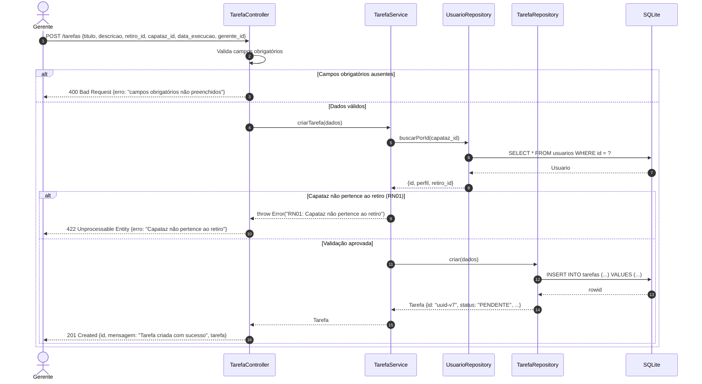
```mermaid
sequenceDiagram
    autonumber
    actor G as Gerente
    participant CTR as TarefaController
    participant SRV as TarefaService
    participant UREP as UsuarioRepository
    participant TREP as TarefaRepository
    participant DB as SQLite

    G->>CTR: POST /tarefas {titulo, descricao, retiro_id, capataz_id, data_execucao, gerente_id}
    CTR->>CTR: Valida campos obrigatórios

    alt Campos obrigatórios ausentes
        CTR-->>G: 400 Bad Request {erro: "campos obrigatórios não preenchidos"}
    else Dados válidos
        CTR->>SRV: criarTarefa(dados)
        SRV->>UREP: buscarPorId(capataz_id)
        UREP->>DB: SELECT * FROM usuarios WHERE id = ?
        DB-->>UREP: Usuario
        UREP-->>SRV: {id, perfil, retiro_id}

        alt Capataz não pertence ao retiro (RN01)
            SRV-->>CTR: throw Error("RN01: Capataz não pertence ao retiro")
            CTR-->>G: 422 Unprocessable Entity {erro: "Capataz não pertence ao retiro"}
        else Validação aprovada
            SRV->>TREP: criar(dados)
            TREP->>DB: INSERT INTO tarefas (...) VALUES (...)
            DB-->>TREP: rowid
            TREP-->>SRV: Tarefa {id: "uuid-v7", status: "PENDENTE", ...}
            SRV-->>CTR: Tarefa
            CTR-->>G: 201 Created {id, mensagem: "Tarefa criada com sucesso", tarefa}
        end
    end
```

**Descrição das camadas:**

- **Controller (`TarefaController`):** recebe a requisição HTTP do Gerente, valida a presença dos campos obrigatórios e delega a lógica de negócio ao Service. Não acessa o banco diretamente.
- **Service (`TarefaService`):** consulta o `UsuarioRepository` para obter os dados do Capataz e aplica a RN01 — impede atribuição a Capataz que não pertence ao retiro informado. Em caso de aprovação, delega a inserção ao `TarefaRepository`.
- **UsuarioRepository:** executa `SELECT` na tabela `usuarios` e retorna a entidade com `perfil` e `retiro_id` para validação da RN01.
- **TarefaRepository (`TarefaRepository`):** gera UUID v7, executa o `INSERT INTO tarefas` com `status = 'PENDENTE'` e `sincronizada = 1`, e retorna a tarefa criada.
- **Banco (`SQLite`):** persiste o registro e retorna o `rowid` da nova linha.

**Fluxos cobertos:**

| Fluxo         | Descrição                                                                       |
| ------------- | ------------------------------------------------------------------------------- |
| Principal     | Gerente envia dados válidos → tarefa criada com status "pendente" → 201 Created |
| Alternativo 1 | Campo obrigatório ausente → Controller retorna 400 sem acionar o Service        |
| Alternativo 2 | Capataz não pertence ao retiro → Service lança erro → Controller retorna 422    |

<center>
  <p><strong>Tabela 43</strong> — Fluxos Cobertos</p>
  <p>Fonte: Próprios autores (2026).</p>
</center>

**Rastreabilidade:**

| Elemento  | Referência                                                                                       |
| --------- | ------------------------------------------------------------------------------------------------ |
| US01      | Como Gerente, posso criar tarefas e atribuí-las a um retiro específico                           |
| RF001     | O sistema deve permitir que o Gerente crie tarefas com título, descrição, retiro, Capataz e data |
| RN01      | Uma tarefa só pode ser atribuída a um Capataz vinculado ao retiro selecionado                    |
| RNF — SEG | Todas as rotas do Gerente retornam 403 para perfis não autorizados                               |
| RNF — DES | Endpoint responde em p95 < 200ms com até 200 registros no banco                                  |

<center>
  <p><strong>Tabela 44</strong> — Rastreabilidade (RF001, RN01, RNF-SEG, RNF-DES)</p>
  <p>Fonte: Próprios autores (2026).</p>
</center>

#### DS02 — Consultar Tarefas Offline (US02) 

Fluxo que representa a consulta das tarefas do dia pelo Capataz em ambiente sem conexão com a internet, percorrendo as camadas Cliente (PWA) → Controller → Service → Repository → Armazenamento Local (IndexedDB/SQLite local). O diagrama diferencia explicitamente o que ocorre no dispositivo do Capataz (offline) do que depende de sincronização prévia com o servidor. Mensagens síncronas são representadas por setas contínuas (`->>`) e retornos por setas tracejadas (`-->>`) 

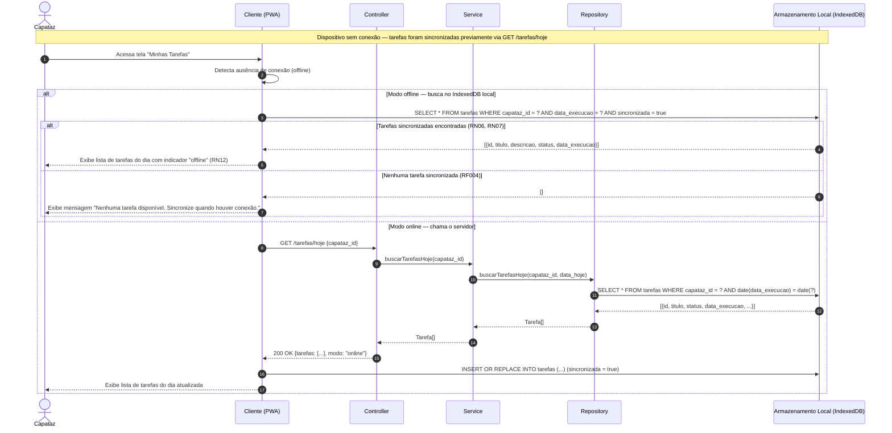
```mermaid
sequenceDiagram
    autonumber
    actor C as Capataz
    participant PWA as Cliente (PWA)
    participant CTR as Controller
    participant SRV as Service
    participant REP as Repository
    participant LS as Armazenamento Local (IndexedDB)

    note over C,LS: Dispositivo sem conexão — tarefas foram sincronizadas previamente via GET /tarefas/hoje

    C->>PWA: Acessa tela "Minhas Tarefas"
    PWA->>PWA: Detecta ausência de conexão (offline)

    alt Modo offline — busca no IndexedDB local
        PWA->>LS: SELECT * FROM tarefas WHERE capataz_id = ? AND data_execucao = ? AND sincronizada = true
        
        alt Tarefas sincronizadas encontradas (RN06, RN07)
            LS-->>PWA: [{id, titulo, descricao, status, data_execucao}]
            PWA-->>C: Exibe lista de tarefas do dia com indicador "offline" (RN12)
        else Nenhuma tarefa sincronizada (RF004)
            LS-->>PWA: []
            PWA-->>C: Exibe mensagem "Nenhuma tarefa disponível. Sincronize quando houver conexão."
        end

    else Modo online — chama o servidor
        PWA->>CTR: GET /tarefas/hoje {capataz_id}
        CTR->>SRV: buscarTarefasHoje(capataz_id)
        SRV->>REP: buscarTarefasHoje(capataz_id, data_hoje)
        REP->>LS: SELECT * FROM tarefas WHERE capataz_id = ? AND date(data_execucao) = date(?)
        LS-->>REP: [{id, titulo, status, data_execucao, ...}]
        REP-->>SRV: Tarefa[]
        SRV-->>CTR: Tarefa[]
        CTR-->>PWA: 200 OK {tarefas: [...], modo: "online"}
        PWA->>LS: INSERT OR REPLACE INTO tarefas (...) (sincronizada = true)
        PWA-->>C: Exibe lista de tarefas do dia atualizada
    end
```

**Descrição das camadas:**

- **Cliente PWA (`Cliente`):** interface do dispositivo do Capataz no campo. Detecta o estado de conectividade: se offline, lê diretamente do IndexedDB local; se online, chama o servidor e atualiza o cache local.
- **Controller (`TarefaController`):** presente apenas no fluxo online — recebe `GET /tarefas/hoje`, repassa `capataz_id` ao Service e retorna a lista. Não aplica lógica de conectividade.
- **Service (`TarefaService`):** delega diretamente ao `TarefaRepository.buscarTarefasHoje(capataz_id, data_hoje)`. A decisão offline/online é responsabilidade do cliente PWA, não do backend.
- **Repository (`TarefaRepository`):** executa `SELECT * FROM tarefas WHERE capataz_id = ? AND date(data_execucao) = date(?)` no SQLite do servidor e retorna o array de tarefas.
- **Armazenamento Local (`IndexedDB`):** no fluxo offline, é a fonte primária de dados. No fluxo online, é atualizado pelo PWA com as tarefas retornadas pelo servidor (`sincronizada = true`).

**Fluxos cobertos:**

| Fluxo         | Descrição                                                                                           |
| ------------- | --------------------------------------------------------------------------------------------------- |
| Principal     | Capataz offline com tarefas sincronizadas → lista exibida a partir do armazenamento local           |
| Alternativo 1 | Capataz offline sem tarefas sincronizadas → mensagem de ausência exibida com linguagem simples (RN04)|
| Alternativo 2 | Capataz online → tarefas buscadas do servidor, armazenamento local atualizado e lista exibida       |
| Alternativo 3 | Perfil não autorizado → acesso negado com 403                                                        |

<center>
  <p><strong>Tabela 45</strong> — Fluxos Cobertos</p>
  <p>Fonte: Próprios autores (2026).</p>
</center>

**Rastreabilidade:**

| Elemento     | Referência                                                                                              |
| ------------ | ------------------------------------------------------------------------------------------------------- |
| US02         | Como Capataz, posso visualizar minha lista de tarefas do dia offline                                    |
| RF002        | O sistema deve permitir que o Capataz visualize as tarefas do dia mesmo sem conexão                     |
| RF003        | O sistema deve armazenar localmente as tarefas sincronizadas para acesso offline                        |
| RF004        | O sistema deve exibir mensagem simples quando não houver tarefas disponíveis offline                    |
| RN02         | Apenas tarefas do dia atual devem ser exibidas ao Capataz                                               |
| RN05         | Apenas tarefas do retiro do Capataz devem ser exibidas para ele                                         |
| RN06         | O sistema deve permitir visualização offline apenas de tarefas previamente sincronizadas                |
| RN07         | As tarefas do dia devem ficar disponíveis offline quando houver sincronização prévia                    |
| RN12         | As telas do Capataz devem usar linguagem simples, botões visíveis e poucos passos de interação          |
| RNF — CONF   | 0% de perda de dados em falhas de conexão; estratégia offline-first                                     |
| RNF — DES    | Latência p95 < 200ms para salvar e ler registros no banco de dados local                                |

<center>
  <p><strong>Tabela 46</strong> — Mapa de Rastreabilidade</p>
  <p>Fonte: Próprios autores (2026).</p>
</center>

---

#### DS03 — Concluir Tarefa Offline (US03) 

Fluxo que representa a marcação de uma tarefa como concluída pelo Capataz em ambiente sem conexão, com persistência local imediata e sincronização automática posterior com o servidor quando a conectividade for restabelecida. Mensagens síncronas são representadas por setas contínuas (`->>`) e retornos por setas tracejadas (`-->>`) 

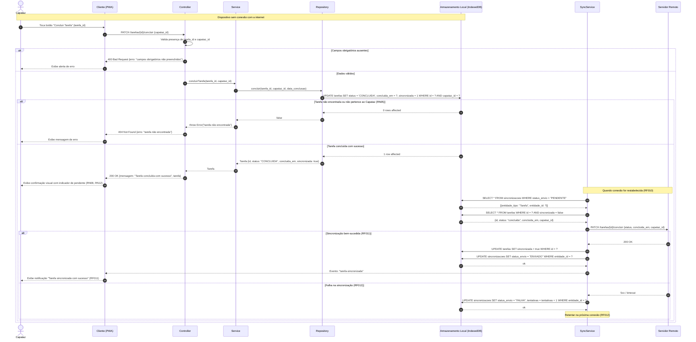
```mermaid
sequenceDiagram
    autonumber
    actor C as Capataz
    participant PWA as Cliente (PWA)
    participant CTR as Controller
    participant SRV as Service
    participant REP as Repository
    participant LS as Armazenamento Local (IndexedDB)
    participant SYNC as SyncService
    participant API as Servidor Remoto

    note over C,LS: Dispositivo sem conexão com a internet

    C->>PWA: Toca botão "Concluir Tarefa" (tarefa_id)
    PWA->>CTR: PATCH /tarefas/{id}/concluir {capataz_id}
    CTR->>CTR: Valida presença de tarefa_id e capataz_id

    alt Campos obrigatórios ausentes
        CTR-->>PWA: 400 Bad Request {erro: "campos obrigatórios não preenchidos"}
        PWA-->>C: Exibe alerta de erro
    else Dados válidos
        CTR->>SRV: concluirTarefa(tarefa_id, capataz_id)
        SRV->>REP: concluir(tarefa_id, capataz_id, data_conclusao)
        REP->>LS: UPDATE tarefas SET status = 'CONCLUIDA', concluida_em = ?, sincronizada = 1 WHERE id = ? AND capataz_id = ?
        
        alt Tarefa não encontrada ou não pertence ao Capataz (RN05)
            LS-->>REP: 0 rows affected
            REP-->>SRV: false
            SRV-->>CTR: throw Error("tarefa não encontrada")
            CTR-->>PWA: 404 Not Found {erro: "tarefa não encontrada"}
            PWA-->>C: Exibe mensagem de erro
        else Tarefa concluída com sucesso
            LS-->>REP: 1 row affected
            REP-->>SRV: Tarefa {id, status: "CONCLUIDA", concluida_em, sincronizada: true}
            SRV-->>CTR: Tarefa
            CTR-->>PWA: 200 OK {mensagem: "Tarefa concluída com sucesso", tarefa}
            PWA-->>C: Exibe confirmação visual com indicador de pendente (RN08, RN12)

            note over SYNC,API: Quando conexão for restabelecida (RF010)

            SYNC->>LS: SELECT * FROM sincronizacoes WHERE status_envio = "PENDENTE"
            LS-->>SYNC: [{entidade_tipo: "Tarefa", entidade_id: ?}]
            SYNC->>LS: SELECT * FROM tarefas WHERE id = ? AND sincronizada = false
            LS-->>SYNC: {id, status: "concluida", concluida_em, capataz_id}
            SYNC->>API: PATCH /tarefas/{id}/concluir {status, concluida_em, capataz_id}

            alt Sincronização bem-sucedida (RF011)
                API-->>SYNC: 200 OK
                SYNC->>LS: UPDATE tarefas SET sincronizada = true WHERE id = ?
                SYNC->>LS: UPDATE sincronizacoes SET status_envio = "ENVIADO" WHERE entidade_id = ?
                LS-->>SYNC: ok
                SYNC-->>PWA: Evento: "tarefa-sincronizada"
                PWA-->>C: Exibe notificação "Tarefa sincronizada com sucesso" (RF011)
            else Falha na sincronização (RF012)
                API-->>SYNC: 5xx / timeout
                SYNC->>LS: UPDATE sincronizacoes SET status_envio = "FALHA", tentativas = tentativas + 1 WHERE entidade_id = ?
                LS-->>SYNC: ok
                note over SYNC: Retentar na próxima conexão (RF012)
            end
        end
    end
```

**Descrição das camadas:**

- **Cliente PWA (`Cliente`):** captura a ação do Capataz, dispara a requisição de conclusão e exibe confirmações visuais simples e de alto contraste, adequadas ao uso em campo (RN12). Escuta eventos de sincronização emitidos pelo SyncService para atualizar o indicador de status.
- **Controller (`TarefaController`):** valida a presença dos identificadores obrigatórios e delega ao Service. Não acessa o banco diretamente.
- **Service (`TarefaService`):** delega ao `TarefaRepository.concluir(tarefa_id, capataz_id, data_conclusao)`. A RN05 é garantida pela cláusula `WHERE capataz_id = ?` no SQL — se nenhuma linha for afetada, lança erro 404.
- **Repository (`TarefaRepository`):** executa `UPDATE tarefas SET status = 'CONCLUIDA', concluida_em = ?, sincronizada = 1 WHERE id = ? AND capataz_id = ?` no SQLite do servidor. Retorna `false` se nenhuma linha for afetada.
- **Armazenamento Local (`SQLite / IndexedDB`):** no backend, é o SQLite do servidor. No cliente offline, é o IndexedDB — o SyncService transmite a conclusão ao servidor quando a conexão for restabelecida.
- **SyncService (`SyncService`):** processo em segundo plano (background sync via Service Worker) responsável por detectar a reconexão, consultar registros pendentes e transmiti-los ao servidor remoto. Atualiza o status para `ENVIADO` em caso de sucesso ou incrementa o contador de tentativas em caso de falha (RF012).
- **Servidor Remoto (`API`):** recebe a atualização de status da tarefa e confirma a persistência no banco de dados central, tornando a informação visível ao Gerente no painel de acompanhamento (RF007).

**Fluxos cobertos:**

| Fluxo         | Descrição                                                                                                    |
| ------------- | ------------------------------------------------------------------------------------------------------------ |
| Principal     | Capataz offline → conclusão persistida localmente → sincronização automática ao reconectar → confirmação visual |
| Alternativo 1 | Campo obrigatório ausente → Controller retorna 400 sem acionar o Service                                     |
| Alternativo 2 | Tarefa não encontrada ou não pertence ao Capataz → Service lança erro → 404                                  |
| Alternativo 3 | Falha na sincronização com o servidor → tentativa registrada e reenvio automático na próxima conexão (RF012) |

<center>
  <p><strong>Tabela 47</strong> — Fluxos Cobertos</p>
  <p>Fonte: Próprios autores (2026).</p>
</center>

**Rastreabilidade:**

| Elemento     | Referência                                                                                              |
| ------------ | ------------------------------------------------------------------------------------------------------- |
| US03         | Como Capataz, posso marcar uma tarefa como concluída para informar o Gerente sobre o avanço             |
| RF003        | O sistema deve armazenar localmente as tarefas sincronizadas para acesso offline                        |
| RF010        | O sistema deve detectar automaticamente o restabelecimento da conexão e iniciar a transmissão           |
| RF011        | O sistema deve notificar o Capataz após sincronização bem-sucedida                                      |
| RF012        | Registros com falha devem ser mantidos e reenviados automaticamente a cada nova conexão                 |
| RN05         | Apenas tarefas do retiro do Capataz devem ser exibidas e manipuladas por ele                            |
| RN08         | A marcação de conclusão feita offline deve ser armazenada localmente até a próxima sincronização        |
| RN09         | A tarefa concluída deve ter seu status atualizado para o Gerente após sincronização                     |
| RN12         | As telas do Capataz devem usar linguagem simples, botões visíveis e poucos passos de interação          |
| RNF — SEG    | 100% dos registros devem conter metadados de autoria (ID do Capataz) e timestamp não editável           |
| RNF — CONF   | 0% de perda de dados em falhas de conexão; estratégia offline-first com reenvio automático              |

<center>
  <p><strong>Tabela 48</strong> — Mapa de Rastreabilidade (RF003, RF010, RF011, RF012, RN05, RN08, RN09, RN12, RNF-SEG, RNF-CONF)</p>
  <p>Fonte: Próprios autores (2026).</p>
</center>

---

#### DS04 — Anexar Foto na Conclusão de Tarefa (US04) 

Fluxo que representa o anexo de uma foto como evidência de conclusão de tarefa pelo Capataz em ambiente sem conexão, com armazenamento local da imagem e sincronização automática em lote quando a conectividade for restabelecida. Mensagens síncronas são representadas por setas contínuas (`->>`) e retornos por setas tracejadas (`-->>`) 

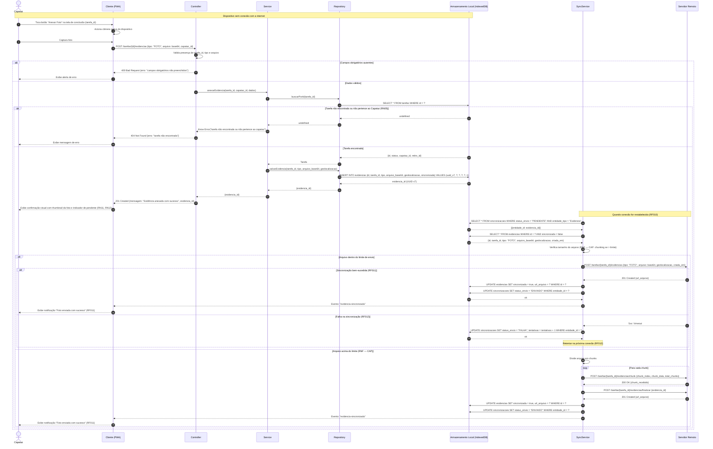
```mermaid
sequenceDiagram
    autonumber
    actor C as Capataz
    participant PWA as Cliente (PWA)
    participant CTR as Controller
    participant SRV as Service
    participant REP as Repository
    participant LS as Armazenamento Local (IndexedDB)
    participant SYNC as SyncService
    participant API as Servidor Remoto

    note over C,LS: Dispositivo sem conexão com a internet

    C->>PWA: Toca botão "Anexar Foto" na tela de conclusão (tarefa_id)
    PWA->>PWA: Aciona câmera nativa do dispositivo
    C->>PWA: Captura foto
    PWA->>CTR: POST /tarefas/{id}/evidencias {tipo: "FOTO", arquivo: base64, capataz_id}
    CTR->>CTR: Valida presença de tarefa_id, tipo e arquivo

    alt Campos obrigatórios ausentes
        CTR-->>PWA: 400 Bad Request {erro: "campos obrigatórios não preenchidos"}
        PWA-->>C: Exibe alerta de erro
    else Dados válidos
        CTR->>SRV: anexarEvidencia(tarefa_id, capataz_id, dados)
        SRV->>REP: buscarPorId(tarefa_id)
        REP->>LS: SELECT * FROM tarefas WHERE id = ?

        alt Tarefa não encontrada ou não pertence ao Capataz (RN05)
            LS-->>REP: undefined
            REP-->>SRV: undefined
            SRV-->>CTR: throw Error("tarefa não encontrada ou não pertence ao capataz")
            CTR-->>PWA: 404 Not Found {erro: "tarefa não encontrada"}
            PWA-->>C: Exibe mensagem de erro
        else Tarefa encontrada
            LS-->>REP: {id, status, capataz_id, retiro_id}
            REP-->>SRV: Tarefa

            SRV->>REP: salvarEvidencia(tarefa_id, tipo, arquivo_base64, geolocalizacao)
            REP->>LS: INSERT INTO evidencias (id, tarefa_id, tipo, arquivo_base64, geolocalizacao, sincronizada) VALUES (uuid_v7, ?, ?, ?, ?, 1)
            LS-->>REP: evidencia_id (UUID v7)
            REP-->>SRV: {evidencia_id}
            SRV-->>CTR: {evidencia_id}
            CTR-->>PWA: 201 Created {mensagem: "Evidência anexada com sucesso", evidencia_id}
            PWA-->>C: Exibe confirmação visual com thumbnail da foto e indicador de pendente (RN11, RN12)

            note over SYNC,API: Quando conexão for restabelecida (RF010)

            SYNC->>LS: SELECT * FROM sincronizacoes WHERE status_envio = "PENDENTE" AND entidade_tipo = "Evidencia"
            LS-->>SYNC: [{entidade_id: evidencia_id}]
            SYNC->>LS: SELECT * FROM evidencias WHERE id = ? AND sincronizada = false
            LS-->>SYNC: {id, tarefa_id, tipo: "FOTO", arquivo_base64, geolocalizacao, criada_em}

            SYNC->>SYNC: Verifica tamanho do arquivo (RNF — CAP: chunking se > limite)

            alt Arquivo dentro do limite de envio
                SYNC->>API: POST /tarefas/{tarefa_id}/evidencias {tipo: "FOTO", arquivo: base64, geolocalizacao, criada_em}
                alt Sincronização bem-sucedida (RF011)
                    API-->>SYNC: 201 Created {url_arquivo}
                    SYNC->>LS: UPDATE evidencias SET sincronizada = true, url_arquivo = ? WHERE id = ?
                    SYNC->>LS: UPDATE sincronizacoes SET status_envio = "ENVIADO" WHERE entidade_id = ?
                    LS-->>SYNC: ok
                    SYNC-->>PWA: Evento: "evidencia-sincronizada"
                    PWA-->>C: Exibe notificação "Foto enviada com sucesso" (RF011)
                else Falha na sincronização (RF012)
                    API-->>SYNC: 5xx / timeout
                    SYNC->>LS: UPDATE sincronizacoes SET status_envio = "FALHA", tentativas = tentativas + 1 WHERE entidade_id = ?
                    LS-->>SYNC: ok
                    note over SYNC: Retentar na próxima conexão (RF012)
                end
            else Arquivo acima do limite (RNF — CAP)
                SYNC->>SYNC: Divide arquivo em chunks
                loop Para cada chunk
                    SYNC->>API: POST /tarefas/{tarefa_id}/evidencias/chunk {chunk_index, chunk_data, total_chunks}
                    API-->>SYNC: 200 OK {chunk_recebido}
                end
                SYNC->>API: POST /tarefas/{tarefa_id}/evidencias/finalizar {evidencia_id}
                API-->>SYNC: 201 Created {url_arquivo}
                SYNC->>LS: UPDATE evidencias SET sincronizada = true, url_arquivo = ? WHERE id = ?
                SYNC->>LS: UPDATE sincronizacoes SET status_envio = "ENVIADO" WHERE entidade_id = ?
                SYNC-->>PWA: Evento: "evidencia-sincronizada"
                PWA-->>C: Exibe notificação "Foto enviada com sucesso" (RF011)
            end
        end
    end
```

**Descrição das camadas:**

- **Cliente PWA (`Cliente`):** aciona a câmera nativa do dispositivo, exibe um thumbnail da imagem capturada e apresenta indicador visual de status de envio (pendente/sincronizado) com linguagem simples e botões de alto contraste (RN12). Escuta eventos de sincronização emitidos pelo SyncService.
- **Controller (`TarefaController`):** valida a presença dos campos obrigatórios (identificador da tarefa, tipo de evidência e arquivo base64) e delega ao Service via `anexarEvidencia(tarefa_id, capataz_id, dados)`. Não acessa o banco diretamente.
- **Service (`TarefaService`):** verifica se a tarefa existe chamando `TarefaRepository.buscarPorId(tarefa_id)` e, em caso positivo, delega a inserção via `TarefaRepository.salvarEvidencia(tarefa_id, tipo, arquivo_base64, geolocalizacao)`.
- **Repository (`TarefaRepository`):** gera UUID v7 para a evidência, executa `INSERT INTO evidencias` com `sincronizada = 1` e retorna o `evidencia_id`. Mantém o vínculo com a tarefa pelo campo `tarefa_id` (RN10).
- **Armazenamento Local (`SQLite / IndexedDB`):** no backend, é o SQLite do servidor, onde a evidência fica disponível imediatamente com `sincronizada = 1`. No fluxo offline do cliente PWA, é o IndexedDB — o SyncService transmite a evidência via `POST /tarefas/{id}/evidencias` ao reconectar.
- **SyncService (`SyncService`):** detecta a reconexão via Service Worker e transmite as evidências pendentes ao servidor. Implementa chunking para arquivos de imagem que excedam o limite de transmissão segura em conexões instáveis (RNF — CAP), garantindo a integridade do envio em lote.
- **Servidor Remoto (`API`):** recebe a evidência, persiste o arquivo e retorna a URL definitiva do arquivo armazenado, que é então atualizada no registro local. A evidência fica disponível para consulta pelo Gerente e Coordenador (RF014, UC05).

**Fluxos cobertos:**

| Fluxo         | Descrição                                                                                                          |
| ------------- | ------------------------------------------------------------------------------------------------------------------ |
| Principal     | Capataz offline → foto capturada e salva localmente em base64 → sincronização automática ao reconectar             |
| Alternativo 1 | Campo obrigatório ausente → Controller retorna 400                                                                  |
| Alternativo 2 | Tarefa não encontrada ou não pertence ao Capataz → Service lança erro → 404                                        |
| Alternativo 3 | Falha na sincronização → tentativa registrada e reenvio automático na próxima conexão (RF012)                      |
| Alternativo 4 | Arquivo acima do limite → SyncService divide em chunks e transmite sequencialmente ao servidor (RNF — CAP)         |

<center>
  <p><strong>Tabela 49</strong> — Fluxos cobertos</p>
  <p>Fonte: Próprios autores (2026).</p>
</center>

**Rastreabilidade:**

| Elemento     | Referência                                                                                                   |
| ------------ | ------------------------------------------------------------------------------------------------------------ |
| US04         | Como Capataz, posso anexar fotos na conclusão de uma tarefa para comprovar visualmente o serviço realizado   |
| RF004        | O sistema deve armazenar localmente as tarefas e evidências sincronizadas para acesso offline                |
| RF010        | O sistema deve detectar automaticamente o restabelecimento da conexão e iniciar a transmissão pendente       |
| RF011        | O sistema deve notificar o Capataz com confirmação após sincronização bem-sucedida                           |
| RF012        | Registros com falha de envio devem ser mantidos e reenviados automaticamente a cada nova conexão             |
| RN10         | As fotos anexadas devem estar vinculadas à tarefa correspondente                                             |
| RN11         | Fotos registradas offline devem ser enviadas ao sistema quando houver conexão                                |
| RN12         | As telas do Capataz devem usar linguagem simples, botões visíveis e poucos passos de interação               |
| RN19         | O sistema deve capturar automaticamente a localização GPS quando o Capataz criar um registro com foto        |
| RNF — SEG    | 100% dos registros devem conter metadados de autoria e timestamp não editável                                |
| RNF — CONF   | 0% de perda de dados em falhas de conexão; imagem mantida localmente até confirmação do servidor             |
| RNF — CAP    | Suporte a sincronização em lote de até 500 eventos; chunking para arquivos grandes em conexões instáveis     |

<center>
  <p><strong>Tabela 50</strong> — Mapa de Rastreabilidade</p>
  <p>Fonte: Próprios autores (2026).</p>
</center>

### 3.2.5. Diagrama de Atividades ou Estados (sprint 3)

O diagrama de atividades abaixo representa o fluxo de execução de tarefas no sistema BrPec, contemplando o funcionamento offline-first da aplicação. O processo inicia com a criação da tarefa pelo gerente, passando pela disponibilização ao capataz, execução da atividade em campo e sincronização dos dados com o sistema central. O fluxo foi modelado utilizando UML, mantendo consistência de notação ao longo de toda a representação.

<center>
  <p><strong>Figura 11</strong> — Diagrama de Estados do Sistema BrPec</p>
  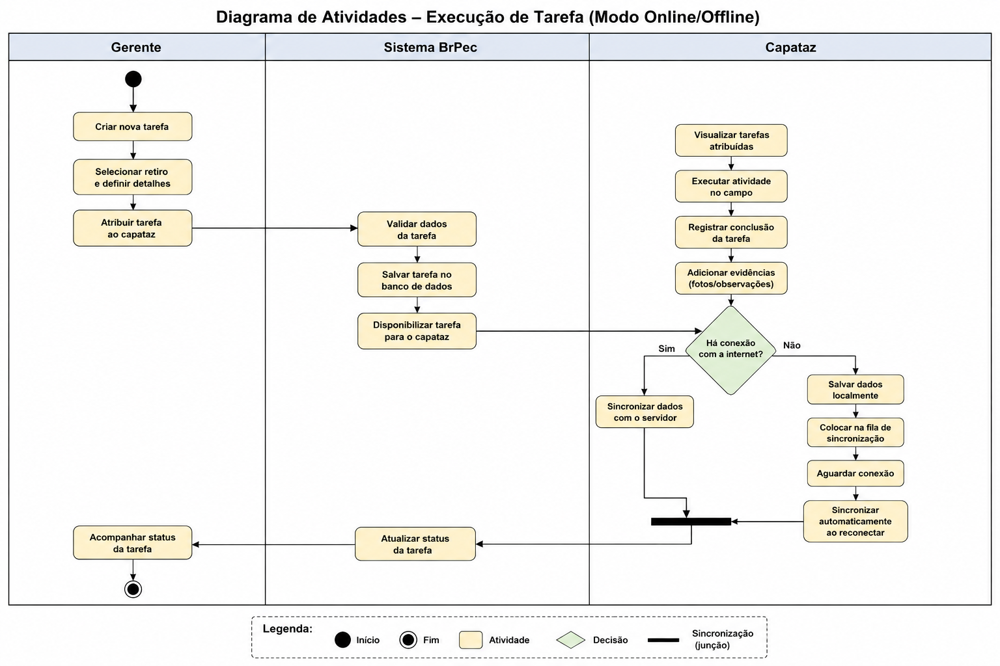
  <p>Fonte: Próprios autores (2026).</p>
</center>

### 3.2.6. Diagrama de Implantação (sprints 4 e 5)

_Diagrama UML de deployment mostrando nós físicos, artefatos e canais de comunicação. Representa a visão Engineering + Technology do RM-ODP._

### 3.2.7. Padrões de Projeto Aplicados (sprints 3 a 5)

O Sistema BrPec aplica padrões de projeto motivados por **três restrições estruturais** documentadas neste WAD: (i) a **conectividade satelital intermitente** via Starlink, que impõe arquitetura offline-first (seções 1 e 3.1.3); (ii) os **quatro perfis distintos de usuário** — Gerente, Coordenador, Capataz e Técnico — com regras de operação diferentes (seção 2.2); e (iii) a possibilidade de **evolução da camada de persistência**, hoje implementada com `better-sqlite3` para o cache local e `@supabase/supabase-js` para o servidor central (seção 3.2.1). Cada padrão a seguir é apresentado com categoria GoF [29], localização no repositório, necessidade de negócio que atende e princípios SOLID materializados [30].

A tabela a seguir consolida os quatro padrões adotados nesta sprint, indicando para cada um a categoria GoF, a pasta/arquivo correspondente no repositório, a necessidade de negócio atendida e os princípios SOLID materializados. O padrão com status "previsto" está planejado para sprint posterior e será implementado conforme as funcionalidades correspondentes forem desenvolvidas.

<center>
  <p><strong>Quadro 22</strong> — Padrões de projeto aplicados ao Sistema BrPec</p>
</center>

| # | Padrão              | Categoria         | Localização no repositório                                                                        | Necessidade que atende                                  | SOLID |
|---|---------------------|-------------------|---------------------------------------------------------------------------------------------------|---------------------------------------------------------|-------|
| 1 | Repository          | Estrutural        | `src/backend/repositories/` (ex.: `tarefaRepository.ts`)                                         | Isolar a troca de driver/ORM da camada de persistência  | S, D  |
| 2 | Outbox (Sync Queue) | Arquitetural [31] | Tabela `sincronizacoes` (migration.sql) + `src/backend/services/sincronizacaoService.ts`          | Offline-first: 0% de perda de dados em falha de rede   | S, O  |
| 3 | Singleton           | Criacional        | `src/backend/config/database.ts`                                                                  | Reuso de uma única instância do cliente de banco local  | D     |
| 4 | Strategy            | Comportamental    | `src/backend/middlewares/permissions/` (previsto para a sprint 5)                                 | Regras de autorização distintas por perfil de usuário   | O, L  |

<center>
  <p>Fonte: Próprios autores (2026).</p>
</center>

Os padrões 1, 2 e 3 já possuem implementação no repositório, validando a arquitetura proposta. O padrão 4 está planejado para a sprint 5, conforme o cronograma de implementação do controle de autorização. O detalhamento de cada padrão, com sua justificativa de negócio e princípios SOLID associados, é apresentado nas subseções seguintes.

#### 1. Repository Pattern *(estrutural)*

**Localização:** `src/repositories/` (já implementado: `movimentacaoRepository.ts`; demais repositories — `tarefasRepository.ts`, `usuariosRepository.ts`, `retirosRepository.ts` — em desenvolvimento nesta sprint).

**Necessidade que atende:** o backend acessa duas fontes de dados distintas — `better-sqlite3` para o cache local offline e `@supabase/supabase-js` para o servidor central. Sem uma camada que abstraia esse acesso, qualquer evolução (introduzir cache, migrar para um ORM como Prisma, trocar provedor) propagaria mudanças por Controllers e Services. O Repository centraliza o acesso a dados e expõe métodos com semântica de domínio (`movimentacaoRepository.inserir(mov)`), em linha com a definição clássica de Fowler [32]: *"mediates between the domain and data mapping layers"*.

**Validação pela equipe:** o padrão foi validado em revisão dedicada na issue [#202](https://git.inteli.edu.br/graduacao/2026-1b/t26/g03/-/issues/202).

**Princípios SOLID:** **S** — cada repository é responsável por uma única entidade do domínio pecuário; **D** — Services dependem da abstração do repository, não do driver de banco.

#### 2. Outbox / Sync Queue *(arquitetural)*

**Localização:** tabela `sincronizacoes` (migration.sql, seção 3.6.3) + serviço já implementado em `src/backend/services/sincronizacaoService.ts`.

**Necessidade que atende:** é o coração da arquitetura offline-first do BrPec e atende diretamente ao RNF de **integridade da sincronização** ("0% de perda de dados em falhas de conexão", seção 3.1.3, eixo CONF). Quando o capataz conclui uma tarefa sem internet (US03), a operação é gravada no banco local SQLite e enfileirada na tabela `sincronizacoes`. Ao restabelecer comunicação com a Starlink, o `sincronizacaoService` drena a fila e replica as operações no servidor central via Supabase, com idempotência garantida pelo UUID gerado client-side (seção 3.6.3 — Nota Técnica). É a aplicação direta do **Transactional Outbox** [31], padrão consagrado em sistemas distribuídos para garantir entrega eventual sem perda de dados.

**Princípios SOLID:** **S** — a fila tem uma única responsabilidade (garantir entrega eventual); **O** — novos tipos de operação (`INSERT`, `UPDATE`, `DELETE`, futuramente `MERGE`) podem ser adicionados sem alterar o processador.

#### 3. DTO (Data Transfer Object) *(estrutural — não implementado na sprint 3)*

**Localização planejada:** `src/backend/dtos/` (ex.: `CriarTarefaDTO.ts`, `TarefaResponseDTO.ts`), a implementar em sprints futuras conforme os endpoints forem evoluídos.

**Necessidade que atende:** existe uma diferença real entre o que o cliente envia, o que o banco persiste e o que a API devolve. Para a US01, o cliente envia `{titulo, retiro_id, prazo}`; o banco persiste `{id, titulo, retiro_id, autor_id, criado_em, sincronizado_em, deletado_em}` (Migration 003); e a resposta da API expõe `{id, titulo, retiro: {id, nome}, prazo, status}`, sem campos internos como `autor_id`. DTOs evitam que detalhes do schema vazem na API pública e protegem o backend de payloads mal formados, validando entrada na fronteira Controller → Service. O padrão segue a recomendação de Evans [33] de isolar o modelo de domínio da camada de apresentação.

**Princípios SOLID:** **S** — separa "modelo de entrada da API" de "entidade de domínio"; **I** — clientes da API recebem apenas os campos que precisam, sem dependências desnecessárias.

**Exemplo concreto — `POST /tarefas` (US01):** o caso real do endpoint implementado em `tarefaController.criarTarefa` ilustra como o padrão DTO opera nas três fronteiras (entrada da API, persistência, saída da API).

`CriarTarefaDTO` (o que o cliente envia):

```json
{
  "titulo": "Vistoria do piquete norte",
  "descricao": "Verificar cerca elétrica e nível de bebedouro",
  "retiro_id": "8c4f-...",
  "capataz_id": "a1b2-...",
  "data_execucao": "2026-05-28",
  "gerente_id": "f9e8-..."
}
```

Linha persistida em `tarefas` (Migration 003) — o que o banco efetivamente guarda, com campos internos adicionados pelo Service:

```json
{
  "id": "f1a2-...",
  "titulo": "Vistoria do piquete norte",
  "descricao": "Verificar cerca elétrica e nível de bebedouro",
  "retiro_id": "8c4f-...",
  "capataz_id": "a1b2-...",
  "gerente_id": "f9e8-...",
  "data_execucao": "2026-05-28",
  "status": "pendente",
  "criado_em": "2026-05-26T21:00:00Z",
  "atualizado_em": "2026-05-26T21:00:00Z",
  "sincronizado_em": null,
  "deletado_em": null
}
```

`TarefaResponseDTO` (o que a API efetivamente devolve em `201 Created`):

```json
{
  "id": "f1a2-...",
  "mensagem": "Tarefa criada com sucesso",
  "tarefa": {
    "id": "f1a2-...",
    "titulo": "Vistoria do piquete norte",
    "status": "pendente",
    "data_execucao": "2026-05-28"
  }
}
```

Note que o response **omite** campos internos como `criado_em`, `sincronizado_em` e `deletado_em` (relevantes só para o backend) e simplifica a estrutura para o consumidor da API. Esse é exatamente o papel do DTO: nenhum dos três representa "a tarefa" sozinho — cada um é a forma apropriada da entidade para sua fronteira específica. Exemplos completos de request/response dos demais endpoints encontram-se na seção 3.1.4.

#### 3. Singleton *(criacional)*

**Localização:** `src/backend/config/database.ts` — uma única instância do cliente de banco de dados (SQLite via `better-sqlite3`) reutilizada em todo o backend.

**Necessidade que atende:** evita inicializações redundantes do banco SQLite a cada requisição, garantindo que a mesma conexão e cache em memória do `better-sqlite3` sejam compartilhados por todos os repositories. Vale registrar a crítica de Fowler [32] e da comunidade DDD ao uso indiscriminado do padrão (acoplamento global, dificuldade de teste); aqui o uso é justificado por se tratar de um cliente de infraestrutura sem estado de negócio, e a injeção do cliente nos repositories preserva a testabilidade.

**Princípios SOLID:** **D** — toda a aplicação depende da mesma abstração de cliente, injetada nos repositories.

#### Middleware Chain (Chain of Responsibility) *(comportamental — planejado para as sprints 4-5)*

**Localização planejada:** `src/backend/middlewares/` (autenticação, autorização, validação de payload, tratamento de erros), a implementar ao longo das sprints 4 a 5 conforme os requisitos da seção 3.8 forem desenvolvidos.

**Necessidade que atende:** cada requisição ao backend precisa passar por uma sequência de verificações antes de chegar ao Controller — autenticar o usuário (seção 3.8.1), autorizar a operação (seção 3.8.3), validar o payload contra o DTO esperado e, ao final, tratar exceções de forma uniforme (seção 3.8.4). O Middleware Chain do Express materializa esse pipeline de forma plugável: cada novo cross-cutting concern (logging, métricas, rate-limiting) entra como um novo middleware sem alterar os existentes — instância concreta do padrão Chain of Responsibility [29].

**Princípios SOLID:** **S** — cada middleware tem uma responsabilidade isolada; **O** — novos middlewares são plugados na cadeia sem modificar os anteriores.

#### 4. Strategy *(comportamental — previsto para a sprint 5)*

**Localização planejada:** `src/middlewares/permissions/` (ex.: `GerenteStrategy.ts`, `CoordenadorStrategy.ts`, `CapatazStrategy.ts`, `TecnicoStrategy.ts`), invocadas pelo middleware de autorização da seção 3.8.3.

**Necessidade que atende:** os quatro perfis do sistema têm regras de operação fundamentalmente diferentes — o Gerente cria tarefas para qualquer retiro (US01), o Capataz só visualiza tarefas do próprio retiro (US02), o Coordenador exporta dados consolidados (US12) e o Técnico fecha ordens de serviço (US06). Implementar essas regras com `if/else` aninhados no Controller tornaria a manutenção inviável conforme novos perfis ou novas permissões surgissem. O Strategy [29] encapsula cada conjunto de regras em uma classe própria, selecionada em runtime pelo perfil do usuário autenticado.

**Princípios SOLID:** **O** — adicionar um quinto perfil significa criar uma nova classe sem alterar o middleware; **L** — todas as strategies são intercambiáveis pela mesma interface (`podeExecutar(acao, recurso)`).

#### Síntese SOLID

Em conjunto, os padrões adotados materializam os cinco princípios SOLID [30]:

- **S — Single Responsibility:** todas as camadas e padrões (Repository, DTO, Middleware) isolam responsabilidades únicas.
- **O — Open/Closed:** Outbox, Strategy e Middleware Chain permitem extensão sem modificação do código existente.
- **L — Liskov Substitution:** as Strategies de permissão são plenamente substituíveis pela mesma interface.
- **I — Interface Segregation:** DTOs garantem que clientes da API recebam apenas os campos pertinentes.
- **D — Dependency Inversion:** Services dependem de abstrações de Repository, não de drivers concretos; o Singleton do Supabase é injetado, não instanciado in-loco.

## 3.3. Wireframes (sprint 2)

Os wireframes apresentados nesta seção foram elaborados para representar as User Stories priorizadas junto ao orientador: **US01** (Gerente cria e distribui tarefas), **US02** (Capataz visualiza lista de tarefas offline), **US03** (Capataz conclui tarefa), **US04** (Capataz anexa fotos como evidência), **US06/US07** (Capataz emite alerta de infraestrutura; Gerente acompanha painel de tarefas e alertas) e **US11/US12** (Coordenador visualiza movimentações e exporta dados consolidados). O design foi desenvolvido no Figma, priorizando clareza e uso de grid para organização dos elementos. O arquivo completo pode ser acessado pelo link público: [Wireframes BRPec — Figma](https://www.figma.com/design/jJjDkweFhygUKwONkyivtb/Untitled?node-id=0-1&t=QpPbn00WVpCx2EiT-0).

Do ponto de vista metodológico, wireframes são utilizados como artefatos de baixa ou média fidelidade para representar a estrutura das telas, a hierarquia das informações e os principais fluxos de navegação antes da implementação visual definitiva. No contexto do BrPec, esse recurso foi adotado para validar a lógica de interação das jornadas priorizadas, reduzindo ambiguidades entre requisitos, User Stories e solução proposta. Assim, os wireframes funcionam como ponte entre a definição funcional do sistema e sua posterior implementação em interface, permitindo avaliar se cada persona consegue cumprir seus objetivos principais com clareza, poucos passos e compatibilidade com seu contexto de uso.

A definição dos dispositivos considerou o ambiente real de uso de cada persona. Para o Capataz, priorizou-se a interface mobile, pois sua atuação ocorre majoritariamente em campo, com uso de celular e conectividade instável. As versões desktop relacionadas a esse fluxo foram mantidas apenas como referência responsiva e de documentação, não como dispositivo principal de uso. Para o Gerente e o Coordenador, as interfaces desktop têm maior relevância, pois esses perfis atuam em ambiente administrativo, com maior necessidade de visualização consolidada, filtros, painéis e exportações.


Os fluxos de navegação estão organizados em quatro jornadas principais:

**Fluxo 1 — Capataz (US02 → US03 → US04 → US05):** O Capataz acessa a lista de tarefas do dia (US02). Ao selecionar uma tarefa, é direcionado à tela de conclusão, onde pode marcar a tarefa como concluída (US03). A partir dessa tela, ele acessa a tela de anexo de fotos para registrar evidências fotográficas do serviço realizado (US04) e, com a possibilidade de gravar áudios (US05).

**Fluxo 2 — Capataz e Técnico de Infraestrutura (US06 e US07):** O Capataz acessa a seção de infraestrutura, visualiza os chamados abertos e pode registrar um novo alerta informando tipo de problema, localização e descrição. O técnico de infraestrutura, ao acessar o mesmo módulo, visualiza o detalhe do chamado e registra a resolução, encerrando o ciclo do alerta.

**Fluxo 3 — Gerente (US07 → US01):** O Gerente acessa o dashboard, onde visualiza o status consolidado de todas as tarefas e alertas por retiro (US07). A partir do painel, pode criar uma nova Ordem de Serviço (US01), preenchendo as informações da tarefa e atribuindo-a ao retiro e Capataz responsável. O Capataz também pode abrir uma O.S. em campo quando identificar uma nova demanda operacional.

**Fluxo 4 — Coordenador (US11 → US12):** O Coordenador acessa o painel de movimentações, onde visualiza todas as movimentações zootécnicas registradas pelos Capatazes, organizadas por retiro e tipo de evento (US11). Após revisar e validar os registros, pode aplicar filtros por retiro, tipo de evento e período, e então exportar os dados consolidados em formato Excel/CSV para alimentar os controles centrais da empresa (US12), eliminando a necessidade de redigitação manual.

---

### Fluxo 1 — Capataz: visualizar e concluir tarefas com evidências (US02, US03, US04)
#### Tela de Tarefas:
Este wireframe (figura 10) representa a interface destinada ao Capataz, com design responsivo adaptado para dispositivos móveis (parte da esquerda) e desktop (parte da direita). 

Esta tela é o ponto de entrada do Capataz no aplicativo. Na parte central é possível ver uma lista com as tarefas pendentes organizadas automaticamente por ordem de importância, garantindo que as atividades críticas sejam atendidas primeiro mesmo offline, atendendo a (US02). Na parte inferior da interface, há um botão "Nova O.S." que permite a criação imediata de novas Ordens de Serviço, eliminando a necessidade de anotações manuais. 

Em relação à navegação e detalhes, o botão "Todos" permite que, ao clicar, o usuário expanda a visualização para uma gestão completa do histórico de atividades, enquanto o botão "Rebanhos" provê acesso às informações do rebanho e dados zootécnicos. Ao selecionar uma tarefa específica no detalhamento de tarefas, o sistema exibe uma tela com as especificações detalhadas e orientações para a execução. 

<center>
  <p><strong>Figura 12</strong> — Wireframe da tela de lista de tarefas do Capataz (US02)</p>
  
  <p>Fonte: Próprios autores (2026).</p>
</center>

#### Informações sobre a tarefa:
A Figura 11 ilustra a interface de Detalhamento da Tarefa, acessada após o Capataz selecionar uma atividade específica na lista principal. A solução foi priorizada para dispositivos móveis, considerando que esse usuário atua majoritariamente em campo, com necessidade de acesso rápido, offline e simplificado às informações operacionais. A versão desktop é apresentada apenas como adaptação responsiva da interface, garantindo consistência visual caso o sistema seja acessado em telas maiores, mas não representa o dispositivo principal da persona.

Para assegurar a execução precisa da ordem de serviço, a tela centraliza todo o conteúdo da tarefa, incluindo a identificação com título da atividade e descrição detalhada do serviço, os parâmetros de controle com prazo de entrega e nível de prioridade, e os recursos multimídia como reprodutor de áudio (instruções gravadas pelo Gerente) e visualização de fotos para referência visual do local ou do problema, atendendo a (US02).

Quanto às ações do usuário, um botão de "Iniciar Tarefa" permite o controle de fluxo para registrar o exato momento em que a atividade começa, mesmo offline, gerando dados de produtividade, enquanto um botão de retorno estrategicamente posicionado permite a navegação para voltar à tela inicial de tarefas de forma rápida.

<center>
<p><strong>Figura 13</strong> — Wireframe da tela de detalhes sobre a tarefa do Capataz (US02)</p>
 
 <p>Fonte: Próprios autores (2026).</p>
</center>

#### Concluir tarefa:
A Figura 12 detalha a interface de Conclusão de Atividade, etapa final do fluxo de trabalho do Capataz, com uma tela projetada para garantir a confiabilidade dos dados e o registro fiel do que foi executado em campo. 

Para a confirmação de atividade e evitar erros operacionais, a tela exibe o título da tarefa em progresso, permitindo que o usuário valide se está encerrando o chamado correto, apresentando também as evidências e feedback através do registro fotográfico, com opção para anexar uma imagem da tarefa concluída para servir como comprovante visual da execução (ex: um animal tratado), e do campo de observações, espaço dedicado para que o Capataz relate eventuais problemas encontrados, comentários pertinentes ou detalhes que fujam ao padrão da ordem de serviço, podendo ser preenchido de forma escrita ou por áudio.

Por fim, para o encerramento, o botão "Salvar" consolida as informações, e depois o de "Concluir", que só aparecerá após salvas as informações, altera o status da tarefa no sistema e prepara os dados para a sincronização com o banco de dados central.

<center>
  <p><strong>Figura 14</strong> — Wireframe da tela de concluir tarefa do Capataz (US04) e (US05) </p>
  
  <p>Fonte: Próprios autores (2026).</p>
</center>

---

### Fluxo 2 — Capataz, Coordenador e Técnico: emitir e resolver alertas de infraestrutura (US06)
#### Tela Infraestrutura:

A Figura 13 apresenta a interface de Gestão de Infraestrutura, onde o Gerente e o Capataz podem monitorar e organizar as manutenções da fazenda (US06) e (US07), com uma tela que segue o padrão de design responsivo para uso em dispositivos móveis e desktop. 

Para facilitar a organização, a categorização de chamados agrupa as demandas de manutenção em três seções principais, sendo hidráulica (gestão de bebedouros, bombas e encanamentos), cerca (reparos e vistorias de perímetros e divisões de pastos) e elétrica (manutenção de cercas elétricas, painéis e iluminação). 

Ao selecionar uma categoria, o sistema permite o monitoramento de status e detalha o fluxo de trabalho através de indicadores específicos, como pendentes/abertos para visualização da quantidade de novos chamados, em andamento para acompanhamento dos serviços iniciados e o histórico semanal como relatório de chamados concluídos nos últimos sete dias. Como ação rápida, dentro de cada seção, existe a funcionalidade de criar uma nova Ordem de Serviço (O.S.) específica para aquele setor, garantindo que o registro seja feito no local do problema.

<center>
  <p><strong>Figura 15</strong> — Wireframe do painel de infraestrutura (US06) e (US07)</p>
  
  <p>Fonte: Próprios autores (2026).</p>
</center>

#### Nova O.S.:

A Figura 14 ilustra a interface de Abertura de Nova Ordem de Serviço (O.S.), acessível para os perfis do Gerente e do Capataz, onde a tela adota o padrão de design responsivo, operando perfeitamente em dispositivos móveis e desktop. No fluxo de acesso do Gerente, o processo de criação segue a mesma jornada padronizada de abertura de tarefas comuns, de modo que, após acessar o painel de criação, o Gerente deve selecionar o botão "Infraestrutura" para habilitar o formulário específico de manutenção. Já no fluxo do Capataz, esse acesso seria através do botão de "Nova O.S." presente na tela inicial e não apareceria a opção de selecionar a equipe "Capataz", atendendo a (US06) e a (US07). 
  
Para garantir o direcionamento correto da demanda, os campos e parâmetros de cadastro oferecem preenchimento para o tipo de chamado, realizando a classificação da O.S. entre as três categorias principais da fazenda, que são Hidráulica, Cerca ou Elétrica, para a definição de prioridade, com a atribuição do nível de urgência do reparo (ex: Alta, Média, Baixa) para auxiliar na organização da fila de trabalho do Capataz, para o prazo ideal, definindo uma data limite esperada para a conclusão do serviço, e para o detalhamento técnico, que consiste em um campo descritivo para que o gestor insira todas as informações, orientações e especificações necessárias, garantindo clareza para a equipe de execução em campo.

<center>
  <p><strong>Figura 16</strong> — Wireframe da tela de criação de nova O.S. pelo Gerente (US06) e (US07)</p>
  
  <p>Fonte: Próprios autores (2026).</p>
</center>


#### Tela Infraestrutura- registrar resolução:

A Figura 15 detalha a interface de Detalhes do Chamado, permitindo que o funcionário da Infraestrutura formalize o encerramento dos chamados de infraestrutura, mantendo a responsividade para facilitar o uso tanto no campo quanto no escritório. 

O formulário de registro de solução permite documentar o fechamento da tarefa com precisão, incluindo a descrição da atividade com o relato detalhado do que foi executado para resolver o problema, dados temporais com o registro da data e horário de conclusão, e evidência visual por meio de campo para anexar fotos que comprovem a resolução do chamado. 

Além disso, uma funcionalidade crítica desta tela é a linha do tempo (histórico do chamado), que permite a visualização do ciclo de vida da tarefa apresentando todas as fases até a entrega final, como a abertura, com o registro de quando o chamado foi criado e por quem, o andamento, indicando o horário em que a tarefa foi iniciada e o tempo de resposta, e a conclusão, marcando o momento exato da resolução e permitindo o cálculo da eficiência operacional. Essas informações poderão ser vistas pelos Gerentes e Capatazes também, atendendo ao (US06) e ao (US07).

<center>
  <p><strong>Figura 17</strong> — Wireframe da tela de registrar resolução- infraestrutura</p>
  
  <p>Fonte: Próprios autores (2026).</p>
</center>

---

### Fluxo 3 — Gerente: acompanhar painel e criar ordens de serviço (US07, US01)
#### Dashboard inicial:

A Figura 16 ilustra a Interface Principal (Dashboard) destinada aos perfis de Gerente e Coordenador, desenvolvida com design responsivo para dispositivos móveis e desktop, onde esta tela funciona como o núcleo centralizador para o monitoramento e a tomada de decisões na fazenda. 

Os indicadores do painel central oferecem uma visão macro e em tempo real das operações, permitindo acesso rápido aos chamados por retiro, com a distribuição volumétrica das demandas de manutenção entre as áreas da propriedade, à evolução dos chamados, através de gráficos ou métricas que demonstram o ritmo de abertura e fechamento de ordens de serviço, aos alertas em aberto, com notificações críticas que exigem atenção imediata da gestão, e às prioridades, que trazem uma lista consolidada das tarefas mais urgentes em execução no campo. 

No menu de navegação lateral (desktop), posicionado no canto esquerdo da interface, destacam-se abas estruturadas para navegação direta nas seguintes verticais: retiros, para detalhamento de estoque de rebanho e infraestrutura local; ordens, para a gestão e distribuição de novas Ordens de Serviço; e alertas, consistindo em um painel dedicado à triagem de ocorrências críticas, atendendo a (US07).

<center>
  <p><strong>Figura 18</strong> — Wireframe da tela de dashboard do Gerente e Coordenador (US07)</p>
  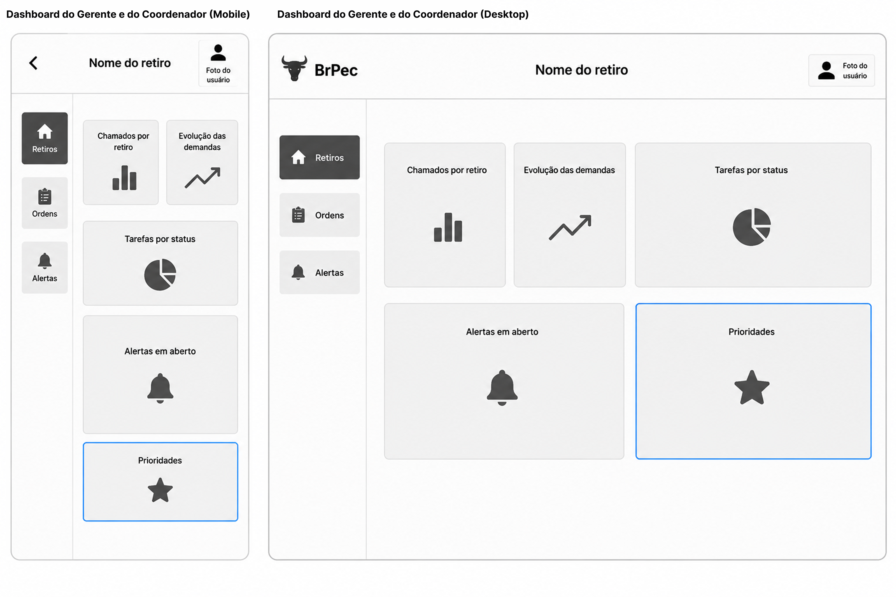
  <p>Fonte: Próprios autores (2026).</p>
</center>

#### Nova O.S.:
A Figura 14 (citada anteriormente) ilustra a interface unificada de Abertura de Demandas, utilizada pelo Gerente para delegar atividades tanto para a equipe de manutenção quanto para os Capatazes de campo, adotando o padrão de design responsivo para dispositivos móveis e desktop. 

No fluxo de seleção de tipo, ao acessar o painel, o gestor pode alternar entre duas verticais de trabalho, sendo elas a de infraestrutura, para manutenção Hidráulica, Cerca ou Elétrica, e a de operações de manejo, para demandas zootécnicas direcionadas diretamente aos Capatazes, tais como Movimentação de Rebanho, Registro de Óbito, entre outras. 

Para garantir o direcionamento correto e a clareza da atividade, os campos e parâmetros de cadastro oferecem recursos como o nível de prioridade, para atribuição de urgência para organizar a fila de trabalho em campo, o prazo limite, definindo a data esperada para a conclusão do serviço, o detalhamento descritivo, em um campo de texto livre para detalhar as especificações da tarefa, e os recursos multimídia, trazendo a opção para anexar áudios (com instruções gravadas por voz) e imagens/fotos de referência, eliminando qualquer ambiguidade na comunicação entre o escritório e o campo, atendendo a (US01), (US06) e (US07).

---

### Fluxo 4 — Coordenador: visualizar movimentações e exportar dados consolidados (US11, US12)
#### Dashboard inicial:

A Interface Principal (Dashboard) destinada aos perfis de Gerente e Coordenador, desenvolvida com design responsivo para dispositivos móveis e desktop, funciona como o núcleo centralizador para o monitoramento e a tomada de decisões na fazenda. Ela foi descrita anteriormente, no fluxo 3, na parte de "Dashboard inicial". O respectivo wireframe foi apresentado na Figura 16.

#### Tela de movimentações (boletas digitais):

A Figura 17, ilustra a tela de movimentações. A interface foi projetada em design responsivo para uso em desktop e dispositivos móveis, permitindo ao Coordenador acessar, revisar e validar os registros enviados pelos Capatazes após a sincronização.

Na parte central da tela, é exibida uma lista consolidada de todos os retiros, sendo possível, ao clicar em um deles, visualizar os detalhes das movimentações zootécnicas registradas, contendo as informações essenciais de cada evento: tipo de movimentação (nascimento, óbito, transferência ou compra/venda), retiro de origem, categoria animal, quantidade, data do registro e Capataz responsável (US11).

Para facilitar a gestão dos registros, a interface disponibiliza filtros por retiro, tipo de evento e período (data inicial e data final), permitindo que o Coordenador isole rapidamente os registros de interesse. Indicadores visuais na parte superior da tela apresentam um resumo quantitativo das movimentações por tipo de evento, oferecendo uma visão macro do fluxo zootécnico recente.

Além disso, o Coordenador dispõe de um botão de exportação posicionado de forma destacada na interface, permitindo gerar e baixar um arquivo em formato Excel/CSV contendo os registros filtrados (US12). A exportação respeita a estrutura de colunas padronizada e compatível com os templates legados utilizados pela coordenação da BrPec, contemplando: data, retiro, tipo de evento, categoria animal, quantidade e Capataz responsável.

<center>
  <p><strong>Figura 19</strong> — Wireframe da tela de lista de movimentações do Coordenador (US11)</p>
  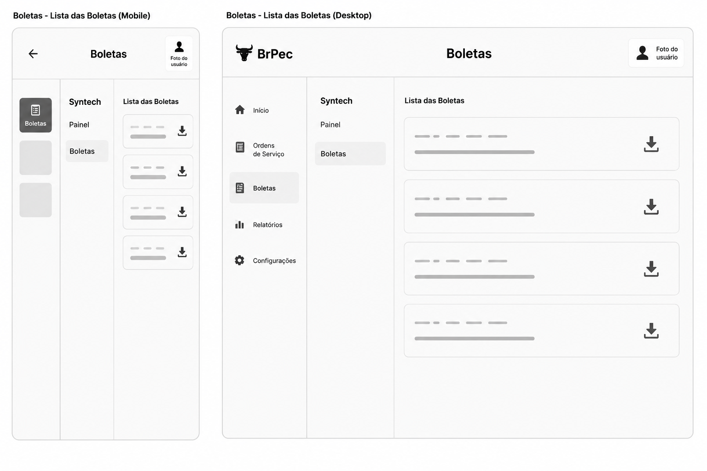
  <p>Fonte: Próprios autores (2026).</p>
</center>

### 3.3.5. Síntese de rastreabilidade dos wireframes

O quadro a seguir consolida a relação entre personas, User Stories priorizadas, necessidades atendidas, telas representadas e dispositivos considerados. Essa síntese facilita a leitura da seção e evidencia que os wireframes foram definidos a partir das jornadas mais relevantes para validação da solução.

| Persona | User Stories relacionadas | Necessidade principal | Wireframes associados | Dispositivo prioritário |
|---|---|---|---|---|
| João Pereira — Gerente | US01, US07 | Criar tarefas, acompanhar status e priorizar demandas operacionais | Dashboard inicial; Nova O.S.; Painel de infraestrutura | Desktop |
| Gabriel Galdino — Capataz | US02, US03, US04, US05, US06 | Visualizar tarefas offline, concluir atividades e registrar evidências com baixa digitação | Lista de tarefas; Detalhe da tarefa; Concluir tarefa; Infraestrutura; Nova O.S. | Mobile |
| Marcos Cesar Filho — Coordenador | US11, US12 | Visualizar movimentações, validar registros e exportar dados consolidados | Dashboard; Tela de movimentações; Exportação de dados | Desktop |
| Técnico de Infraestrutura | US06, US07 | Visualizar chamados e registrar resolução de problemas | Painel de infraestrutura; Detalhe do chamado; Registrar resolução | Mobile/Desktop |

<center>
  <p><strong>Tabela 51</strong> — Wireframes</p>
  <p>Fonte: Próprios autores (2026).</p>
</center>


## 3.4. Guia de estilos (sprint 3)

Um guia de estilo (style guide) é um documento de referência que centraliza todas as decisões visuais de um produto digital, como cores, tipografia, ícones, espaçamentos, componentes e outros, garantindo consistência em todo o sistema. É tanto um instrumento de comunicação entre designers e desenvolvedores quanto um repositório vivo de decisões de design [22][23].

O Guia de Estilos navegável completo está disponível em: [Figma - SynTech](https://www.figma.com/design/CnhVA41sJORDmEQ1DLbxfY/SynTech?node-id=198-939)

<center>
  <p><strong>Figura 18</strong> - Guia de Estilos Completo</p>
  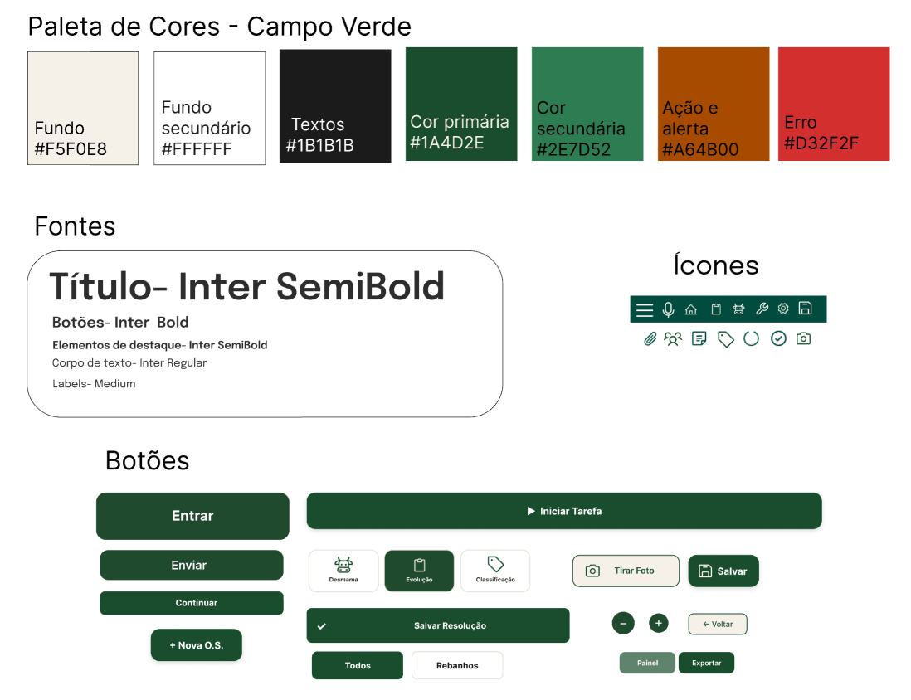
  <p>Fonte: Próprios autores (2026).</p>
</center>

A Figura 18 apresenta o guia de estilos completo da plataforma SynTech, consolidando em uma única visualização as decisões visuais do produto: paleta de cores, escala tipográfica, biblioteca de ícones e componentes de interface. O documento serve como referência central para garantir consistência entre design e desenvolvimento ao longo de todo o projeto.

### 3.4.1 Cores

#### Definição

Uma **paleta de cores** é o conjunto definido e limitado de cores que uma marca, produto ou projeto pode utilizar. Ela integra o **guia de estilo** (*style guide*) com o objetivo de garantir consistência visual em todos os materiais: interfaces, documentos, redes sociais, entre outros [34].

> Sem uma paleta definida, cada membro da equipe escolhe cores de forma independente, gerando inconsistência visual. A paleta funciona como a "lei cromática" do projeto.

#### Paleta de Cores - Campo Verde

| Imagem | Cor | Hex | Função |
|---|---|---|---|
|  | Verde Profundo | `#1A4D2E` | Cor primária - botões principais, cabeçalhos, elementos de destaque |
|  | Verde Médio | `#2E7D52` | Cor secundária - hover states, ícones ativos, badges de status |
|  | Off-white Quente | `#F5F0E8` | Fundo principal - base de todas as telas (evita reflexo do branco puro) |
|  | Quase Preto | `#1B1B1B` | Texto primário - corpo, títulos, labels funcionais |
|  | Âmbar Escuro | `#A64B00` | Ação e alerta - botões de ação secundária, avisos, notificações |
|  | Vermelho Escuro | `#D32F2F` | Erro - mensagens de falha, campos inválidos, ações destrutivas |
|  | Branco | `#FFFFFF` | Fundos Secundários - fundo de cards, mensagens e caixas |

<center>
  <p><strong>Tabela 52</strong> — Paleta de Cores</p>
  <p>Fonte: Próprios autores (2026).</p>
</center>

A paleta é composta por sete cores com funções bem delimitadas. O **Verde Profundo** (`#1A4D2E`) é a cor primária. Ele aparece nos botões principais, cabeçalhos e em qualquer elemento que precise de destaque imediato, ancorando a identidade visual do produto. O **Verde Médio** (`#2E7D52`) atua como cor secundária, reservada para estados de interação como hover, ícones ativos e badges de status, criando uma progressão tonal natural a partir da primária.

As cores neutras são o **Off-white Quente** (`#F5F0E8`) e o **Quase Preto** (`#1B1B1B`). O off-white é a base de todas as telas. O tom levemente amarelado evita o reflexo agressivo do branco puro, tornando a leitura mais confortável. O quase preto é aplicado em textos de corpo, títulos e labels funcionais, oferecendo contraste adequado sem o peso visual do preto absoluto. O **Branco** (`#FFFFFF`) é aplicado exclusivamente no fundo de cards, mensagens e caixas, criando separação visual em relação ao off-white da tela base.

Por fim, as cores semânticas comunicam estados do sistema de forma imediata. O **Âmbar Escuro** (`#A64B00`) sinaliza ações que exigem atenção, como botões de ação secundária, avisos e notificações. O **Vermelho Escuro** (`#D32F2F`) é reservado exclusivamente para erros: mensagens de falha, campos inválidos e ações destrutivas como exclusão de dados.

#### Justificativa Técnica: Contraste Outdoor (Nível AAA)

A adoção do contraste mínimo de 7:1 para interfaces operadas em ambientes externos sob luz solar direta fundamenta-se na convergência entre engenharia de fatores humanos e acessibilidade, conforme o critério de sucesso 1.4.6 da WCAG (Nível AAA) [24].

Em condições de exposição solar direta, que pode ultrapassar 100.000 lux [26], a luz incidente nas camadas do display desencadeia o fenômeno conhecido como veiling glare: reflexões que adicionam luminância ao fundo e ao texto, "lavando" as cores e reduzindo drasticamente o contraste percebido. Para compensar essa perda física e garantir legibilidade em campo, a interface precisa partir de uma razão de contraste nativa substancialmente elevada [25]. Nesse contexto, a iluminação extrema impõe ao usuário uma deficiência visual situacional temporária, equiparável, em termos perceptivos, à perda severa de sensibilidade ao contraste [27].

É exatamente esse cenário que o critério 1.4.6 da WCAG visa cobrir ao exigir a proporção de 7:1. Além do impacto direto na legibilidade, relações inferiores a esse limiar aumentam o tempo de fixação ocular, elevam a taxa de erro na leitura de dados críticos e aceleram a fadiga visual pelo esforço contínuo de acomodação. O patamar de 7:1 é, portanto, o requisito técnico mínimo para preservar a usabilidade em condições adversas de luminosidade.

### 3.4.2 Tipografia

A escolha tipográfica em interfaces digitais vai além da estética. Fontes sem serifa de traço uniforme apresentam melhor desempenho em telas de baixa resolução e em condições adversas de luminosidade, como a exposição solar direta enfrentada pelos usuários deste projeto [28]. Além disso, o tamanho e o peso das fontes impactam diretamente a acessibilidade da interface: textos com peso insuficiente ou tamanho reduzido comprometem a leitura em ambientes de alta iluminância [25][27].

A tipografia da solução utiliza a família **Inter**, disponível gratuitamente via Google Fonts, projetada especificamente para interfaces digitais e com alto desempenho em tamanhos reduzidos e em condições adversas de luminosidade [28].

<center>
  <p><strong>Figura 19</strong> - Fonte Inter e suas variações</p>
  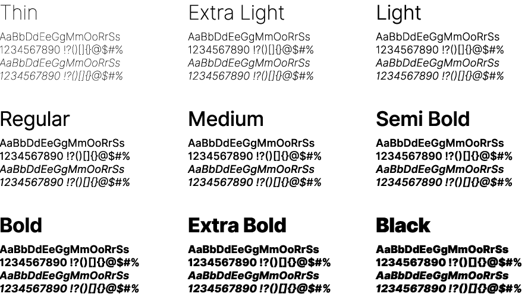
  <p>Fonte: Font Squirrel.</p>
</center>

| Uso | Pesos utilizados |
|---|---|
| Títulos, botões e elementos de destaque | 600 (SemiBold), 700 (Bold) |
| Corpo de texto, labels e tabelas | 400 (Regular), 500 (Medium) |

<center>
  <p><strong>Tabela 53</strong> — Tipografia da solução</p>
  <p>Fonte: Próprios autores (2026).</p>
</center>

#### Escala tipográfica

A escala tipográfica foi definida com base nos critérios de contraste e legibilidade das diretrizes WCAG 2.1, que recomendam tamanhos e pesos mínimos para garantir acessibilidade em diferentes contextos de uso [24]. Para ambientes externos com alta incidência de luz, recomenda-se priorizar pesos a partir de 500 (Medium) e tamanhos a partir de 16px no corpo do texto [27].

| Nível | Família | Peso | Tamanho | Uso |
|---|---|---|---|---|
| Título H1 | Inter | 700 | 32px | Títulos de página |
| Título H2 | Inter | 600 | 24px | Títulos de seção |
| Título H3 | Inter | 600 | 20px | Subtítulos e cards |
| Corpo | Inter | 400 | 16px | Texto principal |
| Label | Inter | 500 | 14px | Labels de formulário e tabelas |
| Caption | Inter | 400 | 12px | Textos auxiliares e rodapés |

> Tamanho mínimo adotado: **12px**. Nenhum texto funcional da interface utiliza tamanho inferior a esse valor, garantindo legibilidade mesmo em dispositivos móveis sob luz solar direta [24][25].

<center>
  <p><strong>Tabela 54</strong> — Escala Tipográfica</p>
  <p>Fonte: Próprios autores (2026).</p>
</center>

### 3.4.3 Iconografia e imagens
#### Iconografia
A iconografia da solução utiliza a biblioteca **Phosphor Icons**, escolhida por seu traço generoso e alta legibilidade em telas mobile e web sob luz solar direta. Os ícones são aplicados exclusivamente nos estilos **Bold** e **Fill**, que apresentam melhor desempenho em condições de alta iluminância, onde traços finos tendem a desaparecer [27].

De acordo com Nielsen [22], os ícones podem ser classificados em três categorias segundo seu grau de correspondência com o conceito que representam:

- **Semelhança** — representam visualmente o objeto ao qual se referem (ex.: folha para natureza, gota para água);
- **Referência** — estabelecem uma analogia com o conceito representado (ex.: engrenagem para configurações);
- **Arbitrários** — têm significado definido apenas por convenção (ex.: triângulo de alerta).


A biblioteca foi selecionada priorizando ícones de semelhança, categoria que apresenta melhor usabilidade e menor dependência cultural [22]. Ícones arbitrários foram adotados apenas quando já amplamente convencionados — como o símbolo de alerta — evitando ambiguidade para o usuário.

Todo ícone funcional da interface é acompanhado de rótulo textual, nunca utilizado de forma isolada em ações críticas. Essa decisão reforça a acessibilidade e reduz erros de interpretação, especialmente em contextos de uso ao ar livre onde a atenção do usuário pode estar dividida [28].

**Atributos de aplicação**

| Imagem | Ícone | Tamanho | Uso |
|---|---|---|---|
|  | Home | 24px | Navegação principal |
|  | Check Circle | 35px | Confirmações e sucesso |
|  | Gear | 24px | Configurações |
|  | Tool | 24px | Acessar infraestrutura |
|  | Microphone | 24px | Gravar áudios |
|  | Camera | 24px e 84px | Adicionar fotos |
|  | Cow | 24px | Movimentação de rebanhos |
|  | Floppy Disk | 24px | Salvar informações |
|  | Play | 24px | Iniciar tarefas |
|  | Download Simple | 24px | Baixar dados |
|  | Paper Clip | 24px | Tarefas |
|  | Clock Counter Clockwise | 24px | Histórico do chamado |
|  | Circle Notch | 35px | Em andamento |
|  | Note | 35px | Chamado em aberto |
|  | Paperclip | 32px | Anexar foto |
|  | Note Pencil | 32px | Boletas |
|  | Users Three | 32px | Identificação gerente |
|  | Tag | 32px | Classificação da evolução |

> Tamanho mínimo adotado: **24px**. Nenhum ícone funcional da interface utiliza tamanho inferior a esse valor, garantindo identificação visual mesmo em dispositivos móveis sob luz solar direta [25][27].

---

#### Imagens

No guia de estilo, a seção de imagens define quais assets visuais estáticos fazem parte da identidade do produto e como devem ser aplicados. Diferentemente dos ícones, que são elementos funcionais da interface, como os da biblioteca Phosphor Icons, as imagens são representações visuais da marca em si [35].

No caso desta solução, o único asset de imagem utilizado é o **logotipo da SynTech**, a plataforma web do projeto. Ele deve ser tratado como elemento protegido da identidade visual: sua proporção não deve ser alterada e sua aplicação se limita ao cabeçalho da plataforma, garantindo reconhecimento consistente da marca ao longo de toda a experiência do usuário.

<center>
  <p><strong>Figura 20</strong> - Logotipo SynTech</p>
  
  <p>Fonte: Próprios autores.</p>
</center>

<center>
  <p><strong>Tabela 55</strong> — Ícones e atributos</p>
  <p>Fonte: Próprios autores (2026).</p>
</center>

## 3.5 Protótipo de alta fidelidade (sprint 3)

O protótipo de alta fidelidade foi desenvolvido no Figma com base nas personas, User
Stories priorizadas e no Guia de Estilos definido na seção 3.4. As decisões visuais
priorizaram a acessibilidade operacional dos usuários de campo, em especial os Capatazes,
que apresentam baixo letramento digital e utilizam o sistema em ambientes externos com
alta incidência solar.

As telas seguem as diretrizes de contraste nível AAA (WCAG 1.4.6, razão mínima de 7:1),
tipografia Inter com tamanhos mínimos de 14px e elementos de interação dimensionados para
uso tátil em dispositivos móveis (altura mínima de 56px nos botões de ação principal). A
paleta aplicada segue integralmente a definida na seção 3.4.1, com Verde Profundo
(`#1A4D2E`) como cor primária e Off-white Quente (`#F5F0E8`) como fundo.

**Sistema de Grid:** O layout foi estruturado com base em um sistema de grid de 12
colunas. Na versão mobile (390px), são utilizadas margens laterais de 20px e colunas de
29px com gutter de 8px. Na versão desktop (1280px), as margens são de 48px com colunas
de 72px e gutter de 16px. Todos os elementos de interface, incluindo cards, botões e
campos de formulário, estão alinhados à grade, garantindo consistência visual entre telas
e entre as versões mobile e desktop.

**Fluxo de interação:** O protótipo cobre quatro fluxos principais de navegação, um por
perfil de usuário. O fluxo do Capataz percorre as telas na seguinte sequência: Lista de
Tarefas (3.5.1) → Detalhe da Tarefa (3.5.2) → Concluir Tarefa (3.5.3). O fluxo da
Equipe de Infraestrutura percorre: Painel de Infraestrutura (3.5.4) → Registrar
Resolução (3.5.6). O fluxo do Gerente percorre: Dashboard (3.5.7) → Nova Ordem de
Serviço (3.5.5). O fluxo do Coordenador percorre: Dashboard (3.5.7) → Boletas (3.5.8).
O encadeamento entre as telas é garantido por elementos de navegação consistentes: seta
de voltar no cabeçalho das telas de detalhe, sidebar fixa nas versões desktop e botões
de ação primária sempre posicionados na base da tela, criando um padrão de navegação
previsível para todos os perfis de usuário.

O protótipo navegável completo está disponível em: [Figma — Alta Fidelidade BRPec](https://www.figma.com/design/CnhVA41sJORDmEQ1DLbxfY/SynTech?node-id=0-1&p=f&t=6lUcQJwa1x9U38DA-0)

---

### 3.5.1. Tela de Tarefas — Capataz (US02 / US03)

A tela de tarefas é a interface principal do Capataz. Projetada para exibir apenas o essencial — lista de tarefas do dia, status de cada item e botão de ação principal —, o design evita textos longos e instruções complexas, apoiando-se em badges coloridos para indicar o estado de cada tarefa sem exigir leitura extensiva.

**Critérios de aceite cobertos:**

- **CR1 (US02):** O Capataz visualiza a lista de tarefas do dia ao acessar a tela, mesmo offline.
- **CR2 (US02):** Quando não há tarefas sincronizadas, uma mensagem simples é exibida no lugar da lista.
- **CR3 (US02):** As tarefas são exibidas de forma organizada e de fácil entendimento.

<center>
  <p><strong>Figura 20</strong> — Protótipo de Alta Fidelidade: Tela de Tarefas do Capataz (Mobile e Desktop)</p>
  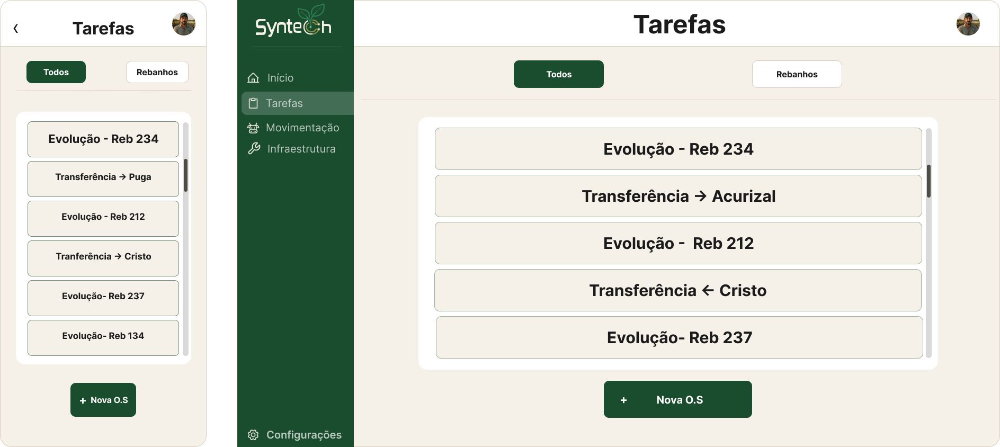
  <p>Fonte: Próprios autores (2026).</p>
</center>

**Decisões de design:**

- **Header verde profundo** com o título da tela em destaque, garantindo orientação imediata mesmo sob luz solar direta.
- **Filtros "Todos" e "Rebanhos"** posicionados logo abaixo do cabeçalho, com o filtro ativo preenchido em verde e o inativo com borda, diferenciando os estados sem ambiguidade.
- **Cards de tarefa** com barra lateral colorida indicando o status (âmbar para "Em andamento", verde para "Pendente"), título em destaque e badge de status. A seta à direita sinaliza que o item é clicável, seguindo convenções já familiares ao usuário de aplicativos móveis.
- **Botão "Nova O.S."** centralizado com altura generosa (56px), permitindo acionamento fácil mesmo com dedos em movimento.
- **Versão desktop** mantém a mesma hierarquia visual da versão mobile, com os cards expandidos em largura total e badge de status posicionado à direita do título.

### 3.5.2. Tela de Detalhe da Tarefa — Capataz (US02)

A tela de detalhe exibe todas as informações necessárias para que o Capataz execute a tarefa corretamente, sem precisar consultar nenhuma outra fonte. O design prioriza hierarquia visual clara: título e status no topo, descrição textual, player de áudio com instruções gravadas pelo Gerente e espaço para registro fotográfico de evidência, tudo acessível em uma única tela.

**Critérios de aceite cobertos:**

- **CR1 (US02):** O Capataz acessa os detalhes da tarefa selecionada, incluindo descrição e instruções, mesmo sem conexão.
- **CR2 (US02):** O player de áudio permite que o Capataz ouça orientações gravadas pelo Gerente sem precisar ler textos longos.
- **CR3 (US02):** O botão "Iniciar Tarefa" registra localmente o início da execução, mesmo offline.

<center>
  <p><strong>Figura 19</strong> — Protótipo de Alta Fidelidade: Tela de Detalhe da Tarefa do Capataz (Mobile e Desktop)</p>
  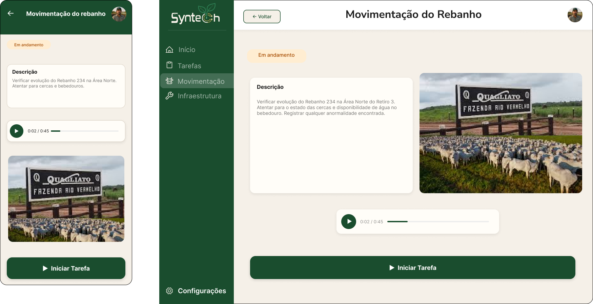
  <p>Fonte: Próprios autores (2026).</p>
</center>

**Decisões de design:**

- **Badge de status** posicionado logo abaixo do cabeçalho, em âmbar para "Em andamento", permitindo identificação imediata do estado da tarefa sem leitura do texto.
- **Card de descrição** com fundo branco e sombra suave, destacando o conteúdo textual sobre o fundo off-white da tela e facilitando a leitura em campo.
- **Player de áudio** com botão de play circular em verde profundo e barra de progresso, seguindo padrão já familiar ao usuário pelo uso do WhatsApp.
- **Placeholder de foto** com ícone de câmera e instrução simples, sinalizando o espaço para anexar a evidência fotográfica da execução.
- **Botão "Iniciar Tarefa"** em largura total com ícone de play, altura de 64px, garantindo acionamento fácil mesmo com dedos em movimento ou luvas.
- **Versão desktop** organiza descrição e player na coluna esquerda e o espaço de foto na coluna direita, aproveitando o espaço horizontal sem alterar a hierarquia de informação.

### 3.5.3. Tela de Concluir Tarefa — Capataz (US03 / US04 / US05)

A tela de conclusão de tarefa centraliza todas as ações necessárias para o Capataz registrar a execução do serviço: foto da conclusão, observações em texto e registro de áudio. O design mantém o fluxo linear e sem ambiguidade, com cada elemento de entrada claramente identificado por label e ícone, reduzindo a chance de erro por parte de usuários com baixo letramento digital.

**Critérios de aceite cobertos:**

- **CR1 (US03):** O Capataz consegue marcar a tarefa como concluída após preencher ao menos um campo de evidência.
- **CR1 (US04):** O Capataz anexa uma foto como evidência da conclusão diretamente pela câmera do dispositivo.
- **CR1 (US05):** O Capataz grava e anexa um áudio curto explicando detalhes da execução sem precisar digitar.

<center>
  <p><strong>Figura 20</strong> — Protótipo de Alta Fidelidade: Tela de Concluir Tarefa do Capataz (Mobile e Desktop)</p>
  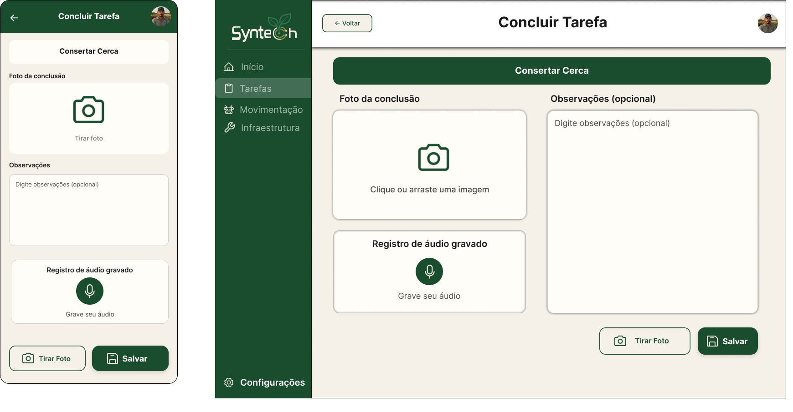
  <p>Fonte: Próprios autores (2026).</p>
</center>

**Decisões de design:**

- **Nome da tarefa** exibido em botão verde profundo na parte superior, permitindo que o Capataz confirme visualmente que está concluindo a tarefa correta antes de registrar qualquer evidência.
- **Área de foto** com ícone de câmera centralizado e instrução "Tirar foto" ou "Clique ou arraste uma imagem", seguindo padrão já familiar ao usuário pelo uso cotidiano do celular.
- **Campo de observações** em textarea com placeholder explicativo, posicionado ao lado da foto na versão desktop e abaixo na versão mobile, mantendo a hierarquia de informação consistente entre os dois layouts.
- **Card de áudio** com botão de microfone circular em verde profundo e instrução "Grave seu áudio", permitindo que o Capataz registre detalhes complexos sem precisar digitar textos longos.
- **Botões "Tirar Foto" e "Salvar"** posicionados lado a lado na base da tela, com alturas de 56px e diferenciação visual clara: "Tirar Foto" com borda verde e fundo off-white, "Salvar" preenchido em verde profundo.
- **Sidebar na versão desktop** com navegação entre Início, Tarefas, Movimentação e Configurações, garantindo que o usuário possa navegar para outras seções sem perder o contexto da tarefa em andamento.

### 3.5.4. Painel - Infraestrutura (US06 / US07)

O painel de infraestrutura oferece à equipe técnica uma visão consolidada dos chamados de
manutenção da fazenda, organizados por categoria e status. A estrutura kanban na versão
desktop e a lista de contadores na versão mobile permitem identificar rapidamente o volume
de demandas abertas, em andamento e encerradas, sem necessidade de navegar por múltiplas
telas.

**Critérios de aceite cobertos:**

- **CR1 (US06):** A equipe de infraestrutura visualiza os chamados abertos por categoria
(Hidráulica, Cerca, Elétrica) e cria uma nova O.S. diretamente pelo painel.
- **CR2 (US06):** Os chamados são organizados por status (Abertos, Em andamento,
Fechados), permitindo triagem imediata por prioridade de atendimento.
- **CR3 (US06):** O botão "+ Nova O.S." está sempre visível e acessível, permitindo
abertura rápida de um novo chamado diretamente do painel.

<center>
  <p><strong>Figura 21</strong> — Protótipo de Alta Fidelidade: Painel de Infraestrutura (Mobile e Desktop)</p>
  
  <p>Fonte: Próprios autores (2026).</p>
</center>

**Decisões de design:**

- **Filtros de categoria** (Hidráulica, Cerca, Elétrica) posicionados no topo da tela mobile e na sidebar da versão desktop, com o item ativo destacado em verde profundo, permitindo alternância rápida entre tipos de chamado.
- **Cards de status** na versão mobile com ícone identificador, label descritivo, subtítulo "Total de chamados" e contador numérico em destaque, permitindo leitura imediata da situação operacional sem necessidade de abrir filtros.
- **Layout kanban** na versão desktop com três colunas — Abertos, Em andamento e Fechados — e contadores numéricos no cabeçalho de cada coluna, oferecendo visão macro do pipeline de manutenção em um único olhar.
- **Botão "+ Nova O.S."** em largura total na versão mobile e posicionado no canto inferior direito na versão desktop, sempre visível e de fácil acesso para registro imediato de um novo chamado em campo.
- **Avatar circular verde** no canto superior direito identifica o usuário logado em ambas as versões, mantendo consistência visual com as demais telas do sistema.

### 3.5.5. Tela de Nova Ordem de Serviço — Gerente (US01)

A tela de criação de nova Ordem de Serviço centraliza todos os campos necessários para que o Gerente planeje e distribua uma tarefa ao Capataz ou à equipe de infraestrutura. O formulário foi estruturado para guiar o preenchimento de forma sequencial e sem ambiguidade, com campos de seleção padronizados para evitar erros de digitação e garantir consistência nos registros.

**Critérios de aceite cobertos:**

- **CR1 (US01):** O Gerente consegue criar uma tarefa informando título, operação, retiro de origem, capataz responsável e data de execução.
- **CR2 (US01):** A seleção de equipe (Capataz ou Infra) determina os campos disponíveis no formulário, evitando preenchimento incorreto.
- **CR3 (US01):** O Gerente pode anexar áudio e foto à O.S. para complementar as instruções enviadas ao Capataz.

<center>
  <p><strong>Figura 22</strong> — Protótipo de Alta Fidelidade: Tela de Nova Ordem de Serviço do Gerente (Mobile e Desktop)</p>
  
  <p>Fonte: Próprios autores (2026).</p>
</center>

**Decisões de design:**

- **Seletor de equipe** (Capataz / Infra) posicionado no topo do formulário, com o item ativo preenchido em verde profundo e o inativo com borda, definindo o contexto da O.S. antes do preenchimento dos demais campos.
- **Campos de seleção padronizados** com dropdown para operação, retiro de origem, destino opcional e responsável, eliminando a entrada livre de texto e garantindo consistência nos dados registrados.
- **Indicadores de prioridade** representados por três círculos coloridos (vermelho, âmbar e verde), permitindo atribuição visual de urgência sem necessidade de leitura de labels extensos.
- **Cards de áudio e foto** posicionados lado a lado na base do formulário, com ícone de microfone e câmera em verde profundo, permitindo que o Gerente complemente as instruções textuais com mídia antes de enviar a O.S.
- **Botão "Continuar"** na versão mobile e "Enviar" na versão desktop, ambos em verde profundo com largura generosa, sinalizando claramente a ação de submissão do formulário.
- **Versão desktop** organiza os campos em grid de duas e três colunas, aproveitando o espaço horizontal para reduzir a necessidade de rolagem e manter todos os campos visíveis simultaneamente.

### 3.5.6. Tela de Registrar Resolução — Infraestrutura (US06)

A tela de registro de resolução é acessada pelo técnico de infraestrutura após iniciar o atendimento de um chamado. Ela centraliza as informações do problema reportado, o campo para descrição da solução aplicada, o anexo de foto como evidência e o histórico completo do ciclo de vida do chamado. O layout em duas colunas na versão desktop permite que o técnico consulte o histórico enquanto preenche a resolução, sem precisar alternar entre telas.

**Critérios de aceite cobertos:**

- **CR1 (US06):** O técnico consegue registrar a solução aplicada com descrição textual e foto de evidência antes de salvar.
- **CR2 (US06):** O histórico do chamado exibe as etapas de ciclo de vida (Aberto, Em andamento, Resolvido) com data, hora e descrição de cada transição.
- **CR3 (US06):** O botão "Salvar Resolução" encerra o chamado e atualiza seu status no painel de infraestrutura.

<center>
  <p><strong>Figura 23</strong> — Protótipo de Alta Fidelidade: Tela de Registrar Resolução de Chamado (Mobile e Desktop)</p>
  
  <p>Fonte: Próprios autores (2026).</p>
</center>

**Decisões de design:**

- **Card de identificação do chamado** na versão mobile com ícone de status, nome do problema e categoria (ex: "Vazamento no bebedouro — Hidráulica"), permitindo que o técnico confirme que está resolvendo o chamado correto antes de registrar qualquer informação.
- **Campo de descrição da solução** com contador de caracteres (0/500) posicionado no canto inferior direito, orientando o técnico sobre o limite de texto sem interromper o preenchimento.
- **Área de anexo de foto** com instrução "Arraste ou selecione uma imagem" e especificação de formatos aceitos (JPG, PNG, máx. 10MB), reduzindo dúvidas sobre o tipo de arquivo suportado.
- **Botão "Salvar Resolução"** em verde profundo com ícone de check, largura total em ambas as versões, sinalizando claramente a ação de encerramento do chamado.
- **Histórico do chamado** na versão desktop exibido em coluna lateral com cards sequenciais mostrando status, data, hora e descrição de cada etapa (Aberto, Em andamento, Resolvido), oferecendo rastreabilidade completa do ciclo de atendimento sem necessidade de tela adicional.
- **Link "Ver histórico do chamado"** na versão mobile como alternativa de acesso ao histórico sem sobrecarregar o layout reduzido, mantendo o foco na ação principal de registro da resolução.

### 3.5.7. Dashboard — Gerente e Coordenador (US07)

O dashboard é a tela inicial do Gerente e do Coordenador, oferecendo uma visão consolidada e em tempo real da operação da fazenda. Os indicadores visuais permitem identificar rapidamente o volume de chamados, a evolução das demandas, a distribuição de tarefas por status e a quantidade de alertas em aberto, sem necessidade de navegar por outras telas.

**Critérios de aceite cobertos:**

- **CR1 (US07):** O Gerente visualiza o status consolidado de todas as tarefas e alertas em aberto agrupados por retiro.
- **CR2 (US07):** Os dados do painel são atualizados automaticamente após cada sincronização dos capatazes.
- **CR3 (US07):** O Gerente pode filtrar os indicadores por retiro e por período diretamente no painel.

<center>
  <p><strong>Figura 24</strong> — Protótipo de Alta Fidelidade: Dashboard do Gerente e Coordenador (Mobile e Desktop)</p>
  
  <p>Fonte: Próprios autores (2026).</p>
</center>

**Decisões de design:**

- **Filtros de retiro e data** posicionados logo abaixo do cabeçalho em ambas as versões, permitindo que o Gerente segmente os indicadores por unidade operacional e período sem precisar acessar uma tela de configuração separada.
- **Gráfico de barras "Chamados por retiro"** com barras em verde profundo e verde médio, oferecendo comparativo visual imediato entre retiros sem exigir leitura de tabelas numéricas.
- **Card "Evolução das demandas"** com ícone de seta de tendência e percentual em destaque (75%), sinalizando de forma objetiva a direção do fluxo operacional.
- **Gráfico de rosca "Tarefas por status"** com legenda colorida (Aberto em verde, Em andamento em âmbar e Resolvido em preto), permitindo leitura proporcional do pipeline de tarefas de forma visual e intuitiva.
- **Cards numéricos** para "Alertas em aberto" e "Prioridades" com valor em verde profundo e tamanho de fonte generoso, garantindo identificação imediata dos indicadores mais críticos da operação.
- **Avatar com foto real** do usuário logado no canto superior direito, substituindo as iniciais usadas nas demais telas e reforçando a identidade do gestor no painel executivo.
- **Versão mobile** organiza os cards em lista vertical com dois itens por linha para os indicadores menores, mantendo a hierarquia de informação sem sacrificar a legibilidade em telas reduzidas.

### 3.5.8. Tela de Boletas — Coordenador (US11 / US12)

A tela de boletas é a interface principal do Coordenador para acesso e exportação das movimentações zootécnicas registradas pelos capatazes. A lista exibe os registros consolidados de forma clara e objetiva, com ícone de download posicionado à direita de cada item para exportação individual, eliminando a necessidade de redigitação manual dos dados em planilhas externas.

**Critérios de aceite cobertos:**

- **CR1 (US11):** O Coordenador visualiza em lista todas as movimentações reportadas pelos capatazes sob sua responsabilidade.
- **CR1 (US12):** O Coordenador consegue exportar os registros de movimentação em formato Excel/CSV diretamente pela interface.
- **CR2 (US12):** Cada boleta exibe informações suficientes para identificação do registro antes do download.

<center>
  <p><strong>Figura 25</strong> — Protótipo de Alta Fidelidade: Tela de Lista de Boletas do Coordenador (Mobile e Desktop)</p>
  
  <p>Fonte: Próprios autores (2026).</p>
</center>

**Decisões de design:**

- **Sub-navegação "Painel / Boletas"** posicionada logo abaixo do cabeçalho, com o item ativo "Boletas" preenchido em verde profundo, permitindo alternância rápida entre a visão de painel e a lista de registros sem alterar a navegação principal.
- **Cards de boleta** com duas linhas de texto em tons de cinza representando o título e o subtítulo do registro, e ícone de download em verde profundo posicionado à direita, mantendo a ação de exportação sempre visível sem sobrecarregar o layout.
- **Lista em coluna única** em ambas as versões, priorizando a leitura sequencial dos registros e facilitando a localização de boletas específicas sem necessidade de grade ou tabela complexa.
- **Sidebar na versão desktop** com navegação entre Início, Tarefas e Boletas, com o item ativo destacado em verde mais escuro, garantindo orientação espacial clara dentro do sistema.
- **Avatar com foto real** do usuário logado no canto superior direito, mantendo consistência com o dashboard do Gerente e reforçando a identidade do Coordenador na interface.
- **Configurações** acessíveis pelo ícone de engrenagem no rodapé da sidebar na versão desktop, mantendo a opção disponível sem ocupar espaço na área principal de conteúdo.

### 3.5.9. Mapeamento de Requisitos Funcionais às Telas do Protótipo

A tabela abaixo relaciona cada Requisito Funcional prioritário à tela do protótipo de alta fidelidade em que ele é representado visualmente, garantindo rastreabilidade completa entre os requisitos definidos na seção 3.1.1 e as interfaces desenvolvidas.

<center>
  <p><strong>Tabela X</strong> — Rastreabilidade RF → Tela → Fluxo</p>
</center>

| RF | Descrição resumida | Tela do protótipo | Seção | User Story |
|---|---|---|---|---|
| RF001 | O Gerente cria tarefas com título, retiro, capataz e data | 3.5.5 — Nova Ordem de Serviço | Formulário de criação com campos de equipe, operação, retiro, responsável, prazo e prioridade | US01 |
| RF002 | O Capataz visualiza tarefas do dia mesmo offline | 3.5.1 — Lista de Tarefas | Lista de tarefas com status, filtros e badge colorido por situação | US02 |
| RF003 | O sistema armazena tarefas localmente para acesso offline | 3.5.1 — Lista de Tarefas | Indicador visual de modo offline e listagem a partir do armazenamento local | US02 |
| RF004 | O sistema exibe mensagem quando não há tarefas offline | 3.5.1 — Lista de Tarefas | Estado vazio da lista com mensagem simples ao Capataz | US02 |
| RF005 | O Capataz anexa foto e áudio como evidência da tarefa | 3.5.3 — Concluir Tarefa | Área de foto com ícone de câmera e card de registro de áudio com botão de microfone | US04 / US05 |
| RF006 | O sistema registra alertas de infraestrutura por categoria e status | 3.5.4 — Painel de Infraestrutura | Cards de chamados abertos, em andamento e fechados com botão Nova O.S., acessados pela equipe técnica | US06 |
| RF007 | O Gerente visualiza painel consolidado de tarefas e alertas | 3.5.7 — Dashboard | Gráficos de chamados por retiro, evolução de demandas, tarefas por status e alertas em aberto | US07 |
| RF008 | O Capataz registra nascimentos de animais offline | 3.5.8 — Boletas | Lista de boletas com registros de movimentação zootécnica disponíveis para download | US08 |
| RF009 | O Capataz registra óbitos de animais offline | 3.5.8 — Boletas | Lista de boletas com registros de movimentação zootécnica disponíveis para download | US09 |
| RF010 | O sistema sincroniza automaticamente ao reconectar | 3.5.1 — Lista de Tarefas / 3.5.3 — Concluir Tarefa | Indicador de modo offline e confirmação visual após sincronização | US02 / US03 |
| RF012 | Registros com falha são mantidos e reenviados automaticamente | 3.5.3 — Concluir Tarefa | Fluxo de salvamento local com retry automático representado pelo botão "Salvar" | US03 |
| RF013 | O Capataz registra óbito com foto obrigatória da carcaça | 3.5.3 — Concluir Tarefa | Área de foto obrigatória para registro de evidência na conclusão | US04 |
| RF014 | O Coordenador visualiza movimentações reportadas pelos capatazes | 3.5.8 — Boletas | Lista consolidada de boletas por retiro com informações de cada movimentação | US11 |
| RF015 | O Coordenador exporta movimentações em Excel/CSV | 3.5.8 — Boletas | Ícone de download posicionado à direita de cada boleta para exportação individual | US12 |

<center>
  <p>Fonte: Próprios autores (2026).</p>
</center>

**Validação de cobertura:**

Todos os RFs prioritários definidos na seção 3.1.1 possuem representação visual em ao menos uma tela do protótipo. As telas 3.5.2 (Detalhe da Tarefa) e 3.5.6 (Registrar Resolução) complementam o fluxo de execução e encerramento de chamados, respectivamente, cobrindo os critérios de aceite das US02, US03 e US06 que não se esgotam em uma única tela.

## 3.6. Modelagem do banco de dados (sprints 2 e 4)

### 3.6.1. Modelo Entidade-Relacionamento (ER) (sprint 2)

O modelo Entidade-Relacionamento (ER) conceitual descreve as principais entidades do domínio da aplicação, seus atributos e os relacionamentos existentes entre elas. O objetivo é estruturar conceitualmente os dados necessários para suportar o gerenciamento operacional da BRPec Agropecuária, contemplando usuários, retiros, tarefas, alertas, movimentações de rebanho e evidências.

No contexto do projeto, a boleta representa o formulário digital utilizado pelo Capataz para registrar as informações de campo que antes eram anotadas em papel. Conceitualmente, a boleta funciona como o fluxo operacional de entrada de dados: por meio dela o Capataz visualiza e conclui tarefas, registra movimentações do rebanho, emite alertas de infraestrutura e anexa evidências. Por não possuir ciclo de vida independente das informações registradas, a boleta não é modelada como uma entidade isolada; ela é materializada no modelo pelos registros de tarefa, alerta, movimentação e evidência. Para cada relacionamento são indicadas as cardinalidades mínima e máxima em ambos os lados, expressando diretamente as regras de negócio do domínio.


#### Decisões de modelagem

- **USUÁRIO:** representa os perfis operacionais do sistema (Gerente, Coordenador, Capataz e Técnico de Infraestrutura). A distinção de funções é realizada pelo atributo `perfil`, centralizando a gestão de acessos e garantindo que cada ação no sistema seja vinculada a um identificador único para fins de rastreabilidade.

- **RETIRO:** representa as unidades físicas e operacionais da fazenda. O relacionamento *pertence* estabelece que cada Capataz deve estar vinculado a exatamente um retiro (USUÁRIO 1,1), enquanto um retiro pode possuir nenhum, um ou múltiplos usuários associados (RETIRO 0,n), considerando que perfis como Gerente, Coordenador e técnico podem atuar em escopo mais amplo.

- **TAREFA:** registra ordens de serviço criadas por Gerentes ou Coordenadores e atribuídas a Capatazes para execução em campo. Cada tarefa é criada por exatamente um usuário autorizado (TAREFA 1,1) e um usuário pode criar várias tarefas (USUÁRIO 0,n). Cada tarefa também possui exatamente um responsável pela execução (TAREFA 1,1), enquanto um Capataz pode executar várias tarefas ao longo do tempo (USUÁRIO 0,n). Toda tarefa pertence obrigatoriamente a um retiro (TAREFA 1,1; RETIRO 0,n).

- **ALERTA:** é utilizado para reportar problemas de infraestrutura (cerca, bebedouro, hidráulica, elétrica, entre outros), com localização geográfica e ciclo de resolução rastreável. Cada alerta é emitido por exatamente um usuário (ALERTA 1,1), enquanto um usuário pode emitir nenhum, um ou vários alertas (USUÁRIO 0,n). Um alerta pode ainda ser atendido por no máximo um técnico de infraestrutura (ALERTA 0,1), e um técnico pode atender vários alertas (USUÁRIO 0,n). Todo alerta pertence obrigatoriamente a um retiro (ALERTA 1,1; RETIRO 0,n).

- **MOVIMENTAÇÃO:** é o núcleo do registro de manejo do rebanho realizado na boleta digital, substituindo os processos manuais em papel. Registra o tipo de evento zootécnico (nascimento, óbito, transferência ou compravenda), a categoria do animal, a quantidade e a data da ocorrência. Cada movimentação é registrada por exatamente um usuário responsável (MOVIMENTAÇÃO 1,1), enquanto um usuário pode registrar várias movimentações (USUÁRIO 0,n). Cada movimentação ocorre obrigatoriamente em um retiro de referência (MOVIMENTAÇÃO 1,1; RETIRO 0,n).

- **EVIDÊNCIA:** armazena mídias de comprovação (foto, áudio, vídeo, documento ou texto) anexadas durante o preenchimento da boleta digital. Cada evidência pertence a exatamente uma origem: uma tarefa, um alerta ou uma movimentação (EVIDÊNCIA 1,1 em uma única origem). A exclusividade é representada por três relacionamentos *comprova* mutuamente exclusivos, enquanto cada tarefa, alerta ou movimentação pode possuir nenhuma, uma ou várias evidências associadas (0,n). Essa decisão mantém a rastreabilidade do registro sem duplicar arquivos de mídia nas entidades operacionais.

- **Tipos específicos de movimentação:** (Nascimento, Óbito, Transferência e CompraVenda): Movimentação atua como entidade genérica que se especializa em quatro subtipos zootécnicos. A especialização é total e disjunta, cada movimentação corresponde a exatamente um subtipo (cardinalidade 1,1 no lado de movimentação). Cada subtipo possui atributos próprios: nascimento registra quantidade e raça; óbito registra identificação do animal, quantidade, causa da morte e exigência de evidência fotográfica; transferência registra retiros de origem e destino e a quantidade transferida; compravenda registra tipo de negócio, valor financeiro e quantidade.

Dessa forma, o ER cobre os principais fluxos de dados do sistema: planejamento e execução de tarefas, emissão e atendimento de alertas, registro de eventos zootécnicos, anexação de evidências e sincronização posterior dos dados coletados em campo.

### 3.6.2. Diagrama Entidade-Relacionamento (DER) (sprint 2)

O DER abaixo é a representação gráfica, na notação de Peter Chen (1976), da versão conceitual concebida durante a sprint 2. Entidades são representadas por retângulos, atributos por elipses e relacionamentos por losangos.

Este diagrama registra a estrutura de dados concebida na sprint 2, com a Boleta como entidade central, concentrando os atributos comuns a todos os eventos zootécnicos (`tipo_boleta`, `data`, `RG/CPF`, `status`, `tipo_animal`, `tipo_transporte`, `quantidade_animal`, `georreferenciamento`). As especializações, Nascimento, Óbito, Transferência, Compra e Venda, conectam-se à Boleta pelo relacionamento detalha com cardinalidade (1,1) em ambos os lados, implementando herança por especialização total e disjunta: cada boleta corresponde a exatamente um tipo de evento, e cada evento pertence a exatamente uma boleta.

A seção 3.6.1 apresenta a versão conceitual consolidada após a evolução deste DER: a Boleta deixa de ser uma entidade isolada e passa a ser materializada pelos registros de Movimentação, Tarefa, Alerta e Evidência. Essa decisão separou melhor as responsabilidades de cada entidade e eliminou atributos que não são pertinentes a todos os tipos de evento.

<center>
  <p><strong>Figura 21</strong> — DER conceitual da sprint 2 — BRPec Agropecuária</p>
</center>


<center>
  <p>Fonte: Próprios autores (2026).</p>
</center>


### 3.6.3.1 Modelo Relacional e Modelo Físico (sprints 2 e 4)

O modelo físico deriva do modelo conceitual (ER) apresentado na seção 3.6.1 e materializa as entidades em tabelas SQLite, usando chaves primárias textuais em UUID v7, chaves estrangeiras explícitas, constraints de domínio e índices para consultas frequentes. A escolha por SQLite está associada ao requisito offline-first: os dados operacionais são gravados no dispositivo antes de qualquer tentativa de sincronização, evitando dependência exclusiva de cache do navegador.

A aplicação PWA mantém os dados estruturados no banco local SQLite. Quando a conexão retorna, a camada de sincronização envia os registros pendentes para uma API central; arquivos de mídia, como fotos e áudios, são enviados a um serviço de armazenamento de evidências pela API. O banco local mantém metadados, caminho local do arquivo antes do upload e a referência remota (`storage_key` ou `url`) após a sincronização.

A evolução conceitual está apresentada nas seções 3.6.1 e 3.6.2. Nesta seção, o modelo consolidado é transformado em modelo relacional e em DDL executável.

#### Modelo Relacional

| Relação          | Chave primária | Chaves estrangeiras principais                             | Observação                                      |
| ---------------- | -------------- | ---------------------------------------------------------- | ----------------------------------------------- |
| `retiros`        | `id`           | —                                                          | Unidades operacionais da fazenda                |
| `usuarios`       | `id`           | `retiro_id -> retiros(id)`                                 | `retiro_id` é obrigatório apenas para Capatazes |
| `tarefas`        | `id`           | `retiro_id`, `criado_por_id`, `responsavel_id`             | Registra quem criou e quem executa a tarefa     |
| `alertas`        | `id`           | `retiro_id`, `criado_por_id`, `tecnico_id`                 | Chamados com tipo, GPS e ciclo de resolução     |
| `movimentacoes`  | `id`           | `retiro_id`, `responsavel_id`                              | Evento-base de manejo do rebanho                |
| `evidencias`     | `id`           | `tarefa_id`, `alerta_id`, `movimentacao_id`                | Cada evidência pertence a exatamente uma origem |
| `nascimentos`    | `id`           | `movimentacao_id -> movimentacoes(id)`                     | Especialização 1:1 de movimentação              |
| `obitos`         | `id`           | `movimentacao_id -> movimentacoes(id)`                     | Especialização 1:1 com exigência de foto        |
| `transferencias` | `id`           | `movimentacao_id`, `retiro_origem_id`, `retiro_destino_id` | Especialização 1:1 entre retiros distintos      |
| `compravendas`   | `id`           | `movimentacao_id -> movimentacoes(id)`                     | Especialização 1:1 de compra ou venda           |
| `sync_queue`     | `id`           | —                                                          | Fila técnica de sincronização offline-online    |

<center>
  <p><strong>Tabela 56</strong> — Modelo Relacional</p>
  <p>Fonte: Próprios autores (2026).</p>
</center>


**Decisões de modelagem física:**

- **SQLite local como fonte offline**: os registros são gravados localmente primeiro, com `sync_status` para indicar se ainda precisam ser enviados à API.
- **UUID v7 em colunas `TEXT`**: o identificador é gerado no cliente, antes da conexão com o servidor, e armazenado como texto por compatibilidade com SQLite.
- **`usuarios.retiro_id` opcional para perfis globais**: Capatazes devem estar vinculados a um retiro, mas Gerente, Coordenador e técnico de infraestrutura podem atuar em escopo mais amplo.
- **`tarefas.criado_por_id` e `tarefas.responsavel_id`**: a primeira FK registra quem criou a tarefa; a segunda registra quem deve executá-la.
- **`alertas.retiro_id` e `alertas.tipo`**: o chamado de infraestrutura fica vinculado ao retiro e ao tipo de problema exigidos nos requisitos.
- **`evidencias` com vínculo polimórfico controlado por `CHECK`**: cada evidência pertence a exatamente uma tarefa, um alerta ou uma movimentação. Isso permite registrar fotos de óbito sem guardar o arquivo binário diretamente na tabela de óbitos.
- **Mídias fora do banco relacional**: `arquivo_local_uri` guarda o caminho local antes da sincronização; `storage_key` e `url` guardam a referência remota após upload pela API; `conteudo_texto` cobre evidências textuais simples.
- **Especialização de `movimentacoes`**: `nascimentos`, `obitos`, `transferencias` e `compravendas` detalham uma movimentação e usam `UNIQUE (movimentacao_id)` para evitar mais de um detalhe do mesmo tipo para o mesmo evento.
- **Regra de totalidade e disjunção das especializações**: no modelo conceitual, cada movimentação pertence a exatamente um subtipo. No SQLite local, essa regra é apoiada por `movimentacoes.tipo`, pelas tabelas especializadas e pela camada de aplicação/sincronização, que só grava o detalhe compatível com o tipo do evento. Caso a validação precise ficar totalmente no banco, a regra pode ser reforçada por triggers.
- **Timestamp de atualização nas especializações**: as tabelas especializadas não possuem `updated_at` próprio porque mudanças de estado do evento são rastreadas na tabela-mãe `movimentacoes`.
- **`sync_queue`**: tabela técnica que registra operações pendentes (`insert`, `update`, `delete` ou `upload`) para a camada de sincronização executar quando houver conexão.

#### Migrations DDL

As migrations abaixo são reproduzíveis e idempotentes (`CREATE TABLE IF NOT EXISTS`). A ordem de execução respeita as dependências de chave estrangeira: primeiro tabelas-base, depois tabelas dependentes e, por fim, a fila de sincronização.

##### Migration 000 — ativação de chaves estrangeiras

```sql
PRAGMA foreign_keys = ON;
```

##### Migration 001 — `retiros`

```sql
CREATE TABLE IF NOT EXISTS retiros (
    id          TEXT PRIMARY KEY,
    nome        TEXT NOT NULL,
    localizacao TEXT NOT NULL,
    created_at  TEXT NOT NULL DEFAULT (strftime('%Y-%m-%dT%H:%M:%fZ','now')),
    updated_at  TEXT NOT NULL DEFAULT (strftime('%Y-%m-%dT%H:%M:%fZ','now'))
);
```

##### Migration 002 — `usuarios`

```sql
CREATE TABLE IF NOT EXISTS usuarios (
    id         TEXT PRIMARY KEY,
    retiro_id  TEXT REFERENCES retiros(id),
    nome       TEXT NOT NULL,
    email      TEXT NOT NULL UNIQUE,
    senha_hash TEXT NOT NULL,
    perfil     TEXT NOT NULL
                   CHECK (perfil IN ('Gerente','Capataz','Coordenador','tecnico_infra')),
    created_at TEXT NOT NULL DEFAULT (strftime('%Y-%m-%dT%H:%M:%fZ','now')),
    updated_at TEXT NOT NULL DEFAULT (strftime('%Y-%m-%dT%H:%M:%fZ','now')),
    CHECK (perfil != 'Capataz' OR retiro_id IS NOT NULL)
);
CREATE INDEX IF NOT EXISTS idx_usuarios_retiro ON usuarios(retiro_id);
CREATE INDEX IF NOT EXISTS idx_usuarios_perfil ON usuarios(perfil);
```

##### Migration 003 — `tarefas`

```sql
CREATE TABLE IF NOT EXISTS tarefas (
    id             TEXT PRIMARY KEY,
    retiro_id      TEXT NOT NULL REFERENCES retiros(id),
    criado_por_id  TEXT NOT NULL REFERENCES usuarios(id),
    responsavel_id TEXT NOT NULL REFERENCES usuarios(id),
    titulo         TEXT NOT NULL,
    descricao      TEXT,
    status         TEXT NOT NULL DEFAULT 'pendente'
                       CHECK (status IN ('pendente','em_andamento','concluida','cancelada')),
    data_prevista  TEXT NOT NULL,
    data_conclusao TEXT,
    sync_status    TEXT NOT NULL DEFAULT 'pendente'
                       CHECK (sync_status IN ('pendente','sincronizado','erro')),
    last_synced_at TEXT,
    created_at     TEXT NOT NULL DEFAULT (strftime('%Y-%m-%dT%H:%M:%fZ','now')),
    updated_at     TEXT NOT NULL DEFAULT (strftime('%Y-%m-%dT%H:%M:%fZ','now')),
    CHECK (
        (status = 'concluida' AND data_conclusao IS NOT NULL)
        OR status != 'concluida'
    )
);
CREATE INDEX IF NOT EXISTS idx_tarefas_retiro      ON tarefas(retiro_id);
CREATE INDEX IF NOT EXISTS idx_tarefas_criado_por  ON tarefas(criado_por_id);
CREATE INDEX IF NOT EXISTS idx_tarefas_responsavel ON tarefas(responsavel_id);
CREATE INDEX IF NOT EXISTS idx_tarefas_status      ON tarefas(status);
CREATE INDEX IF NOT EXISTS idx_tarefas_sync        ON tarefas(sync_status);
```

##### Migration 004 — `alertas`

```sql
CREATE TABLE IF NOT EXISTS alertas (
    id                  TEXT PRIMARY KEY,
    retiro_id           TEXT NOT NULL REFERENCES retiros(id),
    criado_por_id       TEXT NOT NULL REFERENCES usuarios(id),
    tecnico_id          TEXT REFERENCES usuarios(id),
    tipo                TEXT NOT NULL
                            CHECK (tipo IN ('cerca','bebedouro','hidraulica','eletrica','infraestrutura','outro')),
    titulo              TEXT NOT NULL,
    descricao           TEXT NOT NULL,
    status              TEXT NOT NULL DEFAULT 'aberto'
                            CHECK (status IN ('aberto','em_andamento','fechado')),
    localizacao_lat     REAL NOT NULL,
    localizacao_lng     REAL NOT NULL,
    data_resolucao      TEXT,
    descricao_resolucao TEXT,
    sync_status         TEXT NOT NULL DEFAULT 'pendente'
                            CHECK (sync_status IN ('pendente','sincronizado','erro')),
    last_synced_at      TEXT,
    created_at          TEXT NOT NULL DEFAULT (strftime('%Y-%m-%dT%H:%M:%fZ','now')),
    updated_at          TEXT NOT NULL DEFAULT (strftime('%Y-%m-%dT%H:%M:%fZ','now')),
    CHECK (
        (status = 'fechado' AND data_resolucao IS NOT NULL)
        OR status != 'fechado'
    )
);
CREATE INDEX IF NOT EXISTS idx_alertas_retiro     ON alertas(retiro_id);
CREATE INDEX IF NOT EXISTS idx_alertas_status     ON alertas(status);
CREATE INDEX IF NOT EXISTS idx_alertas_tipo       ON alertas(tipo);
CREATE INDEX IF NOT EXISTS idx_alertas_criado_por ON alertas(criado_por_id);
CREATE INDEX IF NOT EXISTS idx_alertas_tecnico    ON alertas(tecnico_id);
CREATE INDEX IF NOT EXISTS idx_alertas_sync       ON alertas(sync_status);
```

##### Migration 005 — `movimentacoes`

```sql
CREATE TABLE IF NOT EXISTS movimentacoes (
    id                TEXT PRIMARY KEY,
    retiro_id         TEXT NOT NULL REFERENCES retiros(id),
    responsavel_id    TEXT NOT NULL REFERENCES usuarios(id),
    tipo              TEXT NOT NULL
                          CHECK (tipo IN ('nascimento','obito','transferencia','compravenda')),
    categoria         TEXT NOT NULL
                          CHECK (categoria IN ('bezerro','garrote','boi_touro','bezerra','novilha','vaca')),
    data_movimentacao TEXT NOT NULL,
    observacoes       TEXT,
    sync_status       TEXT NOT NULL DEFAULT 'pendente'
                          CHECK (sync_status IN ('pendente','sincronizado','erro')),
    last_synced_at    TEXT,
    created_at        TEXT NOT NULL DEFAULT (strftime('%Y-%m-%dT%H:%M:%fZ','now')),
    updated_at        TEXT NOT NULL DEFAULT (strftime('%Y-%m-%dT%H:%M:%fZ','now'))
);
CREATE INDEX IF NOT EXISTS idx_movimentacoes_retiro      ON movimentacoes(retiro_id);
CREATE INDEX IF NOT EXISTS idx_movimentacoes_responsavel ON movimentacoes(responsavel_id);
CREATE INDEX IF NOT EXISTS idx_movimentacoes_tipo        ON movimentacoes(tipo);
CREATE INDEX IF NOT EXISTS idx_movimentacoes_sync        ON movimentacoes(sync_status);
```

##### Migration 006 — `evidencias`

```sql
CREATE TABLE IF NOT EXISTS evidencias (
    id                TEXT PRIMARY KEY,
    tarefa_id         TEXT REFERENCES tarefas(id),
    alerta_id         TEXT REFERENCES alertas(id),
    movimentacao_id   TEXT REFERENCES movimentacoes(id),
    tipo              TEXT NOT NULL CHECK (tipo IN ('foto','audio','video','documento','texto')),
    arquivo_local_uri TEXT,
    storage_key       TEXT,
    url               TEXT,
    conteudo_texto    TEXT,
    mime_type         TEXT,
    tamanho_bytes     INTEGER CHECK (tamanho_bytes IS NULL OR tamanho_bytes >= 0),
    sync_status       TEXT NOT NULL DEFAULT 'pendente'
                          CHECK (sync_status IN ('pendente','sincronizado','erro')),
    uploaded_at       TEXT,
    created_at        TEXT NOT NULL DEFAULT (strftime('%Y-%m-%dT%H:%M:%fZ','now')),
    CHECK (
        (tarefa_id IS NOT NULL AND alerta_id IS NULL AND movimentacao_id IS NULL)
        OR (tarefa_id IS NULL AND alerta_id IS NOT NULL AND movimentacao_id IS NULL)
        OR (tarefa_id IS NULL AND alerta_id IS NULL AND movimentacao_id IS NOT NULL)
    ),
    CHECK (
        (tipo = 'texto' AND conteudo_texto IS NOT NULL)
        OR (
            tipo != 'texto'
            AND (
                arquivo_local_uri IS NOT NULL
                OR storage_key IS NOT NULL
                OR url IS NOT NULL
            )
        )
    )
);
CREATE INDEX IF NOT EXISTS idx_evidencias_tarefa       ON evidencias(tarefa_id);
CREATE INDEX IF NOT EXISTS idx_evidencias_alerta       ON evidencias(alerta_id);
CREATE INDEX IF NOT EXISTS idx_evidencias_movimentacao ON evidencias(movimentacao_id);
CREATE INDEX IF NOT EXISTS idx_evidencias_sync         ON evidencias(sync_status);
```

##### Migration 007 — `nascimentos`

```sql
CREATE TABLE IF NOT EXISTS nascimentos (
    id              TEXT PRIMARY KEY,
    movimentacao_id TEXT NOT NULL UNIQUE REFERENCES movimentacoes(id),
    quantidade      INTEGER NOT NULL CHECK (quantidade > 0),
    raca            TEXT,
    created_at      TEXT NOT NULL DEFAULT (strftime('%Y-%m-%dT%H:%M:%fZ','now'))
);
CREATE INDEX IF NOT EXISTS idx_nascimentos_movimentacao ON nascimentos(movimentacao_id);
```

##### Migration 008 — `obitos`

```sql
CREATE TABLE IF NOT EXISTS obitos (
    id                    TEXT PRIMARY KEY,
    movimentacao_id        TEXT NOT NULL UNIQUE REFERENCES movimentacoes(id),
    identificacao_animal   TEXT,
    quantidade             INTEGER NOT NULL CHECK (quantidade > 0),
    causa                  TEXT NOT NULL,
    exige_evidencia_foto   INTEGER NOT NULL DEFAULT 1 CHECK (exige_evidencia_foto IN (0,1)),
    created_at             TEXT NOT NULL DEFAULT (strftime('%Y-%m-%dT%H:%M:%fZ','now'))
);
CREATE INDEX IF NOT EXISTS idx_obitos_movimentacao ON obitos(movimentacao_id);
```

##### Migration 009 — `transferencias`

```sql
CREATE TABLE IF NOT EXISTS transferencias (
    id                TEXT PRIMARY KEY,
    movimentacao_id   TEXT NOT NULL UNIQUE REFERENCES movimentacoes(id),
    retiro_origem_id  TEXT NOT NULL REFERENCES retiros(id),
    retiro_destino_id TEXT NOT NULL REFERENCES retiros(id),
    quantidade        INTEGER NOT NULL CHECK (quantidade > 0),
    created_at        TEXT NOT NULL DEFAULT (strftime('%Y-%m-%dT%H:%M:%fZ','now')),
    CHECK (retiro_origem_id != retiro_destino_id)
);
CREATE INDEX IF NOT EXISTS idx_transferencias_movimentacao ON transferencias(movimentacao_id);
CREATE INDEX IF NOT EXISTS idx_transferencias_origem       ON transferencias(retiro_origem_id);
CREATE INDEX IF NOT EXISTS idx_transferencias_destino      ON transferencias(retiro_destino_id);
```

##### Migration 010 — `compravendas`

```sql
CREATE TABLE IF NOT EXISTS compravendas (
    id               TEXT PRIMARY KEY,
    movimentacao_id  TEXT NOT NULL UNIQUE REFERENCES movimentacoes(id),
    tipo_negocio     TEXT NOT NULL CHECK (tipo_negocio IN ('compra','venda')),
    valor_financeiro REAL NOT NULL CHECK (valor_financeiro > 0),
    quantidade       INTEGER NOT NULL CHECK (quantidade > 0),
    created_at       TEXT NOT NULL DEFAULT (strftime('%Y-%m-%dT%H:%M:%fZ','now'))
);
CREATE INDEX IF NOT EXISTS idx_compravendas_movimentacao ON compravendas(movimentacao_id);
```

##### Migration 011 — `sync_queue`

```sql
CREATE TABLE IF NOT EXISTS sync_queue (
    id             TEXT PRIMARY KEY,
    tabela         TEXT NOT NULL,
    registro_id    TEXT NOT NULL,
    operacao       TEXT NOT NULL CHECK (operacao IN ('insert','update','delete','upload')),
    payload_json   TEXT,
    status         TEXT NOT NULL DEFAULT 'pendente'
                       CHECK (status IN ('pendente','processando','sincronizado','erro')),
    tentativas     INTEGER NOT NULL DEFAULT 0 CHECK (tentativas >= 0),
    ultimo_erro    TEXT,
    created_at     TEXT NOT NULL DEFAULT (strftime('%Y-%m-%dT%H:%M:%fZ','now')),
    updated_at     TEXT NOT NULL DEFAULT (strftime('%Y-%m-%dT%H:%M:%fZ','now'))
);
CREATE INDEX IF NOT EXISTS idx_sync_queue_status ON sync_queue(status);
CREATE INDEX IF NOT EXISTS idx_sync_queue_registro ON sync_queue(tabela, registro_id);

```
As migrations foram organizadas em ordem explícita de execução para garantir reprodutibilidade do banco local. O arquivo `migration.sql` consolida a criação das tabelas respeitando as dependências de chave estrangeira: primeiro são criadas as tabelas-base (`retiros` e `usuarios`), depois as entidades operacionais (`tarefas`, `alertas`, `movimentacoes` e `evidencias`) e, por fim, as especializações zootécnicas e a fila técnica de sincronização (`sync_queue`). A ativação de `PRAGMA foreign_keys = ON` assegura que as restrições referenciais sejam aplicadas pelo SQLite durante a execução.

```
Para reproduzir o banco em ambiente local, a execução deve seguir o comando:

sqlite3 brpec.db < migration.sql
````

<center>
  <p>Fonte: Próprios autores (2026).</p>
</center>

<h3>Nota Técnica — Estratégia de UUID para criação e atualização offline</h3>

**Contexto:** Como evidenciado nas User Stories US03, US08 e US09, o sistema prevê criação e atualização de registros em ambiente sem conexão, com sincronização posterior via API. Assim, existe a possibilidade de ocorrerem conflitos de IDs se cada dispositivo depender de identificadores sequenciais emitidos pelo servidor. Para evitar conflito de PKs ao sincronizar com o ambiente central, adota-se UUID versão 7 como identificador primário das entidades criadas localmente [10].

**Justificativa:** IDs sequenciais dependem de coordenação com o servidor, já UUIDs são usados para nomear informações de forma única em sistemas sem precisar de uma autoridade central. São essenciais em sistemas distribuídos e sua probabilidade de duplicidade é quase zero, eliminando conflito na sincronização. Assim, utilizaremos a versão 7 do UUID por uma questão de ordenação cronológica e melhor performance de índices no banco.

**Implementação:**

- PKs geradas como UUID v7 em todas as tabelas sujeitas a criação ou atualização offline;
- UUID gerado no dispositivo no momento da criação do registro;
- UUID armazenado como `TEXT` no SQLite local;
- sincronização pela API central, com operação equivalente a UPSERT no ambiente servidor;
- arquivos de mídia sincronizados separadamente para storage, mantendo no banco apenas metadados e referência.

UPSERT é uma operação que combina UPdate (atualizar) e inSERT (inserir). Ele insere uma nova linha se ela não existir ou atualiza um registro existente se já houver uma correspondência. Assim, evitando erros de duplicidade e facilitando a sincronização de dados.

**Alternativas consideradas:**

- ID sequencial com namespace por dispositivo (rejeitado: complexidade)
  Justificativa: Nesse caso cada dispositivo teria um identificador próprio, que se combinaria com o ID sequencial comum. Porém, essa abordagem apresenta dois problemas centrais.
  O primeiro é estrutural: a geração de cada ID sequencial exige uma consulta ao servidor para garantir que o número não foi usado por outro dispositivo. Isso torna o sistema incapaz de criar registros offline por natureza, contradizendo diretamente o requisito de operação sem conexão.
  O segundo é de confiabilidade: se a distribuição de IDs para o dispositivo falhar, como dois dispositivos acabarem tendo o mesmo identificador, por exemplo, ou se o sistema for mal implementado, o problema original de conflito volta. Além disso, aumenta-se a complexidade no banco, pois as PKs viram strings compostas ou há a necessidade de utilizar duas colunas como chave primária.

- ULID (considerado: vantagem de ordenação, porém menos suporte nativo)
  Justificativa: O ULID (Universally Unique Lexicographically Sortable Identifier) é um formato de identificador único que começa com timestamp. Apesar de resolver o problema e os registros ficarem ordenados cronologicamente, ele não é nativo em nenhum banco de dados popular, como no PostgreSQL e é necessário instalar bibliotecas externas no cliente e no servidor, algo que não é necessário com o UUIDv7.

- UUIDv4 (opção viável, mas houve uma preferência para a UUIDv7)
  Justificativa: O UUIDv4 funcionaria perfeitamente para o problema de conflito de IDs, porém, ele é puramente aleatório. Isso significa que os registros inseridos no banco não ficam em nenhuma ordem que possa ser utilizada para organizar o banco ou para outras ações. Nele, cada novo UUID vai para uma posição aleatória no índice, causando fragmentação ao longo do tempo e prejudicando a performance de consultas.


### 3.6.4. Consultas SQL e lógica proposicional (sprint 2)

Consultas SQL são instruções que permitem ao sistema recuperar, inserir, atualizar ou remover dados em um banco de dados relacional. Cada consulta é composta por cláusulas que definem quais tabelas serão acessadas (`FROM`, `JOIN`), quais registros serão selecionados (`WHERE`) e como o resultado será apresentado (`ORDER BY`, `LIMIT`). A cláusula `WHERE`, em particular, especifica um conjunto de condições que cada linha precisa satisfazer para ser incluída no resultado, exatamente o ponto onde a lógica proposicional se aplica.

A lógica proposicional é o ramo da lógica matemática que estuda proposições: afirmações que assumem valor verdadeiro (V) ou falso (F). Proposições simples são combinadas por operadores lógicos: conjunção ($\land$, equivalente ao `AND` do SQL), disjunção ($\lor$, equivalente ao `OR`) e negação ($\lnot$, equivalente ao `NOT`), formando expressões compostas cujo valor de verdade depende dos valores de cada parte. A tabela-verdade enumera todas as combinações possíveis de valores das proposições elementares e o resultado da expressão composta para cada combinação, tornando explícita a semântica da condição de filtragem.

A conexão entre os dois formalismos é direta: cada predicado da cláusula `WHERE` de uma consulta SQL corresponde a uma proposição lógica, e os operadores `AND` e `OR` mapeiam diretamente para $\land$ e $\lor$. Representar as consultas dessa forma dupla, como código SQL e como expressão proposicional com tabela-verdade, permite verificar formalmente se a lógica de filtragem está correta e comunicar a intenção da consulta de maneira precisa, independentemente do dialeto SQL utilizado.

As consultas abaixo representam fluxos priorizados do sistema BrPec e foram extraídas do backend da aplicação, sendo posteriormente validadas tecnicamente com a equipe de desenvolvimento. Elas contemplam funcionalidades centrais do sistema, incluindo o gerenciamento de tarefas operacionais, o controle de nascimentos do rebanho e o mecanismo de sincronização automática de dados em ambientes com conectividade limitada.


### 3.6.4.1 Consulta de Tarefas Pendentes por Capataz

#### Objetivo da Consulta

Identificar tarefas que ainda não foram concluídas, relacionando-as aos respectivos capatazes responsáveis e aos retiros associados.

#### Código SQL

```sql
SELECT 
    t.id,
    t.titulo,
    t.descricao,
    t.data_prevista,
    u.nome AS capataz,
    r.nome AS retiro
FROM tarefas t
JOIN usuarios u ON t.responsavel_id = u.id
JOIN retiros r ON t.retiro_id = r.id
WHERE t.status = 'pendente'
  AND u.perfil = 'capataz';
```
### Proposições Atômicas

A: a tarefa está com status pendente (t.status = 'pendente');

B: o usuário responsável possui perfil de capataz (u.perfil = 'capataz').

Expressão Lógica Proposicional
$A \land B$

### Leitura Lógica

A consulta retorna apenas as tarefas em que a tarefa está pendente e o responsável é um usuário com perfil de capataz.

### Tabela-Verdade
| A | B | A ∧ B |
| - | - | ----- |
| F | F | F     |
| F | V | F     |
| V | F | F     |
| V | V | V     |

<center>
  <p><strong>Tabela 57</strong> — Tabela-Verdade</p>
  <p>Fonte: Próprios autores (2026).</p>
</center>

### Descrição Técnica

A consulta realiza a integração entre as tabelas tarefas, usuarios e retiros, permitindo identificar quais atividades ainda permanecem pendentes dentro da operação da fazenda. Além disso, possibilita visualizar o responsável pela execução de cada tarefa e sua localização operacional.

### Tabelas Relacionadas
| Tabela     | Função                                     |
| ---------- | ------------------------------------------ |
| `tarefas`  | Armazena as tarefas cadastradas no sistema |
| `usuarios` | Contém os responsáveis pelas tarefas       |
| `retiros`  | Representa os retiros da fazenda           |

<center>
  <p><strong>Tabela 58</strong> — Tabelas Relacionadas</p>
  <p>Fonte: Próprios autores (2026).</p>
</center>

#### 3.6.4.2 Matriz de Rastreabilidade entre Regras de Negócio e Modelo Físico
Com o objetivo de garantir rastreabilidade entre as regras de negócio definidas anteriormente e os artefatos de modelagem do banco de dados, a matriz a seguir relaciona cada RN às respectivas entidades do domínio, tabelas físicas e mecanismos de implementação utilizados no modelo relacional. Essa associação contribui para o sincronismo entre requisitos, modelagem conceitual e implementação física do sistema.

#### Rastreabilidade RN → Entidade → Tabela

| Regra de Negócio | Entidade do domínio | Tabela física | Constraint / Implementação |
|---|---|---|---|
| RN01 — Toda tarefa deve estar vinculada a um retiro | Tarefa / Retiro | `tarefas` | `retiro_id TEXT NOT NULL REFERENCES retiros(id)` |
| RN02 — Apenas tarefas do dia atual devem ser exibidas | Tarefa | `tarefas` | Consulta filtrada por `data_prevista` |
| RN05 — Apenas tarefas do retiro do Capataz devem ser exibidas | Usuario / Tarefa / Retiro | `usuarios`, `tarefas`, `retiros` | Relação por `responsavel_id` e `retiro_id` |
| RN08 — Conclusão offline deve ser armazenada localmente | Tarefa / Sincronizacao | `tarefas`, `sync_queue` | `sync_status` e registro pendente na fila |
| RN10 — Fotos devem estar vinculadas à tarefa correspondente | Evidencia / Tarefa | `evidencias`, `tarefas` | `tarefa_id REFERENCES tarefas(id)` |
| RN19 — Alerta deve capturar localização | AlertaInfraestrutura | `alertas` | `localizacao_lat REAL NOT NULL` e `localizacao_lng REAL NOT NULL` |
| RN26 — Alerta deve estar associado a um retiro | AlertaInfraestrutura / Retiro | `alertas`, `retiros` | `retiro_id TEXT NOT NULL REFERENCES retiros(id)` |
| RN27 — Nascimento deve registrar data, retiro, categoria e quantidade | Movimentacao / Nascimento | `movimentacoes`, `nascimentos` | `tipo = 'nascimento'`, `categoria`, `data_movimentacao`, `quantidade` |
| RN28 — Exportação deve refletir dados validados | Movimentacao / Exportacao | `movimentacoes`, `sync_queue` | Uso de registros sincronizados e validados antes da exportação |

<center>
  <p><strong>Tabela 59</strong> — Matriz de Rastreabilidade</p>
  <p>Fonte: Próprios autores (2026).</p>
</center>

### 3.6.4.3 Consulta de Número de Nascimentos Registrados

#### Objetivo da Consulta

Calcular a quantidade total de nascimentos registrados por retiro da fazenda.


#### Código SQL

```sql
SELECT 
    r.nome AS retiro,
    SUM(n.quantidade) AS total_nascimentos
FROM nascimentos n
JOIN movimentacoes m ON n.movimentacao_id = m.id
JOIN retiros r ON m.retiro_id = r.id
WHERE m.tipo = 'nascimento'
GROUP BY r.nome;
```
### Proposições Atômicas

A: a movimentação registrada é do tipo nascimento (m.tipo = 'nascimento').

Expressão Lógica Proposicional

$A$

### Leitura Lógica

A consulta contabiliza apenas as movimentações classificadas como nascimento.
| A | Resultado |
| - | --------- |
| F | F         |
| V | V         |

<center>
  <p><strong>Tabela 60</strong> — Leitura Lógica</p>
  <p>Fonte: Próprios autores (2026).</p>
</center>

### Descrição Técnica
A consulta relaciona os registros de nascimento às movimentações do sistema e aos respectivos retiros da propriedade rural. Seu principal objetivo é fornecer indicadores produtivos relacionados ao crescimento do rebanho.

### Tabelas Relacionadas
| Tabela          | Função                                   |
| --------------- | ---------------------------------------- |
| `nascimentos`   | Armazena registros de nascimentos        |
| `movimentacoes` | Controla eventos relacionados ao rebanho |
| `retiros`       | Identifica o local associado ao registro |

<center>
  <p><strong>Tabela 61</strong> — Tabelas Relacionadas</p>
  <p>Fonte: Próprios autores (2026).</p>
</center> 

### 3.6.4.4 Consulta de Registros Offline Não Sincronizados

#### Objetivo da Consulta

Identificar registros que ainda não foram sincronizados ou que apresentaram falha durante o processo de sincronização com o servidor principal.

#### Código SQL

```sql
SELECT 
    tabela,
    registro_id,
    operacao,
    status,
    tentativas,
    ultimo_erro,
    created_at
FROM sync_queue
WHERE status IN ('pendente', 'erro');
```

### Proposições Atômicas

A: o registro está pendente de sincronização (status = 'pendente');

B: o registro apresentou erro na sincronização (status = 'erro').

### Expressão Lógica Proposicional
$A \lor B$

### Leitura Lógica
A consulta retorna registros que precisam de atenção da rotina de sincronização, seja porque ainda estão pendentes ou porque apresentaram erro no envio.
| A | B | A ∨ B |
| - | - | ----- |
| F | F | F     |
| F | V | V     |
| V | F | V     |
| V | V | V     |

<center>
  <p><strong>Tabela 62</strong> — Leitura Lógica</p>
  <p>Fonte: Próprios autores (2026).</p>
</center>

### Descrição Técnica
A consulta utiliza a tabela sync_queue, responsável pelo gerenciamento das operações executadas localmente em modo offline. Sua função é monitorar registros pendentes de sincronização ou operações que falharam devido à ausência de conectividade.

### Tabelas Relacionadas
| Tabela       | Função                                                       |
| ------------ | ------------------------------------------------------------ |
| `sync_queue` | Controla a fila de registros locais aguardando sincronização |

<center>
  <p><strong>Tabela 63</strong> — Tabelas Relacionadas</p>
  <p>Fonte: Próprios autores (2026).</p>
</center>

---
### 3.6.4.5 Consulta de Atualização de Tentativas de Sincronização

#### Objetivo da Consulta

Atualizar registros da fila de sincronização que apresentaram erro, incrementando o número de tentativas e armazenando a mensagem de falha.

#### Código SQL

```sql
UPDATE sync_queue
SET 
    tentativas = tentativas + 1,
    status = 'erro',
    ultimo_erro = $1,
    updated_at = CURRENT_TIMESTAMP
WHERE status = 'processando'
  AND tentativas < 5;

```
### Proposições Atômicas

A: o registro está em processamento (status = 'processando');

B: o número de tentativas é menor que 5 (tentativas < 5).

### Expressão Lógica Proposicional

$A \land B$

### Leitura Lógica

A atualização só ocorre quando o registro está em processamento e ainda não ultrapassou o limite de tentativas.

### Tabela-Verdade

| A | B | A ∧ B |
| - | - | ----- |
| F | F | F     |
| F | V | F     |
| V | F | F     |
| V | V | V     |

<center>
  <p><strong>Tabela 64</strong> — Tabela-Verdade</p>
  <p>Fonte: Próprios autores (2026).</p>
</center> 

### Considerações da Seção

As consultas SQL apresentadas demonstram operações relevantes implementadas no backend do sistema BrPec, contemplando funcionalidades críticas relacionadas à gestão operacional da fazenda.

Além de atenderem necessidades práticas do domínio do negócio, essas consultas reforçam requisitos funcionais e não funcionais previamente definidos, especialmente aqueles associados ao suporte offline, rastreabilidade das informações e monitoramento das atividades executadas em campo.

---
## 3.7. WebAPI e endpoints (sprints 3 e 4)

A arquitetura da WebAPI do BrPec Agropecuária segue o padrão RESTful, expondo serviços estruturados sob o prefixo `/api` para comunicação síncrona e eficiente com o banco local gerenciado pelo módulo embutido `node:sqlite`. 

Como decisão estratégica para viabilizar a arquitetura offline-first em fazendas no Pantanal com conectividade limitada, o sistema adota um modelo de **Zero Autenticação (Sem JWT)**. A identificação e a responsabilização dos operadores (Capatazes, Gerentes, Coordenadores) são tratadas por meio da passagem explícita de identificadores diretos nos corpos (`body`) ou parâmetros de consulta (`query`) das requisições HTTP, eliminando a dependência de tokens de sessão.

Abaixo é apresentada a especificação completa de cada endpoint ativo, incluindo método, URI, cabeçalhos, payloads de envio, corpos de resposta e status HTTP possíveis.

### 3.7.1. Especificação de Endpoints

#### 1. Baseline e Monitoramento
- **Endpoint**: `GET /api/health`
- **Headers**: `Accept: application/json`
- **Resposta (200 OK)**:
  ```json
  {
    "status": "ok",
    "timestamp": "2026-05-25T15:00:00.000Z",
    "uptime": 12.345,
    "banco": "conectado"
  }
  ```
- **Resposta (503 Service Unavailable)**:
  ```json
  {
    "status": "erro",
    "timestamp": "2026-05-25T15:00:00.000Z",
    "uptime": 12.345,
    "banco": "desconectado",
    "erro": "Connection error details"
  }
  ```
- **Status Codes**:
  - `200 OK`: Servidor ativo e banco de dados SQLite conectado e respondendo corretamente.
  - `503 Service Unavailable`: O banco de dados está inacessível ou desconectado.

#### 2. Criar Tarefa (UC01 / RF001)
- **Endpoint**: `POST /api/tarefas`
- **Headers**: `Content-Type: application/json`, `Accept: application/json`
- **Payload (Body)**:
  ```json
  {
    "titulo": "Vacinação de Lote",
    "descricao": "Vacinação contra febre aftosa no piquete 2",
    "retiro_id": "retiro-1",
    "capataz_id": "capataz-1",
    "data_execucao": "2026-06-20",
    "gerente_id": "gerente-1"
  }
  ```
- **Resposta (201 Created)**:
  ```json
  {
    "id": "uuid-v7-gerado",
    "mensagem": "Tarefa criada com sucesso",
    "tarefa": {
      "id": "uuid-v7-gerado",
      "titulo": "Vacinação de Lote",
      "status": "PENDENTE",
      "data_execucao": "2026-06-20",
      "retiro_id": "retiro-1",
      "capataz_id": "capataz-1",
      "gerente_id": "gerente-1"
    }
  }
  ```
- **Resposta (400 Bad Request)**:
  ```json
  {
    "erro": "Campos obrigatórios não preenchidos"
  }
  ```
- **Resposta (422 Unprocessable Entity)**:
  ```json
  {
    "erro": "RN01: Capataz não pertence ao retiro informado."
  }
  ```
- **Resposta (500 Internal Server Error)**:
  ```json
  {
    "erro": "Erro interno do servidor",
    "detalhe": "Erro message details"
  }
  ```
- **Status Codes**:
  - `201 Created`: Tarefa criada com sucesso.
  - `400 Bad Request`: Campos obrigatórios ausentes.
  - `422 Unprocessable Entity`: Violação de regra de negócio (`RN01`) — Capataz não pertence ao retiro informado.
  - `500 Internal Server Error`: Falha na persistência de dados ou erro de servidor.

#### 3. Buscar Tarefas de Hoje (RF002 / RN02, RN05)
- **Endpoint**: `GET /api/tarefas/hoje`
- **Parâmetros (Query)**: `?capataz_id=capataz-1`
- **Resposta (200 OK)**:
  ```json
  {
    "tarefas": [
      {
        "id": "uuid-v7",
        "titulo": "Vacinação de Lote",
        "status": "PENDENTE",
        "data_execucao": "2026-05-25"
      }
    ],
    "modo": "online"
  }
  ```
- **Resposta (400 Bad Request)**:
  ```json
  {
    "erro": "capataz_id obrigatório"
  }
  ```
- **Resposta (500 Internal Server Error)**:
  ```json
  {
    "erro": "Erro ao buscar tarefas"
  }
  ```
- **Status Codes**:
  - `200 OK`: Lista retornada com sucesso (ou array vazio se sem tarefas).
  - `400 Bad Request`: Parâmetro `capataz_id` ausente.
  - `500 Internal Server Error`: Erro de busca no banco de dados.

#### 4. Concluir Tarefa (RF002 / RN02, RN05)
- **Endpoint**: `PATCH /api/tarefas/:id/concluir`
- **Path Parameter**: `id` — UUID da tarefa a ser concluída
- **Headers**: `Content-Type: application/json`
- **Payload (Body)**:
  ```json
  {
    "capataz_id": "capataz-1"
  }
  ```
- **Resposta (200 OK)**:
  ```json
  {
    "mensagem": "Tarefa concluída com sucesso",
    "tarefa": {
      "titulo": "Vacinação de Lote",
      "descricao": "Vacinação contra febre aftosa no piquete 2",
      "id": "uuid-v7",
      "status": "CONCLUIDA",
      "data_execucao": "2026-06-20",
      "retiro_id": "retiro-1",
      "capataz_id": "capataz-1",
      "gerente_id": "gerente-1",
      "concluida_em": "2026-05-25T15:20:00.000Z",
      "sincronizada": 1
    }
  }
  ```
- **Resposta (400 Bad Request)**:
  ```json
  {
    "erro": "campos obrigatórios não preenchidos"
  }
  ```
- **Resposta (404 Not Found)**:
  ```json
  {
    "erro": "Tarefa não encontrada ou não pertence ao capataz."
  }
  ```
- **Resposta (500 Internal Server Error)**:
  ```json
  {
    "erro": "Erro de processamento interno"
  }
  ```
- **Status Codes**:
  - `200 OK`: Tarefa concluída com sucesso.
  - `400 Bad Request`: `id` da tarefa (path) ou `capataz_id` (body) ausente.
  - `404 Not Found`: Tarefa inexistente ou que não pertence ao capataz informado.
  - `500 Internal Server Error`: Erro de atualização.

#### 5. Anexar Evidência (RF005 / RN13, RN15)
- **Endpoint**: `POST /api/tarefas/:id/evidencias`
- **Path Parameter**: `id` — UUID da tarefa à qual a evidência será vinculada
- **Headers**: `Content-Type: application/json`
- **Payload (Body)**:
  ```json
  {
    "tipo": "FOTO",
    "arquivo_base64": "data:image/png;base64,...",
    "capataz_id": "capataz-1",
    "geolocalizacao": "-23.5505,-46.6333"
  }
  ```
- **Resposta (201 Created)**:
  ```json
  {
    "mensagem": "Evidência salva com sucesso",
    "evidencia_id": "uuid-v7-evidencia"
  }
  ```
- **Resposta (400 Bad Request)**:
  ```json
  {
    "erro": "campos obrigatórios não preenchidos"
  }
  ```
- **Resposta (404 Not Found)**:
  ```json
  {
    "erro": "RN05: Tarefa não encontrada ou não pertence ao capataz."
  }
  ```
- **Resposta (500 Internal Server Error)**:
  ```json
  {
    "erro": "Erro interno de escrita"
  }
  ```
- **Status Codes**:
  - `201 Created`: Evidência gravada e associada com sucesso.
  - `400 Bad Request`: Campos obrigatórios inválidos ou ausentes.
  - `404 Not Found`: Violação de regra de negócio (`RN05`) — Tarefa inexistente ou que não pertence ao capataz.
  - `500 Internal Server Error`: Erro de escrita.

#### 6. Registrar Chamado de Infraestrutura (RF006 / RN19, RN21, RN26)
- **Endpoint**: `POST /api/chamados`
- **Headers**: `Content-Type: application/json`
- **Payload (Body)**:
  ```json
  {
    "tipo": "cerca",
    "descricao": "Cerca do piquete 3 caída",
    "capataz_id": "capataz-1",
    "retiro_id": "retiro-1",
    "latitude": -23.5505,
    "longitude": -46.6333
  }
  ```
- **Resposta (201 Created)**:
  ```json
  {
    "id": "uuid-alerta",
    "mensagem": "Alerta criado com sucesso",
    "alerta": {
      "id": "uuid-alerta",
      "tipo": "cerca",
      "status": "ABERTO",
      "latitude": -23.5505,
      "longitude": -46.6333
    }
  }
  ```
- **Resposta (400 Bad Request)**:
  ```json
  {
    "erro": "Campos obrigatórios não preenchidos: tipo, capataz_id, retiro_id, latitude, longitude"
  }
  ```
- **Resposta (500 Internal Server Error)**:
  ```json
  {
    "erro": "Erro ao criar alerta",
    "detalhe": "Erro details"
  }
  ```
- **Status Codes**:
  - `201 Created`: Alerta registrado com sucesso no banco.
  - `400 Bad Request`: Parâmetros obrigatórios ausentes.
  - `500 Internal Server Error`: Falha de gravação.

#### 7. Registrar Nascimento (RF008 / RN27)
- **Endpoint**: `POST /api/eventos-zootecnicos/nascimentos`
- **Headers**: `Content-Type: application/json`
- **Payload (Body)**:
  ```json
  {
    "data": "2026-05-25",
    "retiro_id": "retiro-1",
    "categoria": "bezerro",
    "quantidade": 3,
    "capataz_id": "capataz-1"
  }
  ```
- **Resposta (201 Created)**:
  ```json
  {
    "id": "uuid-movimentacao",
    "mensagem": "Registro de nascimento criado com sucesso",
    "registro": {
      "id": "uuid-movimentacao",
      "capataz_id": "capataz-1",
      "retiro_id": "retiro-1",
      "data": "2026-05-25",
      "categoria": "bezerro",
      "quantidade": 3,
      "sincronizado": 1
    }
  }
  ```
- **Resposta (400 Bad Request)**:
  ```json
  {
    "erro": "Campos obrigatórios não preenchidos: data, retiro_id, categoria, quantidade, capataz_id"
  }
  ```
- **Resposta (500 Internal Server Error)**:
  ```json
  {
    "erro": "Erro ao criar registro",
    "detalhe": "Erro details"
  }
  ```
- **Status Codes**:
  - `201 Created`: Nascimento registrado nas tabelas `movimentacoes` e `nascimentos` (via transação síncrona).
  - `400 Bad Request`: Validação incorreta de campos.
  - `500 Internal Server Error`: Erro no banco de dados.

#### 8. Registrar Óbito (RF009 / RF013)
- **Endpoint**: `POST /api/eventos-zootecnicos/obitos`
- **Headers**: `Content-Type: application/json`
- **Payload (Body)**:
  ```json
  {
    "capataz_id": "capataz-1",
    "retiro_id": "retiro-1",
    "data": "2026-05-25",
    "categoria": "bezerra",
    "quantidade": 1,
    "identificacao_animal": "BR-987",
    "causa_morte": "acidente",
    "foto_base64": "data:image/png;base64,...",
    "geolocalizacao": "-23.5505,-46.6333"
  }
  ```
- **Resposta (201 Created)**:
  ```json
  {
    "mensagem": "Registro de óbito criado com sucesso",
    "registro": {
      "id": "uuid-movimentacao-obito",
      "categoria": "bezerra",
      "quantidade": 1,
      "causa_morte": "acidente"
    }
  }
  ```
- **Status Codes**:
  - `201 Created`: Óbito registrado nas tabelas `movimentacoes` e `obitos` com sucesso.
  - `400 Bad Request`: Campos obrigatórios ausentes.
  - `422 Unprocessable Entity`: Campos obrigatórios violados na camada de serviço (violação da regra de negócio `RF013` — foto, identificação ou causa da morte ausentes).
  - `500 Internal Server Error`: Falha técnica no servidor.

#### 9. Listar Eventos Zootécnicos (RF014 / US11)
- **Endpoint**: `GET /api/eventos-zootecnicos`
- **Headers**: `Accept: application/json`
- **Parâmetros (Query)** — todos opcionais:
  - `retiro_id` — filtra por retiro específico
  - `categoria` — filtra por categoria do animal (ex.: `bezerro`, `bezerra`)
  - `tipo` — filtra por tipo de evento (`nascimento` ou `obito`)
  - `data_inicio` — data de início do intervalo (formato `YYYY-MM-DD`)
  - `data_fim` — data de fim do intervalo (formato `YYYY-MM-DD`)
  - `pagina` — número da página (padrão: `1`)
  - `limite` — registros por página (padrão: `10`)
- **Resposta (200 OK)**:
  ```json
  {
    "eventos": [
      {
        "id": "uuid-movimentacao",
        "tipo": "nascimento",
        "categoria": "bezerro",
        "quantidade": 3,
        "data": "2026-05-25",
        "retiro_nome": "Retiro Pantanal"
      }
    ],
    "paginacao": {
      "total": 1,
      "pagina": 1,
      "limite": 10
    }
  }
  ```
- **Status Codes**:
  - `200 OK`: Lista retornada com sucesso (pode ser array vazio se não houver registros).
  - `500 Internal Server Error`: Erro ao consultar a base SQLite.

#### 10. Painel Gerencial (RF007)
- **Endpoint**: `GET /api/painel-gerencial`
- **Headers**: `Accept: application/json`
- **Parâmetros (Query)**: `?gerente_id=gerente-1` _(obrigatório)_
- **Resposta (200 OK)**:
  ```json
  {
    "resumo_tarefas": {
      "total": 17,
      "pendentes": 5,
      "em_andamento": 0,
      "concluidas": 12,
      "concluidas_hoje": 2
    },
    "tarefas_por_retiro": [
      {
        "retiro_id": "retiro-1",
        "retiro_nome": "Retiro Central",
        "tarefas": {
          "PENDENTE": 2,
          "CONCLUIDA": 5
        }
      }
    ],
    "alertas_abertos": [
      {
        "id": "uuid-alerta",
        "tipo": "cerca",
        "status": "ABERTO",
        "retiro_id": "retiro-1",
        "capataz_id": "capataz-1"
      }
    ],
    "total_alertas_abertos": 3,
    "gerado_em": "2026-05-26T10:00:00.000Z"
  }
  ```
- **Status Codes**:
  - `200 OK`: Métricas calculadas e consolidadas com sucesso.
  - `400 Bad Request`: `gerente_id` ausente nos parâmetros de consulta.
  - `403 Forbidden`: O usuário informado não possui perfil de Gerente (`ACESSO_NEGADO`).
  - `404 Not Found`: Gerente inexistente no banco.
  - `500 Internal Server Error`: Erro de processamento.

#### 11. Sincronização em Lote (RF010 / RF011 / RF012)
- **Endpoint**: `POST /api/sincronizacao/lote`
- **Headers**: `Content-Type: application/json`
- **Payload (Body)**:
  ```json
  {
    "itens": [
      {
        "entidade_tipo": "tarefa",
        "dados": {
          "id": "uuid-tarefa-offline",
          "titulo": "Consertar porteira",
          "status": "CONCLUIDA",
          "retiro_id": "retiro-1",
          "capataz_id": "capataz-1",
          "data_execucao": "2026-05-25"
        }
      }
    ]
  }
  ```
- **Resposta (200 OK)**:
  ```json
  {
    "mensagem": "Lote de sincronização processado",
    "processados": 1,
    "falhas": 0,
    "detalhes": []
  }
  ```
- **Status Codes**:
  - `200 OK`: Lote processado, mesmo que contenha conflitos ou erros individuais nas entidades (detalhados no corpo).
  - `400 Bad Request`: Estrutura do lote inválida ou array vazio.
  - `413 Payload Too Large`: Quantidade de itens excede o limite máximo de 500 registros por lote.
  - `500 Internal Server Error`: Falha interna de sincronização.

#### 12. Exportação de Dados em CSV (RF015)
- **Endpoint**: `GET /api/exportacao/csv`
- **Headers**: `Accept: text/csv`
- **Parâmetros (Query)**:
  - `coordenador_id` _(obrigatório)_ — identifica o solicitante e valida perfil de Coordenador
  - `retiro_id` _(opcional)_ — filtra os dados de um retiro específico
  - `data_inicio` _(opcional)_ — data de início do intervalo a exportar (formato `YYYY-MM-DD`)
  - `data_fim` _(opcional)_ — data de fim do intervalo a exportar (formato `YYYY-MM-DD`)
- **Resposta (200 OK)**: Retorna o corpo binário ou texto plano com os dados em formato CSV delimitado por vírgulas, com cabeçalhos personalizados:
  - `Content-Type: text/csv; charset=utf-8`
  - `Content-Disposition: attachment; filename="movimentacoes_2026-05-26.csv"`
  - `X-Exportacao-Id: uuid-registro-exportacao`
  - `X-Total-Registros: 15`
- **Status Codes**:
  - `200 OK`: Download do arquivo iniciado com sucesso.
  - `400 Bad Request`: `coordenador_id` ausente nos parâmetros de consulta.
  - `403 Forbidden`: O usuário informado não possui perfil de Coordenador (`ACESSO_NEGADO`).
  - `404 Not Found`: Coordenador inexistente.
  - `500 Internal Server Error`: Erro de geração do arquivo CSV.

### 3.7.2. Artefato 08 — Evidência de Funcionamento dos Endpoints (WebAPI)

Como decisão de engenharia de software e garantia de qualidade do ciclo de desenvolvimento, toda a WebAPI descrita acima possui validação automatizada de regressão e comportamento por meio do framework de testes de integração **Jest** em combinação com **Supertest**. 

Todas as asserções de cabeçalhos HTTP, formatos de payloads de requisição/resposta e regras de negócio críticas (como `RN01` e `RN05`) são validadas de forma determinística no SQLite em memória.

Os recursos comprobatórios da execução estão disponíveis nos seguintes links diretos:
- **Suíte de Testes Executável**: [endpoints.test.ts](file:///c:/Users/Inteli/OneDrive/Área de Trabalho/Modulo II/BRPec/V1.0/g03/src/backend/__tests__/endpoints.test.ts)
- **Relatório Técnico de Evidências (PASS)**: [jest-testes-endpoints.md](file:///c:/Users/Inteli/OneDrive/Área de Trabalho/Modulo II/BRPec/V1.0/g03/documentos/evidencias/jest-testes-endpoints.md)

## 3.8. Autenticação, Autorização e Resiliência (sprints 4 e 5)

### 3.8.1. Autenticação

Para viabilizar o funcionamento offline-first nos retiros do Pantanal da BrPec, a autenticação local do aplicativo (PWA) confia no cadastro de usuários sincronizado localmente. No backend (sprint 3/4), as rotas operam de forma simplificada por razões de conectividade intermitente, associando as transações ao ID do usuário enviado no corpo da requisição (`capataz_id`, `gerente_id`). Para a versão final (sprint 5), as senhas são persistidas com o algoritmo hash `bcrypt` (fator de custo `saltRounds = 12`, otimizado para equilibrar segurança e desempenho em dispositivos de campo de baixo desempenho), impedindo o armazenamento de senhas em texto plano no banco de dados.

### 3.8.2. Controle de sessão

O controle de sessão é gerenciado localmente pelo aplicativo cliente (PWA) no armazenamento do navegador (Local Storage / IndexedDB), contendo a identidade do usuário configurado. No backend centralizador, a validação de sessão é stateless para os fluxos operacionais, permitindo que requisições offline empilhadas em lote (`sync_queue`) sejam processadas de forma direta sem exigir tokens JWT ou IDs de sessão ativos e expiráveis que inviabilizariam o processamento de lotes acumulados por dias sem internet.

### 3.8.3. Autorização

A autorização é aplicada de maneira estrita na camada de banco de dados e controle do backend (MVC). A lógica do sistema garante que um Capataz só consiga visualizar e gerenciar tarefas associadas ao seu retiro ativo. Isso é resolvido programmaticamente na camada SQL (ex: cláusulas `WHERE retiro_id = ? AND capataz_id = ?` nas consultas de listagem e conclusão de ordens de serviço). O backend atua como única fonte da verdade, validando todas as correspondências de retiros e perfis antes de executar transações.

### 3.8.4. Estratégias de Resiliência

A resiliência de rede é um pilar crítico no BrPec. Utiliza-se um mecanismo de persistência local da fila de sincronização (`sync_queue` no cliente). As estratégias incluem:
1. **Retries com Backoff Exponencial:** O sincronizador local tenta transmitir registros pendentes na fila; em caso de falha de conexão (detectada pelo Service Worker), as tentativas subsequentes ocorrem em intervalos crescentes para preservar a bateria do dispositivo.
2. **Tratamento de Timeouts:** Limite de timeout de 15 segundos para requisições de rede.
3. **Idempotência:** A sincronização utiliza identificadores únicos UUID v7 gerados na origem (dispositivo do Capataz). O backend usa cláusulas de inserção com controle de duplicidade (`INSERT OR IGNORE` ou `UPSERT` com base na PK UUID v7), garantindo que transmissões duplicadas devido a instabilidades de rede não causem inconsistência no banco de dados.

## 3.9. Matriz de Rastreabilidade (RTM) (sprints 3 a 5)

A RTM rastreia cada User Story do BrPec da persona até a evidência de teste, atravessando Requisito Funcional (RF), Regra de Negócio (RN), endpoint, tela e caso de teste automatizado. Esta versão consolida os fluxos centrais já implementados e testados na sprint 3 — sem lacunas: cada linha possui endpoint funcional em `src/backend/`, tela correspondente e teste automatizado com evidência de execução.


| Persona | US | RF | RN | Endpoint | Tela | Teste |
| ------- | ---- | ----- | ---------------- | ---------------------------------------- | --------------------- | ------------ |
| João (Gerente) | US01 | RF001 | RN01 | `POST /tarefas` | Nova O.S. | C1-C4 |
| Gabriel (Capataz) | US02 | RF002, RF003 | RN02, RN05 | `GET /tarefas/hoje` | Lista de Tarefas | H1-H3 |
| Gabriel (Capataz) | US03 | RF002 | RN02 | `PATCH /tarefas/:id/concluir` | Concluir Tarefa | K1-K3 |
| Gabriel (Capataz) | US04 | RF005 | RN13, RN15 | `POST /tarefas/:id/evidencias` | Concluir Tarefa | E1-E3 |
| Gabriel (Capataz) | US05 | RF005 | RN13 | `POST /tarefas/:id/evidencias` | Concluir Tarefa | E1-E3 |
| Gabriel (Capataz) | US06 | RF006 | RN19, RN21, RN26 | `POST /chamados` | Painel Infraestrutura | AL1-AL2 |
| João (Gerente) / Marcos (Coordenador) | US07 | RF007 | RN08, RN21 | `GET /painel-gerencial` | Dashboard | pending - Integration tests planned for next phase (Sprint 4/5) |
| Gabriel (Capataz) | US08 | RF008 | RN27 | `POST /eventos-zootecnicos/nascimentos` | Registrar Nascimento | N1-N2 |
| Gabriel (Capataz) | US09 | RF009 | RN27, RN28 | `POST /eventos-zootecnicos/obitos` | Registrar Óbito | pending - Integration tests planned for next phase (Sprint 4/5) |
| Gabriel (Capataz) | US10 | RF013 | RN28 | `POST /eventos-zootecnicos/obitos` | Registrar Óbito | pending - Integration tests planned for next phase (Sprint 4/5) |
| Marcos (Coordenador) | US11 | RF014 | — | `GET /eventos-zootecnicos` | Lista de Boletas | pending - Integration tests planned for next phase (Sprint 4/5) |
| Marcos (Coordenador) | US12 | RF015 | — | `GET /exportacao/csv` | Tela Exportação | pending - Integration tests planned for next phase (Sprint 4/5) |

<center>
  <p><strong>Tabela 65</strong> — Matriz de Rastreabilidade (RTM)</p>
  <p>Fonte: Próprios autores (2026).</p>
</center>

**Legenda dos testes:** os códigos da coluna Teste referenciam casos automatizados em `src/backend/tests/`: **C1-C4** (criar tarefa — `uc01-planejar-tarefas.test.ts`), **H1-H3** (buscar tarefas do dia), **K1-K3** (concluir tarefa), **E1-E3** (anexar evidência) e na suíte `outros-endpoints.test.ts`: **AL1-AL2** (criar chamado) e **N1-N2** (registrar nascimento). A evidência de execução (saída do Jest com todos os testes passando) está registrada em `documentos/assets/jest.png`.

**Cadeia de rastreabilidade:** cada fluxo central da sprint 3 está completo da ponta a ponta — Persona → User Story → RF (seção 3.1.1) → RN (seção 3.1.2) → Endpoint (seção 3.1.4) → Tela (seção 3.3) → Teste automatizado com evidência. As User Stories cujos endpoints não foram testados nesta fase (US07, US09-US12) estão marcadas como `pending` com a devida justificativa técnica de planejamento, preservando a integridade da cadeia de rastreabilidade.

# <a name="c4"></a>4. Desenvolvimento da Aplicação Web

## 4.1. Primeira versão da aplicação web (sprint 3)

A primeira versão da aplicação web SyncTech foi desenvolvida ao longo da sprint 3, materializando a arquitetura em camadas descrita na seção 3.2.1 e os protótipos de alta fidelidade documentados na seção 3.5. O sistema é composto por dois módulos principais: o **frontend estático** (`synctech-app/`), que implementa todas as telas navegáveis do protótipo usando HTML, CSS e JavaScript puro, e o **backend REST** (`src/backend/`), que expõe a WebAPI documentada na seção 3.7 utilizando Node.js, Express e SQLite.

### (a) O que foi implementado

#### Frontend — Interface Navegável Completa

O frontend foi implementado como uma Single Page Application (SPA) leve, sem dependências de frameworks, composta por três arquivos principais: `index.html`, `css/styles.css` e `js/app.js`. A aplicação renderiza dinamicamente 16 telas navegáveis que cobrem todos os fluxos operacionais previstos nas User Stories priorizadas:

**Fluxo do Capataz (US02 → US03 → US04 → US05):**

- **Tela de seleção de perfil** — ponto de entrada do sistema, onde o usuário seleciona seu perfil (Capataz, Infraestrutura, Coordenador ou Gerente) por meio de botões com ícones representativos, seguindo o princípio de redução de digitação definido na persona do Capataz.

<center>
  <p><strong>Figura 25a</strong> — Primeira versão: Tela de Seleção de Perfil (Real)</p>
  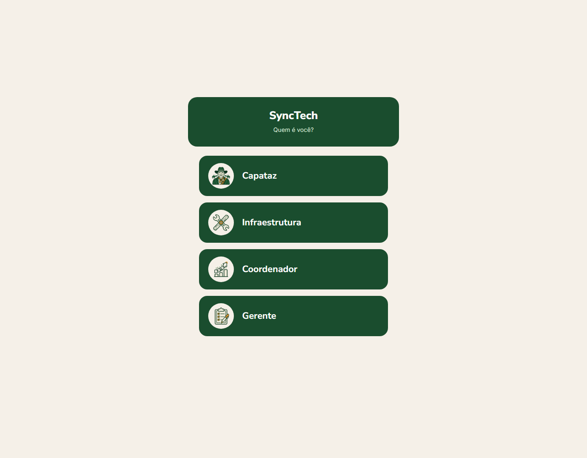
  <p>Fonte: Próprios autores (2026).</p>
</center>

- **Tela de seleção de retiro** — exibida após o Capataz selecionar seu perfil, apresenta a lista dos 15 retiros reais da BrPec (Acurizal, Aroeira, Baia Bonita, Bodoquena 1, Bodoquena 2, Boqueirão, Caieira, CMB, Confinamento, Cristo, Morada Nova, Morro Azul, Puga, São Miguel e Vista Alegre) com busca por nome, permitindo navegação rápida mesmo em dispositivos com tela reduzida.

<center>
  <p><strong>Figura 25b</strong> — Primeira versão: Tela de Seleção de Retiro (Real)</p>
  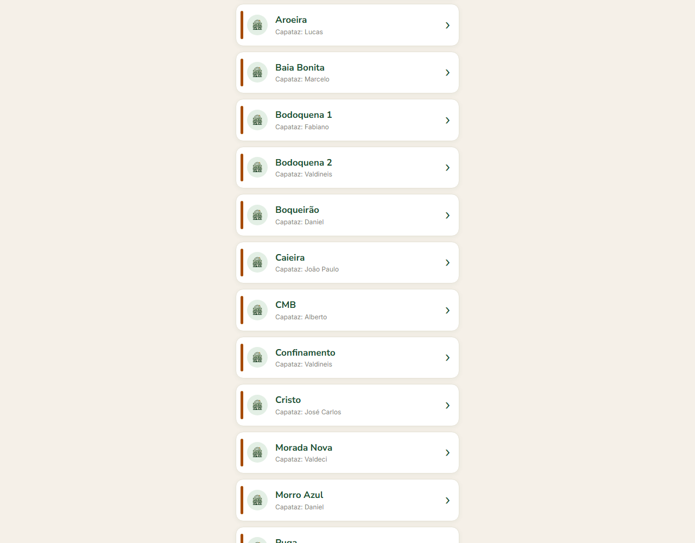
  <p>Fonte: Próprios autores (2026).</p>
</center>

- **Tela de lista de tarefas (US02)** — exibe as tarefas do dia com cards contendo barra lateral colorida por status (âmbar para "Em andamento", verde para "Pendente"), filtros por tipo ("Todos" / "Rebanhos") e botão "Nova O.S." para criação rápida.

<center>
  <p><strong>Figura 26</strong> — Primeira versão: Tela de Lista de Tarefas do Capataz (Real)</p>
  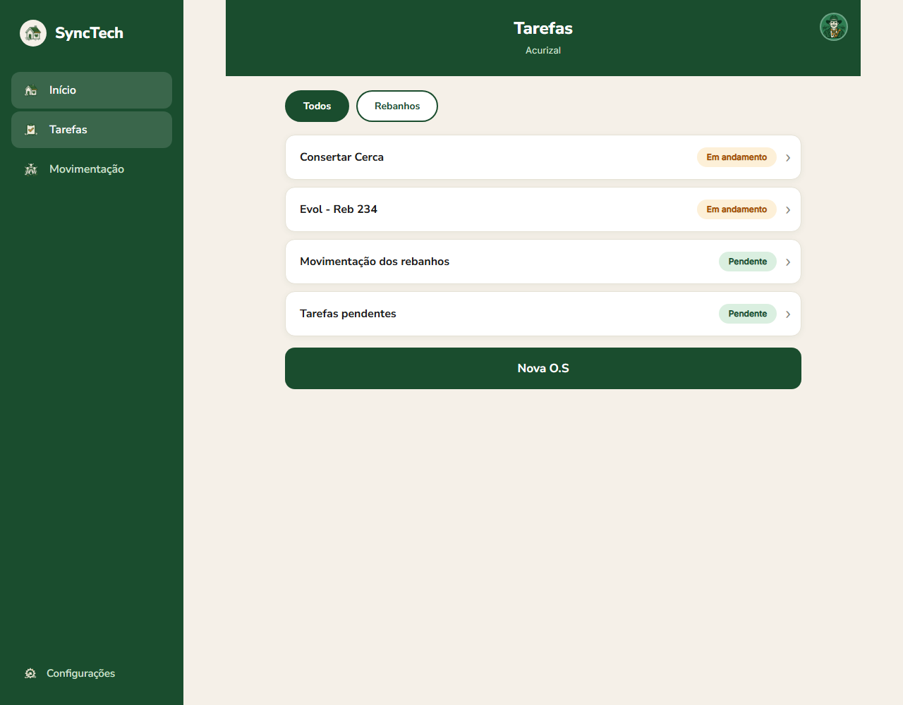
  <p>Fonte: Próprios autores (2026).</p>
</center>

- **Tela de detalhe da tarefa (US02)** — apresenta título, badge de status, descrição textual, player de áudio para instruções gravadas pelo Gerente e placeholder para foto de referência, com botão "Iniciar Tarefa" em largura total.

<center>
  <p><strong>Figura 27</strong> — Primeira versão: Tela de Detalhe da Tarefa do Capataz (Real)</p>
  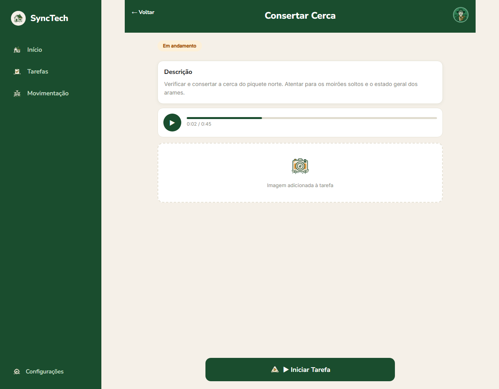
  <p>Fonte: Próprios autores (2026).</p>
</center>

- **Tela de concluir tarefa (US03/US04/US05)** — formulário de conclusão com campos para foto da conclusão, observações em texto e registro de áudio, com botões "Tirar Foto" e "Salvar" na base.

<center>
  <p><strong>Figura 28</strong> — Primeira versão: Tela de Concluir Tarefa do Capataz (Real)</p>
  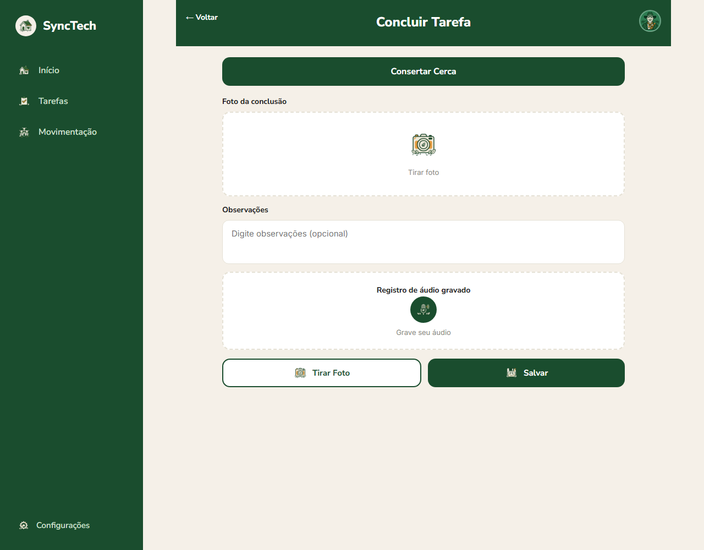
  <p>Fonte: Próprios autores (2026).</p>
</center>

**Fluxo de Movimentação do Rebanho (US08/US09):**

- **Tela de nova boleta** — formulário completo de movimentação de animais com seleção de tipo de operação (Movimentação, Nascimento, Morte), seleção de retiros de origem e destino, contagem categorizada de animais por sexo e faixa etária (7 categorias de machos e 5 de fêmeas, conforme planilha real da BrPec) com steppers para incremento/decremento, total geral calculado automaticamente e campo de observações.

<center>
  <p><strong>Figura 28a</strong> — Primeira versão: Tela de Nova Boleta de Movimentação (Real)</p>
  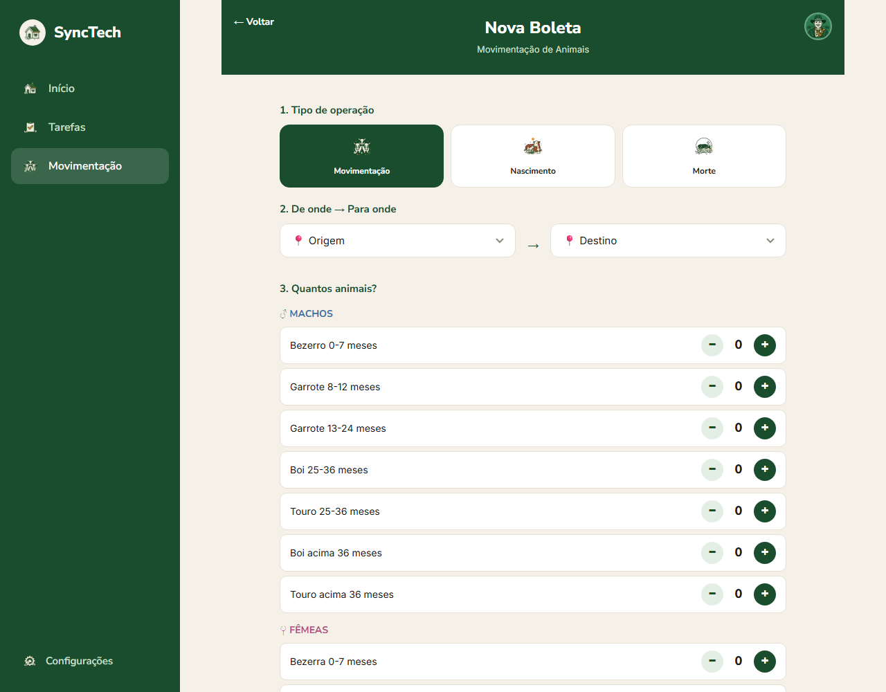
  <p>Fonte: Próprios autores (2026).</p>
</center>

- **Tela de registrar nascimento** — formulário simplificado para registro de nascimentos com data automática, seleção de retiro, categoria (Bezerro/Bezerra), stepper de quantidade e campo de foto opcional.

<center>
  <p><strong>Figura 28b</strong> — Primeira versão: Tela de Registrar Nascimento (Real)</p>
  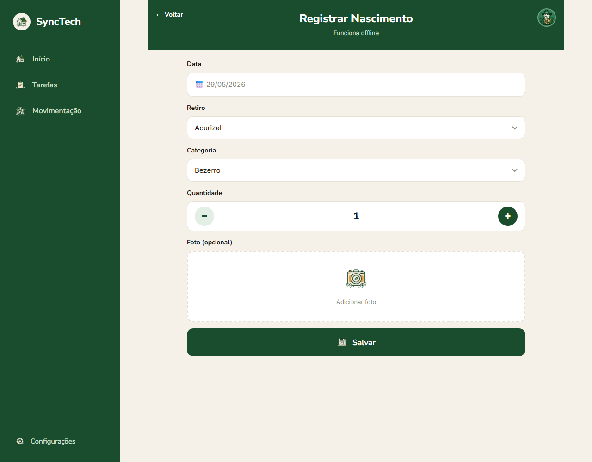
  <p>Fonte: Próprios autores (2026).</p>
</center>

- **Tela de registrar óbito (RF013)** — formulário com campos obrigatórios sinalizados visualmente (asterisco vermelho e borda vermelha): data, retiro, identificação do animal, categoria, causa da morte (14 causas cadastradas: Acidente, Atolado, Cobra, Deficiência nutricional, etc.), quantidade e foto obrigatória.

<center>
  <p><strong>Figura 28c</strong> — Primeira versão: Tela de Registrar Óbito (Real)</p>
  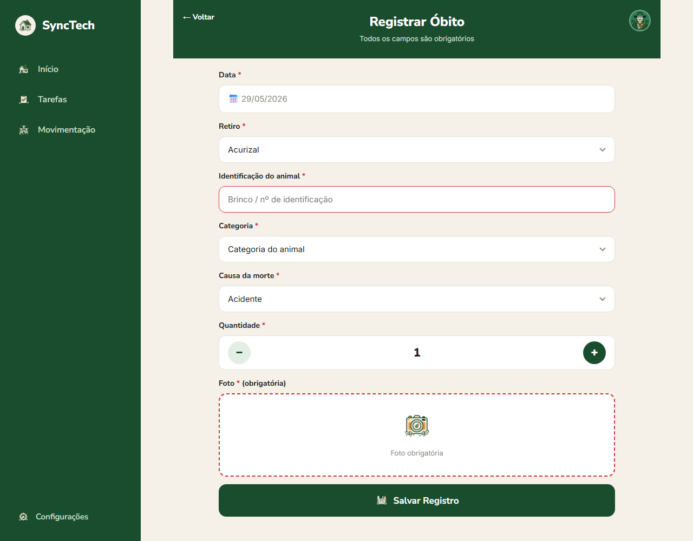
  <p>Fonte: Próprios autores (2026).</p>
</center>

**Fluxo de Infraestrutura (US06/US07):**

- **Painel de infraestrutura** — interface de gestão de chamados com filtros por categoria (Hidráulica, Cerca, Elétrica), cards de contadores por status (Abertos: 12, Em andamento: 5, Fechados: 28) e botão "+ Nova O.S.".

<center>
  <p><strong>Figura 29</strong> — Primeira versão: Painel de Infraestrutura (Real)</p>
  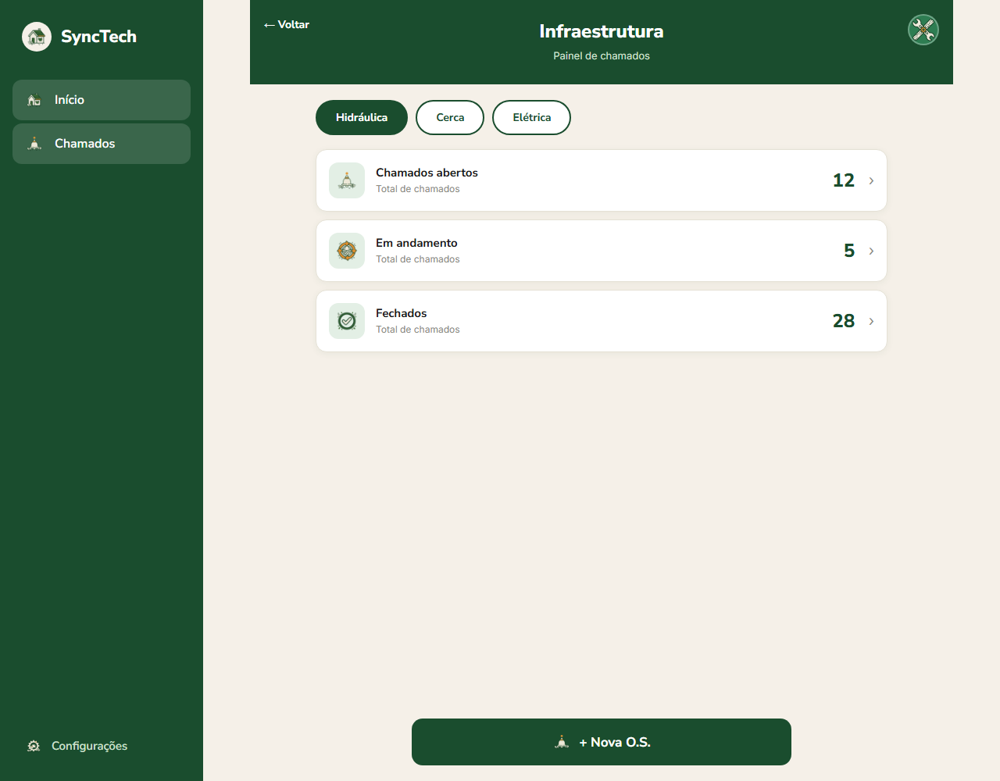
  <p>Fonte: Próprios autores (2026).</p>
</center>

- **Tela de resolver chamado** — formulário de registro de resolução com card de identificação do chamado, campo de descrição com contador de caracteres (0/500), área de anexo de foto com especificação de formatos aceitos, botão "Salvar Resolução" e histórico do chamado em timeline com três etapas (Aberto → Em andamento → Resolvido) incluindo datas e descrições.

<center>
  <p><strong>Figura 30</strong> — Primeira versão: Tela de Registrar Resolução de Chamado (Real)</p>
  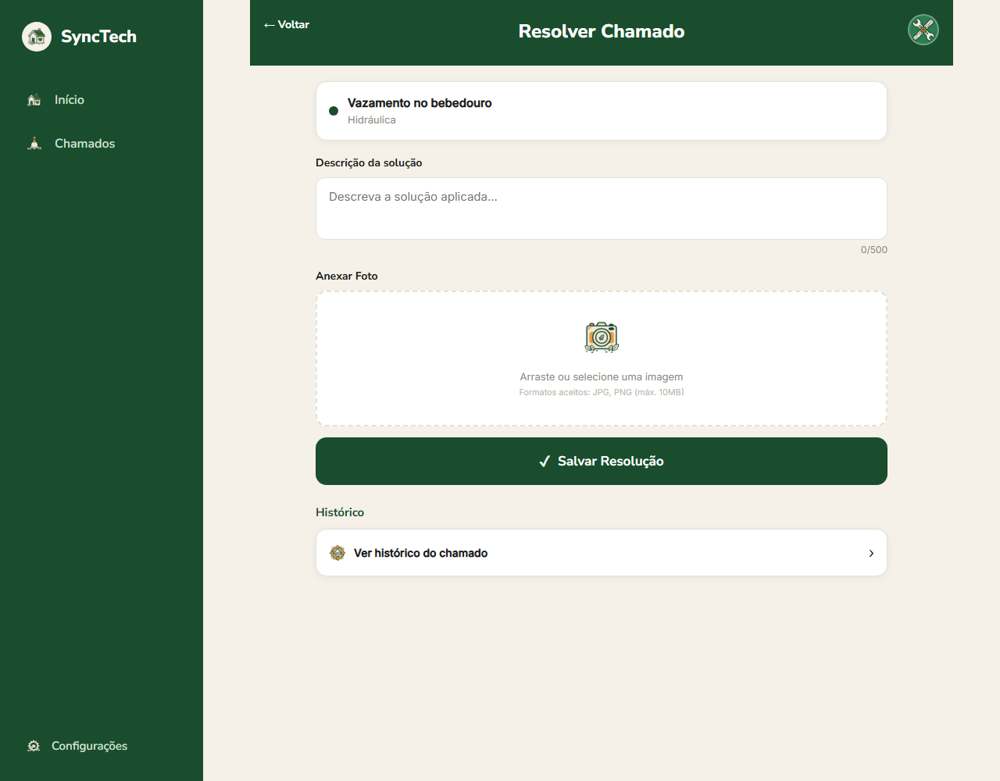
  <p>Fonte: Próprios autores (2026).</p>
</center>

**Fluxo do Gerente (US01/US07):**

- **Dashboard** — painel consolidado com filtros de retiro e data, gráfico de barras "Chamados por retiro", card "Evolução das demandas" com indicador percentual (75%), gráfico de rosca "Tarefas por status" com legenda colorida, e cards numéricos para "Alertas em aberto" e "Prioridades".

<center>
  <p><strong>Figura 31</strong> — Primeira versão: Dashboard do Gerente e Coordenador (Real)</p>
  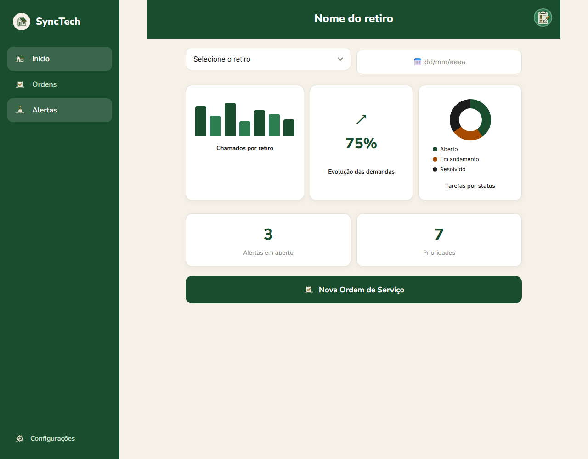
  <p>Fonte: Próprios autores (2026).</p>
</center>

- **Tela de nova O.S. (US01)** — formulário completo de criação de Ordem de Serviço com seletor de equipe (Capataz/Infra), campos de seleção de operação, título, retiro de origem, destino opcional, responsável, descrição, prazo, indicadores de prioridade (alta/média/baixa) com dots coloridos, e cards de áudio e foto para complementar instruções.

<center>
  <p><strong>Figura 32</strong> — Primeira versão: Tela de Nova Ordem de Serviço do Gerente (Real)</p>
  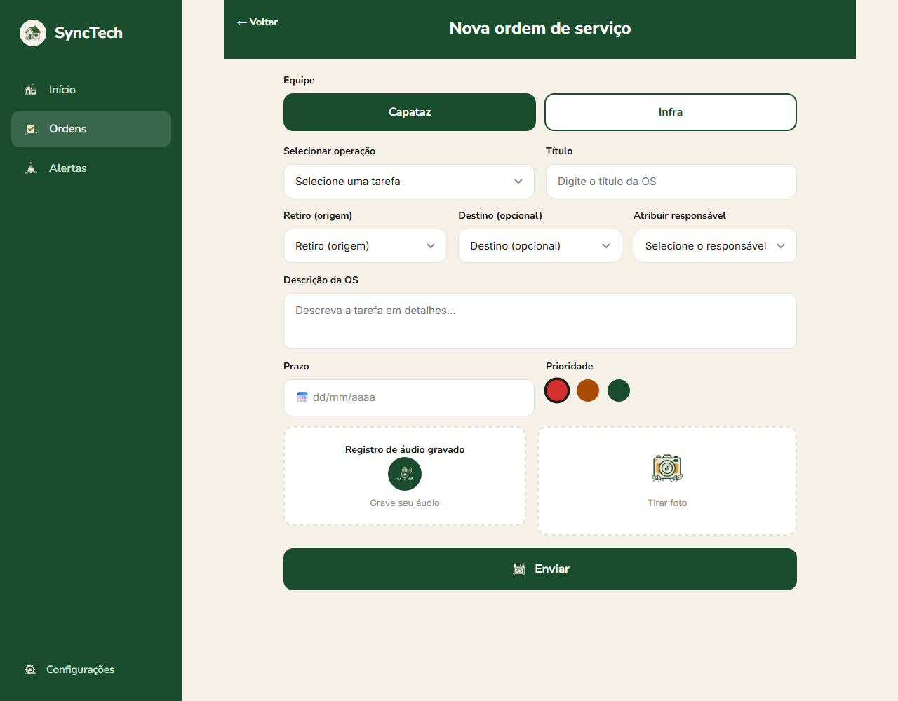
  <p>Fonte: Próprios autores (2026).</p>
</center>

**Fluxo do Coordenador (US11/US12):**

- **Tela de boletas** — lista de boletas com sub-navegação (Painel/Boletas), cards com título e metadados (data, capataz, quantidade de animais) e botão de download individual.

<center>
  <p><strong>Figura 33</strong> — Primeira versão: Tela de Lista de Boletas do Coordenador (Real)</p>
  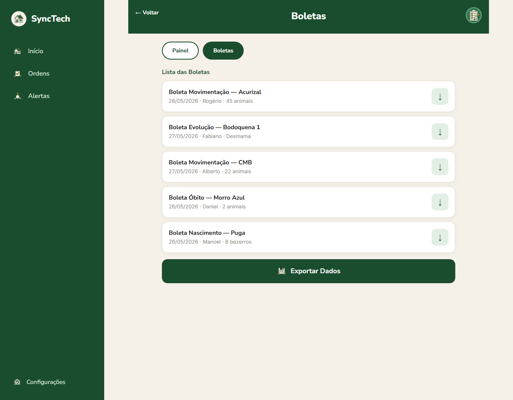
  <p>Fonte: Próprios autores (2026).</p>
</center>

- **Tela de exportação (US12)** — formulário de exportação com seleção de período (De/Até), checkboxes para tipos de dados (Movimentações, Nascimentos, Óbitos, Tarefas), seleção de formato (CSV/Excel) e botão "Exportar".

<center>
  <p><strong>Figura 33a</strong> — Primeira versão: Tela de Exportação de Dados (Real)</p>
  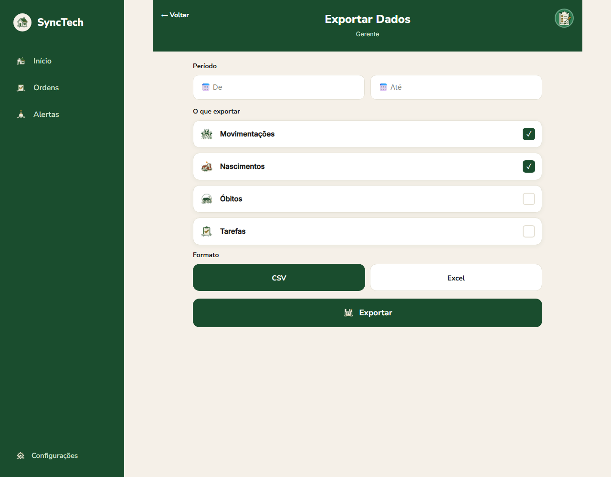
  <p>Fonte: Próprios autores (2026).</p>
</center>

- **Tela de evolução de rebanho** — formulário para registro de reclassificação de animais com seleção de retiro, tipo de classificação (Desmama/Evolução/Classificação), cards de "DE (origem)" e "PARA (nova categoria)" com seletores de categoria e faixa etária, stepper de quantidade e observações.

<center>
  <p><strong>Figura 33b</strong> — Primeira versão: Tela de Evolução de Rebanho (Real)</p>
  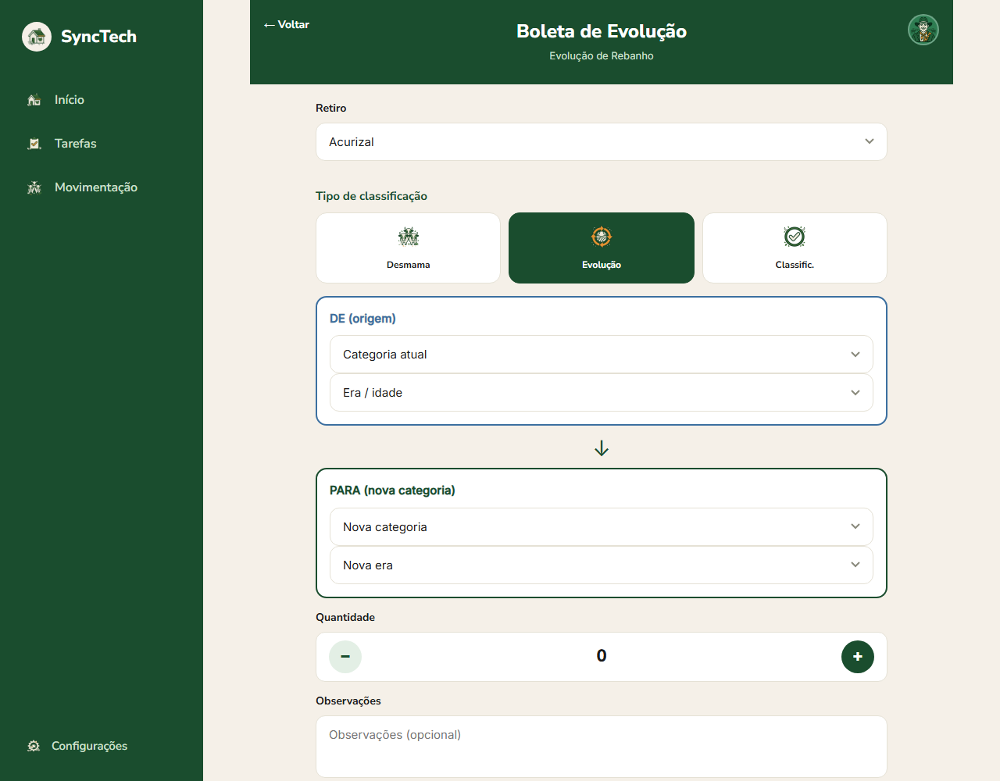
  <p>Fonte: Próprios autores (2026).</p>
</center>

**Elementos transversais:**

- **Sidebar desktop** — navegação lateral adaptada por perfil, com ícones e labels de navegação, exibida automaticamente após login.
- **Bottom navigation mobile** — barra inferior com ícones para Início, Tarefas, Rebanhos e Configurações.
- **Tela de sucesso** — feedback visual de confirmação com ícone de check, mensagem "Salvo com sucesso!" e badge offline "1 registro na fila", simulando o comportamento esperado do modo offline-first.

<center>
  <p><strong>Figura 33c</strong> — Primeira versão: Tela de Confirmação de Sucesso / Modo Offline (Real)</p>
  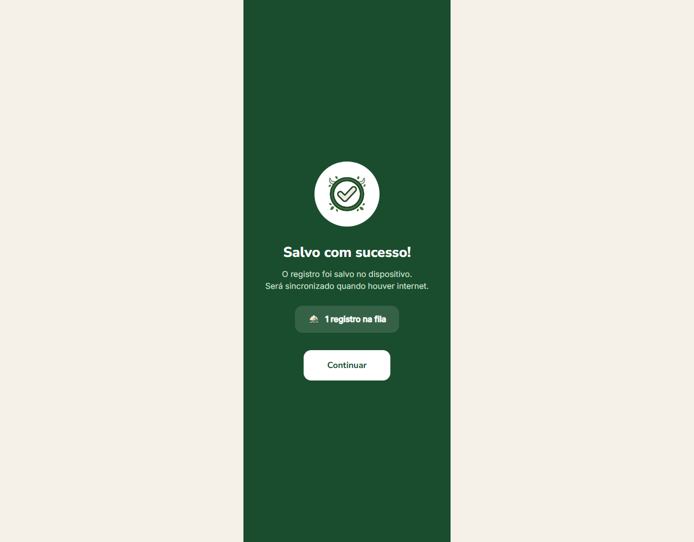
  <p>Fonte: Próprios autores (2026).</p>
</center>

#### Backend — Arquitetura em Camadas Completa

O backend foi implementado em TypeScript com Node.js e Express, seguindo rigorosamente a arquitetura em camadas Controller–Service–Repository documentada na seção 3.2.4. A estrutura de pastas é:

```
src/backend/
├── config/          # Configuração do banco (database.ts, initDb.ts)
├── controllers/     # 7 controllers implementados
├── services/        # 7 services implementados
├── repositories/    # 8 repositories implementados
├── models/          # 7 models implementados
├── routes/          # 7 arquivos de rotas + index.ts
├── database/        # migration.sql com DDL completo
├── tests/           # 2 suítes de testes automatizados
└── __tests__/       # Testes de endpoints
```

**Estado atual de cada camada:**

<center>
  <p><strong>Tabela 20</strong> — Estado da implementação das camadas arquiteturais (sprint 3)</p>
</center>

| Camada | Arquivos implementados | Status |
| --- | --- | --- |
| Routes | `index.ts`, `tarefaRoutes.ts`, `alertaRoutes.ts`, `eventoRoutes.ts`, `exportacaoRoutes.ts`, `painelRoutes.ts`, `sincronizacaoRoutes.ts` | ✅ Implementada |
| Controllers | `tarefaController.ts`, `alertaController.ts`, `eventoController.ts`, `exportacaoController.ts`, `healthController.ts`, `painelController.ts`, `sincronizacaoController.ts` | ✅ Implementada |
| Services | `tarefaService.ts`, `alertaService.ts`, `eventoService.ts`, `exportacaoService.ts`, `healthService.ts`, `painelService.ts`, `sincronizacaoService.ts` | ✅ Implementada |
| Repositories | `tarefaRepository.ts`, `alertaRepository.ts`, `eventoRepository.ts`, `exportacaoRepository.ts`, `healthRepository.ts`, `painelRepository.ts`, `sincronizacaoRepository.ts`, `usuarioRepository.ts` | ✅ Implementada |
| Models | `Tarefa.ts`, `Alerta.ts`, `Movimentacao.ts`, `Evidencia.ts`, `Retiro.ts`, `Sincronizacao.ts`, `Usuario.ts` | ✅ Implementada |
| Database | `migration.sql` com DDL completo (11 tabelas) | ✅ Implementada |
| Testes | `uc01-planejar-tarefas.test.ts` (14 casos), `outros-endpoints.test.ts` (5 casos) | ✅ 19/19 passando |

<center>
  <p>Fonte: Próprios autores (2026).</p>
</center>

Os endpoints implementados e testados cobrem os fluxos críticos da sprint 3:
- `GET /api/health` — monitoramento do servidor e banco
- `POST /api/tarefas` — criação de tarefas (UC01/RF001) com validação de RN01
- `GET /api/tarefas/hoje` — busca de tarefas do dia por capataz (RF002/RN02/RN05)
- `PATCH /api/tarefas/:id/concluir` — conclusão de tarefa pelo capataz
- `POST /api/tarefas/:id/evidencias` — anexar evidências (foto/áudio/texto)
- `POST /api/chamados` — criar alertas de infraestrutura com GPS (RF006)
- `POST /api/eventos-zootecnicos/nascimentos` — registrar nascimento (RF008)
- `GET /api/exportacao/csv` — exportação de dados em CSV (RF015)
- `POST /api/sync/lote` — sincronização em lote

#### Testes Automatizados

A suíte de testes automatizados utiliza Jest 29 + ts-jest + Supertest sobre banco SQLite em memória. Todos os 19 casos de teste foram executados e aprovados com sucesso, validando contratos HTTP, regras de negócio (RN01, RN05) e persistência no banco local. A evidência de execução está registrada em `documentos/assets/jest.png`.

<center>
  <p><strong>Figura 34</strong> — Resultado da execução dos testes automatizados (19/19 passando)</p>
  
  <p>Fonte: Próprios autores (2026).</p>
</center>

### (b) O que não foi concluído

1. **Integração frontend ↔ backend:** O frontend opera com dados estáticos (mock data hardcoded em `js/app.js`) e ainda não consome a API REST do backend. Os dados dos retiros, tarefas e categorias estão duplicados entre o frontend e o backend. A integração será priorizada na sprint 4.

2. **Funcionalidade offline-first (Service Workers):** Embora a tela de sucesso simule o comportamento offline ("1 registro na fila"), os Service Workers e o armazenamento local (IndexedDB/SQLite no cliente) ainda não foram implementados. O fluxo de sincronização existe apenas no backend (`sincronizacaoService.ts` e `sync_queue`).

3. **Autenticação e autorização:** O sistema opera sem autenticação. A identificação do usuário é feita por passagem explícita de IDs nas requisições, conforme decisão documentada na seção 3.7. A implementação de sessão e controle de acesso por perfil está planejada para a sprint 5.

4. **Upload real de mídias:** Os campos de foto e áudio exibem placeholders visuais, mas não capturam nem armazenam arquivos reais. A integração com câmera e microfone do dispositivo será implementada nas sprints seguintes.

5. **Gráficos dinâmicos no dashboard:** Os gráficos de barras e rosca no dashboard são renderizados com CSS estático, sem biblioteca de charts e sem dados reais do banco.

### (c) Dificuldades técnicas enfrentadas

1. **Compatibilidade do SQLite com Node.js nativo:** A utilização do módulo `node:sqlite` nativo exigiu atenção à versão do Node.js (≥ 22.5) e ao modo de execução síncrona para testes em memória. A equipe optou por banco em memória (`:memory:`) nos testes para garantir isolamento completo entre suítes.

2. **Design responsivo mobile-first:** A implementação do CSS responsivo demandou ajustes extensivos para garantir que todos os elementos de interação (botões ≥ 56px, ícones ≥ 24px) mantivessem usabilidade em telas de 5" a 12", conforme o requisito não funcional REST (seção 3.1.3). O contraste AAA (7:1) sob luz solar foi validado manualmente para todas as combinações de cor da paleta.

3. **Navegação SPA sem framework:** A decisão de implementar o roteamento via JavaScript puro (função `go()` com renderização dinâmica de HTML) simplificou a dependência de ferramentas, mas exigiu cuidado extra com a gestão de estado global e a reconstrução do DOM a cada navegação.

4. **Validação de regras de negócio nos testes:** A implementação do teste de RN01 (capataz deve pertencer ao retiro da tarefa) exigiu seed cuidadoso de dados de teste, com inserção controlada de retiros e usuários no `beforeEach` para garantir determinismo nos cenários de sucesso e falha.

### Próximos passos (sprint 4)

- Integrar frontend com backend via chamadas `fetch()` à API REST
- Implementar Service Workers para funcionamento offline-first
- Conectar formulários de boleta ao endpoint `POST /api/eventos-zootecnicos`
- Substituir dados mock por dados reais do banco via API
- Implementar captura de foto via câmera do dispositivo
- Adicionar biblioteca de gráficos ao dashboard (Chart.js ou similar)
- Expandir suíte de testes para cobrir US09 (óbito) e US12 (exportação)

## 4.2. Segunda versão da aplicação web (sprint 4)

_Descreva e ilustre aqui o desenvolvimento da segunda versão do sistema web, com foco no que foi consolidado entre a primeira versão funcional e o sistema operacional integrado. Utilize prints de tela para ilustrar. Indique obrigatoriamente: (a) o que foi implementado, (b) o que não foi concluído, (c) dificuldades técnicas enfrentadas e próximos passos._

## 4.3. Versão final da aplicação web (sprint 5)

_Descreva e ilustre aqui o desenvolvimento da versão final do sistema web, com foco em refatorações, correções finais e na camada de autenticação/autorização entregue. Utilize prints de tela para ilustrar. Indique obrigatoriamente: (a) o que foi refinado ou adicionado desde a sprint 4, (b) pendências remanescentes, (c) dificuldades técnicas enfrentadas._

# <a name="c5"></a>5. Testes

## 5.1. Relatório de testes de integração de endpoints automatizados (sprint 4)

A suite de testes automatizados cobre integralmente os endpoints operacionais do BrPec Agropecuária, utilizando **Jest 29 + ts-jest + Supertest** sobre banco de dados SQLite em memória (`:memory:`). Foram criadas duas suites de testes, totalizando **19 casos** de teste que validam a integridade de contratos HTTP, regras de negócio e persistência no banco local.

### 5.1.1. Estratégia de Testes

- **Isolamento de Banco**: Cada suíte inicia uma conexão síncrona exclusiva com um banco SQLite em memória (`DB_PATH=':memory:'`).
- **Schema e Seed**: `beforeAll` executa `inicializarBanco()` para ler e aplicar as migrações SQL. A semente de retiros e usuários é limpa e reinserida no `beforeEach`.
- **Efeito Colateral**: Toda inserção, atualização ou remoção é validada tanto no retorno da requisição HTTP (Supertest) quanto via consulta direta ao banco pelo objeto `db`.

### 5.1.2. Classificação por Abordagem

- **Black-box**: Testes focados na interface pública HTTP — códigos de status, shape do JSON de resposta, validação de tipos de dados e tratamento correto de erros sem acessar a lógica interna.
- **White-box**: Validação de regras internas, como transações de banco complexas no registro de nascimento, consistência de FKs em cascata e interceptação de erros no repositório.

### 5.1.3. Matriz de Cobertura de Testes

#### Suite 1 — `tests/uc01-planejar-tarefas.test.ts` (14 casos)
- **Criar Tarefas (C1-C4)**: Criação válida (201), violação de `RN01` (422), payload incompleto (400), persistência direta no SQLite (SELECT).
- **Buscar Tarefas Hoje (H1-H3)**: Busca com sucesso (200), array vazio para capataz sem tarefas (200), erro por falta de `capataz_id` (400).
- **Concluir Tarefa (K1-K3)**: Conclusão válida (200), erro ao tentar concluir tarefa de outro capataz (404), persistência da data de conclusão.
- **Anexar Evidência (E1-E4)**: Anexar foto base64 (201), erro de `RN05` por tarefa de outro capataz (404), erro por falta de arquivo (400), persistência de texto como evidência (201).

#### Suite 2 — `tests/outros-endpoints.test.ts` (5 casos)
- **Health-check (H1)**: Resposta 200 OK informando status geral "ok" e conectividade "conectado" com o banco SQLite.
- **Alertas de Infraestrutura (A1-A2)**: Registro de chamado com sucesso (201, status ABERTO), erro por falta de geolocalização latitude/longitude (400).
- **Eventos Zootécnicos (E1-E2)**: Registro de nascimento animal com transação síncrona bem-sucedida (201), erro por falta de quantidade ou categoria (400).

### 5.1.4. Resumo e Resultados

Toda a suíte foi executada e aprovada com sucesso. Detalhes completos das evidências visuais e logs do terminal podem ser encontrados no relatório técnico de [jest-testes-endpoints.md](evidencias/jest-testes-endpoints.md).

```bash
PASS tests/outros-endpoints.test.ts
  H — GET /api/health (Health check)
    ✓ H1. Sucesso — retorna status 200 com informações de saúde do servidor e banco (26 ms)
  A — POST /api/chamados (Criar Alerta)
    ✓ A1. Sucesso — cria alerta com dados válidos e retorna HTTP 201 (13 ms)
    ✓ A2. Payload inválido — campos obrigatórios ausentes retorna HTTP 400 (5 ms)
  E — POST /api/eventos-zootecnicos/nascimentos (Registrar Nascimento)
    ✓ E1. Sucesso — registra nascimento animal com sucesso e retorna HTTP 201 (5 ms)
    ✓ E2. Payload inválido — campos obrigatórios ausentes retorna HTTP 400 (6 ms)

PASS tests/uc01-planejar-tarefas.test.ts
  C — POST /api/tarefas (criar tarefa — UC01 / RF001)
    ✓ C1. Sucesso — cria tarefa com dados válidos e retorna HTTP 201 (23 ms)
    ✓ C2. Regra de negócio (RN01) — capataz não pertence ao retiro retorna HTTP 422 (5 ms)
    ...
Test Suites: 2 passed, 2 total
Tests:       19 passed, 19 total
Snapshots:   0 total
Time:        1.373 s
Ran all test suites.
```

## 5.2. Testes de usabilidade (sprint 5)

### 5.2.1. Relatório de testes de guerrilha

_Posicione aqui as tabelas com enunciados de tarefas, etapas e resultados de testes de usabilidade. Ou utilize um link para seu relatório de testes (mantenha o link sempre público para visualização)._

### 5.2.2. Relatório de testes SUS (System Usability Scale)

_Posicione aqui o relatório dos testes SUS realizados._

# <a name="c6"></a>6. Estudo de Mercado e Plano de Marketing (sprint 4)

## 6.1 Resumo Executivo

O Brasil é o maior exportador mundial de carne bovina, com receita de exportação de
US$ 18,03 bilhões em 2025 [38] e crescente pressão por rastreabilidade de
origem nos principais mercados internacionais. Apesar dessa escala, a gestão operacional
de grande parte das fazendas ainda depende de registros manuais em papel um gargalo
que compromete a qualidade das informações e a velocidade das decisões.

É nesse contexto que se insere a solução desenvolvida para a BrPec Agropecuária S.A.,
empresa com 14 retiros operacionais no Pantanal sul-mato-grossense. A região concentra
64,5% do bioma pantaneiro no Mato Grosso do Sul [43], onde propriedades são
extensas e retiros estão geograficamente dispersos, sem acesso a telecomunicações
convencionais. O fluxo de informações entre o campo e o escritório ocorre por meio de
boletas físicas preenchidas pelos capatazes, redigitadas manualmente em planilhas na
sede. Esse processo gera inconsistências nos registros, atrasos de horas ou dias no
repasse de informações críticas — como mortes de animais — e retrabalho constante para
a equipe de coordenação.

A aplicação web progressiva (PWA) desenvolvida digitaliza o registro das movimentações
do rebanho — nascimentos, mortes, compras, vendas e transferências entre retiros —,
com funcionamento offline nativo. Para isso, adota SQLite como banco de dados local
no dispositivo, desvinculando o registro de dados da disponibilidade de rede. Os dados
são sincronizados automaticamente com o servidor durante as janelas de conectividade
via Starlink, eliminando a dependência de conexão contínua como pré-requisito
operacional.

Os principais diferenciais competitivos da solução são: interface adaptada ao perfil
de baixa escolaridade digital dos capatazes, operação offline nativa via SQLite,
eliminação da etapa de redigitação e rastreabilidade completa das movimentações em
tempo real.

O objetivo estratégico do projeto é reduzir erros operacionais, aumentar a velocidade
de atualização das informações e dar aos gestores uma visão confiável e atualizada das
operações de campo — tornando a BrPec mais competitiva em um setor que avança
rapidamente em direção à digitalização e à rastreabilidade compulsória [41].


## 6.2 Análise de Mercado

_a) Visão Geral do Setor_

O Brasil ocupa posição de destaque na pecuária bovina mundial. Em 2024, o rebanho 
nacional atingiu 238,2 milhões de cabeças, segundo a Pesquisa da Pecuária Municipal 
do IBGE — segundo maior da série histórica, superando em 12% a própria população 
brasileira [36]. No mesmo ano, o abate chegou ao recorde de 39,7 milhões de 
cabeças, com produção de 10,2 milhões de toneladas em equivalente carcaça, conforme 
dados do Ministério da Agricultura e Pecuária [37]. 

No plano das exportações, o setor registrou em 2024 o envio de 2,87 milhões de 
toneladas de carne bovina, crescimento de 25,5% em relação ao ano anterior, gerando 
receita de US$ 12,83 bilhões [37]. Em 2025, os resultados superaram esses 
números: foram exportadas 3,50 milhões de toneladas, alta de 20,9%, com receita de 
US$ 18,03 bilhões — o maior desempenho já registrado na série histórica, segundo a 
Associação Brasileira das Indústrias Exportadoras de Carnes [38]. Com isso, 
o Brasil consolidou-se em 2025 como o maior produtor mundial de carne bovina, 
ultrapassando os Estados Unidos pela primeira vez [36].

Do ponto de vista regulatório, o regulamento antidesmatamento da União Europeia, 
previsto para entrar em vigor a partir de 2026, aumenta as exigências de rastreabilidade 
e comprovação de origem para acesso a mercados externos. Esse cenário reforça a 
necessidade de digitalização das operações de campo, tornando soluções como a 
desenvolvida para a BrPec diretamente alinhadas às demandas do setor.

_b) Tamanho e Crescimento do Mercado_

O rebanho bovino brasileiro encerrou 2024 com 238,2 milhões de cabeças, segundo a
Pesquisa da Pecuária Municipal do IBGE — o segundo maior da série histórica iniciada
em 1974 (IBGE, 2025). O volume de abate acompanhou essa escala: foram 39,27 milhões
de cabeças abatidas em 2024, alta de 15,2% em relação ao ano anterior, com produção
de 10,2 milhões de toneladas de carne em equivalente carcaça [39] [42].
Em 2025, o crescimento continuou: somente no primeiro trimestre foram abatidas
9,87 milhões de cabeças, recorde histórico para o período, com alta de 5,5% sobre
igual trimestre de 2024 [40].

A tabela abaixo resume a evolução do abate nos últimos anos [39]:

| Ano  | Cabeças abatidas (milhões) | Variação anual |
|------|---------------------------|----------------|
| 2022 | ~27,6                     | —              |
| 2023 | ~34,1                     | +23,5%         |
| 2024 | 39,27                     | +15,2%         |
| 2025 (projeção) | ~42,5            | +8,2%          |

No plano das exportações, o Brasil embarcou 2,87 milhões de toneladas em 2024
(+25,5% vs. 2023), gerando US$ 12,83 bilhões em receita (MAPA, 2024). Em 2025,
esses números foram superados: 3,50 milhões de toneladas exportadas (+20,9%),
com receita de US$ 18,03 bilhões (+40,1%), consolidando o país como maior
exportador mundial de carne bovina (ABIEC, 2026). Para 2026, a ABIEC projeta
crescimento adicional de 12% nas exportações totais [38].

| Ano  | Volume exportado (milhões de ton.) | Receita (US$ bilhões) | Variação receita |
|------|------------------------------------|-----------------------|-----------------|
| 2023 | 2,29                               | 10,54                 | —               |
| 2024 | 2,87                               | 12,83                 | +21,7%          |
| 2025 | 3,50                               | 18,03                 | +40,1%          |
| 2026 | ~3,92 (proj.)                      | ~20,5 (proj.)         | ~+12%           |


Além do crescimento em volume, o setor enfrenta uma pressão crescente por
rastreabilidade. O Regulamento Europeu Antidesmatamento (EUDR) exige que produtos
bovinos exportados à União Europeia comprovem origem livre de desmatamento,
prazo previsto para o segundo semestre de 2026 (EUDR, 2023). No plano doméstico,
o Plano Nacional de Identificação de Bovinos (PNIB) estabelece como meta a
rastreabilidade individual de todo o rebanho nacional até 2032 [42].

Esse cenário abre mercado direto para soluções de gestão digital de campo: fazendas
que registram movimentações de rebanho de forma estruturada e rastreável passam a
ter vantagem competitiva concreta no acesso a mercados premium — exatamente o
problema que a solução desenvolvida para a BrPec endereça.


_c) Tendências de Mercado (até 300 palavras)_
_Identifique e analise tendências relevantes (tecnológicas, comportamentais e mercadológicas) que influenciam o setor. Utilize fontes confiáveis._

## 6.3 Análise da Concorrência

_a) Principais Concorrentes (até 250 palavras)_

O mercado de software para gestão pecuária no Brasil conta com soluções voltadas
principalmente para fazendas com infraestrutura tecnológica já estabelecida.

**iRancho** é um sistema ERP focado em pecuária de corte com aplicativo de campo
offline, integração com balanças e brincos eletrônicos e, desde 2026, um ecossistema
de IA por voz para registro sem digitação. Os planos são cobrados por faixa de rebanho, o que eleva o custo para operações de grande escala [44].

**JetBov** é um aplicativo de gestão de pasto com coleta offline de dados zootécnicos
e sincronização automática ao reconectar. Focado em indicadores de ganho de peso,
reprodução e controle de piquetes, seu perfil de usuário pressupõe familiaridade com
ambientes digitais [45].

**Aegro** é uma plataforma de gestão rural ampla, com suporte a múltiplas culturas e
pecuária, funcionalidade offline e integração contábil. Posicionado para produtores com
gestão financeira complexa, apresenta curva de aprendizado mais longa [46].

Nenhuma das soluções comerciais identificadas foi projetada para o modelo operacional
de retiros geograficamente dispersos, com usuários de baixa escolaridade digital e
conectividade dependente de janelas fixas de Starlink. 

_b) Vantagens Competitivas da Aplicação Web (até 250 palavras)_

A solução desenvolvida para a BrPec se diferencia dos concorrentes por um conjunto de
características construídas especificamente para o contexto operacional da empresa.

O primeiro diferencial é a **interface adaptada ao perfil dos usuários**. Enquanto os
sistemas concorrentes pressupõem familiaridade com ambientes digitais, a aplicação foi
projetada para capatazes com baixa escolaridade digital, com fluxos simples, poucos
passos por tarefa e linguagem visual direta.

O segundo diferencial é o **offline nativo via SQLite**. Os dados são gravados
localmente no dispositivo durante o trabalho de campo e sincronizados automaticamente
com o servidor — via fila de sincronização (sync_queue) — nas janelas de conectividade
disponíveis. Não há dependência de conexão contínua em nenhuma etapa do registro.

O terceiro diferencial é a **aderência ao modelo de retiros**. A arquitetura da solução
foi construída sobre o fluxo real da BrPec: registro de nascimentos, mortes, compras,
vendas e transferências entre retiros, com rastreabilidade por unidade operacional.
Nenhum concorrente oferece essa estrutura de forma nativa.

O quarto diferencial é a **instalação via PWA**, sem necessidade de loja de aplicativos.
A solução é instalada diretamente pelo navegador nos dispositivos fornecidos pela BrPec,
eliminando barreiras de configuração e atualizações manuais.

Por fim, a solução não cobra licença por animal — modelo de precificação dos
concorrentes que penaliza operações de grande rebanho como a da BrPec.

## 6.4 Público-Alvo

_a) Segmentação de Mercado (até 250 palavras)_
Descreva os principais segmentos de mercado a serem atendidos pela aplicação. Utilize bases de dados e fontes confiáveis.\*

_b) Perfil do Público-Alvo (até 250 palavras)_
_Caracterize o público-alvo com dados demográficos, psicográficos e comportamentais, incluindo necessidades específicas. Utilize fontes obrigatórias._

## 6.5 Posicionamento

_a) Proposta de Valor Única (até 250 palavras)_
_Defina de maneira clara o que torna a sua aplicação única e valiosa para o mercado._

_b) Estratégia de Diferenciação (até 250 palavras)_
_Explique como sua aplicação se destacará da concorrência, evidenciando a lógica por trás do posicionamento._

## 6.6 Estratégia de Marketing

_a) Produto/Serviço (até 200 palavras)_
_Descreva as funcionalidades, benefícios e diferenciais da aplicação_

_b) Preço (até 200 palavras)_
_Explique o modelo de precificação adotado e justifique com base nas análises anteriores._

_c) Praça (Distribuição) (até 200 palavras)_
_Apresente os canais digitais utilizados para distribuir e entregar a aplicação ao público._

_d) Promoção (até 200 palavras)_
_Descreva as estratégias digitais planejadas, como SEO, redes sociais, marketing de conteúdo e campanhas pagas._

# <a name="c7"></a>7. Conclusões e trabalhos futuros (sprint 5)

_Escreva de que formas a solução da aplicação web atingiu os objetivos descritos na seção 2 deste documento. Indique pontos fortes e pontos a melhorar de maneira geral._

_Relacione os pontos de melhorias evidenciados nos testes com planos de ações para serem implementadas. O grupo não precisa implementá-las, pode deixar registrado aqui o plano para ações futuras_

_Relacione também quaisquer outras ideias que o grupo tenha para melhorias futuras_

# <a name="c8"></a>8. Referências (sprints 1 a 5)

[1] CEPEA. PIB do Agronegócio Brasileiro. Disponível em: https://www.cepea.esalq.usp.br. Acesso em: 29 abr. 2026.

[2] REVISTA DE GESTÃO E PROJETOS — GeP. Gestão de riscos em projetos: uma análise comparativa da norma ISO 31000 e o Guia PMBOK®, 2012. Revista de Gestão e Projetos — GeP, São Paulo, v. 4, n. 3, p. 46–72, set./dez. 2013. Disponível em: https://www.bibliotecadeseguranca.com.br/wp-content/uploads/2020/05/gerenciamento-de-riscos-em-projetos-uma-comparacao-entre-o-pmbok-e-a-iso-31000.pdf. Acesso em: 29 abr. 2026.

[3] PORTAL SALÁRIO. gerente de Produção e Operações Agropecuárias - Salário 2026, Piso Salarial. 2026. Disponível em: https://www.salario.com.br/profissao/gerente-de-producao-e-operacoes-agropecuarias-cbo-141115/. Acesso em: 28 abr. 2026.

[4] COSGROVE, J.; CACHIA, R. DigComp 3.0: European Digital Competence Framework. 5. ed. Luxembourg: Publications Office of the European Union, 2025. Disponível em: https://data.europa.eu/doi/10.2760/0001149. Acesso em: 28 abr. 2026.

[5] IPOG. Gestão do Agronegócio: como está o mercado de trabalho?. Disponível em: https://blog.ipog.edu.br/gestao-e-negocios/gestao-do-agronegocio/. [S.d.]. Acesso em: 28 abr. 2026.

[6] CONFEDERAÇÃO DA AGRICULTURA E PECUÁRIA DO BRASIL. Conheça as 4 carreiras mais quentes do agronegócio brasileiro. CNA Brasil, [S.d.]. Disponível em: https://www.cnabrasil.org.br/noticias/conheca-as-4-carreiras-mais-quentes-do-agronegocio-brasileiro. Acesso em: 28 abr. 2026.

[7] PORTAL SALÁRIO. capataz na Pecuária - Salário 2026, Piso Salarial. 2026. Disponível em: https://www.salario.com.br/profissao/capataz-na-pecuaria-cbo-620115/. Acesso em: 28 abr. 2026.

[8] BRASIL. Ministério do Trabalho e Emprego. Classificação Brasileira de Ocupações (CBO): capataz na Agropecuária - CBO 6210-05. [S.d.]. Disponível em: https://www.mtecbo.gov.br. Acesso em: 28 abr. 2026.

[9] MACHADO, João Guilherme de Camargo Ferraz; NANTES, José Flávio Diniz. Adoção da tecnologia da informação em organizações rurais: o caso da pecuária de corte. Gestão & Produção, São Carlos, v. 18, n. 3, p. 555-570, 2011. Disponível em: https://www.scielo.br/j/gp/a/cwVwLsPgq8FBq5kvgXZPpLQ/. Acesso em: 28 abr. 2026.

[10] LEACH, P. et al. RFC 9562: Universally Unique IDentifiers (UUID). Internet Engineering Task Force, 2024. Disponível em: https://www.rfc-editor.org/rfc/rfc9562. Acesso em: 07 mai. 2026.

[11] COOPER, Alan; REIMANN, Robert; CRONIN, David; NOESSEL, Christopher. About Face: The Essentials of Interaction Design. 4. ed. Indianapolis: John Wiley & Sons, 2014. ISBN 978-1-118-76657-6.

[12] COHN, Mike. User Stories Applied: For Agile Software Development. Boston: Addison-Wesley, 2004.

[13] CHEN, Peter Pin-Shan. The entity-relationship model: toward a unified view of data. ACM Transactions on Database Systems, v. 1, n. 1, p. 9–36, 1976.

[14] OBJECT MANAGEMENT GROUP. Unified Modeling Language Specification: Version 2.5.1. Needham, MA: OMG, 2017. Disponível em: https://www.omg.org/spec/UML/2.5.1. Acesso em: mai. 2026.

[15] FOWLER, Martin. UML Distilled: A Brief Guide to the Standard Object Modeling Language. 3. ed. Boston: Addison-Wesley Professional, 2004. 175 p. ISBN 978-0-321-19368-1.

[16] LARMAN, Craig. Applying UML and Patterns: An Introduction to Object-Oriented Analysis and Design and Iterative Development. 3. ed. Upper Saddle River: Prentice Hall, 2004. 736 p. ISBN 978-0-131-48906-6.

[17] INTERNATIONAL ORGANIZATION FOR STANDARDIZATION. ISO/IEC 19505-2:2012: Information technology — Object Management Group Unified Modeling Language (OMG UML) — Part 2: Superstructure. Genebra: ISO, 2012. Disponível em: https://www.iso.org/standard/52854.html. Acesso em: mai. 2026.

[18] PROJECT MANAGEMENT INSTITUTE. Um guia do conhecimento em gerenciamento de projetos (Guia PMBOK). 7. ed. Newtown Square: PMI, 2021. ISBN 978-1-62825-664-2.

[19] KOTLER, Philip; KELLER, Kevin Lane. Administração de marketing. 14. ed. São Paulo: Pearson Education do Brasil, 2012. ISBN 978-85-430-0199-4.

[20] PORTER, Michael E. Competitive Strategy: Techniques for Analyzing 
Industries and Competitors. New York: Free Press, 2008. ISBN 978-0-7432-7275-4.

[21] BOOCH, Grady; RUMBAUGH, James; JACOBSON, Ivar. The Unified Modeling Language User Guide. 2. ed. Boston: Addison-Wesley Professional, 2005. 494 p. ISBN 978-0-321-26797-9.

[22] NIELSEN NORMAN GROUP. Design Systems vs. Style Guides. 2024. Disponível em: https://www.nngroup.com/articles/design-systems-vs-style-guides/. Acesso em: 18 maio 2026.

[23] UXPIN. Design System vs. Pattern Library vs. Style Guide vs. Component Library. 2026. Disponível em: https://www.uxpin.com/studio/blog/design-systems-vs-pattern-libraries-vs-style-guides-whats-difference/. Acesso em: 18 maio 2026.

[24] W3C. WCAG 2.1 - Success Criterion 1.4.6: Contrast (Enhanced). Disponível em: https://www.w3.org/TR/WCAG21/#contrast-enhanced.

[25] ISO 9241-303:2011. Ergonomics of human-system interaction — Part 303: Requirements for electronic visual displays.

[26] IES. The Lighting Handbook (10th Ed.). Seções de visualização sob alta iluminância.

[27] SNAITH, M.; TORNQVIST, K. Situational Visual Impairment: Designing interfaces for outdoor and mobile usage. JMHCI, v. 12, 2020.

[28] BABICH, Nick. Principles of Typography in UI Design. UX Planet, 2016. Disponível em: https://uxplanet.org/principles-of-typography-in-ui-design-bc28f1f9666d. Acesso em: 19 maio 2026.

[29] GAMMA, Erich; HELM, Richard; JOHNSON, Ralph; VLISSIDES, John. Design Patterns: Elements of Reusable Object-Oriented Software. Boston: Addison-Wesley, 1994. ISBN 978-0-201-63361-0.

[30] MARTIN, Robert C. Clean Architecture: A Craftsman's Guide to Software Structure and Design. Boston: Prentice Hall, 2017. ISBN 978-0-134-49416-6.

[31] HOHPE, Gregor; WOOLF, Bobby. Enterprise Integration Patterns: Designing, Building, and Deploying Messaging Solutions. Boston: Addison-Wesley, 2003. ISBN 978-0-321-20068-6.

[32] FOWLER, Martin. Patterns of Enterprise Application Architecture. Boston: Addison-Wesley, 2002. ISBN 978-0-321-12742-6.

[33] EVANS, Eric. Domain-Driven Design: Tackling Complexity in the Heart of Software. Boston: Addison-Wesley, 2003. ISBN 978-0-321-12521-7.

[34] UX QUEST. Guia completo sobre paleta de cores para design de interface e UX. UX Quest, 2026. Disponível em: https://www.uxquest.com.br/blog/paleta-de-cores. Acesso em: 28 maio 2026.

[35] SUA IMPRENSA. Guia de estilo da marca: o que é, como fazer e elementos essenciais. Sua Imprensa, 2025. Disponível em: https://suaimprensa.com.br/blog/guia-de-estilo-da-marca/. Acesso em: 28 maio 2026.

[36] IBGE. Pesquisa da Pecuária Municipal 2024. Rio de Janeiro: IBGE, 2025. 
Disponível em: https://www.ibge.gov.br/estatisticas/economicas/agricultura-e-pecuaria/9107-producao-da-pecuaria-municipal.html. 
Acesso em: jun. 2026.

[37] MINISTÉRIO DA AGRICULTURA E PECUÁRIA. Produção e exportações de carne bovina 
2024. Brasília: MAPA/SCRI, 2024. Disponível em: https://www.gov.br/agricultura. 
Acesso em: jun. 2026.

[38] ABIEC. Brasil bate recorde nas exportações de carne bovina em 2025. São Paulo: 
ABIEC, 2026. Disponível em: https://abiec.com.br/brasil-bate-recorde-nas-exportacoes-de-carne-bovina-em-2025/. 
Acesso em: jun. 2026.

[39] IBGE. Estatísticas da Produção Pecuária — Resultados do 4º trimestre de 2024.
Rio de Janeiro: IBGE, 2025. Disponível em: https://agenciadenoticias.ibge.gov.br/agencia-noticias/2012-agencia-de-noticias/noticias/42899-abate-de-bovinos-atinge-recorde-em-2024.
Acesso em: jun. 2026.

[40] CONFEDERAÇÃO DA AGRICULTURA E PECUÁRIA DO BRASIL. Pesquisa Trimestral do
Abate, Leite e Ovos — 1º trimestre de 2025. Brasília: CNA, 2025. Disponível em:
https://www.cnabrasil.org.br. Acesso em: jun. 2026.

[41] UNIÃO EUROPEIA. Regulamento (UE) 2023/1115 — Regulamento Europeu
Antidesmatamento (EUDR). Bruxelas: Parlamento Europeu e Conselho da UE, 2023.
Disponível em: https://eur-lex.europa.eu. Acesso em: jun. 2026.

[42] MINISTÉRIO DA AGRICULTURA E PECUÁRIA. Plano Nacional de Identificação de
Bovinos e Búfalos (PNIB). Brasília: MAPA, 2024. Disponível em:
https://www.gov.br/agricultura. Acesso em: jun. 2026.

[43] MINISTÉRIO DA AGRICULTURA E PECUÁRIA. MAPA fortalece agropecuária pantaneira.
Brasília: MAPA, 2023. Disponível em: https://www.gov.br/agricultura/pt-br/assuntos/noticias/mapa-fortalece-agropecuaria-pantaneira.
Acesso em: jun. 2026.

[44] iRancho: https://www.irancho.com.br/perguntas-frequentes/ 

[45] JetBov: https://play.google.com/store/apps/details?id=com.ionicframework.jetbovapp459755

[46] Embrapa Gado de Corte: https://www.embrapa.br/en/gado-de-corte/tecnologias/gestao-da-pecuaria 

# <a name="c9"></a>Anexos

_Inclua aqui quaisquer complementos para seu projeto, como diagramas, imagens, tabelas etc. Organize em sub-tópicos utilizando headings menores (use ## ou ### para isso)_

