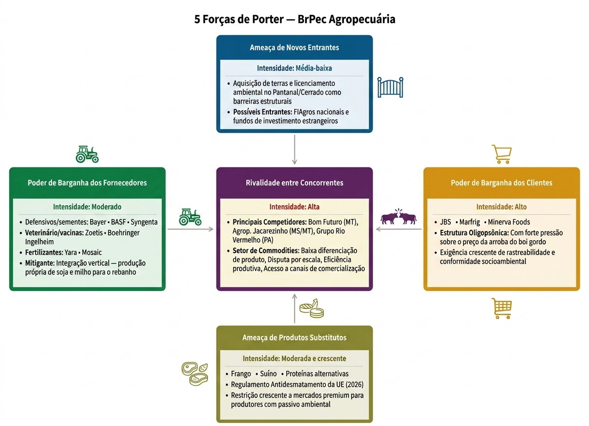
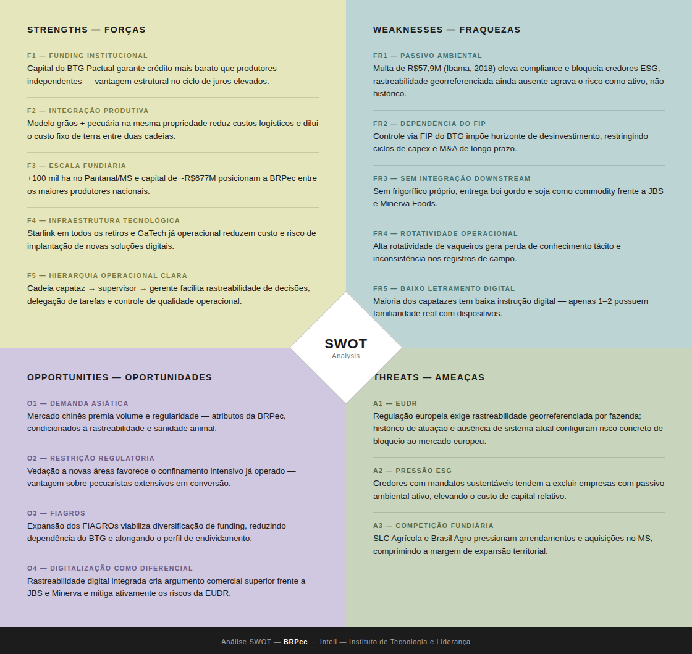

# WAD - Web Application Document - Módulo 2 - Inteli

**_Os trechos em itálico servem apenas como guia para o preenchimento da seção. Por esse motivo, não devem fazer parte da documentação final_**

## Nome do Grupo

#### Nomes dos integrantes do grupo

- <a href="https://www.linkedin.com/in/filipe-salotti-9ab184310/">Arthur Morais </a>
- <a href="https://www.linkedin.com/in/eduardo-gabriel-de-oliveira-1ab818220/">Eduardo Oliveira</a>
- <a href="https://www.linkedin.com/in/enzo-santos-bezerra-1904403bb/">Enzo Santos Bezerra</a>
- <a href="https://www.linkedin.com/in/guilherme-beltrame-18b1b429b/">Guilherme Munhoz Beltrame</a>
- <a href="https://www.linkedin.com/in/laiza-guimar%C3%A3es-2748b2313/">Laiza Guimaraes</a>
- <a href="https://www.linkedin.com/in/kaylan-alexandre/">Lorena Kopke</a>
- <a href="https://www.linkedin.com/in/mateus-galatro/">Mateus Gongora Pereira Galatro</a>
- <a href="https://www.linkedin.com/in/miguel-cristiano-costa-160b96320/">Miguel Cristiano Costa</a>

## Sumário

[1. Introdução](#c1)

[2. Visão Geral da Aplicação Web](#c2)

[3. Projeto Técnico da Aplicação Web](#c3)

[4. Desenvolvimento da Aplicação Web](#c4)

[5. Testes da Aplicação Web](#c5)

[6. Estudo de Mercado e Plano de Marketing](#c6)

[7. Conclusões e trabalhos futuros](#c7)

[8. Referências](c#8)

[Anexos](#c9)

 

# 1. Introdução (sprints 1 a 5)

O agronegócio ocupa um papel central na economia brasileira, não apenas pela produção de alimentos, mas também por gerar empregos e desenvolvimento de diversas regiões do país. Nesse contexto, a pecuária exige organização e supervisão constantes das operações, principalmente no monitoramento das atividades de campo e da movimentação do rebanho, que afetam diretamente a produtividade e a tomada de decisões.
A BrPec Agropecuária S.A, incluída nesse cenário, enfrenta desafios na gestão e no fluxo de informações entre o campo e o escritório. Atualmente, o registro de atividades e das movimentações do rebanho é feito de forma manual, em papel, o que demanda tempo e trabalho dobrado, pois é necessário reescrever em planilhas digitais. Além disso, a falta de conexão com a internet nas áreas operacionais piora essa situação.
Para resolver esse problema, nós desenvolvemos uma aplicação web permitindo que as equipes de campo possam digitalizar o gerenciamento das atividades e o registro das movimentações do rebanho. Além disso, essa solução foi projetada para funcionar offline, permitindo que os dados sejam registrados diretamente no campo e sincronizados posteriormente, quando houver acesso à internet.
O software centraliza e padroniza as informações, reduz falhas humanas e melhora a comunicação entre gerentes, capatazes e coordenadores. Dessa maneira, ele contribui para uma operação mais eficiente, organizada e alinhada às necessidades do cliente, mesmo em uma área com baixa conectividade.

# 2. Visão Geral da Aplicação Web (sprint 1)

## 2.1. Escopo do Projeto (sprints 1 e 4)

### 2.1.1. Modelo de 5 Forças de Porter (sprint 1)

O Modelo das 5 Forças de Porter foi aplicado para analisar a estrutura competitiva do setor agropecuário no qual a BrPec Agropecuária está inserida (PORTER, 2008), setor marcado por dependência de commodities, capital intensivo, pressão regulatória ambiental crescente.

Rivalidade entre concorrentes: A rivalidade é alta. O mercado bovino e de grãos compete por escala, eficiência e acesso a canais de comercialização, dada a limitada diferenciação em commodities. A BrPec disputa com grupos integrados como Bom Futuro (MT), Jacarezinho, ligada a Marcos Molina da Marfrig, e Rio Vermelho (PA), além de fundos de investimento em terras (COMPRERURAL, 2024). Num ambiente de preços de mercado, eficiência de custo e volume são o campo de batalha (PORTER, 2008).

Ameaça de novos entrantes: A ameaça é média a baixa. Operar em larga escala exige capital intensivo para aquisição de terras, infraestrutura e formação de rebanho, além de licenciamento ambiental complexo em biomas como Pantanal e Cerrado. Essas barreiras restringem a entrada de concorrentes de grande porte, embora fundos agropecuários nacionais e estrangeiros sustentem ameaça relevante no longo prazo (CASALE, 2024).

Poder de barganha dos fornecedores: O poder é moderado. A BrPec depende de fertilizantes (Yara, Mosaic), defensivos e sementes (Bayer, BASF, Syngenta) e medicamentos veterinários (Zoetis, Boehringer Ingelheim), segmentos dominados por multinacionais com poder de precificação. A produção própria de soja e milho atenua parcialmente essa dependência (FEED&FOOD, 2024).

Poder de barganha dos clientes: O poder é alto. Os principais compradores JBS, Marfrig e Minerva Foods, operam em oligopsônio e pressionam os preços pagos por arroba (INFOMONEY, 2024). A concentração do lado comprador mantém o produtor em posição estruturalmente desfavorável, com margens sensíveis à política de compra desses grupos (REPÓRTER BRASIL, 2024).

Ameaça de substitutos: A ameaça é moderada e crescente. No mercado interno, frango e suíno competem com a carne bovina em custo-benefício (CEPEA, 2023). Externamente, o regulamento anti-desmatamento da União Europeia, em vigor a partir de 2026, restringe produtores com histórico ambiental negativo, limitando o acesso a mercados de maior valor agregado (REHAGRO, 2024).

Análise estrutural: A BrPec opera em setor com barreiras de entrada relevantes e integração vertical como diferencial, mas enfrenta forte pressão de canais de compra concentrados, alta rivalidade por escala e dependência de fornecedores especializados. O passivo ambiental representa risco estratégico: a empresa figura entre os maiores desmatadores do Pantanal segundo o Ibama (DE OLHO NOS RURALISTAS, 2020), podendo restringir o acesso aos segmentos de maior rentabilidade.

  
  
<strong>Figura 1</strong> — Análise das 5 Forças de Porter aplicada à BrPec Agropecuária 
  Fonte: Próprios autores (2026).

### 2.1.2. Análise SWOT da Instituição Parceira (sprint 1)

A análise SWOT a seguir avalia o posicionamento estratégico da BRPec considerando seu ambiente interno — forças operacionais e financeiras e fraquezas estruturais e regulatórias — e fatores externos: oportunidades de mercado e ameaças setoriais. O contexto de análise é o agronegócio brasileiro de pecuária e grãos, especificamente o segmento de produção integrada em larga escala no Pantanal mato-grossense, caracterizado por crescente pressão ESG sobre crédito e certificações, restrições regulatórias à expansão de novas áreas e acirrada competição fundiária com players institucionalizados.

**Fonte: Elaborado pelos autores (2026).**

A leitura integrada dos quadrantes revela que a principal vantagem competitiva sustentável da BRPec reside em sua escala fundiária no Pantanal e no modelo integrado grãos-pecuária, atributos que concorrentes de médio porte não replicam no curto prazo. Por outro lado, o passivo ambiental ativo representa não apenas uma fraqueza interna de compliance, mas um vetor de amplificação de ameaças externas: é simultaneamente a causa do risco de bloqueio ao mercado europeu via EUDR e do encarecimento do custo de capital frente a concorrentes com certificações ESG consolidadas — concentrando dois dos três riscos externos mapeados em uma única vulnerabilidade de origem interna. Essa sobreposição indica que a resolução do passivo ambiental não é apenas uma pauta regulatória, mas a condição estrutural para que a BRPec converta sua escala operacional em acesso real a mercados premium e crédito qualificado.

### 2.1.3. Solução (sprints 1 a 5)

_Explique detalhadamente os seguintes aspectos (até 60 palavras por item):_

1. Problema a ser resolvido
2. Dados disponíveis (mencionar fonte e conteúdo; se não houver, indicar “não se aplica”)
3. Solução proposta
4. Forma de utilização da solução
5. Benefícios esperados
6. Critério de sucesso e como será avaliado

#### 1. Definição do Problema

A BRPec depende atualmente de processos manuais e anotações em papel (boletas) para comunicar ordens de serviço entre o campo e o escritório, além de registrar movimentações do rebanho (nascimentos, óbitos e transferências). Isso gera retrabalho na consolidação dos dados, redigitação em planilhas eletrônicas e atraso na visibilidade das informações operacionais.

---

#### 2. Dados Disponíveis

Os dados disponíveis para o projeto incluem:

- Estrutura de papéis (Gerente, Capataz, Coordenador de Retiro)
- Tipos de eventos zootécnicos registrados manualmente: nascimento, morte, compra, venda e transferência entre retiros
- Tipos de tarefas de campo: cercas, pasto, infraestrutura
- Formato de saída esperado: planilha Excel/CSV
- Stack técnica definida: HTML/CSS/JS (front), Node.js (servidor), SQLite (banco)
- Restrições: sem autenticação formal de usuários, sem integração com WebAPIs externas

---

#### 3. Solução Proposta

Desenvolvimento de uma aplicação web com arquitetura cliente-servidor (HTML/CSS/JS + Node.js + SQLite) que centraliza o gerenciamento de tarefas operacionais e o registro de movimentações do rebanho bovino. A solução contempla três perfis de uso — Gerente, Capataz e Coordenador — cada um com interface adaptada às suas responsabilidades. O sistema funcionará em modo offline, com sincronização automática quando houver conexão.

---

#### 4. Forma de Uso da Solução

**Gerente:** Cria, edita e monitora tarefas calendarizadas para os Capatazes via painel web.

**Capataz:** Usa a aplicação offline para visualizar tarefas, reportar status com evidências (foto, texto, áudio) e registrar movimentações do rebanho.

**Coordenador:** Visualiza movimentações reportadas e exporta dados consolidados em Excel/CSV.

---

#### 5. Benefícios Esperados

- Padronização dos registros de campo, eliminando anotações em papel
- Agilidade na atualização do inventário pecuário com digitalização na fonte
- Maior transparência e rastreabilidade das atividades operacionais em tempo real
- Redução de falhas de comunicação e de transcrição de dados
- Eliminação da redigitação manual de informações para planilhas
- Ganho de eficiência e integração entre as áreas agrícola e pecuária

---

#### 6. Critérios de Sucesso

O projeto será considerado bem-sucedido quando:

- O MVP funcional integrar o gerenciamento de tarefas e o formulário de movimentação bovina
- Os três perfis (Gerente, Capataz, Coordenador) conseguirem executar seus fluxos principais sem erros
- A funcionalidade offline operar corretamente com sincronização posterior
- A exportação de dados em Excel/CSV gerar arquivos utilizáveis pelos Coordenadores sem necessidade de redigitação
- Os registros de campo eliminarem o uso de boletas de papel no dia a dia

---

## 7. Alinhamento com SWOT e Canvas

> ⚠️ **Nota:** Esta seção deve ser revisada e complementada pelo grupo após a elaboração da Análise SWOT e do Business Model Canvas do projeto.

### Alinhamento com a Análise SWOT

- **SWOT:** Os pontos levantados na análise devem refletir os problemas (fraquezas/ameaças) e oportunidades descritos na TAPI

### Alinhamento com o Business Model Canvas

- **Canvas:** O bloco de "Proposta de Valor" deve estar coerente com os benefícios esperados; "Segmentos de Clientes" com os atores; "Canais" com a interface web/offline

### 2.1.4. Value Proposition Canvas (sprint 1):

A proposta de valor é uma declaração curta e objetiva que resume a essência da aplicação web: o que ela oferece, para quem e por que vale a pena jogar. Ela funciona como o núcleo de toda a visão do projeto, orientando decisões de design e comunicando de forma clara o diferencial do jogo antes de qualquer detalhe técnico ou mecânico ser apresentado.

**Fonte: Elaborado pelos autores (2026).**

O canvas evidencia que o a aplicação web resolve dores concretas dos Capatazes em campo — como a dependência de boletas de papel, a impossibilidade de usar soluções convencionais sem internet e a comunicação informal com o Gerente, garantindo que haja um maior controle pelos Capatazes. Os ganhos gerados, como a eliminação do retrabalho de transcrição, o registro ágil de eventos zootécnicos em poucos toques e a confirmação automática de tarefas com envio de evidências, se alinham diretamente às entregas do produto: formulários digitais de manejo bovino, sistema de alertas multimídia e exportação em Excel para o Coordenador. A proposta de valor da aplicação web, portanto, não se limita a digitalizar uma planilha existente, mas redefine o fluxo de informações entre o campo e o escritório — tornando os registros operacionais mais confiáveis, rastreáveis e acessíveis para toda a cadeia de gestão da fazenda.

### 2.1.5. Matriz de Riscos do Projeto (sprint 1)

A matriz de riscos é uma ferramenta que permite identificar, analisar e priorizar ameaças e oportunidades de um projeto. A classificação é feita com base na probabilidade de ocorrência e no impacto, auxiliando na definição de ações para cada caso. Dessa forma, foi elaborada a matriz de riscos para o desenvolvimento da aplicação web da BrPec Agropecuária S.A, considerando seus principais desafios.

---

### AMEAÇAS

### 1. Não entrega do MVP no prazo

**Probabilidade:** 10%  
**Impacto:** Muito Alto

**Explicação:**  
Existe risco real de atraso devido à complexidade do sistema (offline + integração + múltiplas funcionalidades). O grupo pode focar em detalhes ou features secundárias e não finalizar o núcleo do projeto.

**Plano de ação:**  
Definir claramente o escopo do MVP (tarefas + registro + exportação), priorizar backlog semanalmente, dividir responsabilidades por membro e realizar checkpoints frequentes para garantir evolução contínua.

---

### 2. Falha na sincronização offline

**Probabilidade:** 50%  
**Impacto:** Muito Alto

**Explicação:**  
O sistema depende de funcionamento offline, o que aumenta a complexidade técnica. Problemas na sincronização podem gerar perda ou duplicação de dados, comprometendo a confiança no sistema.

**Plano de ação:**  
Implementar armazenamento local, criar lógica de fila para sincronização, testar cenários offline/online e registrar logs para identificar falhas.

---

### 3. Baixa adoção pelos usuários de campo

**Probabilidade:** 50%  
**Impacto:** Alto

**Explicação:**  
Os capatazes podem resistir à mudança por hábito ou dificuldade com tecnologia. Se o sistema não for simples e rápido, há risco de continuarem utilizando papel.

**Plano de ação:**  
Focar em interface simples e intuitiva, reduzir o número de campos obrigatórios, validar protótipos com o parceiro e priorizar rapidez no uso.

---

### 4. Falta de alinhamento com o parceiro

**Probabilidade:** 30%  
**Impacto:** Alto

**Explicação:**  
Caso o grupo não valide decisões com a BrPec Agropecuária S.A, pode desenvolver funcionalidades que não atendem às necessidades reais.

**Plano de ação:**  
Realizar reuniões frequentes, validar protótipos e funcionalidades, documentar decisões e confirmar requisitos antes de implementar.

---

### 5. Problemas de integração entre frontend e backend

**Probabilidade:** 50%  
**Impacto:** Alto

**Explicação:**  
Diferenças nos formatos de dados ou endpoints podem causar falhas no sistema, atrasando o desenvolvimento.

**Plano de ação:**  
Definir contratos de API (JSON padronizado), documentar endpoints, realizar testes de integração e manter comunicação constante entre os responsáveis.

---

### 6. Desempenho ruim em dispositivos do campo

**Probabilidade:** 30%  
**Impacto:** Moderado

**Explicação:**  
O sistema pode ser utilizado em celulares simples, e baixa performance pode dificultar o uso no dia a dia.

**Plano de ação:**  
Otimizar carregamento das páginas, reduzir uso de recursos pesados, testar em dispositivos reais e simplificar interface.

---

### OPORTUNIDADES

### 1. Redução significativa de retrabalho

**Probabilidade:** 90%  
**Impacto:** Muito Alto

**Explicação:**  
A digitalização elimina a necessidade de transcrever dados do papel para o Excel, reduzindo tempo e erros operacionais.

**Plano de ação:**  
Garantir que o sistema permita registro direto no campo e exportação automática de dados.

---

### 2. Desenvolvimento técnico do grupo

**Probabilidade:** 90%  
**Impacto:** Muito Alto

**Explicação:**  
O projeto envolve tecnologias reais (frontend, backend e banco de dados), proporcionando aprendizado prático relevante.

**Plano de ação:**  
Dividir tarefas técnicas, compartilhar conhecimento entre membros e documentar aprendizados.

---

### 3. Entendimento do setor agro

**Probabilidade:** 50%  
**Impacto:** Alto

**Explicação:**  
O contato com a realidade da pecuária permite aprendizado de um setor relevante e pouco explorado por estudantes de tecnologia.

**Plano de ação:**  
Aproveitar reuniões com o parceiro, fazer perguntas estratégicas e validar entendimento do negócio.

---

### 4. Possibilidade de expansão futura da solução

**Probabilidade:** 30%  
**Impacto:** Alto

**Explicação:**  
A solução pode ser expandida para outras fazendas ou funcionalidades, gerando valor adicional.

**Plano de ação:**  
Desenvolver arquitetura simples e modular, facilitando futuras melhorias.

## 2.2. Personas (sprint 1)

_Posicione aqui suas Personas em forma de texto markdown com imagens, ou como imagem de template preenchido. Atualize esta seção ao longo do módulo se necessário._

### Persona 1
Nome e sobrenome: João Pereira.

Idade: 39 anos.

Cargo: Gerente geral na BrPec Agropecuária S.A.

Localização: Miranda-MS.

Escolaridade: Pós-graduado em veterinária.

Motivações:
Conseguir manter sua família e garantir educação para seus filhos. Além disso, deseja ser um funcionário de destaque para a BrPec.

Interesses:
- Animais;
- Tecnologias aplicadas ao agronegócio;
- Gestão de fazendas;
- Gestão de tempo;
- Livros.

Desafios/Dores:
- Dificuldade de visualizar todo o cenário em tempo real;
- Comunicação lenta e fragmentada.

Metas:
- Ter maior controle sobre as atividades do campo;
- Garantir que as rotinas do campo sejam executadas seguindo o planejamento.

Necessidades:
- Painel de acompanhamento do status das atividades;
- Painel para a criação e gestão de tarefas calendarizadas para os Capatazes;
- Infomações atualizadas.

Biografia:

João Pereira tem 39 anos, trabalha na BrPec há 6 anos e é responsável por gerar as atividades calendarizadas para os Capatazes e acompanham a evolução das atividades da fazenda. Um dos seus maiores desafios é garantir que as rotinas de campo sejam cumpridas conforme o planejado, porque muitas informações chegam com atraso. Está constantemente frustrado, porque sabe que conseguiria fazer seu trabalho muito melhor se tivesse um melhor acesso aos dados.

"Demoro muito para saber o que está acontecendo nas terras, o que torna difícil gerar as atividades para os Capatazes e garantir que tudo está ocorrendo conforme planejado na fazenda. Isso, porque as informações que tenho nem sempre são as mais atualizadas."

João se comunica com supervisores e coordenadores frequentemente, mas essa comunicação ainda é lenta e fragmentada. Além disso, está aberto a ferramentas digitais, porque sabe que elas o ajudariam a ter uma visão atualizada e completa sobre o cenário geral da fazenda.

### Persona 2
Nome e sobrenome: Marcos Cesar Filho

Idade: 35 anos

Cargo: Coordenador na BrPec Agropecuária S.A

Localização: Miranda- MS

Escolaridade: Pós-graduado em administração

Motivações:
Crescer profissionalmente dentro do agronegócio e ser reconhecido pela precisão e confiabilidade dos dados que gerencia.

Interesses:
- Gestão de dados;
- Pecuária;
- Tecnologia aplicada ao campo.

Desafios/Dores:
- Demanda-se tempo para consolidação e redigitação em planilhas eletrônicas;
- Registros de campo não são padronizados.

Metas:
- Conseguir validar rapidamente as movimentações dos capatazes;
- Ter dados consolidados e confiáveis sem depender de redigitação manual.

Necessidades:

- Visualização das movimentações reportadas pelos Capatazes;
- Visão consolidada das movimentações de todos os retiros sob sua responsabilidade;
- Função para gerar e baixar planilhas referentes às movimentações.

Biografia:

Marcos Cesar tem 35 anos, está na BRPec há 5 anos e é responsável por validar as informações enviadas pelos Capatazes em campo. Além disso, tem como grande desafio hoje receber registros em boletas de papel, muitas vezes incompletos ou ilegíveis e ter que redigitar tudo manualmente em planilhas. Essa situação o deixa frustrado, ainda mais por esse processo estar sujeito a erros. 

"Recebo a boleta, tento decifrar o que está escrito e ainda tenho que digitar tudo no Excel. Qualquer erro no campo vira problema aqui."

### Persona 3
Nome e sobrenome: Gabriel Galdino;

Idade: 45 anos;

Cargo: Capataz na BrPec Agropecuária S.A;

Localização: Miranda (MS) – Atua em retiros na região do Pantanal;

Escolaridade: Ensino Fundamental completo;

Motivações: Garantir o sustento da família e proporcionar uma boa vida para os filhos. Quer ser reconhecido como alguém de confiança no retiro.

Biografia

Gabriel Galdino tem 45 anos e atua como capataz na BrPec Agropecuária S.A, sendo responsável pela gestão de um dos retiros da fazenda. Sua rotina é voltada à execução das atividades operacionais, organização da equipe de vaqueiros e acompanhamento direto das demandas relacionadas ao rebanho. Com forte experiência prática no campo, Gabriel coordena tarefas como movimentação de gado, manutenção de cercas e resolução de imprevistos. Também realiza registros básicos das atividades e comunica atualizações ao coordenador.

Gabriel é um profissional que se destaca ao ser um ótimo capataz para seu retiro e comunidade de vaqueiros, se empenha no trabalho para tentar ajudar ao máximo sua família. Entretanto, enfrenta limitações no uso de ferramentas digitais e depende, em grande parte, de anotações informais e comunicação via rádio, o que dificulta o controle das informações e o acompanhamento das tarefas.

Metas

- Manter o retiro organizado e funcionando corretamente;
- Garantir a execução das tarefas dentro do prazo;
- Evitar retrabalho e falhas na comunicação;
- Ter maior controle sobre as atividades realizadas no dia.

Necessidades

- Sistema simples, com navegação intuitiva;
- Registro rápido de tarefas e ocorrências;
- Visualização clara das atividades do dia;
- Funcionamento offline devido à limitação de internet;
- Padronização das informações registradas.

Desafios/dores

- Baixa familiaridade com tecnologias digitais;
- Dependência de registros manuais e memória;
- Dificuldade em acompanhar várias tarefas simultaneamente;
- Falhas na comunicação com níveis superiores;
- Tempo limitado para registrar informações durante o trabalho.

Interesses

- Ferramentas fáceis de usar no dia a dia;
- Soluções que reduzam esforço operacional;
- Organização das tarefas no campo;
- Comunicação mais direta e eficiente com a equipe.

## 2.3. User Stories (sprints 1 a 5)
| Campo                    | Descrição                                                                                                                                                                                |
| ------------------------ | ---------------------------------------------------------------------------------------------------------------------------------------------------------------------------------------- |
| **Identificação**        | US01                                                                                                                                                                                     |
| **Persona**              | João Pereira (Gerente Geral)                                                                                                                                                             |
| **User Story**           | Como gerente geral, posso criar tarefas e atribuí-las a um retiro específico para organizar a rotina diária da equipe de campo e garantir que o planejamento seja executado corretamente |
| **Critério de Aceite 1** | CR1: Dado que João acessa o sistema, quando cria uma tarefa e seleciona um retiro, então a tarefa deve ser salva corretamente vinculada ao retiro                                        |
| **Critério de Aceite 2** | CR2: Dado que a tarefa foi criada, quando o sistema sincronizar, então ela deve ficar disponível para os capatazes responsáveis pelo retiro                                              |

## Critérios INVEST
Independente: Pode ser implementada sem depender da visualização offline

Negociável: Campos e detalhes da tarefa podem ser ajustados conforme necessidade do gerente

Valorosa: Permite maior controle e organização das atividades da fazenda

Estimável: Escopo claro de criação e associação de tarefas

Pequena: Foco apenas na criação e atribuição de tarefas

Testável: Possível validar criação e vínculo com retiro

| Campo                    | Descrição                                                                                                                                                  |
| ------------------------ | ---------------------------------------------------------------------------------------------------------------------------------------------------------- |
| **Identificação**        | US02                                                                                                                                                       |
| **Persona**              | Gabriel Galdino (Capataz)                                                                                                                                  |
| **User Story**           | Como capataz, posso visualizar minha lista de tarefas do dia offline para saber o que precisa ser executado, mesmo longe da sede, de forma simples e clara |
| **Critério de Aceite 1** | CR1: Dado que as tarefas foram previamente sincronizadas, quando Gabriel estiver sem internet, então deve conseguir visualizar a lista de tarefas do dia   |
| **Critério de Aceite 2** | CR2: Dado que não há tarefas sincronizadas, quando acessar offline, então o sistema deve exibir uma mensagem simples informando ausência de tarefas        |
| **Critério de Aceite 3** | CR3: Dado que Gabriel acessa as tarefas, quando exibidas, então devem estar organizadas de forma simples e de fácil entendimento                           |

## Critérios INVEST
Independente: Depende apenas da sincronização de tarefas

Negociável: Forma de exibição pode ser adaptada ao nível de letramento digital

Valorosa: Garante execução das atividades mesmo sem internet

Estimável: Escopo técnico claro (armazenamento local e leitura)

Pequena: Foco na visualização das tarefas do dia

Testável: Cenários offline verificáveis

| **Identificação**        | US09                                                                                                                                                      |
| **Persona**              | Gabriel Galdino (Capataz)                                                                                                                                  |
| **User Story**           | Como capataz, posso registrar a morte de um animal offline para reportar rapidamente a baixa ao coordenador, garantindo que nenhuma informação se perca mesmo sem conexão disponível no campo. |
| **Critério de Aceite 1** | CR1: Dado que Gabriel está sem conexão Starlink no momento do óbito, quando ele preenche os campos obrigatórios do formulário de morte (identificação do animal, categoria, causa e data) e confirma, então o sistema deve salvar o registro localmente no dispositivo e exibir a mensagem "Registro salvo. Será enviado quando houver conexão"   |
 | **Critério de Aceite 2** | CR2: Dado que Gabriel registrou a morte offline durante o período sem sinal, quando o dispositivo detectar automaticamente a conexão com a rede Starlink, então o sistema deve sincronizar o registro com o servidor sem nenhuma ação manual de Gabriel e notificar "Registro sincronizado com sucesso"  |
 | **Critério de Aceite 3** | CCR3: Dado que Gabriel está preenchendo o formulário de óbito, quando ele tentar confirmar sem preencher todos os campos obrigatórios, então o sistema deve bloquear o envio e destacar visualmente os campos faltantes com uma mensagem de alerta, considerando que Gabriel tem dificuldade de leitura, o destaque visual é tão importante quanto o texto da mensagem  |    
 | **Critério de Aceite 4** | CR4: Dado que o registro foi sincronizado com sucesso, quando o coordenador acessar o sistema, então a baixa do animal deve estar disponível e visível no painel do retiro de Gabriel |                                          

# 3. Projeto da Aplicação Web (sprints 1 a 5)

## 3.1. Requisitos do Sistema (sprints 1 a 5)

_Esta seção formaliza o que o sistema deve fazer, sob quais regras e com quais qualidades. Atualize a cada sprint conforme os requisitos evoluem._

### 3.1.1. Requisitos Funcionais (sprint 1, refinar até sprint 5)

| ID    | Descrição                                                                 | Prioridade | Status       |
|-------|---------------------------------------------------------------------------|------------|--------------|
| RF001 | O sistema deve permitir que o gerente crie tarefas e as associe a um retiro específico | Alta       | Planejado    |
| RF002 | O sistema deve permitir que o capataz visualize as tarefas do dia mesmo sem conexão com a internet | Alta       | Planejado    |
| RF003 | O sistema deve armazenar localmente as tarefas sincronizadas para acesso offline | Alta       | Planejado    |
| RF004 | O sistema deve exibir mensagem simples quando não houver tarefas disponíveis offline | Média      | Planejado    |
| RF005 | O sistema deve permitir que o capataz preencha e confirme o formulário de registro de morte de animal mesmo sem conexão com a internet, salvando os dados localmente no dispositivo | alta    | Planejado    |
| RF006 | O sistema deve detectar automaticamente o restabelecimento da conexão com a rede e iniciar a transmissão dos registros locais pendentes para o servidor remoto, sem exigir nenhuma ação manual do capataz | alta    | Planejado    |
| RF007 | O sistema deve notificar o capataz com uma mensagem de confirmação após a sincronização bem-sucedida dos dados com o servidor ("Registro sincronizado com sucesso") | Média   | Planejado    |
| RF008 | O sistema deve manter os registros com falha de envio salvos localmente e tentar reenvio automático a cada nova conexão disponível, até que a sincronização seja concluída com sucesso | Alta  | Planejado    |
| RF009 | O sistema deve validar o preenchimento dos campos obrigatórios do formulário de óbito (identificação do animal, categoria, causa da morte e data) antes de permitir o salvamento local, bloqueando o registro incompleto e sinalizando visualmente os campos faltante | Alta  | Planejado    |
| RF010 | Após a sincronização, o sistema deve disponibilizar automaticamente o registro de óbito no painel do coordenador, vinculado ao retiro do capataz que realizou o lançamento | Média | Planejado    |

### 3.1.2. Regras de Negócio (sprint 1, refinar até sprint 5)

_Numere e redija as RN de forma implementável e testável. Toda RN deve ter pelo menos um teste automatizado associado a partir da sprint 3._

                                                               

| ID   | Descrição                                                                                                                                                         |  |
|------|-------------------------------------------------------------------------------------------------------------------------------------------------------------------|---------------|
| RN01 | Toda tarefa deve estar obrigatoriamente vinculada a um único retiro                                                                                              
| RN02 | Apenas tarefas do dia atual devem ser exibidas ao capataz                                                                                                        
| RN03 | As tarefas devem ser armazenadas localmente após sincronização                                                                                                   
| RN04 | A mensagem exibida deve utilizar linguagem simples e direta                                                                                                      
| RN05 | O sistema deve permitir visualização offline apenas de tarefas previamente sincronizadas                                                                          
| RN06 | Um registro de óbito só pode ser marcado como "sincronizado" e removido da fila local após o servidor retornar HTTP 200 ou 201                                 
| RN07 | O formulário de óbito não pode ser salvo — online ou offline — se qualquer campo obrigatório (identificação, categoria, causa da morte ou data) estiver vazio     | 
| RN08 | A sincronização deve ser iniciada automaticamente ao detectar conexão, sem depender de nenhuma ação manual do capataz                                             |
| RN09 | Em falha parcial de sincronização, apenas registros com HTTP 200/201 são marcados como enviados; os demais permanecem na fila e são reenviados sem duplicação        |
| RN10 | Cada registro de óbito sincronizado deve ser vinculado ao retiro e ao capataz responsável, sendo imutável após confirmação do servidor                            
| RN11 | Um registro de óbito só deve aparecer no painel do coordenador após sincronização bem-sucedida; registros em fila local são invisíveis para outros perfis                 |

### 3.1.3. Requisitos Não Funcionais — 8 Eixos ISO/IEC 25010 (sprints 1 a 5)

_Preencha os 8 eixos. Cada eixo deve ter ao menos um RNF verificável (com métrica, limite ou critério concreto) ou justificativa explícita de ausência. Evolua do conceitual (sprint 1) ao técnico mensurável (sprint 5)._

| Eixo                     | Requisito | Métrica / Critério | Como atendido |
| ------------------------ | --------- | ------------------ | ------------- |
| USAB — Usabilidade       | ...       | ...                | ...           |
| CONF — Confiabilidade    | ...       | ...                | ...           |
| DES — Desempenho         | ...       | p95 < X ms         | ...           |
| SUP — Suportabilidade    | ...       | ...                | ...           |
| SEG — Segurança          | ...       | ...                | ...           |
| CAP — Capacidade         | ...       | ...                | ...           |
| REST — Restrições Design | ...       | ...                | ...           |
| ORG — Organizacionais    | ...       | ...                | ...           |

### 3.1.4. Matriz RF → RN → Endpoint (sprints 3 a 5)

_Matriz de cobertura mostrando quais RN e endpoints implementam cada RF._

| RF    | RN associadas        | Endpoint                  | Método |
|-------|----------------------|---------------------------|--------|
| RF001 | RN01                 | /tarefas                  | POST   |
| RF002 | RN02, RN05           | /tarefas/hoje             | GET    |
| RF003 | RN03                 | /tarefas/sincronizar      | GET    |
| RF004 | RN04                 | /tarefas/hoje/offline     | GET    |

## 3.2. Arquitetura (sprints 1 a 5)

### 3.2.1. Diagrama de Arquitetura (sprints 3 e 4)

_Posicione aqui o diagrama de arquitetura da solução, indicando as camadas principais (Controller, Service, Repository, Model) e suas responsabilidades. Atualize sempre que necessário._

### 3.2.2. Diagrama de Casos de Uso (sprint 1)

_Apresente o diagrama de casos de uso com atores (boneco), casos (elipse) e as relações `<<include>>` / `<<extend>>` com semântica correta. Consulte a notação de referência em `in02/suporte/use-case_3.0_v1.0.pdf`._

### 3.2.3. Diagrama de Classes do Domínio (sprint 2)

_Diagrama UML de classes com entidades, atributos, relacionamentos e responsabilidades. Diferencie **associação**, **agregação** (losango vazio), **composição** (losango cheio) e **herança** (triângulo vazio). Multiplicidade explícita em toda associação._

### 3.2.4. Diagrama de Sequência UML (sprint 3)

_Ao menos um fluxo prioritário, mostrando a interação entre as camadas Controller → Service → Repository → Banco. Linhas de vida verticais, ativação correta, mensagens síncronas e assíncronas diferenciadas, retornos tracejados._

### 3.2.5. Diagrama de Atividades ou Estados (sprint 3)

_Ao menos um fluxo relevante em UML ou BPMN. Use a notação da ferramenta escolhida de forma consistente (sem misturar convenções)._

### 3.2.6. Diagrama de Implantação (sprints 4 e 5)

_Diagrama UML de deployment mostrando nós físicos, artefatos e canais de comunicação. Representa a visão Engineering + Technology do RM-ODP._

### 3.2.7. Padrões de Projeto Aplicados (sprints 3 a 5)

_Documente os design patterns utilizados (Repository, Strategy, Factory, DTO etc.) e quais princípios SOLID se aplicam. Justifique a adoção de cada padrão com base em uma necessidade real do projeto._

## 3.3. Wireframes (sprint 2)

_Posicione aqui as imagens do wireframe construído para sua solução e, opcionalmente, o link para acesso (mantenha o link sempre público para visualização)_

## 3.4. Guia de estilos (sprint 3)

_Descreva aqui orientações gerais para o leitor sobre como utilizar os componentes do guia de estilos de sua solução_

### 3.4.1 Cores

_Apresente aqui a paleta de cores, com seus códigos de aplicação e suas respectivas funções_

### 3.4.2 Tipografia

_Apresente aqui a tipografia da solução, com famílias de fontes e suas respectivas funções_

### 3.4.3 Iconografia e imagens

_(esta subseção é opcional, caso não existam ícones e imagens, apague esta subseção)_

_posicione aqui imagens e textos contendo exemplos padronizados de ícones e imagens, com seus respectivos atributos de aplicação, utilizadas na solução_

## 3.5 Protótipo de alta fidelidade (sprint 3)

_posicione aqui algumas imagens demonstrativas de seu protótipo de alta fidelidade e o link para acesso ao protótipo completo (mantenha o link sempre público para visualização)_

## 3.6. Modelagem do banco de dados (sprints 2 e 4)

### 3.6.1. Modelo Entidade-Relacionamento (ER) (sprint 2)

_Apresente o modelo ER conceitual com entidades, atributos e relacionamentos. Use notação consistente (Chen ou Crow's Foot — não misture)._

### 3.6.2. Diagrama Entidade-Relacionamento (DER) (sprint 2)

_Posicione aqui o DER com cardinalidades explícitas em ambos os lados de cada relação e identificação de PK/FK. O DER deve ser coerente com o diagrama de classes (3.2.3)._

### 3.6.3. Modelo Relacional e Modelo Físico (sprints 2 e 4)

_Posicione aqui os diagramas de modelos relacionais do banco de dados, apresentando todos os esquemas de tabelas e suas relações. Inclua as migrations DDL numeradas e reproduzíveis (`CREATE TABLE`, `CREATE INDEX`, constraints `NOT NULL`, `UNIQUE`, `FOREIGN KEY`, `CHECK`). Utilize texto para complementar suas explicações quando necessário._

### 3.6.4. Consultas SQL e lógica proposicional (sprint 2)

_posicione aqui uma lista de consultas SQL compostas, realizadas pelo back-end da aplicação web, com sua respectiva lógica proposicional, descrita conforme template abaixo. Lembre-se que para usar LaTeX em markdown, basta você colocar as expressões entre $ ou $$_

_Template de SQL + lógica proposicional_
#1 | ---
--- | ---
**Expressão SQL** | SELECT \* FROM suppliers WHERE (state = 'California' AND supplier_id <> 900) OR (supplier_id = 100);
**Proposições lógicas** | $A$: O estado é 'California' (state = 'California')   $B$: O ID do fornecedor não é 900 (supplier_id ≠ 900)   $C$: O ID do fornecedor é 100 (supplier_id = 100)
**Expressão lógica proposicional** | $(A \land B) \lor C$
**Tabela Verdade** | <table> <thead> <tr> <th>$A$</th> <th>$B$</th> <th>$C$</th> <th>$(A \land B)$</th> <th>$(A \land B) \lor C$</th> </tr> </thead> <tbody> <tr> <td>F</td> <td>F</td> <td>F</td> <td>F</td> <td>F</td> </tr> <tr> <td>F</td> <td>F</td> <td>V</td> <td>F</td> <td>V</td> </tr> <tr> <td>F</td> <td>V</td> <td>F</td> <td>F</td> <td>F</td> </tr> <tr> <td>F</td> <td>V</td> <td>V</td> <td>F</td> <td>V</td> </tr> <tr> <td>V</td> <td>F</td> <td>F</td> <td>F</td> <td>F</td> </tr> <tr> <td>V</td> <td>F</td> <td>V</td> <td>F</td> <td>V</td> </tr> <tr> <td>V</td> <td>V</td> <td>F</td> <td>V</td> <td>V</td> </tr> <tr> <td>V</td> <td>V</td> <td>V</td> <td>V</td> <td>V</td> </tr> </tbody> </table>

_Dica: edite a tabela verdade fora do markdown, para ter melhor controle_

## 3.7. WebAPI e endpoints (sprints 3 e 4)

_Utilize um link para outra página de documentação contendo a descrição completa de cada endpoint. Ou descreva aqui cada endpoint criado para seu sistema._

_Cada endpoint deve conter endereço, método (GET, POST, PUT, PATCH, DELETE), header, body, formatos de response e os status codes possíveis (200, 201, 204, 400, 401, 403, 404, 409, 422, 500)._

## 3.8. Autenticação, Autorização e Resiliência (sprint 5)

### 3.8.1. Autenticação

_Descreva o fluxo de autenticação implementado: persistência de senha com hash bcrypt/argon2 (parâmetros de custo explícitos e justificados), validação de credenciais e criação de sessão. Senhas em texto plano no banco não são aceitas._

### 3.8.2. Controle de sessão

_Descreva o controle de sessão baseado em `session id` persistido em tabela própria, com expiração. Se optar por JWT, justifique a escolha explicando os trade-offs (stateless, não revogável, payload exposto)._

### 3.8.3. Autorização

_Descreva as regras de autorização por rota e por operação, baseadas no perfil do usuário autenticado. A verificação deve ocorrer no backend — o frontend nunca é fonte de verdade para autorização._

### 3.8.4. Estratégias de Resiliência

_Descreva as estratégias aplicadas no tratamento de falhas de rede: timeout, retry com backoff exponencial, circuit breaker e idempotência em operações críticas (`PUT`, `DELETE`, operações de pagamento etc.)._

## 3.9. Matriz de Rastreabilidade (RTM) (sprints 3 a 5)

_A RTM consolida a rastreabilidade completa do sistema. Um elo quebrado invalida toda a cadeia — mantenha-a atualizada a cada sprint. A partir da sprint 3 não deve haver lacunas nos fluxos centrais._

| Persona | RF    | RN   | Endpoint    | Tela     | Teste | Evidência                          |
| ------- | ----- | ---- | ----------- | -------- | ----- | ---------------------------------- |
| ...     | RF001 | RN01 | `/usuarios` | Cadastro | CT02  | print, log, relatório de cobertura |

# 4. Desenvolvimento da Aplicação Web

## 4.1. Primeira versão da aplicação web (sprint 3)

_Descreva e ilustre aqui o desenvolvimento da primeira versão do sistema web. Utilize prints de tela para ilustrar. Indique obrigatoriamente: (a) o que foi implementado, (b) o que não foi concluído, (c) dificuldades técnicas enfrentadas e próximos passos._

## 4.2. Segunda versão da aplicação web (sprint 4)

_Descreva e ilustre aqui o desenvolvimento da segunda versão do sistema web, com foco no que foi consolidado entre a primeira versão funcional e o sistema operacional integrado. Utilize prints de tela para ilustrar. Indique obrigatoriamente: (a) o que foi implementado, (b) o que não foi concluído, (c) dificuldades técnicas enfrentadas e próximos passos._

## 4.3. Versão final da aplicação web (sprint 5)

_Descreva e ilustre aqui o desenvolvimento da versão final do sistema web, com foco em refatorações, correções finais e na camada de autenticação/autorização entregue. Utilize prints de tela para ilustrar. Indique obrigatoriamente: (a) o que foi refinado ou adicionado desde a sprint 4, (b) pendências remanescentes, (c) dificuldades técnicas enfrentadas._

# 5. Testes

## 5.1. Relatório de testes de integração de endpoints automatizados (sprint 4)

_Liste e descreva os testes automatizados dos endpoints criados e planejados para sua solução, implementados com **Jest**. Cubra as duas abordagens:_

- **_White-box_** _— testes unitários de Service que exercitam ramos internos, exceções e regras de negócio (conhecimento da implementação)._
- **_Black-box_** _— testes de integração dos endpoints via Jest + Supertest, verificando apenas o contrato HTTP (status, body, efeito observável), sem depender da implementação interna._

_Posicione aqui também o relatório de cobertura de testes Jest se houver (através de link ou transcrito para estrutura markdown)._

## 5.2. Testes de usabilidade (sprint 5)

### 5.2.1. Relatório de testes de guerrilha

_Posicione aqui as tabelas com enunciados de tarefas, etapas e resultados de testes de usabilidade. Ou utilize um link para seu relatório de testes (mantenha o link sempre público para visualização)._

### 5.2.2. Relatório de testes SUS (System Usability Scale)

_Posicione aqui o relatório dos testes SUS realizados._

# 6. Estudo de Mercado e Plano de Marketing (sprint 4)

## 6.1 Resumo Executivo

_Preencher com até 300 palavras, sem necessidade de fonte_

_Apresente de forma clara e objetiva os principais destaques do projeto: oportunidades de mercado, diferenciais competitivos da aplicação web e os objetivos estratégicos pretendidos._

## 6.2 Análise de Mercado

_a) Visão Geral do Setor (até 250 palavras)_
_Contextualize o setor no qual a aplicação está inserida, considerando aspectos econômicos, tecnológicos e regulatórios. Utilize fontes confiáveis._

_b) Tamanho e Crescimento do Mercado (até 250 palavras)_
_Apresente dados quantitativos sobre o tamanho atual e projeções de crescimento do mercado. Utilize fontes confiáveis._

_c) Tendências de Mercado (até 300 palavras)_
_Identifique e analise tendências relevantes (tecnológicas, comportamentais e mercadológicas) que influenciam o setor. Utilize fontes confiáveis._

## 6.3 Análise da Concorrência

_a) Principais Concorrentes (até 250 palavras)_
_Liste os concorrentes diretos e indiretos, destacando suas principais características e posicionamento no mercado._

_b) Vantagens Competitivas da Aplicação Web (até 250 palavras)_
_Descreva os diferenciais da sua aplicação em relação aos concorrentes, sem necessidade de citação de fontes._

## 6.4 Público-Alvo

_a) Segmentação de Mercado (até 250 palavras)_
Descreva os principais segmentos de mercado a serem atendidos pela aplicação. Utilize bases de dados e fontes confiáveis.\*

_b) Perfil do Público-Alvo (até 250 palavras)_
_Caracterize o público-alvo com dados demográficos, psicográficos e comportamentais, incluindo necessidades específicas. Utilize fontes obrigatórias._

## 6.5 Posicionamento

_a) Proposta de Valor Única (até 250 palavras)_
_Defina de maneira clara o que torna a sua aplicação única e valiosa para o mercado._

_b) Estratégia de Diferenciação (até 250 palavras)_
_Explique como sua aplicação se destacará da concorrência, evidenciando a lógica por trás do posicionamento._

## 6.6 Estratégia de Marketing

_a) Produto/Serviço (até 200 palavras)_
_Descreva as funcionalidades, benefícios e diferenciais da aplicação_

_b) Preço (até 200 palavras)_
_Explique o modelo de precificação adotado e justifique com base nas análises anteriores._

_c) Praça (Distribuição) (até 200 palavras)_
_Apresente os canais digitais utilizados para distribuir e entregar a aplicação ao público._

_d) Promoção (até 200 palavras)_
_Descreva as estratégias digitais planejadas, como SEO, redes sociais, marketing de conteúdo e campanhas pagas._

# 7. Conclusões e trabalhos futuros (sprint 5)

_Escreva de que formas a solução da aplicação web atingiu os objetivos descritos na seção 2 deste documento. Indique pontos fortes e pontos a melhorar de maneira geral._

_Relacione os pontos de melhorias evidenciados nos testes com planos de ações para serem implementadas. O grupo não precisa implementá-las, pode deixar registrado aqui o plano para ações futuras_

_Relacione também quaisquer outras ideias que o grupo tenha para melhorias futuras_

# 8. Referências (sprints 1 a 5)

_Incluir as principais referências de seu projeto, para que seu parceiro possa consultar caso ele se interessar em aprofundar. Um exemplo de referência de livro e de site:_ 

LUCK, Heloisa. Liderança em gestão escolar. 4. ed. Petrópolis: Vozes, 2010.  
SOBRENOME, Nome. Título do livro: subtítulo do livro. Edição. Cidade de publicação: Nome da editora, Ano de publicação.  

INTELI. Adalove. Disponível em: https://adalove.inteli.edu.br/feed. Acesso em: 1 out. 2023  
SOBRENOME, Nome. Título do site. Disponível em: link do site. Acesso em: Dia Mês Ano

# Anexos

_Inclua aqui quaisquer complementos para seu projeto, como diagramas, imagens, tabelas etc. Organize em sub-tópicos utilizando headings menores (use ## ou ### para isso)_
