# WAD - Web Application Document - Módulo 2 - Inteli

## Nome do Grupo

#### Nomes dos integrantes do grupo

- <a href="https://www.linkedin.com/in/filipe-salotti-9ab184310/">Arthur Morais </a>
- <a href="https://www.linkedin.com/in/eduardo-oliveira05/">Eduardo Gabriel de Oliveira</a>
- <a href="https://www.linkedin.com/in/enzo-santos-bezerra-1904403bb/">Enzo Santos Bezerra</a>
- <a href="https://www.linkedin.com/in/guilherme-beltrame-18b1b429b/">Guilherme Munhoz Beltrame</a>
- <a href="https://www.linkedin.com/in/laiza-guimar%C3%A3es-2748b2313/">Laiza Guimaraes</a>
- <a href="https://www.linkedin.com/in/lorena-cordeiro-kopke/">Lorena Kopke</a>
- <a href="https://www.linkedin.com/in/mateus-galatro/">Mateus Gongora Pereira Galatro</a>
- <a href="https://www.linkedin.com/in/miguel-cristiano-costa-160b96320/">Miguel Cristiano Costa</a>

## Sumário

[1. Introdução](#c1)

[2. Visão Geral da Aplicação Web](#c2)

[3. Projeto Técnico da Aplicação Web](#c3)

[4. Desenvolvimento da Aplicação Web](#c4)

[5. Testes da Aplicação Web](#c5)

[6. Estudo de Mercado e Plano de Marketing](#c6)

[7. Conclusões e trabalhos futuros](#c7)

[8. Referências](#c8)

[Anexos](#c9)

<br>

# <a name="c1"></a>1. Introdução (sprints 1 a 5)

O agronegócio brasileiro desempenha papel central na economia nacional, sendo responsável
por aproximadamente 25% do PIB e pela geração de empregos em larga escala, especialmente
em regiões de interior [1]. Nesse contexto, a pecuária demanda elevado nível de
controle operacional, especialmente no registro de atividades de campo e na gestão da
movimentação do rebanho, fatores diretamente relacionados à produtividade e à qualidade
da tomada de decisão.

No cenário da BrPec Agropecuária S.A., empresa com 14 retiros operacionais distribuídos
na região do Pantanal sul-mato-grossense e aproximadamente 240 colaboradores, dos quais cerca de 25 atuam diretamente como usuários operacionais da solução,
identificou-se que o fluxo de informações entre o campo e o escritório ocorre de forma
inteiramente manual, por meio de anotações em boletas de papel. Esse modelo gera
ineficiências operacionais relevantes: registros são frequentemente preenchidos de forma
incompleta ou ilegível, agravado pelo fato de parte dos capatazes apresentar dificuldade
de leitura e escrita. Há, ainda, atraso significativo no envio das informações ao escritório
e torna-se necessário redigitar todos os dados em planilhas digitais. Como consequência,
ocorrem retrabalho, risco de erros na consolidação e atrasos que podem comprometer a
visibilidade das operações por horas ou até dias, impactando diretamente a tomada de
decisão dos gestores. Um exemplo concreto identificado no kickoff com o parceiro: boletas
de entrada e saída de animais frequentemente não coincidem, gerando inconsistências no
controle do rebanho.

Além disso, a ausência de conectividade contínua nas áreas operacionais, com
sincronização disponível apenas pela manhã e à noite via Starlink nos retiros, impede o
uso de soluções digitais convencionais, dificultando ainda mais a padronização e a
confiabilidade das informações registradas. Atualmente, o WhatsApp é a principal
ferramenta de comunicação entre capatazes e gestores, o que evidencia tanto a familiaridade
dos usuários com dispositivos móveis quanto a ausência de um canal estruturado para o
fluxo de dados operacionais.

Diante desse contexto, foi proposta a construção de uma aplicação web capaz de digitalizar
o gerenciamento de tarefas e o registro das movimentações do rebanho, contemplando
nascimentos, mortes, compras, vendas e transferências entre retiros, com funcionamento
offline obrigatório. A solução permite que os dados sejam coletados diretamente no campo,
por meio de celulares fornecidos pela própria BrPec, e sincronizados automaticamente quando
houver conexão com a internet.

Como principal criação de valor, o sistema promove a padronização dos registros, elimina
a necessidade de redigitação manual, reduz erros operacionais e melhora a rastreabilidade
das informações. Dessa forma, possibilita maior agilidade na atualização dos dados, aumenta
a transparência das operações e apoia a tomada de decisão dos gestores, alinhando-se
às necessidades reais da BrPec e ao seu contexto operacional.

# <a name="c2"></a>2. Visão Geral da Aplicação Web (sprint 1)

## 2.1. Escopo do Projeto (sprints 1 e 4)

### 2.1.1. Modelo de 5 Forças de Porter (sprint 1)

As 5 forças de Porter são uma metodologia de análise estratégica criada por Michael Porter para avaliar a competitividade e o potencial de lucro de uma indústria. Assim, o objetivo é analisar as principais forças do ambiente externo de uma empresa, e como elas impactam na entrega de valor ao cliente e a rentabilidade do negócio.

O Modelo das 5 Forças de Porter foi aplicado para analisar a estrutura competitiva do setor agropecuário no qual a BrPec Agropecuária está inserida [20], setor marcado por dependência de commodities, capital intensivo, pressão regulatória ambiental crescente.

**Rivalidade entre concorrentes:** A rivalidade é alta. O mercado bovino e de grãos compete por escala, eficiência e acesso a canais de comercialização, dada a limitada diferenciação em commodities. A BrPec disputa com grupos integrados como Bom Futuro (MT), Jacarezinho, ligada a Marcos Molina da Marfrig, e Rio Vermelho (PA), além de fundos de investimento em terras (COMPRERURAL, 2024). Num ambiente de preços de mercado, eficiência de custo e volume são o campo de batalha (PORTER, 2008).

**Ameaça de novos entrantes:** A ameaça é média a baixa. Operar em larga escala exige capital intensivo para aquisição de terras, infraestrutura e formação de rebanho, além de licenciamento ambiental complexo em biomas como Pantanal e Cerrado. Essas barreiras restringem a entrada de concorrentes de grande porte, embora fundos agropecuários nacionais e estrangeiros sustentem ameaça relevante no longo prazo (CASALE, 2024).

**Poder de barganha dos fornecedores:** O poder é moderado. A BrPec depende de fertilizantes (Yara, Mosaic), defensivos e sementes (Bayer, BASF, Syngenta) e medicamentos veterinários (Zoetis, Boehringer Ingelheim), segmentos dominados por multinacionais com poder de precificação. A produção própria de soja e milho atenua parcialmente essa dependência (FEED&FOOD, 2024).

**Poder de barganha dos clientes:** O poder é alto. Os principais compradores JBS, Marfrig e Minerva Foods, operam em oligopsônio e pressionam os preços pagos por arroba (INFOMONEY, 2024). A concentração do lado comprador mantém o produtor em posição estruturalmente desfavorável, com margens sensíveis à política de compra desses grupos (REPÓRTER BRASIL, 2024).

**Ameaça de substitutos:** A ameaça de produtos substitutos é moderada e crescente. No mercado interno, frango e suíno competem diretamente com a carne bovina por apresentarem, em muitos períodos, melhor relação custo-benefício ao consumidor (CEPEA, 2023). Em momentos de redução do poder de compra, essa substituição tende a se intensificar, pressionando a demanda pela carne bovina. Além disso, proteínas vegetais e outras alternativas sustentáveis vêm ganhando espaço em nichos específicos de consumo, especialmente entre públicos mais atentos a questões ambientais e de saúde. Externamente, o regulamento anti-desmatamento da União Europeia, em vigor a partir de 2026, aumenta as exigências de rastreabilidade e conformidade para acesso a mercados de maior valor agregado (REHAGRO, 2024). Nesse contexto, a BrPec precisa fortalecer sua eficiência operacional e sua capacidade de comprovar a origem e a regularidade de sua produção, reduzindo sua vulnerabilidade frente a produtos substitutos e ampliando sua competitividade.

**Análise estrutural:** A BrPec opera em setor com barreiras de entrada relevantes e integração vertical como diferencial, mas enfrenta forte pressão de canais de compra concentrados, alta rivalidade por escala e dependência de fornecedores especializados. Além disso, desafios de conformidade ambiental podem representar riscos estratégicos, especialmente em um contexto de crescente rigor regulatório e ampliação das exigências ESG. A empresa já foi mencionada em levantamentos sobre desmatamento no Pantanal (DE OLHO NOS RURALISTAS, 2020), o que pode restringir o acesso a mercados premium, linhas de crédito e segmentos de maior rentabilidade. Nesse contexto, a digitalização dos registros operacionais contribui para ampliar a rastreabilidade, fortalecer a governança das informações e apoiar a mitigação de riscos reputacionais e regulatórios.

<center>
  <p><strong>Figura 1</strong> — Análise das 5 Forças de Porter aplicada à BRPec Agropecuária<br/>
  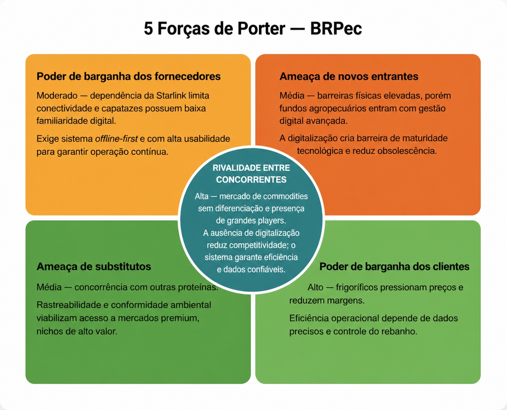
  
  Fonte: Próprios autores (2026).</p>
</center>

**Rivalidade entre concorrentes**
Verifica-se que a rivalidade no setor pecuário é focada na eficiência operacional e na redução do custo por arroba. A BrPec compete com grupos capitalizados, como Bom Futuro (MT) e Rio Vermelho (PA). Como o mercado não diferencia o produto primário, conclui-se que a ausência de digitalização dos registros de campo posiciona a corporação em desvantagem competitiva. Logo, o sistema é a ferramenta necessária para gerar dados confiáveis e equiparar a eficiência da operação.

**Ameaça de novos entrantes**
Observa-se que as barreiras físicas de entrada são altas, representadas por 14 retiros e 130 casas rurais. Contudo, fundos agropecuários terceirizados ingressam no setor suportados por ferramentas de gestão digital consolidadas. Para não sofrer obsolescência tecnológica frente a esses novos agentes, a BrPec precisa implementar o sistema de forma imediata, criando uma barreira de maturidade organizacional e de processos que proteja a sua posição no mercado.

**Poder de barganha dos fornecedores**
Constata-se que a dependência operacional concentra-se principalmente em dois vetores críticos: a infraestrutura satelital da Starlink, que restringe a conectividade a curtas janelas diárias, e os capatazes, mão de obra caracterizada pela baixa familiaridade digital. Essas restrições determinam que a adoção de uma arquitetura estritamente "offline-first" e o desenvolvimento de uma interface de alta usabilidade são requisitos indispensáveis para garantir a coleta dos dados no campo.

**Poder de barganha dos clientes**
Nota-se que o poder dos compradores é evidenciado pela pressão exercida por grandes frigoríficos, como JBS e Minerva, sobre o preço da arroba bovina. A compressão das margens comerciais exige ganhos sistêmicos de eficiência interna, os quais dependem diretamente de dados atualizados. Assim, justifica-se a implementação da solução web para digitalizar os apontamentos na origem, viabilizando o controle preciso do inventário e a otimização do manejo diário.

**Ameaça de substitutos**
Identifica-se que a conformidade ambiental em biomas sensíveis (como o Pantanal monitorado pelo Ibama) e a rastreabilidade são credenciais essenciais para acessar mercados premium, nichos de alto valor que são menos vulneráveis à substituição por outras proteínas. Portanto, o sistema é a camada tecnológica fundamental que viabiliza essa exigência, registrando a origem, o destino e as evidências fotográficas georreferenciadas de cada movimentação animal.

### 2.1.2. Análise SWOT da Instituição Parceira (sprint 1)

A análise SWOT é uma ferramenta de planejamento estratégico que avalia quatro dimensões de uma organização: forças (Strengths), fraquezas (Weaknesses), oportunidades (Opportunities) e ameaças (Threats). As duas primeiras referem-se ao ambiente interno da organização, enquanto as duas últimas dizem respeito a fatores externos [19].

A seguir, essa ferramenta é aplicada ao posicionamento estratégico da BRPec no contexto do agronegócio brasileiro de pecuária e grãos, especificamente o segmento de produção integrada em larga escala no Pantanal mato-grossense, caracterizado por crescente pressão ESG sobre crédito e certificações, restrições regulatórias à expansão de novas áreas e acirrada competição fundiária com players institucionalizados.

<center>
  <p><strong>Figura 2</strong> — Análise SWOT da BRPec Agropecuária</p>
  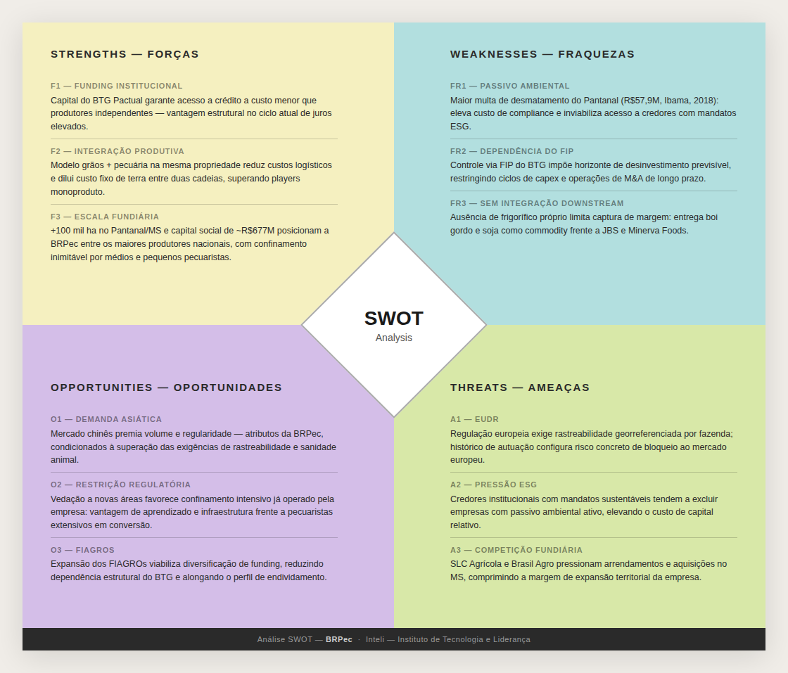
  <p>Fonte: Próprios autores (2026).</p>
</center>

A leitura integrada dos quadrantes revela que a principal força da BrPec está em sua escala fundiária no Pantanal e no modelo integrado entre grãos e pecuária, atributos que fortalecem sua capacidade produtiva e dificultam a replicação por concorrentes de menor porte no curto prazo. Entre as fraquezas, destacam-se a dependência de registros manuais, a baixa padronização das informações operacionais, as limitações de conectividade nos retiros e os desafios de conformidade ambiental associados à atuação em biomas sensíveis. Como oportunidades, a digitalização dos processos, a rastreabilidade do rebanho, a melhoria da gestão operacional e o acesso a mercados mais exigentes podem ampliar a eficiência e o posicionamento competitivo da empresa. Já as ameaças envolvem o aumento da pressão regulatória ambiental, a concentração de compradores, a intensificação das exigências ESG e o possível encarecimento do custo de capital frente a concorrentes com certificações consolidadas. Dessa forma, a solução proposta atua sobre as principais fragilidades operacionais da BrPec, criando condições para reduzir riscos, aumentar a confiabilidade dos dados e transformar sua escala produtiva em uma vantagem competitiva mais sustentável.

### 2.1.3. Solução (sprints 1 a 5)

#### 1. Definição do Problema

A BRPec depende atualmente de processos manuais e anotações em papel (boletas) para comunicar ordens de serviço entre o campo e o escritório, além de registrar movimentações do rebanho (nascimentos, óbitos e transferências). Isso gera retrabalho na consolidação dos dados, redigitação em planilhas eletrônicas e atraso na visibilidade das informações operacionais.

---

#### 2. Dados Disponíveis

Os dados disponibilizados para o desenvolvimento do projeto compreendem exclusivamente informações de negócio e operacionais da fazenda, incluindo:

- Estrutura hierárquica e definição de papéis de usuários, contemplando as funções de Gerente Geral, Coordenador, Supervisor e Capataz.
- Tipologias de eventos zootécnicos e sanitários passíveis de registro, tais como nascimentos, óbitos, aquisições, vendas e transferências de animais entre retiros.
- Categorização do rebanho por faixa etária e estágio de desenvolvimento (bezerro, garrote, boi, touro, bezerra, novilha e vaca).
- Lista fixa dos 14 retiros operacionais que compõem a infraestrutura da propriedade.
- Tipologias de chamados de infraestrutura para manutenção de instalações (ex: hidráulica, elétrica e cercas).
- Modelos de boletas físicas atualmente utilizadas no campo e templates de planilhas eletrônicas utilizadas pela administração para a exportação e consolidação final das movimentações.

---

#### 3. Solução Proposta

Desenvolvimento de uma aplicação web com arquitetura cliente-servidor (HTML/CSS/JS + Node.js + SQLite) que centraliza o gerenciamento de tarefas operacionais e o registro de movimentações do rebanho bovino. A solução contempla três perfis de uso — Gerente, Capataz e Coordenador — cada um com interface adaptada às suas responsabilidades. O sistema funcionará em modo offline, com sincronização automática quando houver conexão.

---

#### 4. Forma de Uso da Solução

**Gerente:** Cria, edita e monitora tarefas calendarizadas para os Capatazes via painel web.

**Capataz:** Usa a aplicação offline para visualizar tarefas, reportar status com evidências (foto, texto, áudio) e registrar movimentações do rebanho.

**Coordenador:** Visualiza movimentações reportadas e exporta dados consolidados em Excel/CSV.

---

#### 5. Benefícios Esperados

- Padronização dos registros de campo, eliminando anotações em papel
- Agilidade na atualização do inventário pecuário com digitalização na fonte
- Maior transparência e rastreabilidade das atividades operacionais em tempo real
- Redução de falhas de comunicação e de transcrição de dados
- Eliminação da redigitação manual de informações para planilhas
- Ganho de eficiência e integração entre as áreas agrícola e pecuária

---

#### 6. Critérios de Sucesso

O projeto será considerado bem-sucedido quando:

- O MVP funcional integrar o gerenciamento de tarefas e o formulário de movimentação bovina
- Os três perfis (Gerente, Capataz, Coordenador) conseguirem executar seus fluxos principais sem erros
- A funcionalidade offline operar corretamente com sincronização posterior
- A exportação de dados em Excel/CSV gerar arquivos utilizáveis pelos Coordenadores sem necessidade de redigitação
- Os registros de campo eliminarem o uso de boletas de papel no dia a dia

---

#### 7. Alinhamento com SWOT e Canvas

#### Alinhamento com a Análise SWOT

- **SWOT:** Os pontos levantados na análise devem refletir os problemas (fraquezas/ameaças) e oportunidades descritos na TAPI

#### Alinhamento com o Business Model Canvas

- **Canvas:** O bloco de "Proposta de Valor" deve estar coerente com os benefícios esperados; "Segmentos de Clientes" com os atores; "Canais" com a interface web/offline

### 2.1.4. Value Proposition Canvas (sprint 1):

A proposta de valor constitui uma declaração objetiva que sintetiza a essência da aplicação web desenvolvida, definindo as funcionalidades entregues, o público-alvo atendido e os benefícios operacionais gerados. Essa ferramenta atua como o eixo analítico do projeto, fundamentando as decisões de arquitetura de software e comunicando o diferencial competitivo da solução digital de modo estruturado. A análise do canvas evidencia que o sistema mitiga ineficiências operacionais concretas enfrentadas pelos capatazes em campo, tais como a dependência exclusiva de registros físicos, a inviabilidade de uso de sistemas convencionais em áreas desprovidas de cobertura de internet e a assincronicidade na comunicação com as instâncias gerenciais.

<center>
  <p><strong>Figura 3</strong> - Canvas Proposta de Valor aplicada à BrPec Agropecuária</p>
  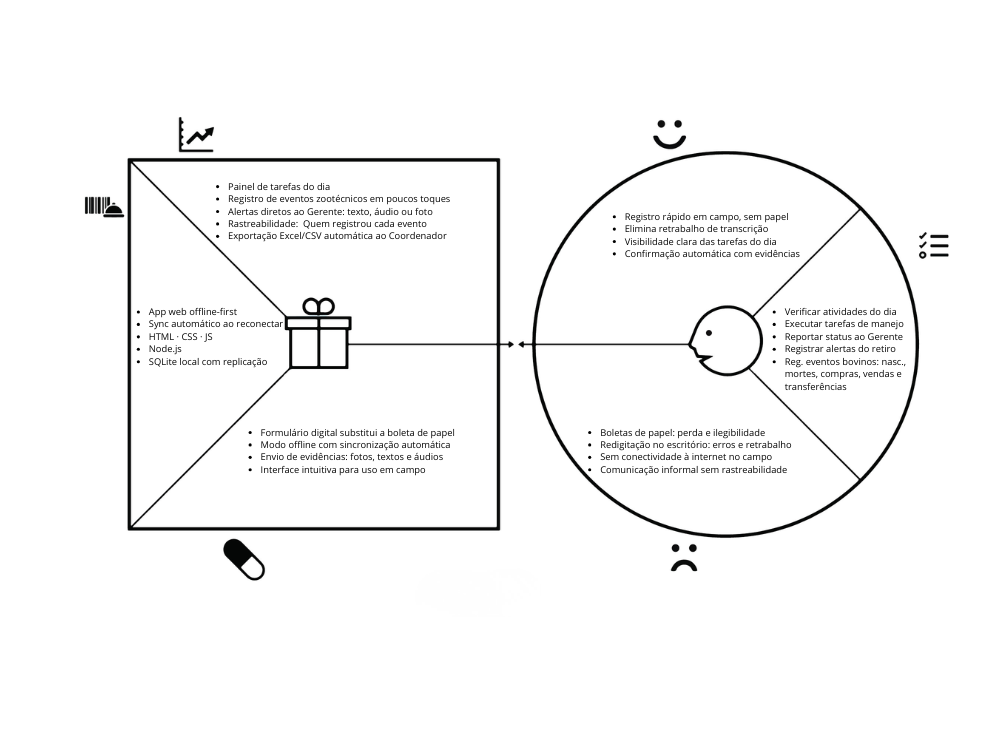
  <p>Fonte: Próprios autores (2026).</p>
</center>

Os benefícios gerados pela adoção do sistema - incluindo a supressão do retrabalho de transcrição de dados, o registro otimizado de eventos zootécnicos em interface acessível e a confirmação documental de ordens de serviço com suporte a evidências fotográficas - estão em conformidade direta com os requisitos estabelecidos pela propriedade rural. Conclui-se, portanto, que a proposta de valor promovida não se restringe à mera digitalização de planilhas de controle, mas consolida a reestruturação integral do fluxo de dados operacionais, assegurando que o inventário pecuário e o status das infraestruturas se tornem mais precisos, rastreáveis e tempestivos para o suporte à tomada de decisão administrativa.

### 2.1.5. Matriz de Riscos do Projeto (sprint 1)

A matriz de riscos é uma ferramenta que permite identificar, analisar e priorizar ameaças e oportunidades de um projeto. A classificação é feita com base na probabilidade de ocorrência e no impacto, auxiliando na definição de ações para cada caso [18]. Dessa forma, foi elaborada a matriz de riscos para o desenvolvimento da aplicação web da BrPec Agropecuária S.A, considerando seus principais desafios.

Nesse contexto, a figura a seguir apresenta a matriz de riscos elaborada para o projeto, que usa como base os padrões da ISO 31000 e PMBOK [2], na qual são organizadas as principais ameaças e oportunidades identificadas, considerando seus respectivos níveis de impacto e probabilidade.

<center>
  <p><strong>Figura 4</strong> — Matriz de Risco aplicada à BrPec Agropecuária</p>
  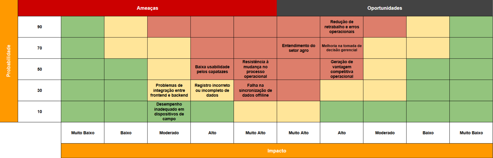
  <p>Fonte: Próprios autores (2026).</p>
</center>

## Ameaças

### A01 — Falha na sincronização de dados offline

**Probabilidade:** 30%  
**Impacto:** Muito Alto

**Explicação:**  
Constata-se que a operação é realizada maioritariamente em modo offline nos retiros, razão pela qual a sincronização de dados é considerada um elemento estruturalmente crítico do sistema. Verifica-se que falhas neste processo podem resultar na perda, duplicidade ou inconsistência de registos. A título de exemplo, observa-se que uma movimentação de rebanho registada no campo pode não ser refletida no sistema central, gerando divergência entre o inventário real de animais e os dados disponibilizados para a gestão.

**Plano de ação:**  
Constata-se que a mitigação deste risco exige a adoção de uma arquitetura orientada ao funcionamento offline, com armazenamento local de dados e sincronização assíncrona. Considera-se fundamental a implementação de mecanismos de controlo de consistência, tais como filas de envio, registos de log e reprocessamento automatizado em caso de falhas. Adicionalmente, recomenda-se a realização de testes que simulem cenários reais de perda e retomada de conexão, assegurando que a integridade dos dados seja mantida mesmo em condições adversas.

---

### A02 — Baixa usabilidade para capatazes

**Probabilidade:** 50%  
**Impacto:** Alto

**Explicação:**  
Verifica-se que os capatazes, identificados como os principais utilizadores do sistema, apresentam reduzido nível de instrução formal e encontram-se habituados ao uso de ferramentas de comunicação elementares, como o WhatsApp. Observa-se que uma interface dotada de elevada complexidade pode dificultar a utilização do sistema e comprometer a sua adoção na rotina operacional diária.

**Plano de ação:**  
Constata-se que a mitigação deste risco exige o desenvolvimento de uma interface altamente intuitiva, fundamentada em elementos visuais e fluxos simplificados. Recomenda-se que a necessidade de leitura e digitação seja reduzida ao mínimo, priorizando-se ações rápidas e diretas. Considera-se essencial a validação contínua com o parceiro, por meio de protótipos e simulações de uso real, para garantir a aderência ao perfil do utilizador. Adicionalmente, observa-se que a comparação com ferramentas já utilizadas pelos capatazes pode orientar decisões de design mais eficazes.

---

### A03 — Registro incorreto ou incompleto de dados

**Probabilidade:** 30%  
**Impacto:** Alto

**Explicação:**  
Observa-se que erros no registro de eventos zootécnicos, tais como nascimento, óbito ou transferência de animais, comprometem diretamente a fiabilidade das informações. A título ilustrativo, constata-se que a ausência de registro de um óbito pode gerar inconsistência no inventário e impactar decisões de venda ou de manejo.

**Plano de ação:**  
Verifica-se que a redução deste risco requer a imposição de validações estruturais nos registros, garantindo-se o preenchimento de campos essenciais, tais como origem, destino e tipo de movimentação. Considera-se que a exigência de evidências, como fotografias georreferenciadas em eventos críticos, contribui para o aumento da fiabilidade dos dados. Adicionalmente, recomenda-se a implementação de histórico de alterações, de modo a permitir a rastreabilidade de inconsistências e a correção de eventuais erros ao longo do tempo.

---

### A04 — Resistência à mudança no processo operacional

**Probabilidade:** 50%  
**Impacto:** Muito Alto

**Explicação:**  
Constata-se que, mesmo perante uma interface considerada adequada, persiste o risco de resistência à mudança por parte dos capatazes, habituados ao uso de registos em papel e ferramentas informais na rotina diária. Observa-se que a introdução de um novo sistema pode ser percecionada como uma complexidade adicional ao fluxo operacional já consolidado. A título de exemplo, verifica-se a possibilidade de o utilizador optar por continuar a registar informações manualmente e postergar a utilização da solução digital, comprometendo a centralização e a fiabilidade dos dados.

**Plano de ação:**  
Identifica-se que a mitigação deste risco exige não apenas uma solução tecnicamente adequada, mas também uma estratégia de implementação alinhada ao contexto operacional da fazenda. Considera-se necessário assegurar que o sistema seja percecionado como facilitador da rotina, evidenciando-se a redução do esforço operacional em comparação ao método vigente. Recomenda-se, ainda, o envolvimento de supervisores no acompanhamento da utilização e a condução de validação contínua com o parceiro, de forma a reforçar a adoção. Verifica-se que a demonstração prática de benefícios — tais como a redução do retrabalho e a maior agilidade no registo — atua como fator de incentivo ao uso continuado da ferramenta.

---

### A05 — Incompatibilidade na exportação de dados

**Probabilidade:** 30%  
**Impacto:** Moderado

**Explicação:**  
Identifica-se o risco de os ficheiros CSV gerados pelo sistema não serem interpretados corretamente pelos templates legados de Excel utilizados pela coordenação da fazenda para a consolidação das movimentações. Observa-se que divergências na codificação de caracteres, na delimitação de campos ou na ordenação das colunas podem resultar na importação incorreta dos dados, gerando inconsistências nos relatórios gerenciais e comprometendo a fiabilidade da informação consolidada.

**Plano de ação:**  
Constata-se que a mitigação deste risco exige a homologação rigorosa dos esquemas de dados exportados, confrontando-se a estrutura dos ficheiros gerados pelo sistema com os templates legados atualmente em uso pela coordenação. Recomenda-se a realização de testes de importação com dados representativos em diferentes versões de Excel, bem como a validação da codificação de caracteres (UTF-8 com BOM) e dos delimitadores utilizados. Adicionalmente, considera-se necessária a documentação formal do esquema de exportação, de modo a garantir a compatibilidade contínua e a rastreabilidade de eventuais alterações no formato dos dados.

---

### A06 — Desempenho inadequado em dispositivos de campo

**Probabilidade:** 10%  
**Impacto:** Moderado

**Explicação:**  
Verifica-se que o sistema será utilizado em dispositivos móveis no campo, os quais podem apresentar limitações de capacidade de processamento e memória. Observa-se que um desempenho insuficiente pode dificultar a utilização do sistema durante as atividades operacionais diárias.

**Plano de ação:**  
Constata-se que a garantia de uma experiência de utilização adequada requer a otimização do sistema para dispositivos móveis, com interfaces leves e reduzido consumo de recursos computacionais. Verifica-se que a utilização de cache local e a minimização de requisições externas contribuem para a melhoria do desempenho. Recomenda-se, adicionalmente, a realização de testes em dispositivos reais, de modo a validar a usabilidade em condições próximas ao ambiente operacional efetivo.

---

## Oportunidades

### O01 — Redução de retrabalho e erros operacionais

**Probabilidade:** 90%  
**Impacto:** Muito Alto

**Explicação:**  
Constata-se que, no modelo atual, os dados são registrados em papel e posteriormente transcritos para planilhas eletrônicas, processo que gera retrabalho e aumenta a probabilidade de erros. Verifica-se que a digitalização permite a eliminação deste processo intermediário, tornando o fluxo informacional mais eficiente e viável.

**Plano de ação:**  
Observa-se que a digitalização dos registros requer a garantia de que todas as informações sejam recolhidas diretamente no campo, de forma estruturada e padronizada. Considera-se que a integração com relatórios e exportações automatizadas assegura que os dados possam ser utilizados de forma imediata, reduzindo-se o tempo operacional e as falhas de origem humana.

---

### O02 — Entendimento do setor agro

**Probabilidade:** 50%  
**Impacto:** Alto

**Explicação:**  
Identifica-se que o contacto direto com a realidade operacional da pecuária proporciona uma oportunidade de aprendizagem significativa acerca de um setor economicamente relevante e ainda pouco explorado por profissionais e equipes de desenvolvimento tecnológico

**Plano de ação:**  
Recomenda-se que as interações com o parceiro sejam aproveitadas como oportunidades de imersão no domínio de negócio, sendo formuladas questões estratégicas e validado sistematicamente o entendimento das dinâmicas operacionais do setor. Considera-se que esta compreensão aprofundada contribui para o alinhamento da solução tecnológica às necessidades reais da propriedade.

---

### O03 — Melhoria na tomada de decisão gerencial

**Probabilidade:** 70%  
**Impacto:** Alto

**Explicação:**  
Verifica-se que, no modelo atual, as decisões são tomadas com base em dados que chegam com atraso ou que podem conter inconsistências. Observa-se que, com a digitalização, os gestores passam a dispor de acesso a informações mais atualizadas e fiáveis. A título de exemplo, constata-se que o controlo preciso do número de animais por categoria permite decisões mais assertivas sobre venda e maneio.

**Plano de ação:**  
Considera-se que a disponibilização de dados estruturados requer o acompanhamento pela criação de painéis e relatórios que facilitem a visualização das informações. Observa-se que a organização por retiro, tipo de atividade e categoria animal contribui para análises mais rápidas e eficazes.

---

### O04 — Geração de vantagem competitiva operacional

**Probabilidade:** 50%  
**Impacto:** Alto

**Explicação:**  
Constata-se que, num setor de elevada competitividade, a eficiência operacional constitui um fator determinante de diferenciação. Verifica-se que a utilização de dados fiáveis permite a redução de perdas, a melhoria do controlo do rebanho e a otimização da execução das atividades. Observa-se, ainda, que a identificação célere de falhas operacionais possibilita correções ágeis, evitando-se impactos de maior magnitude na produção.

**Plano de ação:**  
Identifica-se que a potencialização desta oportunidade requer a garantia de que os dados recolhidos sejam utilizados de forma estratégica. Considera-se que a análise contínua por meio de indicadores e relatórios permite a transformação de informações operacionais em vantagens competitivas, fortalecendo-se o posicionamento da empresa no mercado.

---

## Síntese

A matriz de riscos evidencia que os principais desafios do projeto estão relacionados à operação offline, à adoção pelos usuários de campo, à qualidade dos registros e à compatibilidade dos dados exportados com os processos já utilizados pela BrPec. Ao mesmo tempo, o projeto apresenta oportunidades relevantes, como redução de retrabalho, melhoria da tomada de decisão, aumento da rastreabilidade e fortalecimento da eficiência operacional. Dessa forma, os planos de ação definidos buscam reduzir ameaças técnicas, humanas e operacionais, ao mesmo tempo em que potencializam os ganhos esperados com a digitalização dos registros de campo.

## 2.2. Personas (sprint 1)

Personas são, de forma resumida, representaçôes fictícia dos diferentes tipos de usuários. Elas permitem que a ferramenta seja mais eficiente e focada para atender as necessidades reais do cliente [18]. Dessa forma, as Figuras 5, 6 e 7 mostram as personas criadas para o projeto.

### Persona 1: João Pereira

<center>
  <p><strong>Figura 5</strong> — Persona 1: João Pereira (Gerente)</p>
  
  <p>Fonte: Próprios autores (2026).</p>
</center>

#### Informações:

- Nome e sobrenome: João Pereira;
- Idade: 40 anos [3];
- Cargo: Gerente geral na BrPec Agropecuária S.A.;
- Estado Civil: Casado;
- Localização: Miranda-MS;
- Escolaridade: Pós-graduado em veterinária.

#### Motivações:

Conseguir manter sua família e garantir educação para seus filhos. Além disso, deseja ser um funcionário de destaque para a BrPec.

#### Interesses [3]:

- Animais;
- Tecnologias aplicadas ao agronegócio;
- Gestão Logística e Operações;
- Gestão de tempo.

#### Desafios/Dores:

- Dificuldade de visualizar todo o cenário em tempo real;
- Comunicação lenta e fragmentada.

#### Metas:

- Ter maior controle sobre as atividades do campo;
- Garantir que as rotinas do campo sejam executadas seguindo o planejamento.

#### Necessidades:

- Painel de acompanhamento do status das atividades;
- Painel para a criação e gestão de tarefas calendarizadas para os Capatazes;
- Infomações diariamente atualizadas.

#### Habilidades [5]:

- Planejamento de atividades operacionais;
- Monitoramento e controle de metas de produção;
- Elaboração de relatórios;
- Gestão de equipes e supervisão de desempenho;
- Tomada de decisão baseada em indicadores do campo.

#### Familiaridade com Tecnologia [4]

<center>
  <p><strong>Tabela 1</strong> — Familiaridade com Tecnologia (João Pereira)</p>
</center>

| Aspecto                 | Nível / Situação                                                                      |
| ----------------------- | ------------------------------------------------------------------------------------- |
| Smartphone              | Intermediate (DigComp) - uso ativo de WhatsApp, e-mail, chamadas de trabalho e outros |
| Aplicativos de gestão   | Basic (DigComp) - uso limitado, sem experiência com sistemas ERP ou dashboards        |
| Planilhas e formulários | Intermediate (DigComp) - utiliza planilhas para acompanhar as atividades              |
| Sistemas web            | Basic (DigComp) - acessa portais e e-mail, sem uso de plataformas integradas          |

<center>
  <p>Fonte: Próprios autores (2026).</p>
</center>

Informações extras:

- Conectividade: Boa - trabalha em escritório com acesso estável à internet;
- Meio de comunicação principal: WhatsApp, rádio e telefone com capatazes e coordenadores;
- Adaptação a novas tecnologias: Moderada a alta - reconhece o valor das ferramentas digitais e está aberto a adotá-las [5];
- Dispositivo disponível: Computador e celular.

#### Notas e Justificativas:

**Idade e perfil do cargo:**
A faixa etária de 40 anos foi baseada no perfil médio do Gerente de Produção e Operações Agropecuárias (CBO 1411-15), que aponta 40 anos como idade mais recorrente segundo o Portal Salário a partir de dados do CAGED. Além disso, outras informações sobre o perfil do foram baseadas a partir dessa fonte [3].

**Framework de Competência Digital - DigComp 3.0:**
Os níveis de familiaridade com tecnologia foram classificados seguindo o DigComp 3.0, framework europeu de competência digital desenvolvido pelo Joint Research Centre da Comissão Europeia. Ele define quatro níveis de proficiência (Basic, Intermediate, Advanced e Highly Advanced) com base na complexidade das tarefas executadas e no grau de autonomia do indivíduo [4].

**Habilidades do gestor no agronegócio:**
As habilidades listadas foram baseadas no perfil de profissionais que ocupam cargos de gestão no agronegócio [5].

#### Biografia:

João Pereira tem 40 anos, trabalha na BrPec há 6 anos e é responsável por gerar as atividades calendarizadas para os Capatazes, como por exemplo: "Segunda-feira, Gabriel deve verificar as cercas do retiro 3". Além disso, ele acompanha a evolução das atividades da fazenda.

João começa seu dia sempre verificando mensagens dos capatazes e coordenadores, depois disso, distribui tarefas para os retiros consultando anotações e planilhas. Ao longo do dia, participa de diversas reuniões, mas sempre sofre com o atraso das informações, que o impedem de identificar e corrigir imprevistos rapidamente, além de impedir que ele garanta que as rotinas de campo sejam cumpridas conforme o planejado. No final do dia, consolida o que foi executado, mas se sente frustrado por saber que poderia ter tomado decisões melhores se tivesse acesso a dados em tempo real.

"Demoro muito para saber o que está acontecendo nas terras, o que torna difícil gerar as atividades para os Capatazes e garantir que tudo está ocorrendo conforme planejado na fazenda. Isso, porque as informações que tenho nem sempre são as mais atualizadas."

João se comunica com supervisores e coordenadores frequentemente, mas essa comunicação ainda é lenta e fragmentada. Além disso, está aberto a ferramentas digitais, porque sabe que elas o ajudariam a ter uma visão atualizada e completa sobre o cenário geral da fazenda.

### Persona 2: Marcos Cesar Filho

<center>
  <p><strong>Figura 6</strong> — Persona 2: Marcos Cesar Filho (Coordenador)</p>
  
  <p>Fonte: Próprios autores (2026).</p>
</center>

#### Informações:

- Nome e sobrenome: Marcos Cesar Filho;
- Idade: 35 anos;
- Cargo: Coordenador na BrPec Agropecuária S.A.;
- Estado Civil: Solteiro;
- Localização: Miranda- MS;
- Escolaridade: Pós-graduado em administração [6].

#### Motivações:

Crescer profissionalmente dentro do agronegócio e ser reconhecido pela precisão e confiabilidade dos dados que gerencia.

#### Interesses:

- Gestão de dados;
- Pecuária;
- Tecnologia aplicada ao campo.

#### Desafios/Dores:

- Demanda-se tempo para consolidação e transcrição em planilhas eletrônicas;
- Registros de campo não são padronizados.

#### Metas:

- Conseguir validar rapidamente as movimentações dos capatazes;
- Ter dados consolidados e confiáveis sem depender de transcrição manual.

#### Necessidades:

- Visualização das movimentações reportadas pelos Capatazes;
- Visão consolidada das movimentações de todos os retiros sob sua responsabilidade;
- Função para gerar e baixar planilhas referentes às movimentações.

#### Habilidades:

- Análise e validação de dados operacionais;
- Gestão de planilhas e relatórios;
- Comunicação entre campo e gestão;
- Tomada de decisão baseada em dados.

#### Familiaridade com Tecnologia [4]:

<center>
  <p><strong>Tabela 2</strong> — Familiaridade com Tecnologia (Marcos Cesar Filho)</p>
</center>

| Aspecto                 | Nível / Situação                                                               |
| ----------------------- | ------------------------------------------------------------------------------ |
| Smartphone              | Intermediate (DigComp) - uso ativo de WhatsApp, e-mail e câmera no trabalho    |
| Aplicativos de gestão   | Basic (DigComp) - sem experiência com sistemas ERP ou plataformas operacionais |
| Planilhas e formulários | Intermediate (DigComp) - usa Excel para consolidação manual de dados de campo  |
| Sistemas web            | Basic (DigComp) - acessa e-mail e portais simples, sem dashboards ou sistemas  |

<center>
  <p>Fonte: Próprios autores (2026).</p>
</center>

**Informações extras:**

- Conectividade: Boa, trabalha em ambiente de escritório com acesso à internet;
- Meio de comunicação principal: WhatsApp, e-mail e telefone;
- Adaptação a novas tecnologias: Moderada - aberto a ferramentas que simplifiquem seu fluxo de trabalho;
- Dispositivo disponível: Computador e celular.

#### Notas e Justificativas:

**Escolaridade do gestor no agronegócio:**
O Portal CNA Brasil aponta que, para cargos de coordenação técnica no agronegócio, o perfil mais buscado combina forte conhecimento técnico com boas noções de gestão, habilidade de comunicação e liderança [6].

**Framework de Competência Digital - DigComp 3.0:**
Os níveis de familiaridade com tecnologia foram classificados seguindo o DigComp 3.0, framework europeu de competência digital desenvolvido pelo Joint Research Centre da Comissão Europeia. Ele define quatro níveis de proficiência (Basic, Intermediate, Advanced e Highly Advanced) com base na complexidade das tarefas executadas e no grau de autonomia do indivíduo [4].

#### Biografia:

Marcos Cesar tem 35 anos, está na BRPec há 5 anos e é responsável por validar as informações enviadas pelos Capatazes em campo. Além disso, tem como grande desafio hoje receber registros em boletas de papel, muitas vezes incompletos ou ilegíveis e ter que redigitar tudo manualmente em planilhas. Essa situação o deixa frustrado, ainda mais por esse processo estar sujeito a erros.

Sua rotina começa organizando as boletas vindas dos capatazes. Assim, ele tenta decifrar as caligrafias para depois iniciar a transcrição no Excel. Durante o dia, alterna entre a consolidação dos dados de movimentação do rebanho, validação de registros e comunicação com os capatazes para esclarecer dúvidas. Ao fim do dia, revisa as planilhas para garantir que nenhum dado ficou incorreto.

"Recebo a boleta, tento decifrar o que está escrito e ainda tenho que digitar tudo no Excel. Qualquer erro no campo vira problema aqui."

### Persona 3: Gabriel Galdino

<center>
  <p><strong>Figura 7</strong> — Persona 3: Gabriel Galdino (Capataz)</p>
  
  <p>Fonte: Próprios autores (2026).</p>
</center>

#### Informações:

- Nome e sobrenome: Gabriel Galdino;
- Idade: 33 anos [7];
- Cargo: Capataz na BrPec Agropecuária S.A. [8];
- Estado Civil: Casado;
- Localização: Aquidauana (MS) – Atua em retiros na região do Pantanal;
- Escolaridade: Ensino Fundamental completo;

#### Motivações:

Garantir o sustento da família e proporcionar uma boa vida para os filhos. Quer ser reconhecido como alguém de confiança no retiro.

#### Metas:

- Manter o retiro organizado e funcionando corretamente;
- Garantir a execução das tarefas dentro do prazo;
- Evitar retrabalho e falhas na comunicação;
- Ter maior controle sobre as atividades realizadas no dia.

#### Necessidades:

- Sistema fácil de usar sem conhecimento técnico prévio, por ter maior dificuldade com tecnologias [9];
- Registro rápido de tarefas e ocorrências;
- Visualização clara das atividades do dia;
- Funcionamento offline devido à limitação de internet;
- Padronização das informações registradas.

#### Desafios/dores:

- Baixa familiaridade com tecnologias digitais [9];
- Dependência de registros manuais e memória;
- Dificuldade para acompanhar tarefas em tempo real;
- Dificuldade de comunicação com níveis superiores;

#### Interesses:

- Animais e agricultura;
- Soluções que reduzam esforço operacional;
- Organização das tarefas no campo;
- Comunicação direta e eficiente.

#### Habilidades:

- Administração de mão de obra rural;
- Controle de qualidade e produtividade do rebanho;
- Planejamento e supervisão de atividades no campo;
- Gestão de recursos e insumos do retiro;
- Resolução de imprevistos sob pressão;
- Comunicação direta com equipe de vaqueiros;
- Resiliência devido aos diversos problemas que ocorrem.

#### Familiaridade com Tecnologia [4]:

<center>
  <p><strong>Tabela 3</strong> — Familiaridade com Tecnologia (Gabriel Galdino)</p>
</center>

| Aspecto                  | Nível / Situação                                                                      |
| ------------------------ | ------------------------------------------------------------------------------------- |
| Smartphone               | Basic (DigComp) - uso restrito a ligações e WhatsApp                                  |
| Aplicativos de gestão    | Abaixo do Basic - sem experiência com apps de controle de tarefas ou relatórios       |
| Planilhas e formulários  | Abaixo do Basic - registro em planilhas é feito por outros a partir de suas anotações |
| Sistemas web ou digitais | Abaixo do Basic - boletas são físicas e comunicação é verbal                          |

<center>
  <p>Fonte: Próprios autores (2026).</p>
</center>

Informações extras:

- Conectividade no campo: Instável ou ausente - sinal de internet limitado ou inexistente nos retiros;
- Meio de comunicação principal: Rádio, comunicação verbal e anotações;
- Adaptação a novas tecnologias: Baixa - resistência natural e por pouco contato com dispositivos ao longo da vida [9];
- Dispositivo disponível: Celular.

#### Notas e Justificativas:

**Idade e perfil salarial do capataz:**  
A faixa etária de 33 anos foi baseada no perfil médio de trabalhadores que ocupam o cargo de capataz na pecuária, conforme levantamento disponível no site consultado [7].

**Descrição do cargo de Capataz:**  
As atribuições descritas, como exemplo a administração de mão de obra ou o controle do rebanho, estão alinhadas com a Classificação Brasileira de Ocupações (CBO), que define formalmente as competências e atividades do capataz na agropecuária [8].

**Baixa familiaridade com tecnologias digitais na pecuária:**  
A pesquisa acadêmica publicada na SciELO expõe a dificuldade de adoção de tecnologias por trabalhadores rurais na pecuária. O estudo aponta que características individuais como formação profissional e a posição ocupada dentro da propriedade influenciam diretamente a adoção ou rejeição de tecnologias, sendo a baixa escolaridade um fator determinante para a resistência ao uso de ferramentas digitais no campo [9].

**Framework de Competência Digital - DigComp 3.0:**
Os níveis de familiaridade com tecnologia foram classificados seguindo o DigComp 3.0, framework europeu de competência digital desenvolvido pelo Joint Research Centre da Comissão Europeia. Ele define quatro níveis de proficiência (Basic, Intermediate, Advanced e Highly Advanced) com base na complexidade das tarefas executadas e no grau de autonomia do indivíduo [4].

#### Biografia:

Gabriel Galdino tem 33 anos e atua como capataz na BrPec Agropecuária S.A, sendo responsável pela gestão do retiro da Barra Bonita. Sua rotina é voltada à execução das atividades operacionais, organização da equipe de vaqueiros e acompanhamento direto das demandas relacionadas ao rebanho. Com forte experiência prática no campo, coordena tarefas como movimentação de gado, manutenção de cercas e resolução de imprevistos. Também realiza registros básicos das atividades e comunica atualizações ao coordenador.

Comprometido com o sustento da família e com o bom funcionamento do retiro, Gabriel é um profissional que se destaca ao ser um ótimo capataz para seu retiro e comunidade. Apesar disso, enfrenta limitações no uso de ferramentas digitais e depende, em grande parte, de anotações informais e comunicação via rádio, o que dificulta o controle das informações e o acompanhamento das tarefas.

"Quando o bicho adoece ou a cerca arrebenta, não tem tempo de procurar papel, tem que resolver na hora. O que não ficou na cabeça, ficou perdido."

## 2.3. User Stories (sprints 1 a 5)

User Stories são descrições concisas de uma funcionalidade do sistema sob a perspectiva do usuário final. Diferente de requisitos técnicos tradicionais, elas focam no valor de negócio e na necessidade do usuário, servindo como ponto de partida para a implementação técnica. [12]

<center>
  <p><strong>Quadro 1</strong> — User Story 01</p>
</center>

| Campo                    | Descrição                                                                                                                                                                                |
| ------------------------ | ---------------------------------------------------------------------------------------------------------------------------------------------------------------------------------------- |
| **Identificação**        | US01                                                                                                                                                                                     |
| **Persona**              | João Pereira (Gerente Geral)                                                                                                                                                             |
| **User Story**           | Como gerente geral, posso criar tarefas e atribuí-las a um retiro específico para organizar a rotina diária da equipe de campo e garantir que o planejamento seja executado corretamente |
| **Critério de Aceite 1** | CR1: Dado que João acessa o sistema, quando cria uma tarefa e seleciona um retiro, então a tarefa deve ser salva corretamente vinculada ao retiro                                        |
| **Critério de Aceite 2** | CR2: Dado que a tarefa foi criada, quando o sistema sincronizar, então ela deve ficar disponível para os capatazes responsáveis pelo retiro                                              |

<center>
  <p>Fonte: Próprios autores (2026).</p>
</center>

### Critérios INVEST

**Independente:** Pode ser implementada sem depender da visualização offline

**Negociável:** Campos e detalhes da tarefa podem ser ajustados conforme necessidade do gerente

**Valorosa:** Permite maior controle e organização das atividades da fazenda

**Estimável:** Escopo claro de criação e associação de tarefas

**Pequena:** Foco apenas na criação e atribuição de tarefas

**Testável:** Possível validar criação e vínculo com retiro

<center>
  <p><strong> Quadro 2 </strong> — User Story 02</p>
</center>

| Campo                    | Descrição                                                                                                                                                  |
| ------------------------ | ---------------------------------------------------------------------------------------------------------------------------------------------------------- |
| **Identificação**        | US02                                                                                                                                                       |
| **Persona**              | Gabriel Galdino (Capataz)                                                                                                                                  |
| **User Story**           | Como capataz, posso visualizar minha lista de tarefas do dia offline para saber o que precisa ser executado, mesmo longe da sede, de forma simples e clara |
| **Critério de Aceite 1** | CR1: Dado que as tarefas foram previamente sincronizadas, quando Gabriel estiver sem internet, então deve conseguir visualizar a lista de tarefas do dia   |
| **Critério de Aceite 2** | CR2: Dado que não há tarefas sincronizadas, quando acessar offline, então o sistema deve exibir uma mensagem simples informando ausência de tarefas        |
| **Critério de Aceite 3** | CR3: Dado que Gabriel acessa as tarefas, quando exibidas, então devem estar organizadas de forma simples e de fácil entendimento                           |

<center>
  <p>Fonte: Próprios autores (2026).</p>
</center>

### Critérios INVEST

**Independente:** Depende apenas da sincronização de tarefas

**Negociável:** Forma de exibição pode ser adaptada ao nível de letramento digital

**Valorosa:** Garante execução das atividades mesmo sem internet

**Estimável:** Escopo técnico claro (armazenamento local e leitura)

**Pequena:** Foco na visualização das tarefas do dia

**Testável:** Cenários offline verificáveis

---

<center>
  <p><strong>Quadro 3</strong> — User Story 03</p>
</center>

| Campo                    | Descrição                                                                                                                                           |
| ------------------------ | --------------------------------------------------------------------------------------------------------------------------------------------------- |
| **Identificação**        | US03                                                                                                                                                |
| **Persona**              | Gabriel Galdino (Capataz)                                                                                                                           |
| **User Story**           | Como capataz, posso marcar uma tarefa como concluída para informar o gerente sobre o avanço do trabalho de forma simples e rápida                   |
| **Critério de Aceite 1** | CR1: Dado que Gabriel visualiza uma tarefa, quando marcar como concluída, então o status da tarefa deve ser atualizado no sistema                   |
| **Critério de Aceite 2** | CR2: Dado que a tarefa foi marcada como concluída offline, quando o dispositivo sincronizar, então o status deve ser atualizado para o gerente      |
| **Critério de Aceite 3** | CR3: Dado que Gabriel interage com a tarefa, quando marcar como concluída, então a ação deve ser simples, com botão visível e de fácil entendimento |

<center>
  <p>Fonte: Próprios autores (2026).</p>
</center>

### Critérios INVEST

**Independente:** Pode ser implementada separadamente da criação de tarefas

**Negociável:** Forma de interação pode ser ajustada (botão, ícone, etc.)

**Valorosa:** Permite acompanhamento do progresso das atividades

**Estimável:** Escopo claro (alteração de status + sincronização)

**Pequena:** Foco apenas na atualização de status

**Testável:** Possível validar mudança de status e sincronização

---

<center>
  <p><strong>Quadro 4</strong> — User Story 04</p>
</center>

| Campo                    | Descrição                                                                                                                                          |
| ------------------------ | -------------------------------------------------------------------------------------------------------------------------------------------------- |
| **Identificação**        | US04                                                                                                                                               |
| **Persona**              | Gabriel Galdino (Capataz)                                                                                                                          |
| **User Story**           | Como capataz, posso anexar fotos na conclusão de uma tarefa para comprovar visualmente o serviço realizado, mesmo em ambiente com conexão limitada |
| **Critério de Aceite 1** | CR1: Dado que Gabriel conclui uma tarefa, quando anexar uma foto, então ela deve ser associada corretamente à tarefa                               |
| **Critério de Aceite 2** | CR2: Dado que a foto foi registrada offline, quando o dispositivo sincronizar, então a imagem deve ser enviada ao sistema                          |
| **Critério de Aceite 3** | CR3: Dado que Gabriel utiliza a funcionalidade, quando anexar a foto, então o processo deve ser simples e intuitivo                                |

<center>
  <p>Fonte: Próprios autores (2026).</p>
</center>

### Critérios INVEST

**Independente:** Pode ser implementada separadamente do fluxo de conclusão

**Negociável:** Forma de captura/anexo pode ser ajustada

**Valorosa:** Garante evidência visual do trabalho realizado

**Estimável:** Escopo claro (upload + vínculo com tarefa)

**Pequena:** Foco no anexo de imagens

**Testável:** Possível validar envio e associação da imagem

---

<center>
  <p><strong>Quadro 5</strong> — User Story 05</p>
</center>

| Campo                    | Descrição                                                                                                                                    |
| ------------------------ | -------------------------------------------------------------------------------------------------------------------------------------------- |
| **Identificação**        | US05                                                                                                                                         |
| **Persona**              | Gabriel Galdino (Capataz)                                                                                                                    |
| **User Story**           | Como capataz, posso gravar e anexar um áudio curto à tarefa, para explicar detalhes complexos sem precisar digitar textos longos             |
| **Critério de Aceite 1** | CR1: Dado que Gabriel está visualizando uma tarefa, quando clicar na opção de gravar áudio, então o sistema deve permitir iniciar a gravação |
| **Critério de Aceite 2** | CR2: Dado que a gravação foi finalizada, quando salvar, então o áudio deve ser anexado corretamente à tarefa                                 |
| **Critério de Aceite 3** | CR3: Dado que o áudio foi anexado, quando o supervisor acessar a tarefa, então deve conseguir reproduzir o áudio                             |

<center>
  <p>Fonte: Próprios autores (2026).</p>
</center>

### Critérios INVEST

**Independente:** Não depende de outras funcionalidades além da tarefa

**Negociável:** Tempo máximo e formato do áudio podem ser ajustados

**Valorosa:** Reduz a necessidade de digitação para usuários com baixa instrução

**Estimável:** Escopo claro envolvendo gravação e anexação de áudio

**Pequena:** Funcionalidade focada apenas no envio de áudio

**Testável:** Possível testar gravação, salvamento e reprodução do áudio

---

<center>
  <p><strong>Quadro 6</strong> — User Story 06</p>
</center>

| Campo                    | Descrição                                                                                                                              |
| ------------------------ | -------------------------------------------------------------------------------------------------------------------------------------- |
| **Identificação**        | US06                                                                                                                                   |
| **Persona**              | Gabriel Galdino (Capataz)                                                                                                              |
| **User Story**           | Como capataz, posso criar um alerta de infraestrutura (ticket), para avisar a gerência sobre cercas ou bebedouros quebrados            |
| **Critério de Aceite 1** | CR1: Dado que Gabriel deseja registrar um problema, quando acessar a opção de novo alerta, então deve visualizar um formulário simples |
| **Critério de Aceite 2** | CR2: Dado que o alerta está sendo criado, quando preencher os dados, então deve ser obrigatório informar o tipo de problema            |
| **Critério de Aceite 3** | CR3: Dado que o alerta é enviado, então o sistema deve registrar automaticamente a localização (GPS)                                   |
| **Critério de Aceite 4** | CR4: Dado que o alerta foi criado, quando o supervisor acessar o sistema, então deve visualizar o novo chamado                         |

<center>
  <p>Fonte: Próprios autores (2026).</p>
</center>

---

<center>
  <p><strong>Quadro 7</strong> — User Story 07</p>
</center>

| Campo                    | Descrição                                                                                                                                                                                                                                                  |
| ------------------------ | ---------------------------------------------------------------------------------------------------------------------------------------------------------------------------------------------------------------------------------------------------------- |
| **Identificação**        | US07                                                                                                                                                                                                                                                       |
| **Persona**              | João Pereira (Gerente)                                                                                                                                                                                                                                     |
| **User Story**           | Como gerente, posso visualizar um painel com o status de todas as tarefas e alertas em aberto, para priorizar a equipe de manutenção e garantir que as rotinas de campo sejam executadas conforme o planejamento                                           |
| **Critério de Aceite 1** | CR1: Dado que João acessa o painel de acompanhamento, quando a tela é carregada, então são exibidas todas as tarefas atribuídas aos capatazes com seus respectivos status (pendente, em andamento, concluída), agrupadas por retiro ou capataz responsável |
| **Critério de Aceite 2** | CR2: Dado que um ou mais capatazes enviaram alertas ao gerente, quando João visualiza o painel, então os alertas aparecem em seção destacada, com identificação do capataz, do retiro e da data/hora de envio, ordenados do mais recente ao mais antigo    |
| **Critério de Aceite 3** | CR3: Dado que um usuário com perfil diferente de gerente tenta acessar o painel de acompanhamento, quando a requisição é feita, então o sistema nega o acesso e redireciona para a interface correspondente ao seu perfil                                  |

<center>
  <p>Fonte: Próprios autores (2026).</p>
</center>

---

<center>
  <p><strong>Quadro 8</strong> — User Story 08</p>
</center>

| Campo                    | Descrição                                                                                                                                                                                                                                                                                                 |
| ------------------------ | --------------------------------------------------------------------------------------------------------------------------------------------------------------------------------------------------------------------------------------------------------------------------------------------------------- |
| **Identificação**        | US08                                                                                                                                                                                                                                                                                                      |
| **Persona**              | Gabriel Galdino (Capataz)                                                                                                                                                                                                                                                                                 |
| **User Story**           | Como capataz, posso registrar o nascimento de bezerros de forma offline para manter o rebanho atualizado sem usar boletas de papel                                                                                                                                                                        |
| **Critério de Aceite 1** | CR1: Dado que Gabriel está no pasto sem acesso à internet, quando ele acessa o formulário de registro de nascimento e preenche os campos obrigatórios (data, retiro, categoria e quantidade), então o registro é salvo localmente no dispositivo com confirmação visual de que foi armazenado com sucesso |
| **Critério de Aceite 2** | CR2: Dado que Gabriel registrou um ou mais nascimentos enquanto estava offline, quando o dispositivo se conecta à internet, então os registros são sincronizados automaticamente com o servidor e Gabriel recebe uma confirmação visual de que os dados foram enviados                                    |
| **Critério de Aceite 3** | CR3: Dado que Gabriel tenta salvar um registro de nascimento sem preencher todos os campos obrigatórios, quando ele tenta confirmar o formulário, então o sistema exibe uma mensagem indicando quais campos estão incompletos e não permite o salvamento do registro                                      |
| **Critérios INVEST**     | Não se aplica (US08 é de prioridade secundária).                                                                                                                                                                                                                                                          |

<center>
  <p>Fonte: Próprios autores (2026).</p>
</center>

---

<center>
  <p><strong>Quadro 9</strong> — User Story 09</p>
</center>

| Campo                     | Descrição                                                                                                                                                                                                                                                                                                                                       |
| ------------------------- | ----------------------------------------------------------------------------------------------------------------------------------------------------------------------------------------------------------------------------------------------------------------------------------------------------------------------------------------------- |
| **Identificação**         | US09                                                                                                                                                                                                                                                                                                                                            |
| **Persona**               | Gabriel Galdino (Capataz)                                                                                                                                                                                                                                                                                                                       |
| **User Story**            | Como capataz, posso registrar a morte de um animal offline para reportar rapidamente a baixa ao coordenador, garantindo que nenhuma informação se perca mesmo sem conexão disponível no campo.                                                                                                                                                  |
| **Critério de Aceite 1**  | CR1: Dado que Gabriel está sem conexão Starlink no momento do óbito, quando ele preenche os campos obrigatórios do formulário de morte (identificação do animal, categoria, causa e data) e confirma, então o sistema deve salvar o registro localmente no dispositivo e exibir a mensagem "Registro salvo. Será enviado quando houver conexão" |
| **Critério de Aceite 2:** | Dado que o formulário exige evidências sanitárias, quando o usuário realizar o registro de óbito, então o sistema deve requerer a captura e a anexação obrigatória de uma fotografia georreferenciada da carcaça do animal.                                                                                                                     |
| **Critério de Aceite 3:** | Dado que o registro foi persistido localmente, quando a conectividade com a rede de satélite for restabelecida nos horários de cobertura, então a sincronização com o servidor central deve ser executada de forma assíncrona, e o status do relatório deve ser alterado para "Sincronizado".                                                   |
| **Critérios INVEST**      | Não se aplica (US09 é de prioridade secundária).                                                                                                                                                                                                                                                                                                |

---

<center>
  <p><strong>Quadro 10</strong> — User Story 10</p>
</center>

| Campo                    | Descrição                                                                                                                                                                                                      |
| ------------------------ | -------------------------------------------------------------------------------------------------------------------------------------------------------------------------------------------------------------- |
| **Identificação**        | US10                                                                                                                                                                                                           |
| **Persona**              | Gabriel Galdino (Capataz)                                                                                                                                                                                      |
| **User Story**           | Como capataz, posso (e devo) anexar a foto do animal no registro de óbito para cumprir as regras de auditoria e controle sanitário da fazenda.                                                                 |
| **Critério de Aceite 1** | CR1: Dado que o capataz está registrando um óbito, quando preencher as informações do registro, então o sistema deve exigir o anexo de pelo menos uma foto do animal antes de finalizar o cadastro.            |
| **Critério de Aceite 2** | CR2: Dado que o capataz esteja sem conexão com a internet, quando anexar a foto ao registro de óbito, então o sistema deve armazenar a imagem localmente para sincronização posterior.                         |
| **Critério de Aceite 3** | CR3: Dado que o registro de óbito foi sincronizado com sucesso, quando o gerente ou coordenador acessar o sistema, então a foto anexada deve estar vinculada ao respectivo registro para consulta e auditoria. |
| **Critérios INVEST**     | Não se aplica (US10 é de prioridade secundária).                                                                                                                                                               |

<center>
  <p>Fonte: Próprios autores (2026).</p>
</center>

---

# <a name="c3"></a>3. Projeto da Aplicação Web (sprints 1 a 5)

## 3.1. Requisitos do Sistema (sprints 1 a 5)

O sistema a ser desenvolvido abrange a modernização do fluxo de informações operacionais e zootécnicas entre o campo e o escritório da fazenda BRPec. Atualmente, a comunicação de ordens de serviço e o registro de movimentações do rebanho dependem de processos manuais e anotações em papel (boletas), o que exige tempo para consolidação e redigitação em planilhas. O problema central é solucionado por meio de uma plataforma digital integrada, na qual o planejamento de tarefas e o reporte de eventos do rebanho (como nascimentos, óbitos e transferências) são registrados digitalmente na fonte, com suporte a operação offline. Com isso, os registros de campo são padronizados e a atualização do inventário pecuário é agilizada.

**Atores e Responsabilidades**

- **Capatazes:** A aplicação é utilizada como ferramenta diária no campo, operando de modo offline. As tarefas designadas são visualizadas e o status é reportado mediante o envio de evidências (fotos, áudios e textos). Os eventos zootécnicos do retiro são registrados e alertas de infraestrutura são enviados aos gerentes.

- **Gerentes:** As atividades calendarizadas são criadas, editadas, deletadas e designadas aos capatazes. A evolução e o status das tarefas em campo, bem como os alertas reportados, são monitorados por meio de um painel de acompanhamento.

- **Coordenadores:** As informações e movimentações enviadas pelos capatazes são visualizadas e validadas. Os dados consolidados são exportados em formato de planilha (Excel/CSV) para a atualização dos controles centrais da empresa, eliminando a necessidade de redigitação manual.

### 3.1.1. Requisitos Funcionais (sprint 1, refinar até sprint 5)

Os Requisitos Funcionais (RF) determinam a competência computacional e os serviços intrínsecos que devem compor a governança operacional do sistema modelado. A especificação formal destas asserções delineia a delimitação funcional entre dados, entrada, transformação interativa e respostas previstas frente aos perfis autorizados de acesso.

<center>
  <p><strong>Tabela 4</strong> — Requisitos Funcionais</p>
</center>

| ID    | Descrição                                                                                                                                                                                                                                                             | Prioridade | Status    |
| ----- | --------------------------------------------------------------------------------------------------------------------------------------------------------------------------------------------------------------------------------------------------------------------- | ---------- | --------- |
| RF001 | O sistema deve permitir que o gerente crie tarefas e as associe a um retiro específico                                                                                                                                                                                | Alta       | Planejado |
| RF002 | O sistema deve permitir que o capataz visualize as tarefas do dia mesmo sem conexão com a internet                                                                                                                                                                    | Alta       | Planejado |
| RF003 | O sistema deve armazenar localmente as tarefas sincronizadas para acesso offline                                                                                                                                                                                      | Alta       | Planejado |
| RF004 | O sistema deve exibir mensagem simples quando não houver tarefas disponíveis offline                                                                                                                                                                                  | Média      | Planejado |
| RF005 | O sistema deve permitir que o capataz grave um áudio curto e o anexe a uma tarefa                                                                                                                                                                                     | Média      | Planejado |
| RF006 | O sistema deve permitir que o capataz crie alertas de infraestrutura (ticket), informando: tipo de problema, retirada e localização                                                                                                                                   | Média      | Planejado |
| RF007 | O sistema deve exibir ao gerente um painel com o status de todas as tarefas (pendente, em andamento, concluída) e alertas em aberto, agrupados por retiro.                                                                                                            | Média      | Planejado |
| RF008 | O sistema deve permitir que o capataz registre o nascimento de bezerros de forma offline, informando: data, retiro, categoria e quantidade                                                                                                                            | Média      | Planejado |
| RF009 | O sistema deve permitir que o capataz preencha e confirme o formulário de registro de morte de animal mesmo sem conexão com a internet, salvando os dados localmente no dispositivo                                                                                   | Alta       | Planejado |
| RF010 | O sistema deve detectar automaticamente o restabelecimento da conexão com a rede e iniciar a transmissão dos registros locais pendentes para o servidor remoto, sem exigir nenhuma ação manual do capataz                                                             | Alta       | Planejado |
| RF011 | O sistema deve notificar o capataz com uma mensagem de confirmação após a sincronização bem-sucedida dos dados com o servidor ("Registro sincronizado com sucesso")                                                                                                   | Média      | Planejado |
| RF012 | O sistema deve manter os registros com falha de envio salvos localmente e tentar reenvio automático a cada nova conexão disponível, até que a sincronização seja concluída com sucesso                                                                                | Alta       | Planejado |
| RF013 | O sistema deve validar o preenchimento dos campos obrigatórios do formulário de óbito (identificação do animal, categoria, causa da morte e data) antes de permitir o salvamento local, bloqueando o registro incompleto e sinalizando visualmente os campos faltante | Alta       | Planejado |
| RF014 | Após a sincronização, o sistema deve disponibilizar automaticamente o registro de óbito no painel do coordenador, vinculado ao retiro do capataz que realizou o lançamento                                                                                            | Média      | Planejado |
| RF015 | O sistema deve permitir que o coordenador exporte os dados consolidados das movimentações zootécnicas e do status operacional em arquivos formatados como planilha eletrônica (Excel/CSV)                                                                             | Alta       | Planejado |

<center>
  <p>Fonte: Próprios autores (2026).</p>
</center>

### 3.1.2. Regras de Negócio (sprint 1, refinar até sprint 5)

As Regras de Negócio (RN) balizam as lógicas limitantes, condições contingenciais e políticas mandatórias herdadas das rotinas produtivas e normativas da instituição parceira. A formalização axiomática das regras impõe que a instrumentação sistêmica, embora escalável em seu código subjacente, reproduza em escopo fechado a exatidão empírica da governança operacional do manejo bovino atual.

<center>
  <p><strong>Tabela 5</strong> — Regras de Negócio</p>
</center>

| ID   | Descrição                                                                                                                                                                  | RF associado        |
| ---- | -------------------------------------------------------------------------------------------------------------------------------------------------------------------------- | ------------------- |
| RN01 | Toda tarefa deve estar obrigatoriamente vinculada a um único retiro                                                                                                        | RF001               |
| RN02 | Apenas tarefas do dia atual devem ser exibidas ao capataz                                                                                                                  | RF002               |
| RN03 | As tarefas devem ser armazenadas localmente após sincronização                                                                                                             | RF003               |
| RN04 | A mensagem exibida deve utilizar linguagem simples e direta                                                                                                                | RF004               |
| RN05 | Apenas tarefas associadas ao retiro do capataz devem ser exibidas para ele                                                                                                 | RF002               |
| RN06 | O sistema deve permitir visualização offline apenas de tarefas previamente sincronizadas                                                                                   | RF002               |
| RN07 | As tarefas do dia devem ficar disponíveis offline quando houver sincronização prévia                                                                                       | RF002               |
| RN08 | A marcação de conclusão feita offline deve ser armazenada localmente até a próxima sincronização                                                                           | RF003               |
| RN09 | Uma tarefa concluída deve ter seu status atualizado para o gerente após sincronização                                                                                      | RF003               |
| RN10 | As fotos anexadas devem estar vinculadas à tarefa correspondente                                                                                                           | RF004               |
| RN11 | Fotos registradas offline devem ser enviadas ao sistema quando houver conexão                                                                                              | RF004               |
| RN12 | As telas destinadas ao capataz devem usar linguagem simples, botões visíveis e poucos passos de interação                                                                  | RF002, RF003, RF004 |
| RN13 | O áudio anexado pelo capataz deve estar vinculado a uma tarefa existente                                                                                                   | RF005               |
| RN14 | O capataz deve conseguir gravar um áudio curto para complementar a conclusão ou atualização de uma tarefa                                                                  | RF005               |
| RN15 | O áudio gravado sem conexão com a internet deve ser armazenado localmente até a próxima sincronização                                                                      | RF005               |
| RN16 | O áudio registrado offline deve ser enviado ao sistema quando houver conexão disponível                                                                                    | RF005               |
| RN17 | O sistema deve exibir uma mensagem simples de confirmação após o áudio ser salvo ou sincronizado                                                                           | RF005               |
| RN18 | O áudio anexado deve ficar disponível junto aos detalhes da tarefa correspondente                                                                                          | RF005               |
| RN19 | O sistema deve capturar automaticamente a localização (GPS) quando o capataz criar um alerta                                                                               | RF006               |
| RN20 | O alerta deve ser enviado imediatamente ao servidor caso haja conexão com a internet                                                                                       | RF006               |
| RN21 | Se não houver conexão, o alerta deve ser armazenado localmente e enviado na próxima sincronização                                                                          | RF006               |
| RN22 | O sistema deve exibir uma mensagem de confirmação após o envio bem-sucedido do alerta                                                                                      | RF006               |
| RN23 | Se o alerta não puder ser enviado devido à falta de conexão, o sistema deve informar ao capataz que o registro foi salvo localmente e será enviado posteriormente          | RF006               |
| RN24 | As coordenadas geográficas (GPS) anexadas ao alerta de infraestrutura devem ser imutáveis e não editáveis pelo usuário, visando garantir a precisão do georreferenciamento | RF006               |
| RN25 | O sistema deve registrar a data e hora exatas da criação do alerta                                                                                                         | RF006               |
| RN26 | O sistema deve associar o alerta ao retiro selecionado pelo capataz                                                                                                        | RF006               |
| RN27 | O sistema deve permitir que o capataz registre o nascimento de bezerros de forma offline, informando: data, retiro, categoria e quantidade                                 | RF008               |
| RN28 | A exportação de relatórios pelo coordenador deve refletir estritamente os dados que já foram submetidos a validação estrutural no banco de dados central                   | RF015               |

<center>
  <p>Fonte: Próprios autores (2026).</p>
</center>

### 3.1.3. Requisitos Não Funcionais — 8 Eixos ISO/IEC 25010 (sprints 1 a 5)

Os Requisitos Não Funcionais (RNF) definem os critérios de qualidade da aplicação. Ou seja, eles não descrevem o que o sistema faz (as suas funcionalidades), mas sim como ele deve se comportar. Eles garantem que o software entregue tenha um bom desempenho, seja seguro, fácil de usar e não apresente falhas.

No contexto do nosso projeto para a BrPec, esses requisitos são fundamentais, pois o sistema será operado no campo, muitas vezes sem internet, sob forte incidência solar e por usuários (como o Capataz) que necessitam de agilidade. Para garantir a qualidade da solução, nossos requisitos foram estruturados de acordo com os 8 eixos da norma ISO/IEC 25010, detalhados na tabela e explicados a seguir.

<center>
  <p><strong>Tabela 6</strong> — Requisitos Não Funcionais</p>
</center>

| Eixo                                     | Requisito                       | Métrica / Critério                                                                              | Como atendido                                                                                                                  |
| ---------------------------------------- | ------------------------------- | ----------------------------------------------------------------------------------------------- | ------------------------------------------------------------------------------------------------------------------------------ |
| USAB — Usabilidade                       | Facilidade de Operação em Campo | O Capataz deve registrar uma movimentação (nascimento/morte) em no máximo 4 cliques/toques.     | Interface com botões grandes (&gt;44px), alto contraste para leitura sob sol e fluxo de formulário simplificado.               |
| CONF — Confiabilidade                    | Integridade da Sincronização    | 0% de perda de dados em falhas de conexão durante o envio de registros para o servidor.         | Uso de Service Workers e persistência local no SQLite/IndexedDB antes de tentar o upload (estratégia Offline-first).           |
| DES — Desempenho                         | Tempo de Resposta Local         | Latência p95 &lt; 200 ms para salvar registros no banco de dados local do dispositivo.          | Processamento assíncrono no JavaScript e banco de dados SQLite otimizado com indexação por ID de animal.                       |
| SUP — Suportabilidade (Manutenibilidade) | Facilidade de Atualização       | O tempo médio de reparo (MTTR) de um bug crítico na lógica de negócio não deve exceder 8 horas. | Código modular em Node.js com separação clara entre rotas de API e controladores de persistência.                              |
| SEG — Segurança                          | Rastreabilidade de Ações        | 100% dos registros devem conter metadados de autoria (ID do perfil) e timestamp não editável.   | Injeção automática de log de auditoria no backend para cada transação enviada ao banco de dados.                               |
| CAP — Capacidade (Adequação Funcional)   | Volume de Dados Sincronizados   | O sistema deve suportar a sincronização em lote de até 500 eventos pendentes em um único ciclo. | Implementação de chunking (divisão em pedaços) no envio de dados para evitar timeout em conexões 3G oscilantes.                |
| REST — Restrições Design (Portabilidade) | Adaptabilidade de Dispositivo   | A aplicação deve manter 100% da funcionalidade em telas de 5" a 12" (celular a tablet).         | Design Responsivo (Mobile-first) utilizando CSS Flexbox/Grid e suporte a modo PWA.                                             |
| ORG — Organizacionais (Compatibilidade)  | Conformidade de Exportação      | Os arquivos gerados devem ser validados pelo esquema RFC 4180 (CSV) para leitura em Excel/BI.   | Biblioteca de exportação de dados configurada para padrão Windows-1252 (comum no agronegócio para evitar erros de acentuação). |

<center>
  <p>Fonte: Próprios autores (2026).</p>
</center>

#### Detalhamento e Contextualização dos Eixos

**1. Usabilidade (Facilidade de Uso)**

- **O que é:** Refere-se à mitigação da curva de aprendizado e à maximização da operabilidade das interfaces em contextos rurais e sob condições ergonômicas restritas.
- **Explicação:** A interface do usuário foi concebida para demandar esforço cognitivo mínimo e alta responsividade. A arquitetura de navegação determina que o registro de intercorrências ou eventos zootécnicos exija uma quantidade reduzida de interações táteis. Elementos de interface (botões) foram projetados com dimensões adequadas e padrões de contraste elevados para garantir a legibilidade dos dados sob alta incidência solar e mitigar falhas de seleção durante as inspeções de campo.

**2. Confiabilidade (Segurança de que funciona)**

- **O que é:** Consiste na garantia de disponibilidade e na persistência integral dos dados frente à instabilidade ou latência extrema das conexões de rede.
- **Explicação:** A arquitetura do sistema adota o paradigma "offline-first". O processamento primário da aplicação assegura que as entradas sejam armazenadas localmente no dispositivo. Tão logo os terminais identifiquem a comunicação com a rede via satélite da propriedade, uma rotina de sincronização é inicializada em segundo plano. Essa metodologia assegura que nenhuma anotação operacional seja descartada durante os períodos de indisponibilidade de sinal.

**3. Desempenho (Velocidade)**

- **O que é:** Define os limites toleráveis de latência para a execução de transações e a resposta de interface frente aos estímulos do usuário.
- **Explicação:** A fluidez computacional é exigida para evitar interrupções no fluxo de trabalho operacional. A estrutura computacional determina que as requisições de leitura e inserção de dados no banco local ocorram de maneira instantânea (inferior a 200 milissegundos). Essa limitação é imposta para atestar que as tarefas de manejo e vistoria não sejam prorrogadas por tempos ociosos do software.

**4. Suportabilidade (Conserto Rápido)**

- **O que é:** Refere-se à modularidade do código-fonte e à agilidade na execução de correções ou melhorias na arquitetura técnica.
- **Explicação:** O código foi estruturado em um padrão arquitetural modular, propiciando que falhas ou atualizações específicas sejam mitigadas e implementadas sem a necessidade de reescritura em outras camadas de abstração. Dessa forma, a identificação e a remediação de defeitos críticos ocorrem com alta precisão, restringindo o Tempo Médio de Reparo (MTTR) de anomalias.

**5. Segurança (Quem fez o quê?)**

- **O que é:** Estabelece o princípio da integridade autoral e o rastreamento das submissões por meio de controles lógicos irrefutáveis.
- **Explicação:** O sistema injeta algoritmicamente parâmetros de identificação nas requisições, vinculando todo o ciclo de vida dos dados aos identificadores dos capatazes e registrando carimbos de tempo sistêmicos invioláveis. Este controle de auditoria possibilita que os níveis de coordenação e gerência isolem responsabilidades, procedam com validações precisas e identifiquem com exatidão a procedência e a temporalidade das informações colhidas.

**6. Capacidade (Adequação Funcional)**

- **O que é:** Indica o dimensionamento de volume de requisições tolerado pelo sistema para operações de sincronização sem ocorrência de gargalos ou falhas (timeout).
- **Explicação:** O sistema foi parametrizado para processar em lote volumes de dados substanciais provenientes do trabalho acumulado durante períodos sem conexão. A implementação de divisão de carga de dados assegura a recepção de inúmeros registros simultâneos no servidor central na janela de contato restabelecido, impedindo sobrecargas de processamento do banco de dados na consolidação final do estoque e do manejo.

**7. Restrições de Design (Adaptabilidade de Dispositivos)**

- **O que é:** Especifica a necessidade de portabilidade e adequação do sistema de modo fluído e responsivo a diferentes resoluções e hardwares.
- **Explicação:** A solução exige o uso de metodologias responsivas de desenvolvimento. As matrizes de grade flexível (Flexbox/Grid) moldam dinamicamente a apresentação da interface para preservar a simetria de leitura e garantir o acesso contínuo, independente das dimensões nativas do terminal operado pelo agente produtivo no campo.

**8. Organizacionais (Compatibilidade)**

- **O que é:** Trata do nível de conformidade e padronização das informações exportadas em relação aos ecossistemas computacionais adotados pela entidade parceira.
- **Explicação:** O tratamento de dados foi arquitetado para extinguir os processos passivos de transcrição manual, que tradicionalmente incitam a geração de inconsistências qualitativas. O artefato consolida a geração de relatórios diretos, padronizados e homologados, viabilizando o consumo nativo e direto desses arquivos por manipuladores de planilhas eletrônicas.

### 3.1.4. Matriz RF → RN → Endpoint (sprints 3 a 5)

_Matriz de cobertura mostrando quais RN e endpoints implementam cada RF._

<center>
  <p><strong>Tabela 7</strong> — Matriz RF → RN → Endpoint</p>
</center>

| RF    | RN associadas | Endpoint              | Método |
| ----- | ------------- | --------------------- | ------ |
| RF001 | RN01          | /tarefas              | POST   |
| RF002 | RN02, RN05    | /tarefas/hoje         | GET    |
| RF003 | RN03          | /tarefas/sincronizar  | GET    |
| RF004 | RN04          | /tarefas/hoje/offline | GET    |
| RF005 | RN05          | /tarefas/concluir     | POST   |
| RF006 | RN06          | /chamados             | POST   |
| RF007 | RN07          | /eventos/zootecnicos  | POST   |
| RF008 | RN08          | /transacoes/gado      | POST   |
| RF009 | RN09          | /transferencias       | POST   |
| RF010 | RN10          | Armazenamento Local   | INSERT |
| RF011 | RN11          | /sincronizar          | POST   |
| RF012 | RN12          | Consulta Banco Local  | GET    |

<center>
  <p>Fonte: Próprios autores (2026).</p>
</center>

## 3.2. Arquitetura (sprints 1 a 5)

### 3.2.1. Diagrama de Arquitetura (sprints 3 e 4)

_Posicione aqui o diagrama de arquitetura da solução, indicando as camadas principais (Controller, Service, Repository, Model) e suas responsabilidades. Atualize sempre que necessário._

### 3.2.2. Diagrama de Casos de Uso (sprint 1)

Os casos de uso do Sistema BrPec foram definidos com o objetivo de representar, de forma estruturada, as principais interações entre os atores do sistema e as funcionalidades disponibilizadas pela plataforma. Esses casos de uso refletem os processos críticos da operação pecuária, com foco na gestão de tarefas, registro de movimentações e consolidação de dados para tomada de decisão.

Cada caso de uso está associado a um requisito funcional (RF), garantindo rastreabilidade entre as necessidades identificadas e as funcionalidades implementadas. A seguir, são detalhados os principais casos de uso do sistema.

<center>
  <p><strong>Figura 8</strong> — Diagrama de Caso de Uso aplicado à BrPec Agropecuária</p>
  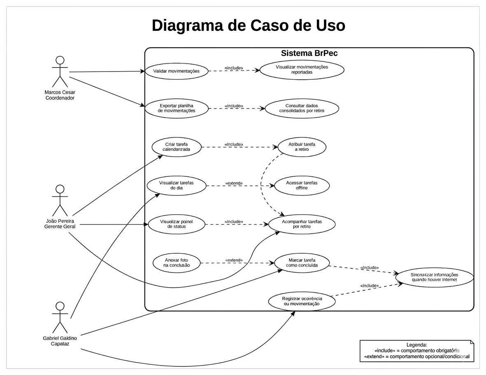
  <p>Fonte: Próprios autores (2026).</p>
</center>

UC01 — Planejar tarefas (RF001)
| Campo | Descrição |
| ------------------ | ------------------------------------------------------------------------------------------ |
| Ator principal | Gerente Geral |
| Atores secundários | Não se aplica |
| Pré-condições | O sistema deve estar acessível e o usuário autenticado |
| Fluxo principal | O gerente define uma nova tarefa, estabelece prazos e descreve a atividade a ser executada |
| Pós-condições | A tarefa é registrada no sistema e fica disponível para distribuição |

<center>
  <p><strong>Quadro 11</strong> — Caso de Uso UC01</p>
</center>

<center>
  <p>Fonte: Próprios autores (2026).</p>
</center>

UC02 — Distribuir tarefas por retiro (RF002)
| Campo | Descrição |
| ------------------ | ----------------------------------------------------------------------- |
| Ator principal | Gerente Geral |
| Atores secundários | Não se aplica |
| Pré-condições | Deve existir ao menos uma tarefa previamente cadastrada |
| Fluxo principal | O gerente associa a tarefa a um ou mais retiros, definindo responsáveis |
| Pós-condições | A tarefa é atribuída e visível para execução pelos capatazes |

<center>
  <p><strong>Quadro 12</strong> — Caso de Uso UC02</p>
</center>

<center>
  <p>Fonte: Próprios autores (2026).</p>
</center>

UC03 — Visualizar tarefas do dia (RF003)
| Campo | Descrição |
| ------------------ | ------------------------------------------------------------------- |
| Ator principal | Capataz |
| Atores secundários | Não se aplica |
| Pré-condições | O capataz deve estar autenticado no sistema |
| Fluxo principal | O capataz acessa a lista de tarefas disponíveis para o dia corrente |
| Pós-condições | As tarefas são exibidas para execução |

<center>
  <p><strong>Quadro 13</strong> — Caso de Uso UC03</p>
</center>

<center>
  <p>Fonte: Próprios autores (2026).</p>
</center>

UC04 — Registrar execução de tarefa (RF004)
| Campo | Descrição |
| ------------------ | ------------------------------------------------------------ |
| Ator principal | Capataz |
| Atores secundários | Não se aplica |
| Pré-condições | Deve existir uma tarefa atribuída ao capataz |
| Fluxo principal | O capataz marca a tarefa como concluída no sistema |
| Pós-condições | A tarefa é registrada como concluída e atualizada no sistema |

<center>
  <p><strong>Quadro 14</strong> — Caso de Uso UC04</p>
</center>

<center>
  <p>Fonte: Próprios autores (2026).</p>
</center>

UC05 — Anexar evidência (RF005)
| Campo | Descrição |
| ------------------ | --------------------------------------------------------------- |
| Ator principal | Capataz |
| Atores secundários | Não se aplica |
| Pré-condições | A tarefa deve estar em processo de conclusão |
| Fluxo principal | O capataz adiciona uma foto ou áudio como evidência da execução |
| Pós-condições | A evidência é armazenada e vinculada à tarefa |

<center>
  <p><strong>Quadro 15</strong> — Caso de Uso UC05</p>
</center>

<center>
  <p>Fonte: Próprios autores (2026).</p>
</center>

UC06 — Registrar movimentação (RF006)
| Campo | Descrição |
| ------------------ | ---------------------------------------------------------- |
| Ator principal | Capataz |
| Atores secundários | Não se aplica |
| Pré-condições | O sistema deve estar disponível para registro |
| Fluxo principal | O capataz registra uma movimentação relacionada ao rebanho |
| Pós-condições | A movimentação é armazenada para posterior validação |

<center>
  <p><strong>Quadro 16</strong> — Caso de Uso UC06</p>
</center>

<center>
  <p>Fonte: Próprios autores (2026).</p>
</center>

UC07 — Validar movimentações (RF007)
| Campo | Descrição |
| ------------------ | ---------------------------------------------------------- |
| Ator principal | Coordenador |
| Atores secundários | Não se aplica |
| Pré-condições | Devem existir movimentações previamente registradas |
| Fluxo principal | O coordenador revisa e valida as movimentações registradas |
| Pós-condições | As movimentações são confirmadas e consideradas válidas |

<center>
  <p><strong>Quadro 17</strong> — Caso de Uso UC07</p>
</center>

<center>
  <p>Fonte: Próprios autores (2026).</p>
</center>

UC08 — Consultar dados consolidados (RF008)
| Campo | Descrição |
| ------------------ | --------------------------------------------------- |
| Ator principal | Coordenador |
| Atores secundários | Gerente Geral |
| Pré-condições | Devem existir dados registrados no sistema |
| Fluxo principal | O usuário acessa relatórios consolidados por retiro |
| Pós-condições | As informações são exibidas para análise |

<center>
  <p><strong>Quadro 18</strong> — Caso de Uso UC08</p>
</center>

<center>
  <p>Fonte: Próprios autores (2026).</p>
</center>

UC09 — Exportar relatórios (RF009)
| Campo | Descrição |
| ------------------ | -------------------------------------------------------------------- |
| Ator principal | Coordenador |
| Atores secundários | Não se aplica |
| Pré-condições | Deve haver dados consolidados disponíveis |
| Fluxo principal | O coordenador solicita a exportação dos dados em formato estruturado |
| Pós-condições | O relatório é gerado e disponibilizado para download |

<center>
  <p><strong>Quadro 19</strong> — Caso de Uso UC09</p>
</center>

<center>
  <p>Fonte: Próprios autores (2026).</p>
</center>

### 3.2.3. Diagrama de Classes do Dominio (sprint 2)

O Diagrama de Classes do Domínio representa, em notação UML, a estrutura estática
do sistema BrPec: suas entidades principais, os atributos que as compõem, os métodos
que encapsulam seu comportamento e os relacionamentos que as interligam. Conforme
definido pelo Object Management Group (OMG) na especificação UML 2.5.1, o diagrama
de classes é o principal artefato de modelagem estrutural da linguagem, sendo empregado
para visualizar, especificar, construir e documentar os elementos conceituais de um
sistema de software [14]. A notação utilizada segue as convenções formais consolidadas
dessa especificação, diferenciando com precisão os tipos de relacionamento —
**associação**, **agregação** (losango vazio), **composição** (losango cheio) e
**herança** (triângulo vazio) —, com multiplicidade explicitada em todas as
extremidades.

A modelagem segue também as diretrizes consolidadas por Booch, Rumbaugh e Jacobson
em *The Unified Modeling Language User Guide* [21], obra de referência dos criadores
originais da linguagem, que estabelece o diagrama de classes como o bloco fundamental
de construção do UML, sendo todos os outros diagramas coleções de classes ou
representações de relações entre elas. Complementarmente, as boas práticas de
modelagem estrutural adotadas no projeto baseiam-se em Fowler [15], cuja obra _UML
Distilled_ orienta o uso do diagrama de classes como ferramenta de comunicação de
design orientado a objetos, enfatizando clareza, coesão e rastreabilidade entre modelo
e requisitos. A estrutura de classes abstratas e a organização das responsabilidades
entre as entidades seguem ainda os princípios de modelagem de domínio descritos por
Larman [16], que fundamentam a identificação de classes conceituais abstratas como
mecanismo para restringir quais classes podem ter instâncias concretas, esclarecendo
as regras do domínio do problema.

A norma ISO/IEC 19505-2:2012, que publica formalmente a especificação UML como padrão
internacional, define que o diagrama de classes deve prover uma definição formal dos
conceitos de modelagem, seus atributos e seus relacionamentos, bem como as regras para
combiná-los na construção de modelos parciais ou completos [17]. O modelo foi construído
a partir da análise cruzada dos Requisitos Funcionais (RF), das Regras de Negócio (RN)
e dos Casos de Uso (UC) definidos nas seções anteriores, garantindo rastreabilidade
entre as decisões de modelagem e os demais artefatos de engenharia de requisitos do
projeto.

<center>
  <p><strong>Figura 9</strong> — Diagrama de Classes do Domínio do Sistema BrPec</p>
  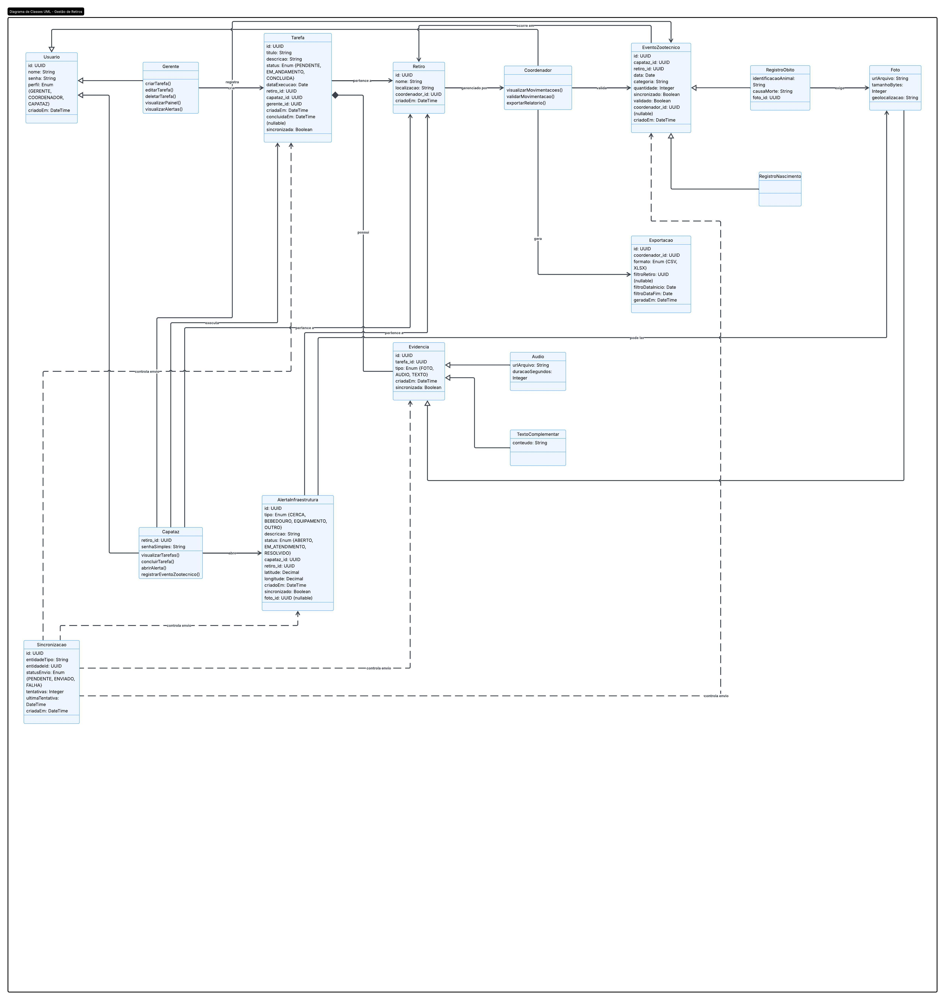
  <p>Fonte: Próprios autores (2026).</p>
</center>

O diagrama é organizado em três camadas conceituais:

- **Camada de Identidade e Acesso:** agrupa a hierarquia de usuários do sistema
  (`Usuario`, `Gerente`, `Coordenador` e `Capataz`), modelada por herança, refletindo
  os três perfis de acesso e as responsabilidades distintas de cada ator, conforme
  descritos na seção 3.1;
- **Camada Operacional:** concentra as entidades centrais do fluxo de trabalho —
  `Retiro`, `Tarefa`, `Evidencia` e `AlertaInfraestrutura` —, que materializam o
  planejamento, a execução e o reporte das atividades de campo (US01 a US07);
- **Camada Zootécnica e de Controle:** reúne os registros de eventos do rebanho —
  `EventoZootecnico`, `RegistroNascimento` e `RegistroObito` —, que suportam o controle
  pecuário offline (US08 a US10), além da entidade `Sincronizacao`, responsável pela
  gestão do ciclo de envio de dados ao servidor central, e `Exportacao`, que atende à
  demanda do Coordenador de geração de relatórios estruturados (RF015).

A decisão de modelar `Evidencia` e `EventoZootecnico` como classes abstratas decorre
da necessidade de encapsular atributos e comportamentos comuns — como o vínculo com
a tarefa ou com o retiro e o controle de sincronização offline —, evitando duplicação
nas subclasses concretas (`Foto`, `Audio`, `TextoComplementar`, `RegistroNascimento`
e `RegistroObito`). Segundo Larman [16], é útil identificar classes abstratas no modelo
de domínio porque elas restringem quais classes podem ter instâncias concretas,
esclarecendo as regras do domínio do problema: se toda instância de um conceito deve,
obrigatoriamente, ser uma instância de uma de suas subclasses, então esse conceito é
abstrato por definição. A classe `Sincronizacao`, por sua vez, foi isolada como
entidade independente para suportar o requisito não funcional de Confiabilidade
(RNF — CONF), que determina 0% de perda de dados em falhas de conexão, sem
sobrecarregar as demais classes com atributos de controle de rede — decisão alinhada
ao princípio de responsabilidade única descrito por Fowler [15] como critério de
coesão em modelos orientados a objetos.

A seguir, são detalhados os atributos, tipos de dado e métodos de cada classe
modelada no diagrama, organizados por camada conceitual. Os tipos adotam a notação
primitiva do domínio de aplicação, compatível com as tecnologias de persistência
previstas na arquitetura (SQLite para armazenamento local e banco relacional central).
Conforme orientam Booch, Rumbaugh e Jacobson [14], cada atributo de uma classe define
o seu estado em um dado instante, enquanto os métodos definem o seu comportamento,
devendo ambos ser especificados com o nível de detalhe adequado à fase de modelagem
em que o diagrama é produzido.

---

**Camada de Identidade e Acesso**

A hierarquia de usuários é fundamentada em uma superclasse abstrata `Usuario`, que centraliza os atributos de identificação e autenticação comuns a todos os perfis. As subclasses concretas herdam esses atributos e estendem o comportamento de acordo com as responsabilidades de cada ator, conforme modelado nos casos de uso UC01 a UC09.

<center>
  <p><strong>Tabela 8</strong> — Atributos da Classe <em>Usuario</em> (superclasse abstrata)</p>
</center>

| Atributo | Tipo     | Obrigatório | Descrição                                                               |
| -------- | -------- | ----------- | ----------------------------------------------------------------------- |
| id       | UUID     | Sim         | Identificador único do usuário, gerado automaticamente                  |
| nome     | String   | Sim         | Nome completo do usuário                                                |
| senha    | String   | Sim         | Credencial de acesso; para Capataz, senha simples definida pelo Gerente |
| perfil   | Enum     | Sim         | Tipo do ator: `GERENTE`, `COORDENADOR` ou `CAPATAZ`                     |
| criadoEm | DateTime | Sim         | Timestamp de criação do registro, gerado pelo sistema                   |

<center>
  <p>Fonte: Próprios autores (2026).</p>
</center>

<center>
  <p><strong>Tabela 9</strong> — Atributos e Métodos da Classe <em>Gerente</em></p>
</center>

| Elemento             | Tipo/Retorno | Descrição                                                           |
| -------------------- | ------------ | ------------------------------------------------------------------- |
| _(herda de Usuario)_ | —            | Todos os atributos da superclasse são herdados                      |
| criarTarefa()        | Tarefa       | Instancia uma nova tarefa e a associa a um retiro e a um capataz    |
| editarTarefa()       | Tarefa       | Atualiza os dados de uma tarefa existente                           |
| deletarTarefa()      | void         | Remove uma tarefa do sistema, desde que não esteja concluída        |
| visualizarPainel()   | void         | Acessa o painel consolidado de status de tarefas e alertas (RF007)  |
| visualizarAlertas()  | void         | Acessa os alertas de infraestrutura abertos pelos capatazes (RF006) |

<center>
  <p>Fonte: Próprios autores (2026).</p>
</center>

<center>
  <p><strong>Tabela 10</strong> — Atributos e Métodos da Classe <em>Coordenador</em></p>
</center>

| Elemento                  | Tipo/Retorno             | Descrição                                                                          |
| ------------------------- | ------------------------ | ---------------------------------------------------------------------------------- |
| _(herda de Usuario)_      | —                        | Todos os atributos da superclasse são herdados                                     |
| visualizarMovimentacoes() | List\<EventoZootecnico\> | Recupera todos os eventos zootécnicos dos retiros sob sua responsabilidade         |
| validarMovimentacao()     | void                     | Confirma a integridade de um evento zootécnico, alterando seu status para validado |
| exportarRelatorio()       | Exportacao               | Gera e disponibiliza arquivo CSV/XLSX com os dados consolidados (RF015)            |

<center>
  <p>Fonte: Próprios autores (2026).</p>
</center>

<center>
  <p><strong>Tabela 11</strong> — Atributos e Métodos da Classe <em>Capataz</em></p>
</center>

| Elemento                    | Tipo/Retorno         | Descrição                                                                               |
| --------------------------- | -------------------- | --------------------------------------------------------------------------------------- |
| _(herda de Usuario)_        | —                    | Todos os atributos da superclasse são herdados                                          |
| retiro_id                   | UUID                 | Chave estrangeira que vincula o Capataz a um único Retiro (RN01, RN05)                  |
| visualizarTarefas()         | List\<Tarefa\>       | Recupera as tarefas do dia do retiro ao qual o capataz pertence (RF002)                 |
| concluirTarefa()            | void                 | Atualiza o status de uma tarefa para `CONCLUIDA` e aciona o envio de evidências (RF003) |
| abrirAlerta()               | AlertaInfraestrutura | Registra um novo alerta de infraestrutura com geolocalização (RF006)                    |
| registrarEventoZootecnico() | EventoZootecnico     | Preenche e persiste localmente um evento de nascimento ou óbito (RF008, RF009)          |

<center>
  <p>Fonte: Próprios autores (2026).</p>
</center>

**Camada Operacional**

Essa camada concentra as entidades que sustentam o fluxo principal de trabalho do sistema: o planejamento e a distribuição de tarefas pelo Gerente, a execução e o reporte pelo Capataz e a supervisão pelo Coordenador.

<center>
  <p><strong>Tabela 12</strong> — Atributos da Classe <em>Retiro</em></p>
</center>

| Atributo       | Tipo     | Obrigatório | Descrição                                                    |
| -------------- | -------- | ----------- | ------------------------------------------------------------ |
| id             | UUID     | Sim         | Identificador único do retiro                                |
| nome           | String   | Sim         | Nome de identificação do retiro na fazenda                   |
| localizacao    | String   | Sim         | Descrição geográfica ou referência da área do retiro         |
| coordenador_id | UUID     | Sim         | Chave estrangeira para o Coordenador responsável pelo retiro |
| criadoEm       | DateTime | Sim         | Timestamp de cadastro do retiro no sistema                   |

<center>
  <p>Fonte: Próprios autores (2026).</p>
</center>

<center>
  <p><strong>Tabela 13</strong> — Atributos da Classe <em>Tarefa</em></p>
</center>

| Atributo     | Tipo     | Obrigatório | Descrição                                                                         |
| ------------ | -------- | ----------- | --------------------------------------------------------------------------------- |
| id           | UUID     | Sim         | Identificador único da tarefa                                                     |
| titulo       | String   | Sim         | Título resumido da atividade a ser executada                                      |
| descricao    | String   | Não         | Detalhamento das instruções para o capataz                                        |
| status       | Enum     | Sim         | Estado atual da tarefa: `PENDENTE`, `EM_ANDAMENTO` ou `CONCLUIDA`                 |
| dataExecucao | Date     | Sim         | Data prevista para execução da tarefa (base para a regra RN02)                    |
| retiro_id    | UUID     | Sim         | Chave estrangeira para o Retiro ao qual a tarefa está vinculada (RN01)            |
| capataz_id   | UUID     | Sim         | Chave estrangeira para o Capataz responsável pela execução (RN01)                 |
| gerente_id   | UUID     | Sim         | Chave estrangeira para o Gerente que criou a tarefa (RF001)                       |
| criadaEm     | DateTime | Sim         | Timestamp de criação da tarefa, injetado automaticamente pelo sistema (RNF — SEG) |
| concluidaEm  | DateTime | Não         | Timestamp de conclusão, preenchido quando o status é alterado para `CONCLUIDA`    |
| sincronizada | Boolean  | Sim         | Indica se o registro já foi transmitido ao servidor central (RF010)               |

<center>
  <p>Fonte: Próprios autores (2026).</p>
</center>

A classe `Evidencia` é modelada como abstrata por reunir o comportamento comum às três formas de comprovação da execução de tarefas previstas no sistema — foto, áudio e texto —, sem que nenhuma instância de `Evidencia` pura faça sentido no domínio. Cada subclasse concreta especializa os atributos de acordo com o meio de registro.

<center>
  <p><strong>Tabela 14</strong> — Atributos da Classe Abstrata <em>Evidencia</em> e Subclasses</p>
</center>

| Classe                | Atributo        | Tipo     | Obrigatório | Descrição                                                         |
| --------------------- | --------------- | -------- | ----------- | ----------------------------------------------------------------- |
| **Evidencia**         | id              | UUID     | Sim         | Identificador único da evidência                                  |
| **Evidencia**         | tarefa_id       | UUID     | Sim         | Chave estrangeira para a Tarefa à qual a evidência está vinculada |
| **Evidencia**         | tipo            | Enum     | Sim         | Natureza da evidência: `FOTO`, `AUDIO` ou `TEXTO`                 |
| **Evidencia**         | criadaEm        | DateTime | Sim         | Timestamp de criação, gerado automaticamente pelo sistema         |
| **Evidencia**         | sincronizada    | Boolean  | Sim         | Indica se o arquivo já foi transmitido ao servidor (RF010, RN11)  |
| **Foto**              | urlArquivo      | String   | Sim         | Caminho ou URL do arquivo de imagem após sincronização            |
| **Foto**              | tamanhoBytes    | Integer  | Sim         | Tamanho do arquivo em bytes, para controle de capacidade          |
| **Foto**              | geolocalizacao  | String   | Sim         | Coordenadas GPS capturadas no momento do registro (RN19, RN24)    |
| **Audio**             | urlArquivo      | String   | Sim         | Caminho ou URL do arquivo de áudio após sincronização             |
| **Audio**             | duracaoSegundos | Integer  | Sim         | Duração da gravação em segundos (RF005, RN14)                     |
| **TextoComplementar** | conteudo        | String   | Sim         | Conteúdo textual inserido pelo capataz como complemento da tarefa |

<center>
  <p>Fonte: Próprios autores (2026).</p>
</center>

<center>
  <p><strong>Tabela 15</strong> — Atributos da Classe <em>AlertaInfraestrutura</em></p>
</center>

| Atributo     | Tipo     | Obrigatório | Descrição                                                                     |
| ------------ | -------- | ----------- | ----------------------------------------------------------------------------- |
| id           | UUID     | Sim         | Identificador único do alerta                                                 |
| tipo         | Enum     | Sim         | Categoria do problema: `CERCA`, `BEBEDOURO`, `EQUIPAMENTO` ou `OUTRO` (RF006) |
| descricao    | String   | Não         | Detalhamento adicional fornecido pelo capataz                                 |
| status       | Enum     | Sim         | Situação do chamado: `ABERTO`, `EM_ATENDIMENTO` ou `RESOLVIDO`                |
| capataz_id   | UUID     | Sim         | Chave estrangeira para o Capataz que originou o alerta                        |
| retiro_id    | UUID     | Sim         | Chave estrangeira para o Retiro onde o problema foi identificado (RN26)       |
| latitude     | Decimal  | Sim         | Coordenada geográfica capturada automaticamente pelo sistema (RN19, RN24)     |
| longitude    | Decimal  | Sim         | Coordenada geográfica capturada automaticamente pelo sistema (RN19, RN24)     |
| criadoEm     | DateTime | Sim         | Timestamp de criação do alerta, registrado automaticamente (RN25)             |
| sincronizado | Boolean  | Sim         | Indica se o alerta já foi transmitido ao servidor (RN20, RN21)                |
| foto_id      | UUID     | Não         | Chave estrangeira opcional para uma Foto associada ao chamado                 |

<center>
  <p>Fonte: Próprios autores (2026).</p>
</center>

**Camada Zootécnica e de Controle**

Essa camada concentra os registros de eventos do rebanho e as entidades de suporte à operação offline e à geração de relatórios. A classe `EventoZootecnico` é modelada como abstrata pelo mesmo princípio aplicado a `Evidencia`: nascimentos e óbitos compartilham atributos estruturais comuns, mas possuem campos obrigatórios e regras de validação distintos, justificando a especialização em subclasses concretas.

<center>
  <p><strong>Tabela 16</strong> — Atributos da Classe Abstrata <em>EventoZootecnico</em> e Subclasses</p>
</center>

| Classe                 | Atributo                     | Tipo     | Obrigatório | Descrição                                                                                |
| ---------------------- | ---------------------------- | -------- | ----------- | ---------------------------------------------------------------------------------------- |
| **EventoZootecnico**   | id                           | UUID     | Sim         | Identificador único do evento                                                            |
| **EventoZootecnico**   | capataz_id                   | UUID     | Sim         | Chave estrangeira para o Capataz que realizou o registro                                 |
| **EventoZootecnico**   | retiro_id                    | UUID     | Sim         | Chave estrangeira para o Retiro de origem do evento                                      |
| **EventoZootecnico**   | data                         | Date     | Sim         | Data de ocorrência do evento no campo                                                    |
| **EventoZootecnico**   | categoria                    | String   | Sim         | Categoria do animal envolvido (ex.: bezerro, vaca, touro)                                |
| **EventoZootecnico**   | quantidade                   | Integer  | Sim         | Quantidade de animais envolvidos no evento                                               |
| **EventoZootecnico**   | sincronizado                 | Boolean  | Sim         | Indica se o registro foi transmitido ao servidor central (RF010, RF012)                  |
| **EventoZootecnico**   | validado                     | Boolean  | Sim         | Indica se o Coordenador confirmou a integridade do registro (RF014)                      |
| **EventoZootecnico**   | coordenador_id               | UUID     | Não         | Chave estrangeira preenchida pelo sistema após validação pelo Coordenador                |
| **EventoZootecnico**   | criadoEm                     | DateTime | Sim         | Timestamp de criação local do registro, injetado automaticamente (RNF — SEG)             |
| **RegistroNascimento** | _(sem atributos adicionais)_ | —        | —           | Especialização de EventoZootecnico para nascimentos (US08, RF008)                        |
| **RegistroObito**      | identificacaoAnimal          | String   | Sim         | Identificação individual do animal (brinco, marca ou descrição) (RF013)                  |
| **RegistroObito**      | causaMorte                   | String   | Sim         | Causa declarada do óbito, campo obrigatório para validação sanitária (RF013)             |
| **RegistroObito**      | foto_id                      | UUID     | Sim         | Chave estrangeira para a Foto obrigatória da carcaça, exigida para auditoria (US09, CR2) |

<center>
  <p>Fonte: Próprios autores (2026).</p>
</center>

<center>
  <p><strong>Tabela 17</strong> — Atributos da Classe <em>Sincronizacao</em></p>
</center>

| Atributo        | Tipo     | Obrigatório | Descrição                                                                           |
| --------------- | -------- | ----------- | ----------------------------------------------------------------------------------- |
| id              | UUID     | Sim         | Identificador único do registro de sincronização                                    |
| entidadeTipo    | String   | Sim         | Nome da classe da entidade gerenciada (ex.: `"Tarefa"`, `"RegistroObito"`)          |
| entidadeId      | UUID     | Sim         | Identificador da instância específica da entidade a ser sincronizada                |
| statusEnvio     | Enum     | Sim         | Estado da transmissão: `PENDENTE`, `ENVIADO` ou `FALHA`                             |
| tentativas      | Integer  | Sim         | Contador de tentativas de envio realizadas pelo sistema (RF012)                     |
| ultimaTentativa | DateTime | Não         | Timestamp da última tentativa de sincronização, atualizado a cada ciclo             |
| criadaEm        | DateTime | Sim         | Timestamp de criação do registro de controle, gerado no momento do salvamento local |

<center>
  <p>Fonte: Próprios autores (2026).</p>
</center>

<center>
  <p><strong>Tabela 18</strong> — Atributos da Classe <em>Exportacao</em></p>
</center>

| Atributo         | Tipo     | Obrigatório | Descrição                                                                     |
| ---------------- | -------- | ----------- | ----------------------------------------------------------------------------- |
| id               | UUID     | Sim         | Identificador único do registro de exportação                                 |
| coordenador_id   | UUID     | Sim         | Chave estrangeira para o Coordenador que solicitou a exportação               |
| formato          | Enum     | Sim         | Formato do arquivo gerado: `CSV` ou `XLSX` (RF015, RN28, RNF — ORG)           |
| filtroRetiro     | UUID     | Não         | Filtro opcional por retiro específico, aplicado na consulta dos dados         |
| filtroDataInicio | Date     | Não         | Limite inferior do intervalo de datas aplicado ao conjunto de dados exportado |
| filtroDataFim    | Date     | Não         | Limite superior do intervalo de datas aplicado ao conjunto de dados exportado |
| geradaEm         | DateTime | Sim         | Timestamp de geração do arquivo, registrado automaticamente pelo sistema      |

<center>
  <p>Fonte: Próprios autores (2026).</p>
</center>

#### Síntese dos Relacionamentos

A Tabela 19 consolida todos os relacionamentos modelados no diagrama, com seus tipos UML formais e as multiplicidades em cada extremidade, garantindo a rastreabilidade com os requisitos e regras de negócio que os originaram.

<center>
  <p><strong>Tabela 19</strong> — Síntese dos Relacionamentos do Diagrama de Classes</p>
</center>

| Classe Origem        | Tipo UML            | Classe Destino       | Multiplicidade | Rastreabilidade    |
| -------------------- | ------------------- | -------------------- | -------------- | ------------------ |
| Usuario              | Herança (△)         | Gerente              | —              | UC01, UC02         |
| Usuario              | Herança (△)         | Coordenador          | —              | UC07, UC08, UC09   |
| Usuario              | Herança (△)         | Capataz              | —              | UC03 a UC06        |
| Evidencia            | Herança (△)         | Foto                 | —              | RF004, US04        |
| Evidencia            | Herança (△)         | Audio                | —              | RF005, US05        |
| Evidencia            | Herança (△)         | TextoComplementar    | —              | RF005              |
| EventoZootecnico     | Herança (△)         | RegistroNascimento   | —              | RF008, US08        |
| EventoZootecnico     | Herança (△)         | RegistroObito        | —              | RF009, US09        |
| Gerente              | Associação          | Tarefa               | 1 para N       | RF001, RN01        |
| Capataz              | Associação          | Tarefa               | 1 para N       | RF002, RN05        |
| Capataz              | Associação          | Retiro               | N para 1       | RN01, RN05         |
| Tarefa               | Composição (◆)      | Evidencia            | 1 para 0..N    | RF004, RF005, RN10 |
| Tarefa               | Associação          | Retiro               | N para 1       | RF001, RN01        |
| Retiro               | Associação          | Coordenador          | N para 1       | UC07               |
| Capataz              | Associação          | AlertaInfraestrutura | 1 para N       | RF006, RN19        |
| AlertaInfraestrutura | Associação          | Retiro               | N para 1       | RN26               |
| AlertaInfraestrutura | Associação          | Foto                 | 1 para 0..1    | RF006              |
| Capataz              | Associação          | EventoZootecnico     | 1 para N       | RF008, RF009       |
| EventoZootecnico     | Associação          | Retiro               | N para 1       | RF008, RF009       |
| Coordenador          | Associação          | EventoZootecnico     | 1 para N       | RF014, RN28        |
| RegistroObito        | Associação          | Foto                 | 1 para 1       | US09, CR2, RF013   |
| Coordenador          | Associação          | Exportacao           | 1 para N       | RF015, RN28        |
| Sincronizacao        | Dependência (- - →) | Tarefa               | 1 para 1       | RF010, RF012       |
| Sincronizacao        | Dependência (- - →) | Evidencia            | 1 para 1       | RF010, RF012       |
| Sincronizacao        | Dependência (- - →) | AlertaInfraestrutura | 1 para 1       | RN20, RN21         |
| Sincronizacao        | Dependência (- - →) | EventoZootecnico     | 1 para 1       | RF010, RF012       |

<center>
  <p>Fonte: Próprios autores (2026).</p>
</center>

### 3.2.4. Diagrama de Sequência UML (sprint 3)

O Diagrama de Sequência UML constitui um dos quatro tipos de diagrama de interação previstos pela especificação UML 2.5.1, sendo formalmente classificado como um diagrama comportamental que enfatiza a troca ordenada de mensagens entre participantes ao longo do tempo [13]. Segundo o Object Management Group (OMG), a semântica de uma interação é definida como um par de conjuntos de *traces* — sequências válidas e inválidas de ocorrências de eventos —, de modo que cada diagrama de sequência representa, de forma gráfica, os cenários de comunicação aceitos pelo sistema modelado [13][18]. A notação adotada emprega linhas de vida (*lifelines*) para representar os participantes, setas contínuas para mensagens síncronas e setas tracejadas para retornos, com fragmentos combinados (*combined fragments*) do tipo `alt` para expressar ramificações condicionais no fluxo de execução, conforme as convenções consolidadas por Fowler [15] e detalhadas na norma ISO/IEC 19505-2:2012 [17].

No contexto do sistema BrPec, os diagramas de sequência foram elaborados para representar os fluxos operacionais críticos identificados nas User Stories (US01 a US05) e nos Requisitos Funcionais (RF001 a RF015), detalhando a interação entre o ator externo — Gerente ou Capataz — e as camadas internas da arquitetura da aplicação. A estrutura de camadas adotada segue o padrão Controller–Service–Repository, amplamente documentado na literatura de engenharia de software como uma instância concreta da arquitetura em camadas (*layered architecture*) [19], na qual cada componente possui responsabilidade única e bem delimitada:

- **Controller:** recebe a requisição HTTP, valida a presença dos campos obrigatórios e delega o processamento à camada de negócio, sem acessar o banco de dados diretamente;
- **Service:** aplica as regras de negócio do domínio (RNs) e orquestra as chamadas ao Repository, encapsulando a lógica que determina se a operação será executada localmente ou remotamente;
- **Repository:** abstrai o acesso ao mecanismo de persistência — banco de dados central (SQLite no servidor) ou armazenamento local (IndexedDB no dispositivo) —, expondo uma interface uniforme ao Service independentemente da origem dos dados;
- **Banco de dados / Armazenamento Local:** camada de persistência que varia conforme o modo de operação do dispositivo (online ou offline).

Essa separação garante que as regras de negócio permaneçam isoladas das preocupações de transporte HTTP e de persistência, facilitando a manutenção e a evolução do sistema — critério alinhado ao requisito não funcional de Suportabilidade (RNF — SUP), que limita o Tempo Médio de Reparo (MTTR) a 8 horas para defeitos críticos.

Os diagramas subsequentes cobrem tanto operações executadas em ambiente conectado (DS01) quanto fluxos que operam integralmente em modo offline, com sincronização assíncrona posterior (DS02, DS03, DS04). A diferenciação explícita entre os dois modos de operação constitui um requisito estrutural do projeto, visto que os retiros da BrPec dispõem de conectividade Starlink apenas em janelas limitadas (manhã e noite), exigindo que a aplicação funcione como fonte primária de dados localmente e trate a rede como camada de sincronização secundária — paradigma denominado *offline-first* na literatura de sistemas distribuídos [20]. Cada diagrama inclui, ao final, tabela de rastreabilidade que vincula os elementos representados às User Stories, Requisitos Funcionais, Regras de Negócio e Requisitos Não Funcionais correspondentes, assegurando a coerência com os demais artefatos de engenharia de requisitos do projeto.

#### Fundamentação Tecnológica: Persistência Offline e Sincronização

Os diagramas de sequência apresentados nesta seção referenciam, de forma recorrente, componentes de persistência local e mecanismos de sincronização assíncrona que fundamentam a operação offline da aplicação. A presente subseção detalha as tecnologias adotadas e justifica as decisões arquiteturais que sustentam o funcionamento do sistema nos retiros da BrPec, onde a conectividade à internet é restrita a janelas de cobertura Starlink.

**SQLite — Banco de dados relacional do servidor**

O SQLite é um sistema de gerenciamento de banco de dados relacional (*RDBMS*) autocontido (*self-contained*), sem servidor (*serverless*) e de configuração zero (*zero-configuration*) [21]. Diferentemente de sistemas cliente-servidor convencionais — como PostgreSQL ou MySQL —, o SQLite opera como uma biblioteca vinculada diretamente ao processo da aplicação, lendo e gravando o banco de dados como um arquivo único no disco, sem a necessidade de um processo daemon separado [21]. Essa característica o torna particularmente adequado ao contexto da BrPec, em que a infraestrutura de servidor deve ser leve e de fácil implantação, dado que os nós de processamento central operam em ambientes com recursos computacionais limitados.

No escopo da arquitetura do sistema, o SQLite é empregado como banco de dados central do servidor Node.js, persistindo todas as entidades modeladas no Diagrama de Classes (seção 3.2.3): `Usuario`, `Tarefa`, `Evidencia`, `EventoZootecnico`, `AlertaInfraestrutura`, `Sincronizacao` e `Exportacao`. Os diagramas de sequência DS01 (Criar Tarefa) e os fluxos de sincronização dos diagramas DS03 e DS04 representam a interação do Repository com esse banco central por meio de instruções SQL padrão (`INSERT`, `SELECT`, `UPDATE`), garantindo a compatibilidade com o modelo relacional definido nas tabelas de atributos da seção 3.2.3. A escolha pelo SQLite no servidor está alinhada ao requisito não funcional de Desempenho (RNF — DES), que exige latência p95 inferior a 200 ms para operações de leitura e escrita, e ao requisito de Suportabilidade (RNF — SUP), dado que o SQLite dispensa a administração de processos, usuários e permissões de banco de dados, reduzindo a complexidade operacional de manutenção.

A escolha pelo SQLite no servidor fundamenta-se em três critérios: (i) suporte nativo a transações ACID garante integridade mesmo em interrupções abruptas (RNF — CONF); (ii) consultas SQL relacionais permitem filtrar tarefas por `capataz_id`, `retiro_id` e `data_execucao` sem carregar conjuntos completos em memória; (iii) ausência de processo daemon reduz a complexidade operacional de manutenção (RNF — SUP).

**IndexedDB — Armazenamento local no dispositivo do capataz**

O IndexedDB é uma API de armazenamento local de baixo nível, padronizada pelo W3C, projetada para a persistência de volumes significativos de dados estruturados no navegador do cliente [22]. Trata-se de um banco de dados transacional não relacional (*NoSQL*), com suporte a índices sobre propriedades de objetos, que opera de forma inteiramente assíncrona para evitar o bloqueio da interface do usuário [22].

No sistema BrPec, o IndexedDB é utilizado nos dispositivos móveis dos capatazes como camada de armazenamento local para as tarefas sincronizadas, evidências (fotos e áudios), registros de eventos zootécnicos e alertas de infraestrutura. Conforme representado nos diagramas DS02, DS03 e DS04, o Repository abstrai o acesso ao IndexedDB por meio da mesma interface exposta ao Service, de modo que as operações de leitura e escrita sejam transparentes à camada de negócio — independentemente de o dispositivo estar online ou offline. A tabela `sincronizacoes`, persistida no IndexedDB, funciona como fila de controle de envio, registrando cada entidade modificada localmente com status `PENDENTE`, `ENVIADO` ou `FALHA`, e o respectivo contador de tentativas de reenvio, conforme previsto nos requisitos RF010, RF011 e RF012.

A decisão de adotar o IndexedDB como mecanismo de armazenamento local, em complemento ao SQLite do servidor, decorre de três fatores técnicos: (i) o IndexedDB é nativamente disponível em todos os navegadores modernos, sem necessidade de extensões ou plugins; (ii) sua natureza transacional garante a integridade dos dados mesmo em cenários de interrupção abrupta da aplicação, como queda de bateria ou encerramento involuntário do navegador; e (iii) sua capacidade de armazenamento excede amplamente as limitações do Web Storage (5 MB típico), suportando os volumes de fotos codificadas em base64 e registros acumulados durante os períodos sem conexão — requisito crítico dado que os capatazes podem operar offline durante todo o intervalo entre as janelas de Starlink.

**Service Workers e Background Sync — Sincronização assíncrona**

O mecanismo de sincronização representado nos diagramas DS03 e DS04 pelo participante `SyncService` é implementado tecnicamente por meio de Service Workers em combinação com a Background Synchronization API [23]. O Service Worker é um script executado pelo navegador em segundo plano, separado do contexto da página web, que permite interceptar requisições de rede, gerenciar o cache da aplicação e executar tarefas assíncronas mesmo quando o usuário não está interagindo ativamente com a interface [23].

A Background Sync API estende as capacidades do Service Worker ao permitir que ações diferidas — como o envio de tarefas concluídas ou evidências fotográficas — sejam registradas como eventos de sincronização pendentes e executadas automaticamente pelo navegador assim que uma conexão de rede estável for detectada [23]. No contexto operacional da BrPec, esse comportamento é essencial: o capataz registra a conclusão de tarefas e anexa evidências durante o período offline, e o SyncService, ativado automaticamente pela reconexão Starlink, percorre a fila de sincronizações pendentes no IndexedDB, transmite os dados ao servidor remoto e atualiza o status local para `ENVIADO` ou incrementa o contador de tentativas em caso de falha, conforme modelado nas ramificações `alt` dos diagramas DS03 e DS04.

Esse mecanismo implementa o padrão de *Outbox* [24], no qual toda operação que altera o estado local gera um registro de controle com status `PENDENTE` consumido pelo SyncService ao reconectar, garantindo que nenhuma operação seja perdida mesmo que o dispositivo seja desligado entre o registro e a sincronização (RF012).

A combinação dessas três camadas tecnológicas — SQLite no servidor, IndexedDB no cliente e Service Workers para sincronização — materializa a arquitetura *offline-first* exigida pelo contexto operacional do projeto, assegurando o cumprimento dos requisitos não funcionais de Confiabilidade (RNF — CONF: 0% de perda de dados em falhas de conexão), Desempenho (RNF — DES: latência p95 < 200 ms no armazenamento local) e Capacidade (RNF — CAP: sincronização em lote de até 500 eventos pendentes).

---

#### DS01 — Criar Tarefa (US01)

Fluxo que representa a criação de uma tarefa pelo Gerente, percorrendo as camadas Controller → Service → Repository → Banco. Mensagens síncronas são representadas por setas contínuas (`->>`) e retornos por setas tracejadas (`-->>`)

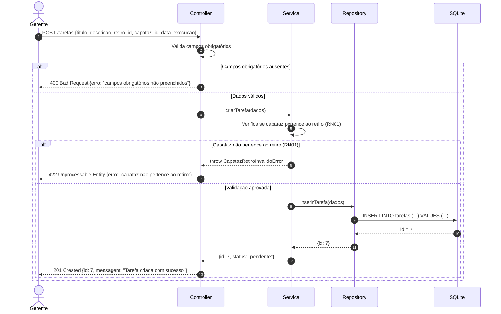
```mermaid
sequenceDiagram
    autonumber
    actor G as Gerente
    participant CTR as Controller
    participant SRV as Service
    participant REP as Repository
    participant DB as SQLite

    G->>CTR: POST /tarefas {titulo, descricao, retiro_id, capataz_id, data_execucao}
    CTR->>CTR: Valida campos obrigatórios

    alt Campos obrigatórios ausentes
        CTR-->>G: 400 Bad Request {erro: "campos obrigatórios não preenchidos"}
    else Dados válidos
        CTR->>SRV: criarTarefa(dados)
        SRV->>SRV: Verifica se capataz pertence ao retiro (RN01)

        alt Capataz não pertence ao retiro (RN01)
            SRV-->>CTR: throw CapatazRetiroInvalidoError
            CTR-->>G: 422 Unprocessable Entity {erro: "capataz não pertence ao retiro"}
        else Validação aprovada
            SRV->>REP: inserirTarefa(dados)
            REP->>DB: INSERT INTO tarefas (...) VALUES (...)
            DB-->>REP: id = 7
            REP-->>SRV: {id: 7}
            SRV-->>CTR: {id: 7, status: "pendente"}
            CTR-->>G: 201 Created {id: 7, mensagem: "Tarefa criada com sucesso"}
        end
    end
```

**Descrição das camadas:**

- **Controller (`TarefaController`):** recebe a requisição HTTP do Gerente, valida a presença dos campos obrigatórios e delega a lógica de negócio ao Service. Não acessa o banco diretamente.
- **Service (`TarefaService`):** aplica as regras de negócio do domínio — em especial a RN01, que impede a atribuição de uma tarefa a um capataz que não pertence ao retiro informado. Orquestra a chamada ao Repository.
- **Repository (`TarefaRepository`):** responsável exclusivamente pelo acesso ao banco de dados. Executa o `INSERT` e retorna o `id` gerado.
- **Banco (`SQLite`):** persiste o registro com `status = "pendente"` e retorna o identificador da nova linha.

**Fluxos cobertos:**

| Fluxo         | Descrição                                                                       |
| ------------- | ------------------------------------------------------------------------------- |
| Principal     | Gerente envia dados válidos → tarefa criada com status "pendente" → 201 Created |
| Alternativo 1 | Campo obrigatório ausente → Controller retorna 400 sem acionar o Service        |
| Alternativo 2 | Capataz não pertence ao retiro → Service lança erro → Controller retorna 422    |

**Rastreabilidade:**

| Elemento  | Referência                                                                                       |
| --------- | ------------------------------------------------------------------------------------------------ |
| US01      | Como gerente, posso criar tarefas e atribuí-las a um retiro específico                           |
| RF001     | O sistema deve permitir que o gerente crie tarefas com título, descrição, retiro, capataz e data |
| RN01      | Uma tarefa só pode ser atribuída a um capataz vinculado ao retiro selecionado                    |
| RNF — SEG | Todas as rotas do gerente retornam 403 para perfis não autorizados                               |
| RNF — DES | Endpoint responde em p95 < 200ms com até 200 registros no banco                                  |

#### DS02 — Consultar Tarefas Offline (US02)

Fluxo que representa a consulta das tarefas do dia pelo Capataz em ambiente sem conexão com a internet, percorrendo as camadas Cliente (PWA) → Controller → Service → Repository → Armazenamento Local (IndexedDB/SQLite local). O diagrama diferencia explicitamente o que ocorre no dispositivo do capataz (offline) do que depende de sincronização prévia com o servidor. Mensagens síncronas são representadas por setas contínuas (`->>`) e retornos por setas tracejadas (`-->>`)

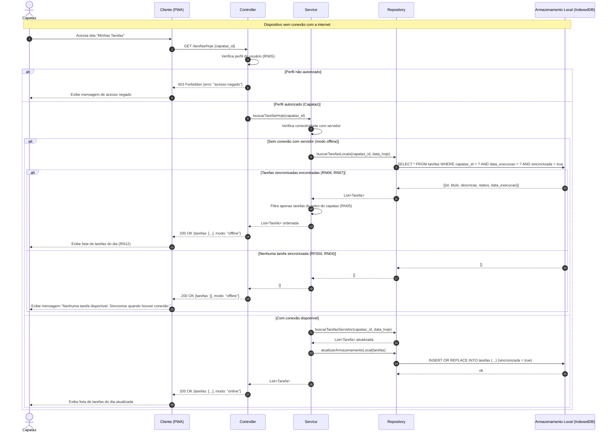
```mermaid
sequenceDiagram
    autonumber
    actor C as Capataz
    participant PWA as Cliente (PWA)
    participant CTR as Controller
    participant SRV as Service
    participant REP as Repository
    participant LS as Armazenamento Local (IndexedDB)

    note over C,LS: Dispositivo sem conexão com a internet

    C->>PWA: Acessa tela "Minhas Tarefas"
    PWA->>CTR: GET /tarefas/hoje {capataz_id}
    CTR->>CTR: Verifica perfil do usuário (RN05)

    alt Perfil não autorizado
        CTR-->>PWA: 403 Forbidden {erro: "acesso negado"}
        PWA-->>C: Exibe mensagem de acesso negado
    else Perfil autorizado (Capataz)
        CTR->>SRV: buscarTarefasHoje(capataz_id)
        SRV->>SRV: Verifica conectividade com servidor

        alt Sem conexão com servidor (modo offline)
            SRV->>REP: buscarTarefasLocais(capataz_id, data_hoje)
            REP->>LS: SELECT * FROM tarefas WHERE capataz_id = ? AND data_execucao = ? AND sincronizada = true
            
            alt Tarefas sincronizadas encontradas (RN06, RN07)
                LS-->>REP: [{id, titulo, descricao, status, data_execucao}]
                REP-->>SRV: List<Tarefa>
                SRV->>SRV: Filtra apenas tarefas do retiro do capataz (RN05)
                SRV-->>CTR: List<Tarefa> ordenada
                CTR-->>PWA: 200 OK {tarefas: [...], modo: "offline"}
                PWA-->>C: Exibe lista de tarefas do dia (RN12)
            else Nenhuma tarefa sincronizada (RF004, RN04)
                LS-->>REP: []
                REP-->>SRV: []
                SRV-->>CTR: []
                CTR-->>PWA: 200 OK {tarefas: [], modo: "offline"}
                PWA-->>C: Exibe mensagem "Nenhuma tarefa disponível. Sincronize quando houver conexão."
            end

        else Com conexão disponível
            SRV->>REP: buscarTarefasServidor(capataz_id, data_hoje)
            REP-->>SRV: List<Tarefa> atualizada
            SRV->>REP: atualizarArmazenamentoLocal(tarefas)
            REP->>LS: INSERT OR REPLACE INTO tarefas (...) (sincronizada = true)
            LS-->>REP: ok
            SRV-->>CTR: List<Tarefa>
            CTR-->>PWA: 200 OK {tarefas: [...], modo: "online"}
            PWA-->>C: Exibe lista de tarefas do dia atualizada
        end
    end
```

**Descrição das camadas:**

- **Cliente PWA (`Cliente`):** interface do dispositivo do capataz no campo. Detecta o estado de conectividade e apresenta a lista de tarefas com indicação visual do modo de operação (online ou offline).
- **Controller (`TarefaController`):** recebe a requisição de listagem, valida o perfil do usuário e delega ao Service. Não acessa o armazenamento local diretamente.
- **Service (`TarefaService`):** verifica a disponibilidade de conexão e decide a estratégia de busca — servidor remoto (online) ou armazenamento local (offline). Aplica a regra RN05, garantindo que apenas tarefas do retiro do capataz sejam retornadas.
- **Repository (`TarefaRepository`):** abstrai tanto o acesso ao banco remoto quanto ao armazenamento local (IndexedDB/SQLite local), expondo a mesma interface ao Service independentemente da origem dos dados.
- **Armazenamento Local (`IndexedDB`):** persiste localmente as tarefas previamente sincronizadas. Só contém tarefas com `sincronizada = true`, garantindo que dados incompletos nunca sejam exibidos ao capataz (RN06).

**Fluxos cobertos:**

| Fluxo         | Descrição                                                                                           |
| ------------- | --------------------------------------------------------------------------------------------------- |
| Principal     | Capataz offline com tarefas sincronizadas → lista exibida a partir do armazenamento local           |
| Alternativo 1 | Capataz offline sem tarefas sincronizadas → mensagem de ausência exibida com linguagem simples (RN04)|
| Alternativo 2 | Capataz online → tarefas buscadas do servidor, armazenamento local atualizado e lista exibida       |
| Alternativo 3 | Perfil não autorizado → acesso negado com 403                                                        |

**Rastreabilidade:**

| Elemento     | Referência                                                                                              |
| ------------ | ------------------------------------------------------------------------------------------------------- |
| US02         | Como capataz, posso visualizar minha lista de tarefas do dia offline                                    |
| RF002        | O sistema deve permitir que o capataz visualize as tarefas do dia mesmo sem conexão                     |
| RF003        | O sistema deve armazenar localmente as tarefas sincronizadas para acesso offline                        |
| RF004        | O sistema deve exibir mensagem simples quando não houver tarefas disponíveis offline                    |
| RN02         | Apenas tarefas do dia atual devem ser exibidas ao capataz                                               |
| RN05         | Apenas tarefas do retiro do capataz devem ser exibidas para ele                                         |
| RN06         | O sistema deve permitir visualização offline apenas de tarefas previamente sincronizadas                |
| RN07         | As tarefas do dia devem ficar disponíveis offline quando houver sincronização prévia                    |
| RN12         | As telas do capataz devem usar linguagem simples, botões visíveis e poucos passos de interação          |
| RNF — CONF   | 0% de perda de dados em falhas de conexão; estratégia offline-first                                     |
| RNF — DES    | Latência p95 < 200ms para salvar e ler registros no banco de dados local                                |

---

#### DS03 — Concluir Tarefa Offline (US03)

Fluxo que representa a marcação de uma tarefa como concluída pelo Capataz em ambiente sem conexão, com persistência local imediata e sincronização automática posterior com o servidor quando a conectividade for restabelecida. Mensagens síncronas são representadas por setas contínuas (`->>`) e retornos por setas tracejadas (`-->>`)

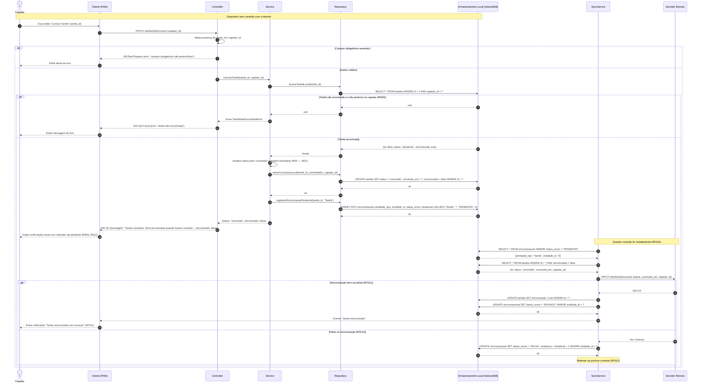
```mermaid
sequenceDiagram
    autonumber
    actor C as Capataz
    participant PWA as Cliente (PWA)
    participant CTR as Controller
    participant SRV as Service
    participant REP as Repository
    participant LS as Armazenamento Local (IndexedDB)
    participant SYNC as SyncService
    participant API as Servidor Remoto

    note over C,LS: Dispositivo sem conexão com a internet

    C->>PWA: Toca botão "Concluir Tarefa" (tarefa_id)
    PWA->>CTR: PATCH /tarefas/{id}/concluir {capataz_id}
    CTR->>CTR: Valida presença de tarefa_id e capataz_id

    alt Campos obrigatórios ausentes
        CTR-->>PWA: 400 Bad Request {erro: "campos obrigatórios não preenchidos"}
        PWA-->>C: Exibe alerta de erro
    else Dados válidos
        CTR->>SRV: concluirTarefa(tarefa_id, capataz_id)
        SRV->>REP: buscarTarefaLocal(tarefa_id)
        REP->>LS: SELECT * FROM tarefas WHERE id = ? AND capataz_id = ?
        
        alt Tarefa não encontrada ou não pertence ao capataz (RN05)
            LS-->>REP: null
            REP-->>SRV: null
            SRV-->>CTR: throw TarefaNaoEncontradaError
            CTR-->>PWA: 404 Not Found {erro: "tarefa não encontrada"}
            PWA-->>C: Exibe mensagem de erro
        else Tarefa encontrada
            LS-->>REP: {id, titulo, status: "pendente", sincronizada: true}
            REP-->>SRV: Tarefa

            SRV->>SRV: Atualiza status para "concluida" e registra timestamp (RNF — SEG)
            SRV->>REP: salvarConclusaoLocal(tarefa_id, concluidaEm, capataz_id)
            REP->>LS: UPDATE tarefas SET status = "concluida", concluida_em = ?, sincronizada = false WHERE id = ?
            LS-->>REP: ok
            REP-->>SRV: ok
            SRV->>REP: registrarSincronizacaoPendente(tarefa_id, "Tarefa")
            REP->>LS: INSERT INTO sincronizacoes (entidade_tipo, entidade_id, status_envio, tentativas) VALUES ("Tarefa", ?, "PENDENTE", 0)
            LS-->>REP: ok
            SRV-->>CTR: {status: "concluida", sincronizado: false}
            CTR-->>PWA: 200 OK {mensagem: "Tarefa concluída. Será sincronizada quando houver conexão.", sincronizado: false}
            PWA-->>C: Exibe confirmação visual com indicador de pendente (RN08, RN12)

            note over SYNC,API: Quando conexão for restabelecida (RF010)

            SYNC->>LS: SELECT * FROM sincronizacoes WHERE status_envio = "PENDENTE"
            LS-->>SYNC: [{entidade_tipo: "Tarefa", entidade_id: ?}]
            SYNC->>LS: SELECT * FROM tarefas WHERE id = ? AND sincronizada = false
            LS-->>SYNC: {id, status: "concluida", concluida_em, capataz_id}
            SYNC->>API: PATCH /tarefas/{id}/concluir {status, concluida_em, capataz_id}

            alt Sincronização bem-sucedida (RF011)
                API-->>SYNC: 200 OK
                SYNC->>LS: UPDATE tarefas SET sincronizada = true WHERE id = ?
                SYNC->>LS: UPDATE sincronizacoes SET status_envio = "ENVIADO" WHERE entidade_id = ?
                LS-->>SYNC: ok
                SYNC-->>PWA: Evento: "tarefa-sincronizada"
                PWA-->>C: Exibe notificação "Tarefa sincronizada com sucesso" (RF011)
            else Falha na sincronização (RF012)
                API-->>SYNC: 5xx / timeout
                SYNC->>LS: UPDATE sincronizacoes SET status_envio = "FALHA", tentativas = tentativas + 1 WHERE entidade_id = ?
                LS-->>SYNC: ok
                note over SYNC: Retentar na próxima conexão (RF012)
            end
        end
    end
```

**Descrição das camadas:**

- **Cliente PWA (`Cliente`):** captura a ação do capataz, dispara a requisição de conclusão e exibe confirmações visuais simples e de alto contraste, adequadas ao uso em campo (RN12). Escuta eventos de sincronização emitidos pelo SyncService para atualizar o indicador de status.
- **Controller (`TarefaController`):** valida a presença dos identificadores obrigatórios e delega ao Service. Não acessa o armazenamento local diretamente.
- **Service (`TarefaService`):** aplica as regras de negócio — verifica se a tarefa pertence ao capataz (RN05), atualiza o status e injeta o timestamp de conclusão (RNF — SEG). Orquestra o registro de sincronização pendente.
- **Repository (`TarefaRepository`):** persiste a conclusão localmente com `sincronizada = false` e insere o registro de controle na tabela `sincronizacoes` (RF012).
- **Armazenamento Local (`IndexedDB`):** mantém o estado da tarefa e o registro de pendência de sincronização até que o envio seja confirmado pelo servidor.
- **SyncService (`SyncService`):** processo em segundo plano (background sync via Service Worker) responsável por detectar a reconexão, consultar registros pendentes e transmiti-los ao servidor remoto. Atualiza o status para `ENVIADO` em caso de sucesso ou incrementa o contador de tentativas em caso de falha (RF012).
- **Servidor Remoto (`API`):** recebe a atualização de status da tarefa e confirma a persistência no banco de dados central, tornando a informação visível ao Gerente no painel de acompanhamento (RF007).

**Fluxos cobertos:**

| Fluxo         | Descrição                                                                                                    |
| ------------- | ------------------------------------------------------------------------------------------------------------ |
| Principal     | Capataz offline → conclusão persistida localmente → sincronização automática ao reconectar → confirmação visual |
| Alternativo 1 | Campo obrigatório ausente → Controller retorna 400 sem acionar o Service                                     |
| Alternativo 2 | Tarefa não encontrada ou não pertence ao capataz → Service lança erro → 404                                  |
| Alternativo 3 | Falha na sincronização com o servidor → tentativa registrada e reenvio automático na próxima conexão (RF012) |

**Rastreabilidade:**

| Elemento     | Referência                                                                                              |
| ------------ | ------------------------------------------------------------------------------------------------------- |
| US03         | Como capataz, posso marcar uma tarefa como concluída para informar o gerente sobre o avanço             |
| RF003        | O sistema deve armazenar localmente as tarefas sincronizadas para acesso offline                        |
| RF010        | O sistema deve detectar automaticamente o restabelecimento da conexão e iniciar a transmissão           |
| RF011        | O sistema deve notificar o capataz após sincronização bem-sucedida                                      |
| RF012        | Registros com falha devem ser mantidos e reenviados automaticamente a cada nova conexão                 |
| RN05         | Apenas tarefas do retiro do capataz devem ser exibidas e manipuladas por ele                            |
| RN08         | A marcação de conclusão feita offline deve ser armazenada localmente até a próxima sincronização        |
| RN09         | A tarefa concluída deve ter seu status atualizado para o gerente após sincronização                     |
| RN12         | As telas do capataz devem usar linguagem simples, botões visíveis e poucos passos de interação          |
| RNF — SEG    | 100% dos registros devem conter metadados de autoria (ID do capataz) e timestamp não editável           |
| RNF — CONF   | 0% de perda de dados em falhas de conexão; estratégia offline-first com reenvio automático              |

---

#### DS04 — Anexar Foto na Conclusão de Tarefa (US04)

Fluxo que representa o anexo de uma foto como evidência de conclusão de tarefa pelo Capataz em ambiente sem conexão, com armazenamento local da imagem e sincronização automática em lote quando a conectividade for restabelecida. Mensagens síncronas são representadas por setas contínuas (`->>`) e retornos por setas tracejadas (`-->>`)

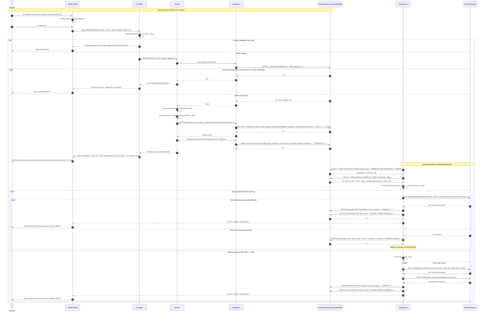
```mermaid
sequenceDiagram
    autonumber
    actor C as Capataz
    participant PWA as Cliente (PWA)
    participant CTR as Controller
    participant SRV as Service
    participant REP as Repository
    participant LS as Armazenamento Local (IndexedDB)
    participant SYNC as SyncService
    participant API as Servidor Remoto

    note over C,LS: Dispositivo sem conexão com a internet

    C->>PWA: Toca botão "Anexar Foto" na tela de conclusão (tarefa_id)
    PWA->>PWA: Aciona câmera nativa do dispositivo
    C->>PWA: Captura foto
    PWA->>CTR: POST /tarefas/{id}/evidencias {tipo: "FOTO", arquivo: base64, capataz_id}
    CTR->>CTR: Valida presença de tarefa_id, tipo e arquivo

    alt Campos obrigatórios ausentes
        CTR-->>PWA: 400 Bad Request {erro: "campos obrigatórios não preenchidos"}
        PWA-->>C: Exibe alerta de erro
    else Dados válidos
        CTR->>SRV: anexarFoto(tarefa_id, arquivo_base64, capataz_id)
        SRV->>REP: buscarTarefaLocal(tarefa_id)
        REP->>LS: SELECT * FROM tarefas WHERE id = ? AND capataz_id = ?

        alt Tarefa não encontrada ou não pertence ao capataz (RN05)git 
            LS-->>REP: null
            REP-->>SRV: null
            SRV-->>CTR: throw TarefaNaoEncontradaError
            CTR-->>PWA: 404 Not Found {erro: "tarefa não encontrada"}
            PWA-->>C: Exibe mensagem de erro
        else Tarefa encontrada
            LS-->>REP: {id, status, capataz_id}
            REP-->>SRV: Tarefa

            SRV->>SRV: Captura geolocalização do dispositivo (GPS)
            SRV->>SRV: Gera evidencia_id e registra timestamp (RNF — SEG)
            SRV->>REP: salvarFotoLocal(evidencia_id, tarefa_id, arquivo_base64, geolocalizacao, capataz_id)
            REP->>LS: INSERT INTO evidencias (id, tarefa_id, tipo, arquivo_base64, geolocalizacao, criada_em, sincronizada) VALUES (?, ?, "FOTO", ?, ?, ?, false)
            LS-->>REP: ok
            REP-->>SRV: {evidencia_id}

            SRV->>REP: registrarSincronizacaoPendente(evidencia_id, "Evidencia")
            REP->>LS: INSERT INTO sincronizacoes (entidade_tipo, entidade_id, status_envio, tentativas) VALUES ("Evidencia", ?, "PENDENTE", 0)
            LS-->>REP: ok
            SRV-->>CTR: {evidencia_id, sincronizado: false}
            CTR-->>PWA: 201 Created {mensagem: "Foto salva. Será enviada quando houver conexão.", sincronizado: false}
            PWA-->>C: Exibe confirmação visual com thumbnail da foto e indicador de pendente (RN11, RN12)

            note over SYNC,API: Quando conexão for restabelecida (RF010)

            SYNC->>LS: SELECT * FROM sincronizacoes WHERE status_envio = "PENDENTE" AND entidade_tipo = "Evidencia"
            LS-->>SYNC: [{entidade_id: evidencia_id}]
            SYNC->>LS: SELECT * FROM evidencias WHERE id = ? AND sincronizada = false
            LS-->>SYNC: {id, tarefa_id, tipo: "FOTO", arquivo_base64, geolocalizacao, criada_em}

            SYNC->>SYNC: Verifica tamanho do arquivo (RNF — CAP: chunking se > limite)

            alt Arquivo dentro do limite de envio
                SYNC->>API: POST /tarefas/{tarefa_id}/evidencias {tipo: "FOTO", arquivo: base64, geolocalizacao, criada_em}
                alt Sincronização bem-sucedida (RF011)
                    API-->>SYNC: 201 Created {url_arquivo}
                    SYNC->>LS: UPDATE evidencias SET sincronizada = true, url_arquivo = ? WHERE id = ?
                    SYNC->>LS: UPDATE sincronizacoes SET status_envio = "ENVIADO" WHERE entidade_id = ?
                    LS-->>SYNC: ok
                    SYNC-->>PWA: Evento: "evidencia-sincronizada"
                    PWA-->>C: Exibe notificação "Foto enviada com sucesso" (RF011)
                else Falha na sincronização (RF012)
                    API-->>SYNC: 5xx / timeout
                    SYNC->>LS: UPDATE sincronizacoes SET status_envio = "FALHA", tentativas = tentativas + 1 WHERE entidade_id = ?
                    LS-->>SYNC: ok
                    note over SYNC: Retentar na próxima conexão (RF012)
                end
            else Arquivo acima do limite (RNF — CAP)
                SYNC->>SYNC: Divide arquivo em chunks
                loop Para cada chunk
                    SYNC->>API: POST /tarefas/{tarefa_id}/evidencias/chunk {chunk_index, chunk_data, total_chunks}
                    API-->>SYNC: 200 OK {chunk_recebido}
                end
                SYNC->>API: POST /tarefas/{tarefa_id}/evidencias/finalizar {evidencia_id}
                API-->>SYNC: 201 Created {url_arquivo}
                SYNC->>LS: UPDATE evidencias SET sincronizada = true, url_arquivo = ? WHERE id = ?
                SYNC->>LS: UPDATE sincronizacoes SET status_envio = "ENVIADO" WHERE entidade_id = ?
                SYNC-->>PWA: Evento: "evidencia-sincronizada"
                PWA-->>C: Exibe notificação "Foto enviada com sucesso" (RF011)
            end
        end
    end
```

**Descrição das camadas:**

- **Cliente PWA (`Cliente`):** aciona a câmera nativa do dispositivo, exibe um thumbnail da imagem capturada e apresenta indicador visual de status de envio (pendente/sincronizado) com linguagem simples e botões de alto contraste (RN12). Escuta eventos de sincronização emitidos pelo SyncService.
- **Controller (`TarefaController`):** valida a presença dos campos obrigatórios (identificador da tarefa, tipo de evidência e arquivo) e delega ao Service. Não acessa o armazenamento local diretamente.
- **Service (`TarefaService`):** captura a geolocalização do dispositivo no momento do anexo, injeta metadados de autoria e timestamp (RNF — SEG), e orquestra o armazenamento local da imagem em formato base64 e o registro de sincronização pendente.
- **Repository (`TarefaRepository`):** persiste a evidência no armazenamento local com `sincronizada = false` e a imagem codificada em base64, mantendo o vínculo com a tarefa correspondente (RN10). Insere o registro de controle na tabela `sincronizacoes`.
- **Armazenamento Local (`IndexedDB`):** armazena a imagem em base64 até que a sincronização com o servidor seja concluída com sucesso, prevenindo qualquer perda de evidência durante períodos offline (RN11, RNF — CONF).
- **SyncService (`SyncService`):** detecta a reconexão via Service Worker e transmite as evidências pendentes ao servidor. Implementa chunking para arquivos de imagem que excedam o limite de transmissão segura em conexões instáveis (RNF — CAP), garantindo a integridade do envio em lote.
- **Servidor Remoto (`API`):** recebe a evidência, persiste o arquivo e retorna a URL definitiva do arquivo armazenado, que é então atualizada no registro local. A evidência fica disponível para consulta pelo Gerente e Coordenador (RF014, UC05).

**Fluxos cobertos:**

| Fluxo         | Descrição                                                                                                          |
| ------------- | ------------------------------------------------------------------------------------------------------------------ |
| Principal     | Capataz offline → foto capturada e salva localmente em base64 → sincronização automática ao reconectar             |
| Alternativo 1 | Campo obrigatório ausente → Controller retorna 400                                                                  |
| Alternativo 2 | Tarefa não encontrada ou não pertence ao capataz → Service lança erro → 404                                        |
| Alternativo 3 | Falha na sincronização → tentativa registrada e reenvio automático na próxima conexão (RF012)                      |
| Alternativo 4 | Arquivo acima do limite → SyncService divide em chunks e transmite sequencialmente ao servidor (RNF — CAP)         |

**Rastreabilidade:**

| Elemento     | Referência                                                                                                   |
| ------------ | ------------------------------------------------------------------------------------------------------------ |
| US04         | Como capataz, posso anexar fotos na conclusão de uma tarefa para comprovar visualmente o serviço realizado   |
| RF004        | O sistema deve armazenar localmente as tarefas e evidências sincronizadas para acesso offline                |
| RF010        | O sistema deve detectar automaticamente o restabelecimento da conexão e iniciar a transmissão pendente       |
| RF011        | O sistema deve notificar o capataz com confirmação após sincronização bem-sucedida                           |
| RF012        | Registros com falha de envio devem ser mantidos e reenviados automaticamente a cada nova conexão             |
| RN10         | As fotos anexadas devem estar vinculadas à tarefa correspondente                                             |
| RN11         | Fotos registradas offline devem ser enviadas ao sistema quando houver conexão                                |
| RN12         | As telas do capataz devem usar linguagem simples, botões visíveis e poucos passos de interação               |
| RN19         | O sistema deve capturar automaticamente a localização GPS quando o capataz criar um registro com foto        |
| RNF — SEG    | 100% dos registros devem conter metadados de autoria e timestamp não editável                                |
| RNF — CONF   | 0% de perda de dados em falhas de conexão; imagem mantida localmente até confirmação do servidor             |
| RNF — CAP    | Suporte a sincronização em lote de até 500 eventos; chunking para arquivos grandes em conexões instáveis     |


### 3.2.5. Diagrama de Atividades ou Estados (sprint 3)

_Ao menos um fluxo relevante em UML ou BPMN. Use a notação da ferramenta escolhida de forma consistente (sem misturar convenções)._

### 3.2.6. Diagrama de Implantação (sprints 4 e 5)

_Diagrama UML de deployment mostrando nós físicos, artefatos e canais de comunicação. Representa a visão Engineering + Technology do RM-ODP._

### 3.2.7. Padrões de Projeto Aplicados (sprints 3 a 5)

_Documente os design patterns utilizados (Repository, Strategy, Factory, DTO etc.) e quais princípios SOLID se aplicam. Justifique a adoção de cada padrão com base em uma necessidade real do projeto._

## 3.3. Wireframes (sprint 2)

<center>
  <p><strong>Figura 9</strong> — Wireframe da tela de tarefas do capataz</p>
  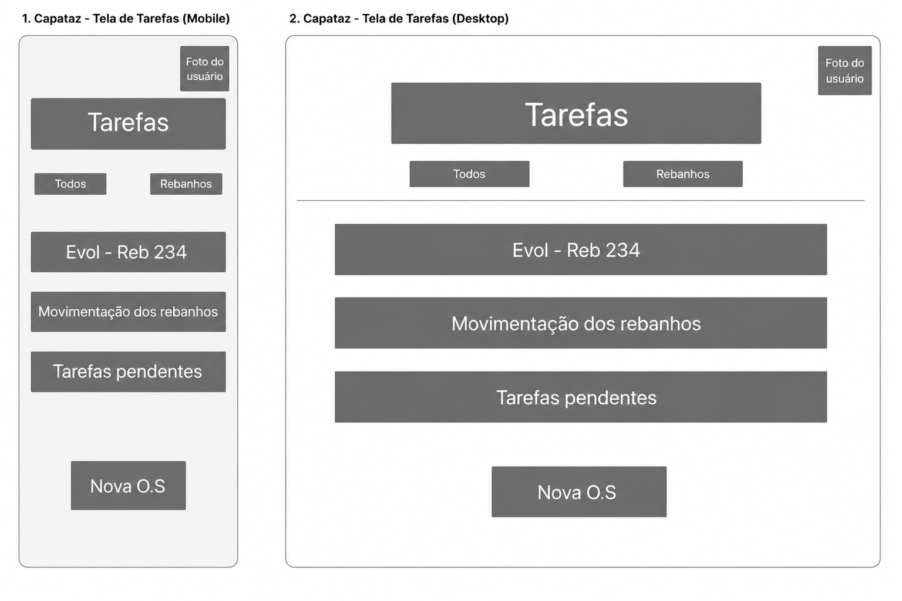
  <p>Fonte: Próprios autores (2026).</p>
</center>

<center>
<p><strong>Figura 10</strong> — Wireframe capataz - concluir tarefa (mobile/tablet/desktop)</p>
 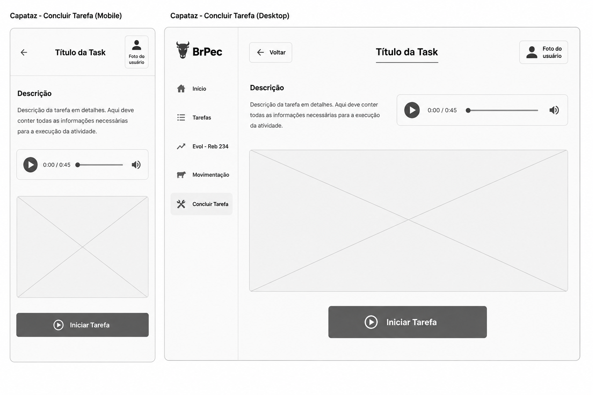
 <p>Fonte: Próprios autores (2026).</p>
</center>

<center>
  <p><strong>Figura 11</strong> — Wireframe da tela de anexar fotos pelo capataz</p>
  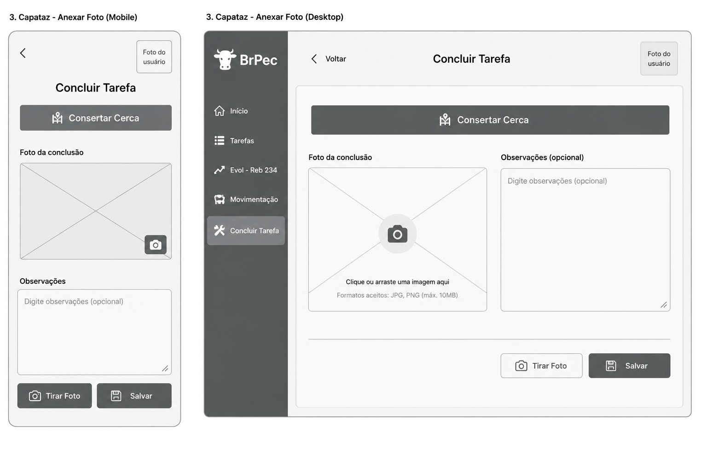
  <p>Fonte: Próprios autores (2026).</p>
</center>

<center>
  <p><strong>Figura 12</strong> — Wireframe da tela de infraestrutura</p>
  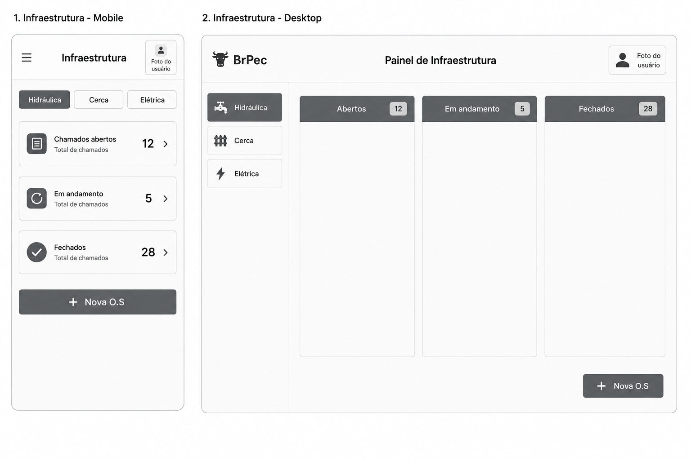
  <p>Fonte: Próprios autores (2026).</p>
</center>

<center>
  <p><strong>Figura 13</strong> — Wireframe da tela de infraestrutura registrar resolução</p>
  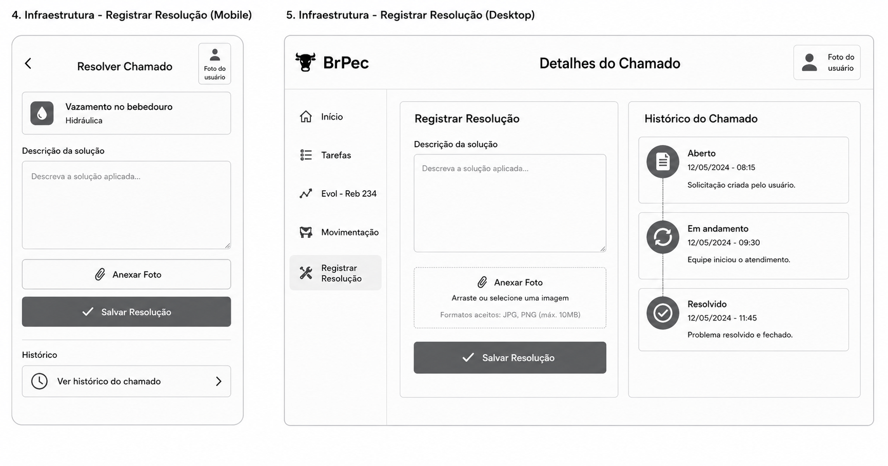
  <p>Fonte: Próprios autores (2026).</p>
</center>

<center>
  <p><strong>Figura 14</strong> — Wireframe da tela de dashboard do gerente</p>
  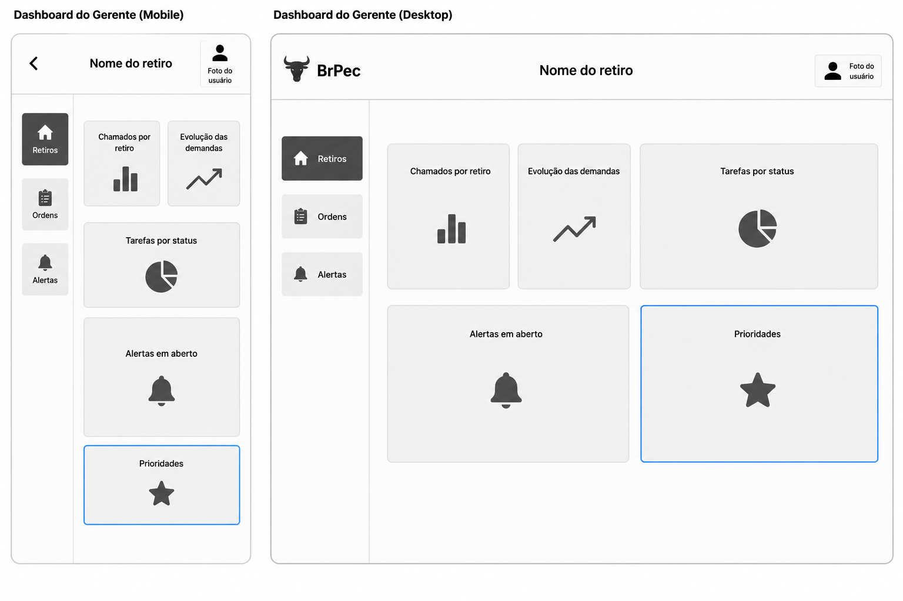
  <p>Fonte: Próprios autores (2026).</p>
</center>

<center>
  <p><strong>Figura 15</strong> — Wireframe da tela de nova O.S do gerente</p>
  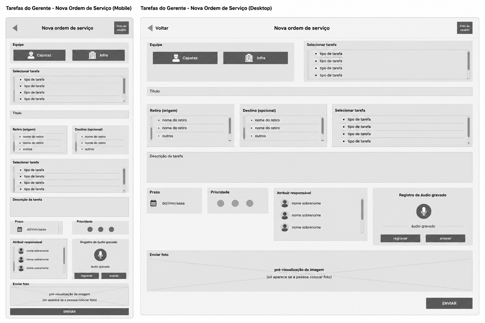
  <p>Fonte: Próprios autores (2026).</p>
</center>

## 3.4. Guia de estilos (sprint 3)

_Descreva aqui orientações gerais para o leitor sobre como utilizar os componentes do guia de estilos de sua solução_

### 3.4.1 Cores

_Apresente aqui a paleta de cores, com seus códigos de aplicação e suas respectivas funções_

### 3.4.2 Tipografia

_Apresente aqui a tipografia da solução, com famílias de fontes e suas respectivas funções_

### 3.4.3 Iconografia e imagens

_(esta subseção é opcional, caso não existam ícones e imagens, apague esta subseção)_

_posicione aqui imagens e textos contendo exemplos padronizados de ícones e imagens, com seus respectivos atributos de aplicação, utilizadas na solução_

## 3.5 Protótipo de alta fidelidade (sprint 3)

_posicione aqui algumas imagens demonstrativas de seu protótipo de alta fidelidade e o link para acesso ao protótipo completo (mantenha o link sempre público para visualização)_

## 3.6. Modelagem do banco de dados (sprints 2 e 4)

### 3.6.1. Modelo Entidade-Relacionamento (ER) (sprint 2)

O modelo Entidade-Relacionamento (ER) conceitual representa as principais entidades do domínio da aplicação, seus atributos e relacionamentos existentes entre elas, utilizando a notação **Chen** de forma consistente em toda a modelagem. O objetivo deste modelo é estruturar conceitualmente os dados necessários para suportar o gerenciamento operacional da BRPec Agropecuária, contemplando usuários, boletas, alertas, retiros e tipos operacionais (nascimento, óbito, transferência, compra, venda).

Nesta etapa conceitual, não são representados detalhes físicos de implementação, como tipos específicos de banco de dados, chaves primárias ou estrangeiras, pois esses elementos serão tratados posteriormente no DER lógico e no modelo físico da aplicação.

<center>
  <p><strong>Figura 13</strong> — Modelo Entidade-Relacionamento Conceitual — BRPec Agropecuária</p>
</center>

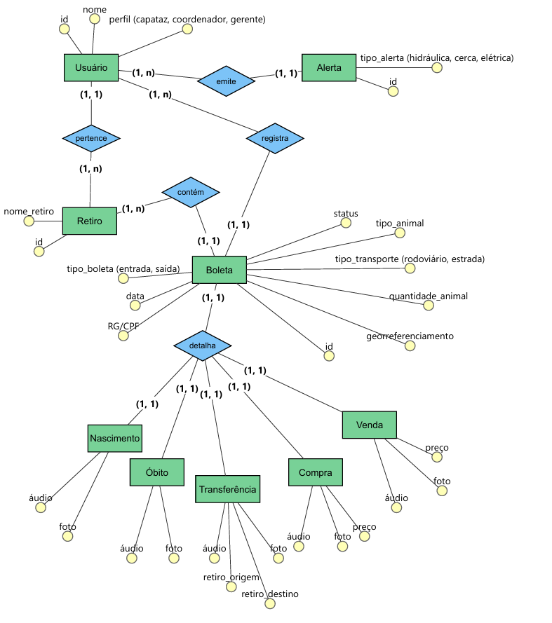

### Decisões de modelagem

- A entidade USUÁRIO representa os perfis operacionais do sistema (Gerente, Coordenador e Capataz). A distinção de funções é realizada pelo atributo perfil, centralizando a gestão de acessos e garantindo que cada ação no sistema seja vinculada a um id único para fins de rastreabilidade.

- A entidade RETIRO representa as unidades físicas e operacionais da fazenda.  O relacionamento "pertence" (1,1 para 1,n) estabelece que um usuário deve estar vinculado a pelo menos um retiro para operar, enquanto um retiro pode possuir múltiplos usuários associados.

- A entidade ALERTA é utilizada para reportar problemas de infraestrutura (hidráulica, cerca, elétrica). O relacionamento "emite" (1,1 para 1,n) garante que cada alerta seja rastreável a um único autor (Usuário), permitindo que o Gerente saiba exatamente quem reportou a ocorrência.

- A entidade BOLETA é o núcleo do registro de manejo, substituindo os processos manuais em papel.  Inclui atributos essenciais para a fiscalização e transporte, como RG/CPF, tipo_transporte (rodoviário/estrada) e georreferenciamento, conforme exigido pelos formulários físicos da empresa.

- Relacionamento REGISTRA (Usuário-Boleta): Estabelece uma conexão (1,n para 1,1), onde cada boleta digitalizada é obrigatoriamente vinculada ao usuário que a criou, eliminando falhas de transcrição e garantindo a autoria dos dados.

- Relacionamento CONTÉM (Retiro-Boleta): Define que cada boleta pertence a um retiro de referência (1,1), permitindo a organização dos registros por localidade e facilitando a exportação de dados consolidados por área.

- Especialização DETALHA (Nascimento, Óbito, Transferência, Compra e Venda): A entidade BOLETA atua como uma classe base que se ramifica em eventos zootécnicos específicos.

A cardinalidade (1,1) entre o losango detalha e a Boleta indica que um registro de manejo deve corresponder obrigatoriamente a um desses tipos.

Cada subtipo (ex: Óbito ou Nascimento) possui seus próprios campos de evidência, como foto e áudio, para validar a execução da tarefa em campo.

<center>
  <p>Fonte: Próprios autores (2026).</p>
</center>

### 3.6.2. Diagrama Entidade-Relacionamento (DER) (sprint 2)

_Posicione aqui o DER com cardinalidades explícitas em ambos os lados de cada relação e identificação de PK/FK. O DER deve ser coerente com o diagrama de classes (3.2.3)._

O Diagrama Entidade-Relacionamento (DER) é uma representação gráfica da estrutura de um banco de dados, baseada no Modelo Entidade-Relacionamento (MER) proposto por Peter Chen (1976). No diagrama, entidades (objetos do mundo real com existência independente) são representadas por retângulos. Seus atributos, por elipses, e os relacionamentos entre elas, por losangos. Essa notação auxilia desenvolvedores a visualizar e comunicar a arquitetura de dados de um sistema antes de sua implementação. [9]

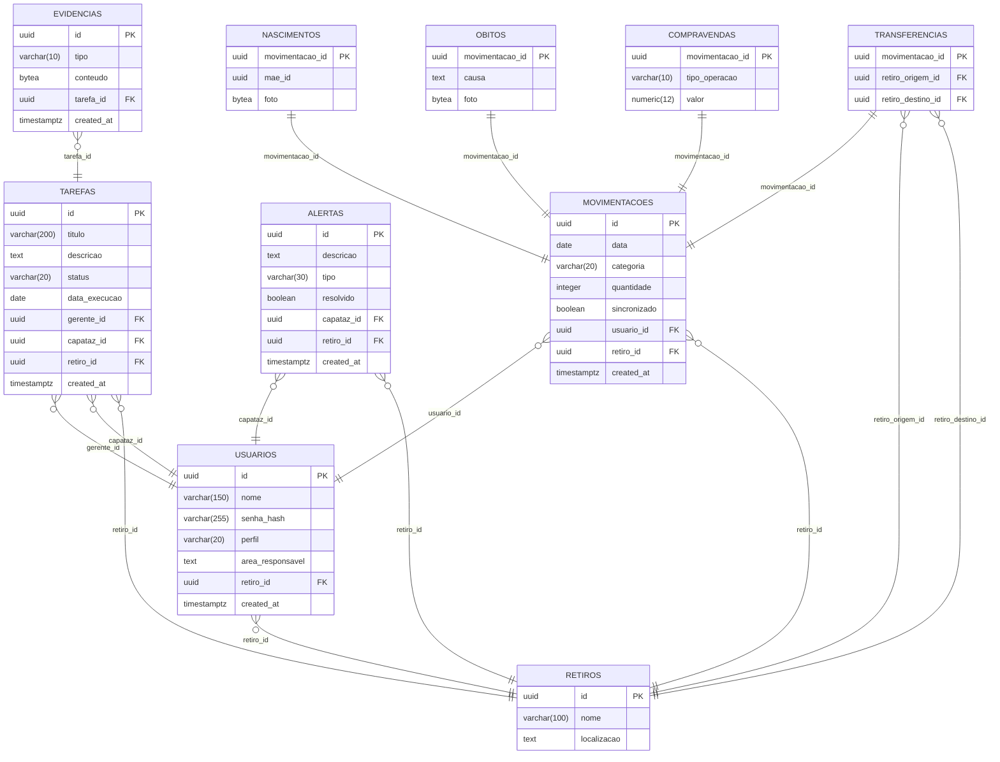
```mermaid
erDiagram
    RETIROS {
        uuid id PK
        varchar(100) nome
        text localizacao
    }
    USUARIOS {
        uuid id PK
        varchar(150) nome
        varchar(255) senha_hash
        varchar(20) perfil
        text area_responsavel
        uuid retiro_id FK
        timestamptz created_at
    }
    TAREFAS {
        uuid id PK
        varchar(200) titulo
        text descricao
        varchar(20) status
        date data_execucao
        uuid gerente_id FK
        uuid capataz_id FK
        uuid retiro_id FK
        timestamptz created_at
    }
    EVIDENCIAS {
        uuid id PK
        varchar(10) tipo
        bytea conteudo
        uuid tarefa_id FK
        timestamptz created_at
    }
    ALERTAS {
        uuid id PK
        text descricao
        varchar(30) tipo
        boolean resolvido
        uuid capataz_id FK
        uuid retiro_id FK
        timestamptz created_at
    }
    MOVIMENTACOES {
        uuid id PK
        date data
        varchar(20) categoria
        integer quantidade
        boolean sincronizado
        uuid usuario_id FK
        uuid retiro_id FK
        timestamptz created_at
    }
    NASCIMENTOS {
        uuid movimentacao_id PK
        uuid mae_id
        bytea foto
    }
    OBITOS {
        uuid movimentacao_id PK
        text causa
        bytea foto
    }
    TRANSFERENCIAS {
        uuid movimentacao_id PK
        uuid retiro_origem_id FK
        uuid retiro_destino_id FK
    }
    COMPRAVENDAS {
        uuid movimentacao_id PK
        varchar(10) tipo_operacao
        numeric(12) valor
    }

    USUARIOS }o--|| RETIROS : "retiro_id"
    TAREFAS }o--|| USUARIOS : "gerente_id"
    TAREFAS }o--|| USUARIOS : "capataz_id"
    TAREFAS }o--|| RETIROS : "retiro_id"
    EVIDENCIAS }o--|| TAREFAS : "tarefa_id"
    ALERTAS }o--|| USUARIOS : "capataz_id"
    ALERTAS }o--|| RETIROS : "retiro_id"
    MOVIMENTACOES }o--|| USUARIOS : "usuario_id"
    MOVIMENTACOES }o--|| RETIROS : "retiro_id"
    NASCIMENTOS ||--|| MOVIMENTACOES : "movimentacao_id"
    OBITOS ||--|| MOVIMENTACOES : "movimentacao_id"
    TRANSFERENCIAS ||--|| MOVIMENTACOES : "movimentacao_id"
    TRANSFERENCIAS }o--|| RETIROS : "retiro_origem_id"
    TRANSFERENCIAS }o--|| RETIROS : "retiro_destino_id"
    COMPRAVENDAS ||--|| MOVIMENTACOES : "movimentacao_id"
```

<center>
  <p><strong>Figura 14</strong> — Diagrama Entidade-Relacionamento (DER)</p>
  <p>Fonte: Próprios autores (2026).</p>
</center>

### 3.6.3. Modelo Relacional e Modelo Físico (sprints 2 e 4)

O modelo físico deriva do modelo conceitual (ER) apresentado na seção 3.6.1 e materializa as entidades em tabelas SQLite, usando chaves primárias textuais em UUID v7, chaves estrangeiras explícitas, constraints de domínio e índices para consultas frequentes. A escolha por SQLite está associada ao requisito offline-first: os dados operacionais são gravados no dispositivo antes de qualquer tentativa de sincronização, evitando dependência exclusiva de cache do navegador.

A aplicação PWA mantém os dados estruturados no banco local SQLite. Quando a conexão retorna, a camada de sincronização envia os registros pendentes para uma API central; arquivos de mídia, como fotos e áudios, são enviados a um serviço de armazenamento de evidências pela API. O banco local mantém metadados, caminho local do arquivo antes do upload e a referência remota (`storage_key` ou `url`) após a sincronização.

O DER lógico com cardinalidades, PKs e FKs está apresentado na seção 3.6.2. Nesta seção, o mesmo desenho é transformado em modelo relacional e em DDL executável.

#### Modelo Relacional

| Relação          | Chave primária | Chaves estrangeiras principais                             | Observação                                      |
| ---------------- | -------------- | ---------------------------------------------------------- | ----------------------------------------------- |
| `retiros`        | `id`           | —                                                          | Unidades operacionais da fazenda                |
| `usuarios`       | `id`           | `retiro_id -> retiros(id)`                                 | `retiro_id` é obrigatório apenas para capatazes |
| `tarefas`        | `id`           | `retiro_id`, `criado_por_id`, `responsavel_id`             | Registra quem criou e quem executa a tarefa     |
| `alertas`        | `id`           | `retiro_id`, `criado_por_id`, `tecnico_id`                 | Chamados com tipo, GPS e ciclo de resolução     |
| `movimentacoes`  | `id`           | `retiro_id`, `responsavel_id`                              | Evento-base de manejo do rebanho                |
| `evidencias`     | `id`           | `tarefa_id`, `alerta_id`, `movimentacao_id`                | Cada evidência pertence a exatamente uma origem |
| `nascimentos`    | `id`           | `movimentacao_id -> movimentacoes(id)`                     | Especialização 1:1 de movimentação              |
| `obitos`         | `id`           | `movimentacao_id -> movimentacoes(id)`                     | Especialização 1:1 com exigência de foto        |
| `transferencias` | `id`           | `movimentacao_id`, `retiro_origem_id`, `retiro_destino_id` | Especialização 1:1 entre retiros distintos      |
| `compravendas`   | `id`           | `movimentacao_id -> movimentacoes(id)`                     | Especialização 1:1 de compra ou venda           |
| `sync_queue`     | `id`           | —                                                          | Fila técnica de sincronização offline-online    |

<center>
  <p><strong>Figura 15</strong> — Modelo Relacional</p>
  <p>Fonte: Próprios autores (2026).</p>
</center>


**Decisões de modelagem física:**

- **SQLite local como fonte offline**: os registros são gravados localmente primeiro, com `sync_status` para indicar se ainda precisam ser enviados à API.
- **UUID v7 em colunas `TEXT`**: o identificador é gerado no cliente, antes da conexão com o servidor, e armazenado como texto por compatibilidade com SQLite.
- **`usuarios.retiro_id` opcional para perfis globais**: capatazes devem estar vinculados a um retiro, mas gerente, coordenador e técnico de infraestrutura podem atuar em escopo mais amplo.
- **`tarefas.criado_por_id` e `tarefas.responsavel_id`**: a primeira FK registra quem criou a tarefa; a segunda registra quem deve executá-la.
- **`alertas.retiro_id` e `alertas.tipo`**: o chamado de infraestrutura fica vinculado ao retiro e ao tipo de problema exigidos nos requisitos.
- **`evidencias` com vínculo polimórfico controlado por `CHECK`**: cada evidência pertence a exatamente uma tarefa, um alerta ou uma movimentação. Isso permite registrar fotos de óbito sem guardar o arquivo binário diretamente na tabela de óbitos.
- **Mídias fora do banco relacional**: `arquivo_local_uri` guarda o caminho local antes da sincronização; `storage_key` e `url` guardam a referência remota após upload pela API; `conteudo_texto` cobre evidências textuais simples.
- **Especialização de `movimentacoes`**: `nascimentos`, `obitos`, `transferencias` e `compravendas` detalham uma movimentação e usam `UNIQUE (movimentacao_id)` para evitar mais de um detalhe do mesmo tipo para o mesmo evento.
- **Timestamp de atualização nas especializações**: as tabelas especializadas não possuem `updated_at` próprio porque mudanças de estado do evento são rastreadas na tabela-mãe `movimentacoes`.
- **`sync_queue`**: tabela técnica que registra operações pendentes (`insert`, `update`, `delete` ou `upload`) para a camada de sincronização executar quando houver conexão.

#### Migrations DDL

As migrations abaixo são reproduzíveis e idempotentes (`CREATE TABLE IF NOT EXISTS`). A ordem de execução respeita as dependências de chave estrangeira: primeiro tabelas-base, depois tabelas dependentes e, por fim, a fila de sincronização.

##### Migration 000 — ativação de chaves estrangeiras

```sql
PRAGMA foreign_keys = ON;
```

##### Migration 001 — `retiros`

```sql
CREATE TABLE IF NOT EXISTS retiros (
    id          TEXT PRIMARY KEY,
    nome        TEXT NOT NULL,
    localizacao TEXT NOT NULL,
    created_at  TEXT NOT NULL DEFAULT (strftime('%Y-%m-%dT%H:%M:%fZ','now')),
    updated_at  TEXT NOT NULL DEFAULT (strftime('%Y-%m-%dT%H:%M:%fZ','now'))
);
```

##### Migration 002 — `usuarios`

```sql
CREATE TABLE IF NOT EXISTS usuarios (
    id         TEXT PRIMARY KEY,
    retiro_id  TEXT REFERENCES retiros(id),
    nome       TEXT NOT NULL,
    email      TEXT NOT NULL UNIQUE,
    senha_hash TEXT NOT NULL,
    perfil     TEXT NOT NULL
                   CHECK (perfil IN ('gerente','capataz','coordenador','tecnico_infra')),
    created_at TEXT NOT NULL DEFAULT (strftime('%Y-%m-%dT%H:%M:%fZ','now')),
    updated_at TEXT NOT NULL DEFAULT (strftime('%Y-%m-%dT%H:%M:%fZ','now')),
    CHECK (perfil != 'capataz' OR retiro_id IS NOT NULL)
);
CREATE INDEX IF NOT EXISTS idx_usuarios_retiro ON usuarios(retiro_id);
CREATE INDEX IF NOT EXISTS idx_usuarios_perfil ON usuarios(perfil);
```

##### Migration 003 — `tarefas`

```sql
CREATE TABLE IF NOT EXISTS tarefas (
    id             TEXT PRIMARY KEY,
    retiro_id      TEXT NOT NULL REFERENCES retiros(id),
    criado_por_id  TEXT NOT NULL REFERENCES usuarios(id),
    responsavel_id TEXT NOT NULL REFERENCES usuarios(id),
    titulo         TEXT NOT NULL,
    descricao      TEXT,
    status         TEXT NOT NULL DEFAULT 'pendente'
                       CHECK (status IN ('pendente','em_andamento','concluida','cancelada')),
    data_prevista  TEXT NOT NULL,
    data_conclusao TEXT,
    sync_status    TEXT NOT NULL DEFAULT 'pendente'
                       CHECK (sync_status IN ('pendente','sincronizado','erro')),
    last_synced_at TEXT,
    created_at     TEXT NOT NULL DEFAULT (strftime('%Y-%m-%dT%H:%M:%fZ','now')),
    updated_at     TEXT NOT NULL DEFAULT (strftime('%Y-%m-%dT%H:%M:%fZ','now')),
    CHECK (
        (status = 'concluida' AND data_conclusao IS NOT NULL)
        OR status != 'concluida'
    )
);
CREATE INDEX IF NOT EXISTS idx_tarefas_retiro      ON tarefas(retiro_id);
CREATE INDEX IF NOT EXISTS idx_tarefas_criado_por  ON tarefas(criado_por_id);
CREATE INDEX IF NOT EXISTS idx_tarefas_responsavel ON tarefas(responsavel_id);
CREATE INDEX IF NOT EXISTS idx_tarefas_status      ON tarefas(status);
CREATE INDEX IF NOT EXISTS idx_tarefas_sync        ON tarefas(sync_status);
```

##### Migration 004 — `alertas`

```sql
CREATE TABLE IF NOT EXISTS alertas (
    id                  TEXT PRIMARY KEY,
    retiro_id           TEXT NOT NULL REFERENCES retiros(id),
    criado_por_id       TEXT NOT NULL REFERENCES usuarios(id),
    tecnico_id          TEXT REFERENCES usuarios(id),
    tipo                TEXT NOT NULL
                            CHECK (tipo IN ('cerca','bebedouro','hidraulica','eletrica','infraestrutura','outro')),
    titulo              TEXT NOT NULL,
    descricao           TEXT NOT NULL,
    status              TEXT NOT NULL DEFAULT 'aberto'
                            CHECK (status IN ('aberto','em_andamento','fechado')),
    localizacao_lat     REAL NOT NULL,
    localizacao_lng     REAL NOT NULL,
    data_resolucao      TEXT,
    descricao_resolucao TEXT,
    sync_status         TEXT NOT NULL DEFAULT 'pendente'
                            CHECK (sync_status IN ('pendente','sincronizado','erro')),
    last_synced_at      TEXT,
    created_at          TEXT NOT NULL DEFAULT (strftime('%Y-%m-%dT%H:%M:%fZ','now')),
    updated_at          TEXT NOT NULL DEFAULT (strftime('%Y-%m-%dT%H:%M:%fZ','now')),
    CHECK (
        (status = 'fechado' AND data_resolucao IS NOT NULL)
        OR status != 'fechado'
    )
);
CREATE INDEX IF NOT EXISTS idx_alertas_retiro     ON alertas(retiro_id);
CREATE INDEX IF NOT EXISTS idx_alertas_status     ON alertas(status);
CREATE INDEX IF NOT EXISTS idx_alertas_tipo       ON alertas(tipo);
CREATE INDEX IF NOT EXISTS idx_alertas_criado_por ON alertas(criado_por_id);
CREATE INDEX IF NOT EXISTS idx_alertas_tecnico    ON alertas(tecnico_id);
CREATE INDEX IF NOT EXISTS idx_alertas_sync       ON alertas(sync_status);
```

##### Migration 005 — `movimentacoes`

```sql
CREATE TABLE IF NOT EXISTS movimentacoes (
    id                TEXT PRIMARY KEY,
    retiro_id         TEXT NOT NULL REFERENCES retiros(id),
    responsavel_id    TEXT NOT NULL REFERENCES usuarios(id),
    tipo              TEXT NOT NULL
                          CHECK (tipo IN ('nascimento','obito','transferencia','compravenda')),
    categoria         TEXT NOT NULL
                          CHECK (categoria IN ('bezerro','garrote','boi_touro','bezerra','novilha','vaca')),
    data_movimentacao TEXT NOT NULL,
    observacoes       TEXT,
    sync_status       TEXT NOT NULL DEFAULT 'pendente'
                          CHECK (sync_status IN ('pendente','sincronizado','erro')),
    last_synced_at    TEXT,
    created_at        TEXT NOT NULL DEFAULT (strftime('%Y-%m-%dT%H:%M:%fZ','now')),
    updated_at        TEXT NOT NULL DEFAULT (strftime('%Y-%m-%dT%H:%M:%fZ','now'))
);
CREATE INDEX IF NOT EXISTS idx_movimentacoes_retiro      ON movimentacoes(retiro_id);
CREATE INDEX IF NOT EXISTS idx_movimentacoes_responsavel ON movimentacoes(responsavel_id);
CREATE INDEX IF NOT EXISTS idx_movimentacoes_tipo        ON movimentacoes(tipo);
CREATE INDEX IF NOT EXISTS idx_movimentacoes_sync        ON movimentacoes(sync_status);
```

##### Migration 006 — `evidencias`

```sql
CREATE TABLE IF NOT EXISTS evidencias (
    id                TEXT PRIMARY KEY,
    tarefa_id         TEXT REFERENCES tarefas(id),
    alerta_id         TEXT REFERENCES alertas(id),
    movimentacao_id   TEXT REFERENCES movimentacoes(id),
    tipo              TEXT NOT NULL CHECK (tipo IN ('foto','audio','video','documento','texto')),
    arquivo_local_uri TEXT,
    storage_key       TEXT,
    url               TEXT,
    conteudo_texto    TEXT,
    mime_type         TEXT,
    tamanho_bytes     INTEGER CHECK (tamanho_bytes IS NULL OR tamanho_bytes >= 0),
    sync_status       TEXT NOT NULL DEFAULT 'pendente'
                          CHECK (sync_status IN ('pendente','sincronizado','erro')),
    uploaded_at       TEXT,
    created_at        TEXT NOT NULL DEFAULT (strftime('%Y-%m-%dT%H:%M:%fZ','now')),
    CHECK (
        (tarefa_id IS NOT NULL AND alerta_id IS NULL AND movimentacao_id IS NULL)
        OR (tarefa_id IS NULL AND alerta_id IS NOT NULL AND movimentacao_id IS NULL)
        OR (tarefa_id IS NULL AND alerta_id IS NULL AND movimentacao_id IS NOT NULL)
    ),
    CHECK (
        (tipo = 'texto' AND conteudo_texto IS NOT NULL)
        OR (
            tipo != 'texto'
            AND (
                arquivo_local_uri IS NOT NULL
                OR storage_key IS NOT NULL
                OR url IS NOT NULL
            )
        )
    )
);
CREATE INDEX IF NOT EXISTS idx_evidencias_tarefa       ON evidencias(tarefa_id);
CREATE INDEX IF NOT EXISTS idx_evidencias_alerta       ON evidencias(alerta_id);
CREATE INDEX IF NOT EXISTS idx_evidencias_movimentacao ON evidencias(movimentacao_id);
CREATE INDEX IF NOT EXISTS idx_evidencias_sync         ON evidencias(sync_status);
```

##### Migration 007 — `nascimentos`

```sql
CREATE TABLE IF NOT EXISTS nascimentos (
    id              TEXT PRIMARY KEY,
    movimentacao_id TEXT NOT NULL UNIQUE REFERENCES movimentacoes(id),
    quantidade      INTEGER NOT NULL CHECK (quantidade > 0),
    raca            TEXT,
    created_at      TEXT NOT NULL DEFAULT (strftime('%Y-%m-%dT%H:%M:%fZ','now'))
);
CREATE INDEX IF NOT EXISTS idx_nascimentos_movimentacao ON nascimentos(movimentacao_id);
```

##### Migration 008 — `obitos`

```sql
CREATE TABLE IF NOT EXISTS obitos (
    id                    TEXT PRIMARY KEY,
    movimentacao_id        TEXT NOT NULL UNIQUE REFERENCES movimentacoes(id),
    identificacao_animal   TEXT,
    quantidade             INTEGER NOT NULL CHECK (quantidade > 0),
    causa                  TEXT NOT NULL,
    exige_evidencia_foto   INTEGER NOT NULL DEFAULT 1 CHECK (exige_evidencia_foto IN (0,1)),
    created_at             TEXT NOT NULL DEFAULT (strftime('%Y-%m-%dT%H:%M:%fZ','now'))
);
CREATE INDEX IF NOT EXISTS idx_obitos_movimentacao ON obitos(movimentacao_id);
```

##### Migration 009 — `transferencias`

```sql
CREATE TABLE IF NOT EXISTS transferencias (
    id                TEXT PRIMARY KEY,
    movimentacao_id   TEXT NOT NULL UNIQUE REFERENCES movimentacoes(id),
    retiro_origem_id  TEXT NOT NULL REFERENCES retiros(id),
    retiro_destino_id TEXT NOT NULL REFERENCES retiros(id),
    quantidade        INTEGER NOT NULL CHECK (quantidade > 0),
    created_at        TEXT NOT NULL DEFAULT (strftime('%Y-%m-%dT%H:%M:%fZ','now')),
    CHECK (retiro_origem_id != retiro_destino_id)
);
CREATE INDEX IF NOT EXISTS idx_transferencias_movimentacao ON transferencias(movimentacao_id);
CREATE INDEX IF NOT EXISTS idx_transferencias_origem       ON transferencias(retiro_origem_id);
CREATE INDEX IF NOT EXISTS idx_transferencias_destino      ON transferencias(retiro_destino_id);
```

##### Migration 010 — `compravendas`

```sql
CREATE TABLE IF NOT EXISTS compravendas (
    id               TEXT PRIMARY KEY,
    movimentacao_id  TEXT NOT NULL UNIQUE REFERENCES movimentacoes(id),
    tipo_negocio     TEXT NOT NULL CHECK (tipo_negocio IN ('compra','venda')),
    valor_financeiro REAL NOT NULL CHECK (valor_financeiro > 0),
    quantidade       INTEGER NOT NULL CHECK (quantidade > 0),
    created_at       TEXT NOT NULL DEFAULT (strftime('%Y-%m-%dT%H:%M:%fZ','now'))
);
CREATE INDEX IF NOT EXISTS idx_compravendas_movimentacao ON compravendas(movimentacao_id);
```

##### Migration 011 — `sync_queue`

```sql
CREATE TABLE IF NOT EXISTS sync_queue (
    id             TEXT PRIMARY KEY,
    tabela         TEXT NOT NULL,
    registro_id    TEXT NOT NULL,
    operacao       TEXT NOT NULL CHECK (operacao IN ('insert','update','delete','upload')),
    payload_json   TEXT,
    status         TEXT NOT NULL DEFAULT 'pendente'
                       CHECK (status IN ('pendente','processando','sincronizado','erro')),
    tentativas     INTEGER NOT NULL DEFAULT 0 CHECK (tentativas >= 0),
    ultimo_erro    TEXT,
    created_at     TEXT NOT NULL DEFAULT (strftime('%Y-%m-%dT%H:%M:%fZ','now')),
    updated_at     TEXT NOT NULL DEFAULT (strftime('%Y-%m-%dT%H:%M:%fZ','now'))
);
CREATE INDEX IF NOT EXISTS idx_sync_queue_status ON sync_queue(status);
CREATE INDEX IF NOT EXISTS idx_sync_queue_registro ON sync_queue(tabela, registro_id);
```

> O arquivo executável completo está disponível em [`src/src/migration.sql`](../src/src/migration.sql).

<center>
  <p>Fonte: Próprios autores (2026).</p>
</center>

#### Nota Técnica - Estratégia de UUID para criação e atualização offline

**Contexto:** Como evidenciado nas User Stories US03, US08 e US09, o sistema prevê criação e atualização de registros em ambiente sem conexão, com sincronização posterior via API. Assim, existe a possibilidade de ocorrerem conflitos de IDs se cada dispositivo depender de identificadores sequenciais emitidos pelo servidor. Para evitar conflito de PKs ao sincronizar com o ambiente central, adota-se UUID versão 7 como identificador primário das entidades criadas localmente [10].

**Justificativa:** IDs sequenciais dependem de coordenação com o servidor, já UUIDs são usados para nomear informações de forma única em sistemas sem precisar de uma autoridade central. São essenciais em sistemas distribuídos e sua probabilidade de duplicidade é quase zero, eliminando conflito na sincronização. Assim, utilizaremos a versão 7 do UUID por uma questão de ordenação cronológica e melhor performance de índices no banco.

**Implementação:**

- PKs geradas como UUID v7 em todas as tabelas sujeitas a criação ou atualização offline;
- UUID gerado no dispositivo no momento da criação do registro;
- UUID armazenado como `TEXT` no SQLite local;
- sincronização pela API central, com operação equivalente a UPSERT no ambiente servidor;
- arquivos de mídia sincronizados separadamente para storage, mantendo no banco apenas metadados e referência.

UPSERT é uma operação que combina UPdate (atualizar) e inSERT (inserir). Ele insere uma nova linha se ela não existir ou atualiza um registro existente se já houver uma correspondência. Assim, evitando erros de duplicidade e facilitando a sincronização de dados.

**Alternativas consideradas:**

- ID sequencial com namespace por dispositivo (rejeitado: complexidade)
  Justificativa: Nesse caso cada dispositivo teria um identificador próprio, que se combinaria com o ID sequencial comum. Porém, essa abordagem apresenta dois problemas centrais.
  O primeiro é estrutural: a geração de cada ID sequencial exige uma consulta ao servidor para garantir que o número não foi usado por outro dispositivo. Isso torna o sistema incapaz de criar registros offline por natureza, contradizendo diretamente o requisito de operação sem conexão.
  O segundo é de confiabilidade: se a distribuição de IDs para o dispositivo falhar, como dois dispositivos acabarem tendo o mesmo identificador, por exemplo, ou se o sistema for mal implementado, o problema original de conflito volta. Além disso, aumenta-se a complexidade no banco, pois as PKs viram strings compostas ou há a necessidade de utilizar duas colunas como chave primária.

- ULID (considerado: vantagem de ordenação, porém menos suporte nativo)
  Justificativa: O ULID (Universally Unique Lexicographically Sortable Identifier) é um formato de identificador único que começa com timestamp. Apesar de resolver o problema e os registros ficarem ordenados cronologicamente, ele não é nativo em nenhum banco de dados popular, como no PostgreSQL e é necessário instalar bibliotecas externas no cliente e no servidor, algo que não é necessário com o UUIDv7.

- UUIDv4 (opção viável, mas houve uma preferência para a UUIDv7)
  Justificativa: O UUIDv4 funcionaria perfeitamente para o problema de conflito de IDs, porém, ele é puramente aleatório. Isso significa que os registros inseridos no banco não ficam em nenhuma ordem que possa ser utilizada para organizar o banco ou para outras ações. Nele, cada novo UUID vai para uma posição aleatória no índice, causando fragmentação ao longo do tempo e prejudicando a performance de consultas.

### 3.6.4. Consultas SQL e lógica proposicional (sprint 2)

Consultas SQL são instruções que permitem ao sistema recuperar, inserir, atualizar ou remover dados em um banco de dados relacional. Cada consulta é composta por cláusulas que definem quais tabelas serão acessadas (`FROM`, `JOIN`), quais registros serão selecionados (`WHERE`) e como o resultado será apresentado (`ORDER BY`, `LIMIT`). A cláusula `WHERE`, em particular, especifica um conjunto de condições que cada linha precisa satisfazer para ser incluída no resultado, exatamente o ponto onde a lógica proposicional se aplica.

A lógica proposicional é o ramo da lógica matemática que estuda proposições: afirmações que assumem valor verdadeiro (V) ou falso (F). Proposições simples são combinadas por operadores lógicos: conjunção ($\land$, equivalente ao `AND` do SQL), disjunção ($\lor$, equivalente ao `OR`) e negação ($\lnot$, equivalente ao `NOT`), formando expressões compostas cujo valor de verdade depende dos valores de cada parte. A tabela-verdade enumera todas as combinações possíveis de valores das proposições elementares e o resultado da expressão composta para cada combinação, tornando explícita a semântica da condição de filtragem.

A conexão entre os dois formalismos é direta: cada predicado da cláusula `WHERE` de uma consulta SQL corresponde a uma proposição lógica, e os operadores `AND`/`OR` mapeiam diretamente para $\land$/$\lor$. Representar as consultas dessa forma dupla, como código SQL e como expressão proposicional com tabela-verdade, permite verificar formalmente se a lógica de filtragem está correta e comunicar a intenção da consulta de maneira precisa, independente do dialeto SQL utilizado.

As consultas abaixo representam fluxos priorizados do sistema BRPec, alinhados ao modelo físico SQLite da seção 3.6.3. As expressões usam os nomes de colunas do modelo atual, especialmente `responsavel_id`, `criado_por_id`, `data_prevista`, `sync_status` e a fila técnica `sync_queue`.


<center>
  <p><strong>Tabela 8</strong> — Expressões SQL e Lógica Proposicional</p>
</center>

#1 | ---
--- | ---
**Expressão SQL** | `SELECT id, titulo, descricao, status, data_prevista FROM tarefas WHERE responsavel_id = $1 AND date(data_prevista) = date('now') AND (status = 'pendente' OR status = 'em_andamento') ORDER BY data_prevista ASC;` |
**Proposições lógicas** | $A$: a tarefa pertence ao capataz autenticado (`responsavel_id = $1`) <br> $B$: a tarefa está prevista para hoje (`date(data_prevista) = date('now')`) <br> $C$: o status é pendente (`status = 'pendente'`) <br> $D$: o status é em andamento (`status = 'em_andamento'`) |
**Expressão lógica proposicional** | $A \land B \land (C \lor D)$ |
**Tabela Verdade** | <table> <thead> <tr> <th>$A$</th> <th>$B$</th> <th>$C$</th> <th>$D$</th> <th>$A \land B \land (C \lor D)$</th> </tr> </thead> <tbody> <tr> <td>F</td> <td>F</td> <td>F</td> <td>F</td> <td>F</td> </tr> <tr> <td>F</td> <td>V</td> <td>V</td> <td>F</td> <td>F</td> </tr> <tr> <td>V</td> <td>F</td> <td>V</td> <td>F</td> <td>F</td> </tr> <tr> <td>V</td> <td>V</td> <td>F</td> <td>F</td> <td>F</td> </tr> <tr> <td>V</td> <td>V</td> <td>V</td> <td>F</td> <td>V</td> </tr> <tr> <td>V</td> <td>V</td> <td>F</td> <td>V</td> <td>V</td> </tr> <tr> <td>V</td> <td>V</td> <td>V</td> <td>V</td> <td>V</td> </tr> </tbody> </table>

<center>
  <p>Fonte: Próprios autores (2026).</p>
</center>


---

#2 | ---
--- | ---
**Expressão SQL** | `UPDATE tarefas SET status = 'concluida', data_conclusao = strftime('%Y-%m-%dT%H:%M:%fZ','now'), sync_status = 'pendente', updated_at = strftime('%Y-%m-%dT%H:%M:%fZ','now') WHERE id = $1 AND responsavel_id = $2 AND status <> 'concluida';` |
**Proposições lógicas** | $A$: a tarefa corresponde ao ID informado (`id = $1`) <br> $B$: a tarefa pertence ao responsável autenticado (`responsavel_id = $2`) <br> $C$: a tarefa ainda não está concluída (`status <> 'concluida'`) |
**Expressão lógica proposicional** | $A \land B \land C$ |
**Tabela Verdade** | <table> <thead> <tr> <th>$A$</th> <th>$B$</th> <th>$C$</th> <th>$A \land B \land C$</th> </tr> </thead> <tbody> <tr> <td>F</td> <td>F</td> <td>F</td> <td>F</td> </tr> <tr> <td>F</td> <td>V</td> <td>V</td> <td>F</td> </tr> <tr> <td>V</td> <td>F</td> <td>V</td> <td>F</td> </tr> <tr> <td>V</td> <td>V</td> <td>F</td> <td>F</td> </tr> <tr> <td>V</td> <td>V</td> <td>V</td> <td>V</td> </tr> </tbody> </table>

<center>
  <p>Fonte: Próprios autores (2026).</p>
</center>

---

#3 | ---
--- | ---
**Expressão SQL** | `SELECT a.id, a.titulo, a.descricao, a.tipo, a.status, a.created_at, r.nome AS retiro, u.nome AS criado_por FROM alertas a JOIN retiros r ON a.retiro_id = r.id JOIN usuarios u ON a.criado_por_id = u.id WHERE (a.status = 'aberto' OR a.status = 'em_andamento') AND (a.tipo = 'infraestrutura' OR a.tipo = 'cerca' OR a.tipo = 'bebedouro') ORDER BY a.created_at DESC;` |
**Proposições lógicas** | $A$: o alerta está aberto (`status = 'aberto'`) <br> $B$: o alerta está em andamento (`status = 'em_andamento'`) <br> $C$: o tipo é infraestrutura (`tipo = 'infraestrutura'`) <br> $D$: o tipo é cerca (`tipo = 'cerca'`) <br> $E$: o tipo é bebedouro (`tipo = 'bebedouro'`) |
**Expressão lógica proposicional** | $(A \lor B) \land (C \lor D \lor E)$ |
**Tabela Verdade** | <table> <thead> <tr> <th>$A$</th> <th>$B$</th> <th>$C$</th> <th>$D$</th> <th>$E$</th> <th>$(A \lor B) \land (C \lor D \lor E)$</th> </tr> </thead> <tbody> <tr> <td>F</td> <td>F</td> <td>F</td> <td>F</td> <td>F</td> <td>F</td> </tr> <tr> <td>F</td> <td>F</td> <td>V</td> <td>F</td> <td>F</td> <td>F</td> </tr> <tr> <td>V</td> <td>F</td> <td>F</td> <td>F</td> <td>F</td> <td>F</td> </tr> <tr> <td>F</td> <td>V</td> <td>F</td> <td>F</td> <td>F</td> <td>F</td> </tr> <tr> <td>V</td> <td>F</td> <td>V</td> <td>F</td> <td>F</td> <td>V</td> </tr> <tr> <td>V</td> <td>F</td> <td>F</td> <td>V</td> <td>F</td> <td>V</td> </tr> <tr> <td>F</td> <td>V</td> <td>F</td> <td>F</td> <td>V</td> <td>V</td> </tr> <tr> <td>V</td> <td>V</td> <td>V</td> <td>V</td> <td>V</td> <td>V</td> </tr> </tbody> </table>

<center>
  <p>Fonte: Próprios autores (2026).</p>
</center>

---

#4 | ---
--- | ---
**Expressão SQL** | `SELECT t.id, t.titulo, t.status, t.data_prevista, r.nome AS retiro, u.nome AS responsavel FROM tarefas t JOIN retiros r ON t.retiro_id = r.id JOIN usuarios u ON t.responsavel_id = u.id WHERE t.criado_por_id = $1 AND (t.status = 'pendente' OR t.status = 'em_andamento') AND date(t.data_prevista) >= date('now') ORDER BY t.data_prevista ASC, r.nome ASC;` |
**Proposições lógicas** | $A$: a tarefa foi criada pelo gerente autenticado (`criado_por_id = $1`) <br> $B$: o status é pendente (`status = 'pendente'`) <br> $C$: o status é em andamento (`status = 'em_andamento'`) <br> $D$: a data prevista é hoje ou futura (`date(data_prevista) >= date('now')`) |
**Expressão lógica proposicional** | $A \land (B \lor C) \land D$ |
**Tabela Verdade** | <table> <thead> <tr> <th>$A$</th> <th>$B$</th> <th>$C$</th> <th>$D$</th> <th>$A \land (B \lor C) \land D$</th> </tr> </thead> <tbody> <tr> <td>F</td> <td>F</td> <td>F</td> <td>F</td> <td>F</td> </tr> <tr> <td>F</td> <td>V</td> <td>F</td> <td>V</td> <td>F</td> </tr> <tr> <td>V</td> <td>F</td> <td>F</td> <td>V</td> <td>F</td> </tr> <tr> <td>V</td> <td>V</td> <td>F</td> <td>F</td> <td>F</td> </tr> <tr> <td>V</td> <td>V</td> <td>F</td> <td>V</td> <td>V</td> </tr> <tr> <td>V</td> <td>F</td> <td>V</td> <td>V</td> <td>V</td> </tr> <tr> <td>V</td> <td>V</td> <td>V</td> <td>V</td> <td>V</td> </tr> </tbody> </table>

<center>
  <p>Fonte: Próprios autores (2026).</p>
</center>
---

| #5                                 | Fluxo: Registro de nascimento offline com fila de sincronização (US08 / RF008)                                                                                                                                                                                                                                                                                                                                                                                                                                                                                                                                                                                                                                                                                                                                                                          |
| ---------------------------------- | ------------------------------------------------------------------------------------------------------------------------------------------------------------------------------------------------------------------------------------------------------------------------------------------------------------------------------------------------------------------------------------------------------------------------------------------------------------------------------------------------------------------------------------------------------------------------------------------------------------------------------------------------------------------------------------------------------------------------------------------------------------------------------------------------------------------------------------------------------- |
| **Expressão SQL**                  | `BEGIN; INSERT INTO movimentacoes (id, retiro_id, responsavel_id, tipo, categoria, data_movimentacao, observacoes, sync_status) VALUES ($1, $2, $3, 'nascimento', $4, $5, $6, 'pendente') ON CONFLICT(id) DO UPDATE SET categoria = excluded.categoria, data_movimentacao = excluded.data_movimentacao, observacoes = excluded.observacoes, sync_status = 'pendente', updated_at = strftime('%Y-%m-%dT%H:%M:%fZ','now') WHERE movimentacoes.sync_status != 'sincronizado' AND movimentacoes.responsavel_id = excluded.responsavel_id; INSERT INTO nascimentos (id, movimentacao_id, quantidade, raca) VALUES ($7, $1, $8, $9) ON CONFLICT(id) DO UPDATE SET quantidade = excluded.quantidade, raca = excluded.raca; INSERT INTO sync_queue (id, tabela, registro_id, operacao, payload_json) VALUES ($10, 'movimentacoes', $1, 'insert', $11); COMMIT;` |
| **Proposições lógicas**            | $A$: o registro ainda não existe no banco local <br> $B$: o registro existe, mas ainda não foi sincronizado (`sync_status != 'sincronizado'`) <br> $C$: o registro pertence ao mesmo responsável (`responsavel_id = excluded.responsavel_id`)                                                                                                                                                                                                                                                                                                                                                                                                                                                                                                                                                                                                           |
| **Expressão lógica proposicional** | $A \lor (B \land C)$                                                                                                                                                                                                                                                                                                                                                                                                                                                                                                                                                                                                                                                                                                                                                                                                                                    |

| $A$ | $B$ | $C$ | $A \lor (B \land C)$ |
| --- | --- | --- | -------------------- |
| F   | F   | F   | F                    |
| F   | F   | V   | F                    |
| F   | V   | F   | F                    |
| F   | V   | V   | V                    |
| V   | F   | F   | V                    |
| V   | F   | V   | V                    |
| V   | V   | F   | V                    |
| V   | V   | V   | V                    |

<center>
  <p>Fonte: Próprios autores (2026).</p>
</center>

--- 

| #6 | Fluxo: Registro de óbito offline com fila de sincronização (US09 / RF009) |
|---|---|
| **Expressão SQL** | `BEGIN; INSERT INTO movimentacoes (id, retiro_id, responsavel_id, tipo, categoria, data_movimentacao, observacoes, sync_status) VALUES ($1, $2, $3, 'obito', $4, $5, $6, 'pendente') ON CONFLICT(id) DO UPDATE SET categoria = excluded.categoria, data_movimentacao = excluded.data_movimentacao, observacoes = excluded.observacoes, sync_status = 'pendente', updated_at = strftime('%Y-%m-%dT%H:%M:%fZ','now') WHERE movimentacoes.sync_status != 'sincronizado' AND movimentacoes.responsavel_id = excluded.responsavel_id; INSERT INTO obitos (id, movimentacao_id, identificacao_animal, quantidade, causa, exige_evidencia_foto) VALUES ($7, $1, $8, $9, $10, 1) ON CONFLICT(id) DO UPDATE SET causa = excluded.causa, quantidade = excluded.quantidade, identificacao_animal = excluded.identificacao_animal WHERE obitos.movimentacao_id = excluded.movimentacao_id; INSERT INTO sync_queue (id, tabela, registro_id, operacao, payload_json) VALUES ($11, 'movimentacoes', $1, 'insert', $12); COMMIT;` |
| **Proposições lógicas** | $A$: o registro de óbito ainda não existe no banco local <br> $B$: o registro existe, mas ainda não foi sincronizado (`sync_status != 'sincronizado'`) <br> $C$: o registro pertence ao mesmo responsável (`responsavel_id = excluded.responsavel_id`) <br> $D$: a causa da morte foi informada (`causa IS NOT NULL`) |
| **Expressão lógica proposicional** | $(A \lor (B \land C)) \land D$ |

| $A$ | $B$ | $C$ | $D$ | $(A \lor (B \land C)) \land D$ |
|---|---|---|---|---|
| F | F | F | F | F |
| F | F | F | V | F |
| F | F | V | V | F |
| F | V | F | V | F |
| F | V | V | F | F |
| F | V | V | V | V |
| V | F | F | F | F |
| V | F | F | V | V |
| V | F | V | V | V |
| V | V | F | V | V |
| V | V | V | F | F |
| V | V | V | V | V |

<center>
  <p>Fonte: Próprios autores (2026).</p>
</center>


| **Proposições lógicas** | $A$: o registro de óbito ainda não existe no banco local <br> $B$: o registro existe, mas ainda não foi sincronizado (`sync_status != 'sincronizado'`) <br> $C$: o registro pertence ao mesmo responsável (`responsavel_id = excluded.responsavel_id`) <br> $D$: a causa da morte foi informada (`causa IS NOT NULL`) |
| **Expressão lógica proposicional** | $(A \lor (B \land C)) \land D$ |

| $A$ | $B$ | $C$ | $D$ | $(A \lor (B \land C)) \land D$ |
| --- | --- | --- | --- | ------------------------------ |
| F   | F   | F   | F   | F                              |
| F   | F   | F   | V   | F                              |
| F   | F   | V   | V   | F                              |
| F   | V   | F   | V   | F                              |
| F   | V   | V   | F   | F                              |
| F   | V   | V   | V   | V                              |
| V   | F   | F   | F   | F                              |
| V   | F   | F   | V   | V                              |
| V   | F   | V   | V   | V                              |
| V   | V   | F   | V   | V                              |
| V   | V   | V   | F   | F                              |
| V   | V   | V   | V   | V                              |

<center>
  <p>Fonte: Próprios autores (2026).</p>
</center>

---
| #7 | Fluxo: Busca de registros pendentes na fila de sincronização (RF010 / RF012) |
|---|---|
| **Expressão SQL** | `SELECT id, tabela, registro_id, operacao, payload_json, tentativas FROM sync_queue WHERE status = 'pendente' AND tentativas < 5 ORDER BY created_at ASC LIMIT 50;` |
| **Proposições lógicas** | $A$: o registro está com status pendente de envio (`status = 'pendente'`) <br> $B$: o número de tentativas de envio é menor que 5 (`tentativas < 5`) |
| **Expressão lógica proposicional** | $A \land B$ |

| $A$ | $B$ | $A \land B$ |
| --- | --- | ----------- |
| F   | F   | F           |
| F   | V   | F           |
| V   | F   | F           |
| V   | V   | V           |

<center>
  <p>Fonte: Próprios autores (2026).</p>
</center>

---
| #8 | Fluxo: Exportação de movimentações sincronizadas pelo coordenador (RF015) |
|---|---|
| **Expressão SQL** | `SELECT m.id, m.tipo, m.categoria, m.data_movimentacao, m.observacoes, r.nome AS retiro, u.nome AS responsavel, o.causa AS causa_obito, o.identificacao_animal, n.quantidade AS qtd_nascimento, t.retiro_origem_id, t.retiro_destino_id, cv.tipo_negocio, cv.valor_financeiro FROM movimentacoes m JOIN retiros r ON m.retiro_id = r.id JOIN usuarios u ON m.responsavel_id = u.id LEFT JOIN obitos o ON o.movimentacao_id = m.id LEFT JOIN nascimentos n ON n.movimentacao_id = m.id LEFT JOIN transferencias t ON t.movimentacao_id = m.id LEFT JOIN compravendas cv ON cv.movimentacao_id = m.id WHERE m.sync_status = 'sincronizado' AND m.retiro_id = $1 AND date(m.data_movimentacao) BETWEEN date($2) AND date($3) ORDER BY m.data_movimentacao ASC;` |
| **Proposições lógicas** | $A$: a movimentação já foi sincronizada com o servidor (`sync_status = 'sincronizado'`) <br> $B$: a movimentação pertence ao retiro selecionado pelo coordenador (`retiro_id = $1`) <br> $C$: a data da movimentação está dentro do intervalo de exportação (`data_movimentacao BETWEEN $2 AND $3`) |
| **Expressão lógica proposicional** | $A \land B \land C$ |

| $A$ | $B$ | $C$ | $A \land B$ | $A \land B \land C$ |
| --- | --- | --- | ----------- | ------------------- |
| F   | F   | F   | F           | F                   |
| F   | F   | V   | F           | F                   |
| F   | V   | F   | F           | F                   |
| F   | V   | V   | F           | F                   |
| V   | F   | F   | F           | F                   |
| V   | F   | V   | F           | F                   |
| V   | V   | F   | V           | F                   |
| V   | V   | V   | V           | V                   |

<center>
  <p>Fonte: Próprios autores (2026).</p>
</center>
---
## 3.7. WebAPI e endpoints (sprints 3 e 4)

_Utilize um link para outra página de documentação contendo a descrição completa de cada endpoint. Ou descreva aqui cada endpoint criado para seu sistema._

_Cada endpoint deve conter endereço, método (GET, POST, PUT, PATCH, DELETE), header, body, formatos de response e os status codes possíveis (200, 201, 204, 400, 401, 403, 404, 409, 422, 500)._

## 3.8. Autenticação, Autorização e Resiliência (sprint 5)

### 3.8.1. Autenticação

_Descreva o fluxo de autenticação implementado: persistência de senha com hash bcrypt/argon2 (parâmetros de custo explícitos e justificados), validação de credenciais e criação de sessão. Senhas em texto plano no banco não são aceitas._

### 3.8.2. Controle de sessão

_Descreva o controle de sessão baseado em `session id` persistido em tabela própria, com expiração. Se optar por JWT, justifique a escolha explicando os trade-offs (stateless, não revogável, payload exposto)._

### 3.8.3. Autorização

_Descreva as regras de autorização por rota e por operação, baseadas no perfil do usuário autenticado. A verificação deve ocorrer no backend - o frontend nunca é fonte de verdade para autorização._

### 3.8.4. Estratégias de Resiliência

_Descreva as estratégias aplicadas no tratamento de falhas de rede: timeout, retry com backoff exponencial, circuit breaker e idempotência em operações críticas (`PUT`, `DELETE`, operações de pagamento etc.)._

## 3.9. Matriz de Rastreabilidade (RTM) (sprints 3 a 5)

_A RTM consolida a rastreabilidade completa do sistema. Um elo quebrado invalida toda a cadeia - mantenha-a atualizada a cada sprint. A partir da sprint 3 não deve haver lacunas nos fluxos centrais._

<center>
  <p><strong>Tabela 9</strong> — Matriz de Rastreabilidade (RTM)</p>
</center>

| Persona | RF    | RN   | Endpoint    | Tela     | Teste | Evidência                          |
| ------- | ----- | ---- | ----------- | -------- | ----- | ---------------------------------- |
| ...     | RF001 | RN01 | `/usuarios` | Cadastro | CT02  | print, log, relatório de cobertura |

<center>
  <p>Fonte: Próprios autores (2026).</p>
</center>

# <a name="c4"></a>4. Desenvolvimento da Aplicação Web

## 4.1. Primeira versão da aplicação web (sprint 3)

_Descreva e ilustre aqui o desenvolvimento da primeira versão do sistema web. Utilize prints de tela para ilustrar. Indique obrigatoriamente: (a) o que foi implementado, (b) o que não foi concluído, (c) dificuldades técnicas enfrentadas e próximos passos._

## 4.2. Segunda versão da aplicação web (sprint 4)

_Descreva e ilustre aqui o desenvolvimento da segunda versão do sistema web, com foco no que foi consolidado entre a primeira versão funcional e o sistema operacional integrado. Utilize prints de tela para ilustrar. Indique obrigatoriamente: (a) o que foi implementado, (b) o que não foi concluído, (c) dificuldades técnicas enfrentadas e próximos passos._

## 4.3. Versão final da aplicação web (sprint 5)

_Descreva e ilustre aqui o desenvolvimento da versão final do sistema web, com foco em refatorações, correções finais e na camada de autenticação/autorização entregue. Utilize prints de tela para ilustrar. Indique obrigatoriamente: (a) o que foi refinado ou adicionado desde a sprint 4, (b) pendências remanescentes, (c) dificuldades técnicas enfrentadas._

# <a name="c5"></a>5. Testes

## 5.1. Relatório de testes de integração de endpoints automatizados (sprint 4)

_Liste e descreva os testes automatizados dos endpoints criados e planejados para sua solução, implementados com **Jest**. Cubra as duas abordagens:_

- **_White-box_** _- testes unitários de Service que exercitam ramos internos, exceções e regras de negócio (conhecimento da implementação)._
- **_Black-box_** _- testes de integração dos endpoints via Jest + Supertest, verificando apenas o contrato HTTP (status, body, efeito observável), sem depender da implementação interna._

_Posicione aqui também o relatório de cobertura de testes Jest se houver (através de link ou transcrito para estrutura markdown)._

## 5.2. Testes de usabilidade (sprint 5)

### 5.2.1. Relatório de testes de guerrilha

_Posicione aqui as tabelas com enunciados de tarefas, etapas e resultados de testes de usabilidade. Ou utilize um link para seu relatório de testes (mantenha o link sempre público para visualização)._

### 5.2.2. Relatório de testes SUS (System Usability Scale)

_Posicione aqui o relatório dos testes SUS realizados._

# <a name="c6"></a>6. Estudo de Mercado e Plano de Marketing (sprint 4)

## 6.1 Resumo Executivo

_Preencher com até 300 palavras, sem necessidade de fonte_

_Apresente de forma clara e objetiva os principais destaques do projeto: oportunidades de mercado, diferenciais competitivos da aplicação web e os objetivos estratégicos pretendidos._

## 6.2 Análise de Mercado

_a) Visão Geral do Setor (até 250 palavras)_
_Contextualize o setor no qual a aplicação está inserida, considerando aspectos econômicos, tecnológicos e regulatórios. Utilize fontes confiáveis._

_b) Tamanho e Crescimento do Mercado (até 250 palavras)_
_Apresente dados quantitativos sobre o tamanho atual e projeções de crescimento do mercado. Utilize fontes confiáveis._

_c) Tendências de Mercado (até 300 palavras)_
_Identifique e analise tendências relevantes (tecnológicas, comportamentais e mercadológicas) que influenciam o setor. Utilize fontes confiáveis._

## 6.3 Análise da Concorrência

_a) Principais Concorrentes (até 250 palavras)_
_Liste os concorrentes diretos e indiretos, destacando suas principais características e posicionamento no mercado._

_b) Vantagens Competitivas da Aplicação Web (até 250 palavras)_
_Descreva os diferenciais da sua aplicação em relação aos concorrentes, sem necessidade de citação de fontes._

## 6.4 Público-Alvo

_a) Segmentação de Mercado (até 250 palavras)_
Descreva os principais segmentos de mercado a serem atendidos pela aplicação. Utilize bases de dados e fontes confiáveis.\*

_b) Perfil do Público-Alvo (até 250 palavras)_
_Caracterize o público-alvo com dados demográficos, psicográficos e comportamentais, incluindo necessidades específicas. Utilize fontes obrigatórias._

## 6.5 Posicionamento

_a) Proposta de Valor Única (até 250 palavras)_
_Defina de maneira clara o que torna a sua aplicação única e valiosa para o mercado._

_b) Estratégia de Diferenciação (até 250 palavras)_
_Explique como sua aplicação se destacará da concorrência, evidenciando a lógica por trás do posicionamento._

## 6.6 Estratégia de Marketing

_a) Produto/Serviço (até 200 palavras)_
_Descreva as funcionalidades, benefícios e diferenciais da aplicação_

_b) Preço (até 200 palavras)_
_Explique o modelo de precificação adotado e justifique com base nas análises anteriores._

_c) Praça (Distribuição) (até 200 palavras)_
_Apresente os canais digitais utilizados para distribuir e entregar a aplicação ao público._

_d) Promoção (até 200 palavras)_
_Descreva as estratégias digitais planejadas, como SEO, redes sociais, marketing de conteúdo e campanhas pagas._

# <a name="c7"></a>7. Conclusões e trabalhos futuros (sprint 5)

_Escreva de que formas a solução da aplicação web atingiu os objetivos descritos na seção 2 deste documento. Indique pontos fortes e pontos a melhorar de maneira geral._

_Relacione os pontos de melhorias evidenciados nos testes com planos de ações para serem implementadas. O grupo não precisa implementá-las, pode deixar registrado aqui o plano para ações futuras_

_Relacione também quaisquer outras ideias que o grupo tenha para melhorias futuras_

# <a name="c8"></a>8. Referências (sprints 1 a 5)

[1] CEPEA. PIB do Agronegócio Brasileiro. Disponível em: https://www.cepea.esalq.usp.br. Acesso em: 29 abr. 2026.

[2] REVISTA DE GESTÃO E PROJETOS — GeP. Gestão de riscos em projetos: uma análise comparativa da norma ISO 31000 e o Guia PMBOK®, 2012. Revista de Gestão e Projetos — GeP, São Paulo, v. 4, n. 3, p. 46–72, set./dez. 2013. Disponível em: https://www.bibliotecadeseguranca.com.br/wp-content/uploads/2020/05/gerenciamento-de-riscos-em-projetos-uma-comparacao-entre-o-pmbok-e-a-iso-31000.pdf. Acesso em: 29 abr. 2026.

[3] PORTAL SALÁRIO. Gerente de Produção e Operações Agropecuárias - Salário 2026, Piso Salarial. 2026. Disponível em: https://www.salario.com.br/profissao/gerente-de-producao-e-operacoes-agropecuarias-cbo-141115/. Acesso em: 28 abr. 2026.

[4] COSGROVE, J.; CACHIA, R. DigComp 3.0: European Digital Competence Framework. 5. ed. Luxembourg: Publications Office of the European Union, 2025. Disponível em: https://data.europa.eu/doi/10.2760/0001149. Acesso em: 28 abr. 2026.

[5] IPOG. Gestão do Agronegócio: como está o mercado de trabalho?. Disponível em: https://blog.ipog.edu.br/gestao-e-negocios/gestao-do-agronegocio/. [S.d.]. Acesso em: 28 abr. 2026.

[6] CONFEDERAÇÃO DA AGRICULTURA E PECUÁRIA DO BRASIL. Conheça as 4 carreiras mais quentes do agronegócio brasileiro. CNA Brasil, [S.d.]. Disponível em: https://www.cnabrasil.org.br/noticias/conheca-as-4-carreiras-mais-quentes-do-agronegocio-brasileiro. Acesso em: 28 abr. 2026.

[7] PORTAL SALÁRIO. Capataz na Pecuária - Salário 2026, Piso Salarial. 2026. Disponível em: https://www.salario.com.br/profissao/capataz-na-pecuaria-cbo-620115/. Acesso em: 28 abr. 2026.

[8] BRASIL. Ministério do Trabalho e Emprego. Classificação Brasileira de Ocupações (CBO): Capataz na Agropecuária - CBO 6210-05. [S.d.]. Disponível em: https://www.mtecbo.gov.br. Acesso em: 28 abr. 2026.

[9] MACHADO, João Guilherme de Camargo Ferraz; NANTES, José Flávio Diniz. Adoção da tecnologia da informação em organizações rurais: o caso da pecuária de corte. Gestão & Produção, São Carlos, v. 18, n. 3, p. 555-570, 2011. Disponível em: https://www.scielo.br/j/gp/a/cwVwLsPgq8FBq5kvgXZPpLQ/. Acesso em: 28 abr. 2026.

[10] LEACH, P. et al. RFC 9562: Universally Unique IDentifiers (UUID). Internet Engineering Task Force, 2024. Disponível em: https://www.rfc-editor.org/rfc/rfc9562. Acesso em: 07 mai. 2026.

[11] COOPER, Alan; REIMANN, Robert; CRONIN, David; NOESSEL, Christopher. About Face: The Essentials of Interaction Design. 4. ed. Indianapolis: John Wiley & Sons, 2014. ISBN 978-1-118-76657-6.

[12] COHN, Mike. User Stories Applied: For Agile Software Development. Boston: Addison-Wesley, 2004.

[13] CHEN, Peter Pin-Shan. The entity-relationship model: toward a unified view of data. ACM Transactions on Database Systems, v. 1, n. 1, p. 9–36, 1976.

[14] OBJECT MANAGEMENT GROUP. Unified Modeling Language Specification: Version 2.5.1. Needham, MA: OMG, 2017. Disponível em: https://www.omg.org/spec/UML/2.5.1. Acesso em: mai. 2026.

[15] FOWLER, Martin. UML Distilled: A Brief Guide to the Standard Object Modeling Language. 3. ed. Boston: Addison-Wesley Professional, 2004. 175 p. ISBN 978-0-321-19368-1.

[16] LARMAN, Craig. Applying UML and Patterns: An Introduction to Object-Oriented Analysis and Design and Iterative Development. 3. ed. Upper Saddle River: Prentice Hall, 2004. 736 p. ISBN 978-0-131-48906-6.

[17] INTERNATIONAL ORGANIZATION FOR STANDARDIZATION. ISO/IEC 19505-2:2012: Information technology — Object Management Group Unified Modeling Language (OMG UML) — Part 2: Superstructure. Genebra: ISO, 2012. Disponível em: https://www.iso.org/standard/52854.html. Acesso em: mai. 2026.

[18] PROJECT MANAGEMENT INSTITUTE. Um guia do conhecimento em gerenciamento de projetos (Guia PMBOK). 7. ed. Newtown Square: PMI, 2021. ISBN 978-1-62825-664-2.

[19] KOTLER, Philip; KELLER, Kevin Lane. Administração de marketing. 14. ed. São Paulo: Pearson Education do Brasil, 2012. ISBN 978-85-430-0199-4.

[20] PORTER, Michael E. Competitive Strategy: Techniques for Analyzing 
Industries and Competitors. New York: Free Press, 2008. ISBN 978-0-7432-7275-4.

[21] BOOCH, Grady; RUMBAUGH, James; JACOBSON, Ivar. The Unified Modeling Language User Guide. 2. ed. Boston: Addison-Wesley Professional, 2005. 494 p. ISBN 978-0-321-26797-9.

# <a name="c9"></a>Anexos

_Inclua aqui quaisquer complementos para seu projeto, como diagramas, imagens, tabelas etc. Organize em sub-tópicos utilizando headings menores (use ## ou ### para isso)_
