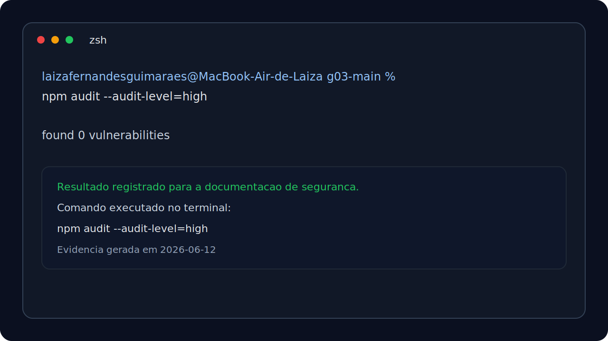

# BrPec — Documentação do Backend

Este documento explica detalhadamente o funcionamento, a arquitetura e a configuração do backend do sistema BrPec. O backend foi concebido sob uma abordagem offline-first para atender fazendas com conectividade limitada, eliminando dependências complexas e infraestrutura desnecessária.

---

## Índice

1. [Visão Geral](#1-visão-geral)
2. [Softwares e Tecnologias](#2-softwares-e-tecnologias)
3. [Decisões Arquiteturais Críticas](#3-decisões-arquiteturais-críticas)
4. [Como Instalar e Executar](#4-como-instalar-e-executar)
5. [Variáveis de Ambiente](#5-variáveis-de-ambiente)
6. [Estrutura de Pastas e Arquivos](#6-estrutura-de-pastas-e-arquivos)
7. [Camadas da Arquitetura](#7-camadas-da-arquitetura)
8. [O Banco de Dados SQLite](#8-o-banco-de-dados-sqlite)
9. [Testes e Qualidade (QA)](#9-testes-e-qualidade-qa)

---

## 1. Visão Geral

O backend do BrPec é uma API REST desenvolvida em Node.js com Express e TypeScript. Suas principais responsabilidades são:
- Processar regras de negócio da gestão pecuária (nascimentos, óbitos, tarefas, chamados/alertas).
- Persistir dados localmente de forma síncrona através de um banco SQLite embutido.
- Disponibilizar endpoints para sincronização em lote dos dados coletados offline.

---

## 2. Softwares e Tecnologias

A stack de desenvolvimento foi enxuta para garantir máxima eficiência no ambiente de execução:

| Tecnologia / Lib | Versão Mínima | Descrição e Papel no Projeto |
| :--- | :--- | :--- |
| **Node.js** | `>=22.5.0` | Runtime do JavaScript no servidor. Fornece o módulo nativo `node:sqlite`. |
| **Express** | `^4.21.2` | Framework web minimalista para gerenciamento de rotas e requisições HTTP. |
| **SQLite** | *(Embutido)* | Banco de dados relacional baseado em arquivo local. Dispensável configurar servidores externos. |
| **node:sqlite** | *(Nativo)* | Módulo nativo do Node.js (sem drivers externos) para conexão com o SQLite. |
| **dotenv** | `^16.4.7` | Leitura do arquivo `.env` para carregar configurações de ambiente. |
| **cors** | `^2.8.5` | Liberação de acessos Cross-Origin para integração segura com o frontend. |
| **uuid** | `^11.1.0` | Geração de identificadores únicos no padrão UUID v7 para persistência descentralizada. |
| **typescript** | `^6.0.3` | Superset JavaScript que adiciona tipagem estática e detecção antecipada de erros. |

---

## 3. Decisões Arquiteturais Críticas

### 3.1. Autenticação com JWT
O backend utiliza autenticação baseada em JWT para manter a sessão do usuário sem exigir login a cada acesso. Após o login inicial, a API emite:

- `accessToken`: token de curta duração, enviado pelo frontend no header `Authorization: Bearer <token>`.
- `refreshToken`: token de maior duração, armazenado em cookie `httpOnly` e usado pela rota `/api/auth/refresh` para renovar a sessão.

O banco possui a tabela `refresh_tokens`, que guarda uma chave de sessão do refresh token em formato hash (`token_hash`). Isso permite validar, expirar e revogar sessões sem salvar o token em texto puro.

Em produção, as variáveis `JWT_ACCESS_SECRET` e `JWT_REFRESH_SECRET` devem ser configuradas com chaves fortes e diferentes. O `accessToken` expira em `15m` por padrão, e o `refreshToken` em `7d`.

#### Passo a passo de instalação e uso

1. Configure o arquivo `.env`:
   ```env
   PORT=3000
   SQLITE_DATABASE_PATH=.data/brpec.sqlite
   NODE_ENV=development
   JWT_ACCESS_SECRET=troque_por_uma_chave_forte_access
   JWT_REFRESH_SECRET=troque_por_uma_chave_forte_refresh
   ACCESS_TOKEN_EXPIRES_IN=15m
   REFRESH_TOKEN_EXPIRES_IN=7d
   ```

2. Instale as dependências:
   ```bash
   npm install
   ```

3. Inicie a aplicação:
   ```bash
   npm run dev
   ```

4. No primeiro boot, o backend executa as migrations pendentes. A migration `001_create_refresh_tokens.sql` cria a tabela de controle dos refresh tokens.

5. Faça login pela tela `/login-auth` ou pela API:
   ```bash
   curl -i -X POST http://localhost:3000/api/auth/login \
     -H "Content-Type: application/json" \
     -d '{"usuario":"admin","senha":"123456","perfil":"Gerente"}'
   ```

6. A resposta inclui o `accessToken`. Use-o nas rotas autenticadas:
   ```bash
   curl http://localhost:3000/api/tarefas/hoje?capataz_id=cap-rogerio \
     -H "Authorization: Bearer SEU_ACCESS_TOKEN"
   ```

7. Quando o `accessToken` expirar, chame `/api/auth/refresh`. O cookie `refreshToken` precisa acompanhar a requisição. No navegador isso acontece automaticamente:
   ```bash
   curl -i -X POST http://localhost:3000/api/auth/refresh \
     -b "refreshToken=SEU_COOKIE_REFRESH_TOKEN"
   ```

8. Para sair, chame logout. O backend revoga a sessão salva em `refresh_tokens` e limpa o cookie:
   ```bash
   curl -i -X POST http://localhost:3000/api/auth/logout \
     -b "refreshToken=SEU_COOKIE_REFRESH_TOKEN"
   ```

9. No frontend, o arquivo `/public/js/auth-client.js` automatiza o fluxo: salva o `accessToken`, adiciona o header `Authorization`, tenta renovar a sessão ao receber `401` e redireciona para login se o refresh falhar.

### 3.2. SQLite Nativo (`node:sqlite`)
Para evitar problemas de compilação de binários nativos no setup do desenvolvedor (comuns em libs como `better-sqlite3` ou `sqlite3`), o projeto utiliza exclusivamente a classe `DatabaseSync` do módulo embutido do Node.js: `node:sqlite`.
Todas as operações de banco são **síncronas** e executadas de forma direta, simplificando o fluxo do código (livre de `async/await` excessivo nas camadas de Repository).

---

## 4. Como Instalar e Executar

### Pré-requisito Obrigatório
- **Node.js v22.5.0 ou superior** instalado.
Certifique-se executando no terminal:
```bash
node --version
```

### Instalação (na Raiz do Projeto)
1. Instale todas as dependências do projeto com o comando único na raiz:
   ```bash
   npm install
   ```

2. Crie e configure o arquivo de ambiente `.env` copiando o modelo:
   ```bash
   cp .env.example .env
   ```
   *(No Windows PowerShell, use `copy .env.example .env`)*

### Executando em Desenvolvimento
Para rodar a aplicação com recarregamento automático (via `nodemon` e `ts-node`):
```bash
npm run dev
```

Você verá a inicialização do banco de dados e a confirmação de que o servidor Express está ativo:
```text
[database] Banco SQLite conectado: C:\...\g03\src\backend\database\brpec.sqlite
[initDb] Banco de dados inicializado com sucesso
[server] Servidor BrPec rodando na porta 3000
   Health-check: http://localhost:3000/api/health
```

### Build e Produção
Para compilar o código TypeScript para JavaScript puro:
```bash
npm run build
```
Os arquivos finais compilados serão gerados no diretório `/dist`. Para iniciar o servidor a partir do ponto compilado:
```bash
npm start
```

---

## 5. Variáveis de Ambiente

O arquivo `.env` gerido pelo `dotenv` suporta as seguintes chaves de configuração:

| Variável | Valor Padrão | Descrição |
| :--- | :--- | :--- |
| `PORT` | `3000` | Porta TCP em que o servidor Express receberá requisições. |
| `NODE_ENV` | `development` | Identificador do ambiente (development, production, test). |
| `DB_PATH` | `./database/brpec.sqlite` | Caminho do arquivo SQLite (relativo à pasta `src/backend/`). |

---

## 6. Estrutura de Pastas e Arquivos

Toda a lógica do backend reside de forma estrita e isolada dentro do diretório `src/backend/`:

```text
src/backend/
├── config/                  # Inicializadores e conexões do sistema
│   ├── database.ts          # Inicialização e exportação da instância do SQLite
│   └── initDb.ts            # Leitura e execução do script de migração do banco
├── controllers/             # Controladores que lidam com a camada HTTP (Express)
│   ├── alertaController.ts
│   ├── eventoController.ts
│   ├── exportacaoController.ts
│   ├── healthController.ts
│   ├── painelController.ts
│   ├── sincronizacaoController.ts
│   └── tarefaController.ts
├── database/                # Pasta que hospeda o arquivo físico do banco SQLite
│   ├── migration.sql        # Script DDL com a criação das tabelas e regras estruturais
│   └── brpec.sqlite         # Banco de dados gerado localmente (ignorado pelo git)
├── models/                  # Tipagens e interfaces das entidades de dados
├── repositories/            # Camada de persistência direta (executa queries SQL)
├── routes/                  # Declaração e agrupamento de endpoints
│   ├── index.ts             # Roteador principal (/api)
│   ├── alertaRoutes.ts
│   ├── eventoRoutes.ts
│   ├── exportacaoRoutes.ts
│   ├── painelRoutes.ts
│   ├── sincronizacaoRoutes.ts
│   └── tarefaRoutes.ts
├── services/                # Camada de serviços (lógica de negócios pecuários)
├── app.ts                   # Configurações do Express (middlewares, CORS, JSON)
└── server.ts                # Ponto de entrada (carrega .env e inicia listen na porta)
```

---

## 7. Camadas da Arquitetura

O sistema é estruturado sob o padrão arquitetural clássico de Camadas Desacopladas:

1. **Camada de Rotas (`routes/`)**: Mapeia as requisições HTTP e as encaminha para a função do controller correspondente.
2. **Camada de Controllers (`controllers/`)**: Recebe a requisição Express (`req`), extrai os parâmetros, valida minimamente a presença de dados obrigatórios e delega o processamento ao Service. Retorna a resposta HTTP (`res`) com o status code adequado.
3. **Camada de Services (`services/`)**: Centraliza as regras de negócio pecuárias (ex: validação de idade em nascimentos, cálculos de totais, verificação de perfis). Não consome HTTP (independente de Express).
4. **Camada de Repositories (`repositories/`)**: Interage diretamente com a instância do banco `node:sqlite`, executando comandos SQL (`INSERT`, `SELECT`, `UPDATE`, etc.) e retornando dados puros.

---

## 8. O Banco de Dados SQLite

O arquivo DDL principal em `src/backend/database/migration.sql` contém a estrutura das tabelas. O banco é composto por 11 tabelas:

- `retiros`: Áreas físicas/retiradas operacionais da fazenda.
- `usuarios`: Agentes de operação (Gerente, Coordenador, Capataz, Técnico).
- `tarefas`: Ordens de trabalho lançadas pelos gerentes aos capatazes.
- `alertas`: Registro de avarias e manutenções de infraestrutura nas fazendas.
- `movimentacoes`: Registros de alteração do rebanho.
- `nascimentos`, `obitos`, `transferencias`, `compravendas`: Especializações das movimentações.
- `evidencias`: Mídias ou notas anexadas a tarefas, alertas ou movimentações.
- `sync_queue`: Fila técnica para o fluxo offline-first sincronizar dados com a nuvem posterior.

---

## 9. Testes e Qualidade (QA)

O desenvolvimento, a manutenção e a execução de testes automatizados e de integração estão localizados no diretório:
- `src/backend/__tests__/` (arquivos `.test.ts`)

> [!IMPORTANT]
> **RESTRIÇÃO DE ESCOPO:** Os testes formais (utilizando Jest e Supertest) são de responsabilidade exclusiva da equipe de QA. Desenvolvedores do backend não devem criar, alterar ou interagir com os arquivos de testes no diretório `__tests__/` sem coordenação explícita do time de qualidade.

---

## 10. Segurança e Validações Executadas

Como parte das entregas de segurança do backend, foram adotadas as seguintes medidas:

- Autenticação com JWT em dois níveis, usando `accessToken` de curta duração e `refreshToken` persistido para renovação controlada.
- Armazenamento do `refreshToken` em cookie `httpOnly`, com `sameSite: 'strict'` e `secure` em produção, reduzindo exposição a acesso via JavaScript e ataques de CSRF.
- Revogação de refresh tokens no logout e rotação do token a cada renovação.
- Persistência de sessão do usuário no servidor para reforçar o controle de autenticação no fluxo de login.
- Middleware de proteção por perfil e acesso a rotas sensíveis somente após autenticação.

### Verificação realizada no terminal

Foi executada uma auditoria de dependências no terminal para verificar vulnerabilidades conhecidas no ecossistema Node.js do projeto:

```bash
npm audit --audit-level=high
```



Resultado obtido:

```text
found 0 vulnerabilities
```

Essa validação não substitui um pentest completo, mas registra uma checagem objetiva de segurança aplicada ao projeto e evidencia que, no estado atual das dependências instaladas, não há vulnerabilidades conhecidas reportadas pelo `npm audit` em nível alto ou superior.
